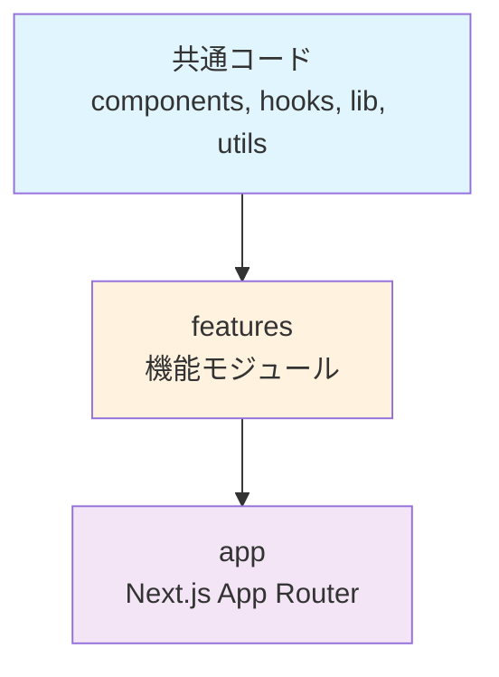

# プロジェクト構成

アプリのプロジェクト構成とディレクトリ構造について説明します。

## 目次

1. [ディレクトリ構成](#ディレクトリ構成)
2. [アーキテクチャ原則](#アーキテクチャ原則)
3. [Feature構成](#feature構成)
4. [ファイル命名規則](#ファイル命名規則)

---

## ディレクトリ構成

```
CAMP_front/src/
├── app/                    # App Router (Next.js 15+)
│   ├── (group-a)/          # ルートグループA
│   │   ├── page-a/
│   │   └── page-b/
│   ├── (group-b)/          # ルートグループB
│   │   ├── page-c/
│   │   ├── page-d/
│   │   └── page-e/
│   ├── layout.tsx          # ルートレイアウト
│   ├── page.tsx            # ホームページ
│   └── providers.tsx       # グローバルプロバイダー
│
├── features/              # 機能モジュール（bulletproof-react）
│   ├── {feature-a}/       # 機能A
│   ├── {feature-b}/       # 機能B
│   └── {feature-c}/       # 機能C
│
├── components/            # 共通コンポーネント
│   ├── ui/                # 基本UIコンポーネント
│   │   ├── button.tsx
│   │   ├── input.tsx
│   │   └── card.tsx
│   ├── layouts/           # レイアウトコンポーネント
│   │   ├── header.tsx
│   │   ├── sidebar.tsx
│   │   └── footer.tsx
│   └── form/              # フォーム関連
│
├── lib/                   # 外部ライブラリ設定
│   ├── api-client.ts      # APIクライアント
│   ├── react-query.ts     # TanStack Query設定
│   └── auth.tsx           # 認証設定
│
├── stores/                # グローバルストア（Zustand）
│   ├── {feature-a}-store.ts
│   ├── {feature-b}-store.ts
│   └── theme-store.ts
│
├── hooks/                 # 共通カスタムフック
│   ├── use-debounce.ts
│   ├── use-local-storage.ts
│   └── use-media-query.ts
│
├── types/                 # 共通型定義
│   ├── api.ts
│   └── index.ts
│
├── utils/                 # ユーティリティ関数
│   ├── format.ts
│   └── cn.ts              # クラス名結合
│
├── config/                # 設定
│   ├── env.ts             # 環境変数
│   └── constants.ts       # 定数
│
└── providers/             # コンテキストプロバイダー
    └── query-provider.tsx
```

---

## アーキテクチャ原則

### 1. bulletproof-react準拠

アプリは[bulletproof-react](https://github.com/alan2207/bulletproof-react)アーキテクチャを採用しています。

#### 主要な原則

- **Feature-Based Organization** - 機能ごとにコードを分離
- **Unidirectional Codebase Flow** - 単一方向のコードフロー
- **Separation of Concerns** - 関心の分離
- **No Cross-Feature Imports** - Feature間の直接インポート禁止

#### コードフローの方向性

```
共通コード (components, hooks, lib, utils)
    ↓
features (各機能モジュール)
    ↓
app (Next.js App Router)
```

### 2. インポートルール

| レイヤー | インポート可能 | インポート不可 |
|---------|--------------|--------------|
| **app** | features, 共通コード | - |
| **features** | 共通コード, 同じfeature内 | 他のfeatures |
| **共通コード** | - | features, app |

**例:**

```typescript
// ✅ Good
// features/{feature-name}/components/{feature}-form.tsx
import { Button } from '@/components/ui/button'
import { useFeature } from './hooks/use-feature'

// ❌ Bad
// features/{feature-a}/components/{feature}-form.tsx
import { FeatureBCard } from '@/features/{feature-b}/components/{feature-b}-card'
```

---

## Feature構成

各Featureは以下の構造を持ちます：

```
features/{feature-name}/
├── api/                   # API通信
│   ├── get-{api-name}.ts  # GET API（TanStack Query）
│   ├── post-{api-name}.ts # POST API（TanStack Query）
│   ├── put-{api-name}.ts  # PUT API（TanStack Query）
│   ├── delete-{api-name}.ts # DELETE API（TanStack Query）
│   └── types.ts           # API型定義
│
├── components/            # Featureのコンポーネント
│   ├── {feature}-list.tsx
│   ├── {feature}-detail.tsx
│   └── {feature}-form.tsx
│
├── hooks/                 # カスタムフック
│   └── use-{feature}.ts
│
├── stores/                # ローカルストア（必要時のみ）
│   └── {feature}-store.ts
│
├── types/                 # 型定義
│   └── index.ts
│
├── utils/                 # ユーティリティ
│   └── {feature}-helpers.ts
│
└── index.ts               # エクスポート
```

### Feature例

```
features/{feature-name}/
├── api/
│   ├── get-items.ts       # 一覧取得API
│   ├── get-item.ts        # 詳細取得API
│   ├── post-item.ts       # 作成API
│   ├── put-item.ts        # 更新API
│   ├── delete-item.ts     # 削除API
│   └── types.ts           # API型定義
│
├── components/
│   ├── {feature}-list.tsx
│   ├── {feature}-detail.tsx
│   └── {feature}-form.tsx
│
├── hooks/
│   └── use-{feature}.ts
│
├── types/
│   └── index.ts
│
└── index.ts
```

---

## ファイル命名規則

### 基本ルール

| タイプ | 形式 | 例 |
|--------|------|---|
| **コンポーネント** | kebab-case | `{feature}-form.tsx` |
| **フック** | kebab-case, `use-`プレフィックス | `use-{feature}.ts` |
| **ストア** | kebab-case, `-store`サフィックス | `{feature}-store.ts` |
| **ユーティリティ** | kebab-case | `format-date.ts` |
| **型定義** | kebab-case | `{feature}-types.ts` |

### コンポーネント命名

```typescript
// ファイル名: {feature}-form.tsx
export const FeatureForm = () => { ... }

// ファイル名: use-{feature}.ts
export const useFeature = () => { ... }

// ファイル名: {feature}-store.ts
export const useFeatureStore = create(() => { ... })
```

---

## 依存関係の方向性

### レイヤー構造



**依存の方向:**
- 共通コード（最下層）← features（中間層）← app（最上層）
- 下層から上層へのインポートのみ許可

### インポートの例

```typescript
// ✅ Good: app からfeaturesをインポート
// app/(dashboard)/page.tsx
import { FeatureList } from '@/features/{feature-name}'

// ✅ Good: featuresから共通コードをインポート
// features/{feature-name}/components/{feature}-form.tsx
import { Button } from '@/components/ui/button'
import { useForm } from '@/hooks/use-form'

// ✅ Good: 同じfeature内でインポート
// features/{feature-name}/components/{feature}-form.tsx
import { useFeature } from '../hooks/use-feature'

// ❌ Bad: 共通コードからfeaturesをインポート
// components/ui/button.tsx
import { FeatureForm } from '@/features/{feature-name}'

// ❌ Bad: feature間でインポート
// features/{feature-a}/components/feature-a.tsx
import { FeatureBList } from '@/features/{feature-b}'
```

---

## ベストプラクティス

### 1. 必要なディレクトリのみ作成

すべてのFeatureが全ディレクトリを持つ必要はありません。

```
// シンプルなFeature
features/{feature-name}/
├── components/
│   └── {feature}.tsx
└── hooks/
    └── use-{feature}.ts
```

### 2. barrel exportsを避ける

```typescript
// ❌ Bad: index.tsでまとめてエクスポート
export * from './{feature}-list'
export * from './{feature}-form'

// ✅ Good: 直接インポート
import { FeatureList } from '@/features/{feature-name}/components/{feature}-list'
```

### 3. TypeScriptのPath Aliasを活用

```typescript
// tsconfig.json
{
  "compilerOptions": {
    "paths": {
      "@/*": ["./src/*"]
    }
  }
}

// ✅ Good
import { Button } from '@/components/ui/button'

// ❌ Bad
import { Button } from '../../../components/ui/button'
```

---

## 参考リンク

### 内部ドキュメント

- [bulletproof-react適用指針](./02-bulletproof-react.md)
- [Feature構成詳細](./03-feature-architecture.md)
- [技術スタック](../03-core-concepts/01-tech-stack.md)

### 外部リンク

- [bulletproof-react](https://github.com/alan2207/bulletproof-react)
- [Next.js App Router](https://nextjs.org/docs/app)
- [Feature-Sliced Design](https://feature-sliced.design/)
