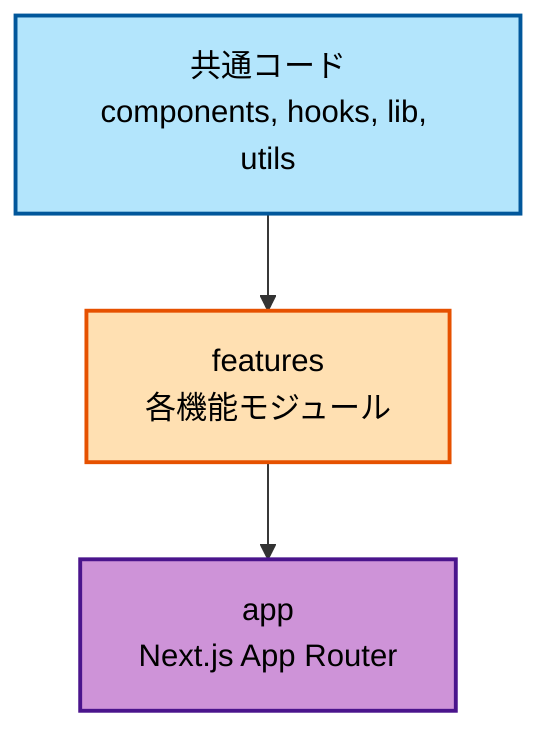
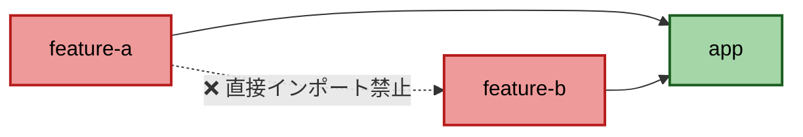
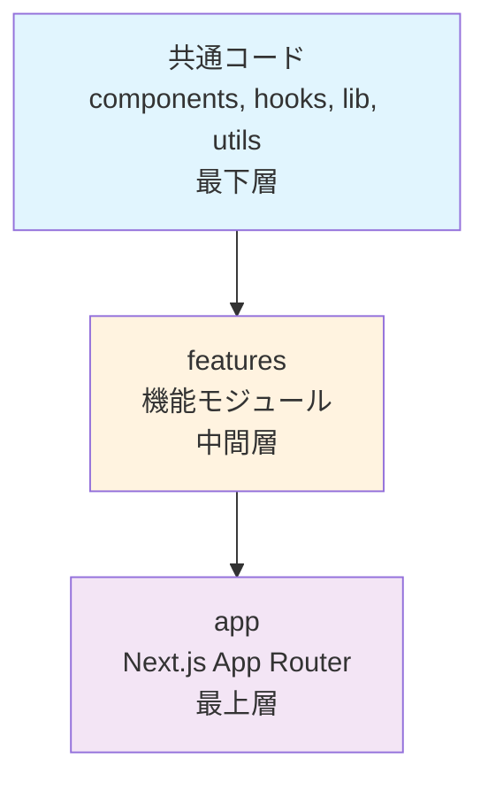

# bulletproof-react適用指針

本プロジェクトにおけるbulletproof-reactアーキテクチャの適用方法と実践ガイドです。

> **📝 注意:** このドキュメントは、プロジェクトの目標とする アーキテクチャを説明しています。`features/`ディレクトリなど、一部の構造は将来の実装予定であり、現在は空のディレクトリとして存在します。実際の実装状況は[プロジェクト構造](./01-project-structure.md)を参照してください。

## 目次

1. [bulletproof-reactとは](#bulletproof-reactとは)
2. [4つの主要原則](#4つの主要原則)
3. [フォルダ構成](#フォルダ構成)
4. [コードフローの方向性](#コードフローの方向性)
5. [インポートルール](#インポートルール)
6. [実践例](#実践例)
7. [アンチパターン](#アンチパターン)

---

## bulletproof-reactとは

**bulletproof-react**は、スケーラブルで保守性の高いReactアプリケーションを構築するためのアーキテクチャパターンです。

### 公式リポジトリ

<https://github.com/alan2207/bulletproof-react>

### なぜbulletproof-reactを採用するのか

| 課題 | bulletproof-reactの解決策 |
|------|-------------------------|
| コードの肥大化 | Feature-Based Organizationで機能ごとに分離 |
| 依存関係の混乱 | 単一方向のコードフローで依存を明確化 |
| テストの困難さ | 関心の分離で単体テスト可能に |
| 新メンバーのオンボーディング | 一貫した構造で学習コストを削減 |

---

## 4つの主要原則

### 1. Feature-Based Organization

機能ごとにコードを分離する:

```text
features/
├── {feature-a}/       # 機能A
│   ├── api/
│   ├── components/
│   └── hooks/
├── {feature-b}/       # 機能B
│   ├── api/
│   ├── components/
│   └── hooks/
└── {feature-c}/       # 機能C
    ├── api/
    ├── components/
    └── hooks/
```

**メリット:**

- 機能単位での開発・テストが容易
- 不要な機能の削除が簡単
- チーム開発での競合が減少

### 2. Unidirectional Codebase Flow

単一方向のコードフロー:



**ルール:**

- 下層から上層へのインポートのみ許可
- 逆方向のインポートは禁止

### 3. Separation of Concerns

関心の分離:

| レイヤー | 責務 |
|---------|------|
| **Components** | UIの表示のみ |
| **Hooks** | ビジネスロジック |
| **API** | データ取得・更新 |
| **Utils** | 汎用的なヘルパー関数 |

### 4. No Cross-Feature Imports

Feature間の直接インポート禁止:



**ルール:**

- Feature間で直接インポートは禁止
- appレイヤーで複数のFeatureを組み合わせる

```typescript
// ❌ Bad: Feature間でインポート
// features/{feature-a}/components/feature-a.tsx
import { FeatureBList } from '@/features/{feature-b}/components/feature-b-list'

// ✅ Good: appレイヤーで組み合わせる
// app/(dashboard)/page.tsx
import { FeatureAStats } from '@/features/{feature-a}'
import { FeatureBList } from '@/features/{feature-b}'

export default function DashboardPage() {
  return (
    <>
      <FeatureAStats />
      <FeatureBList />
    </>
  )
}
```

---

## フォルダ構成

### 全体構造

```text
CAMP_front/src/
├── app/                    # Next.js App Router（最上層）
│   ├── (group-a)/
│   ├── (group-b)/
│   └── layout.tsx
│
├── features/              # 機能モジュール（中間層）
│   ├── {feature-a}/
│   ├── {feature-b}/
│   ├── {feature-c}/
│   └── {feature-d}/
│
└── 共通コード              # 最下層
    ├── components/        # 共通UIコンポーネント
    ├── hooks/             # 共通カスタムフック
    ├── lib/               # ライブラリ設定
    ├── schemas/           # 共通バリデーションスキーマ (Zod)
    ├── stores/            # グローバルストア
    ├── types/             # 共通型定義
    └── utils/             # ユーティリティ
```

### Feature内部の構造

```text
features/{feature-name}/
├── api/                   # API通信
│   ├── queries.ts         # TanStack Query（取得）
│   ├── mutations.ts       # TanStack Query（更新）
│   └── types.ts           # API型定義
│
├── components/            # Featureのコンポーネント
│   ├── {feature}-list.tsx
│   ├── {feature}-detail.tsx
│   └── {feature}-form.tsx
│
├── hooks/                 # カスタムフック
│   └── use-{feature}.ts
│
├── stores/                # ローカルストア（必要時のみ）
│   └── {feature}-store.ts
│
├── types/                 # 型定義
│   └── index.ts
│
├── utils/                 # ユーティリティ
│   └── {feature}-helpers.ts
│
└── index.ts               # エクスポート
```

---

## コードフローの方向性

### レイヤー構造



### 依存の方向性

| インポート元 | インポート先 | 可否 |
|------------|------------|-----|
| app | features | ✅ OK |
| app | 共通コード | ✅ OK |
| features | 共通コード | ✅ OK |
| features | 同じfeature内 | ✅ OK |
| features | 他のfeatures | ❌ NG |
| 共通コード | features | ❌ NG |
| 共通コード | app | ❌ NG |

---

## インポートルール

### ✅ Good: 正しいインポート

```typescript
// app/(group-a)/page.tsx
import { FeatureList } from '@/features/{feature-name}'
import { Button } from '@/components/ui/button'

// features/{feature-name}/components/{feature}-form.tsx
import { Button } from '@/components/ui/button'
import { useForm } from '@/hooks/use-form'
import { useFeature } from '../hooks/use-feature'

// components/ui/button.tsx
import { cva } from 'class-variance-authority'
import { cn } from '@/utils/cn'
```

### ❌ Bad: 間違ったインポート

```typescript
// ❌ 共通コードからfeaturesをインポート
// components/ui/button.tsx
import { FeatureForm } from '@/features/{feature-name}'

// ❌ feature間でインポート
// features/{feature-a}/components/feature-a.tsx
import { FeatureBList } from '@/features/{feature-b}'

// ❌ 共通コードからappをインポート
// hooks/use-form.ts
import { FeaturePage } from '@/app/(group-a)/page'
```

---

## 実践例

### 例1: 機能の実装

#### 1. API定義 (`features/{feature-name}/api/`)

```typescript
// get-items.ts
import { useSuspenseQuery } from '@tanstack/react-query'
import { api } from '@/lib/api-client'
import type { Item } from '../types'

export const useItems = () => {
  return useSuspenseQuery({
    queryKey: ['items'],
    queryFn: () => api.get<Item[]>('/api/items'),
  })
}

// post-item.ts
import { useMutation } from '@tanstack/react-query'
import { api } from '@/lib/api-client'
import type { CreateItemRequest } from './types'

export const useCreateItem = () => {
  return useMutation({
    mutationFn: (data: CreateItemRequest) =>
      api.post('/api/items', data),
  })
}
```

#### 2. コンポーネント定義 (`features/{feature-name}/components/`)

```typescript
// {feature}-list.tsx
import { useItems } from '../api/get-items'
import { Card } from '@/components/ui/card'

export const FeatureList = () => {
  const { data: items, isLoading } = useItems()

  if (isLoading) return <div>Loading...</div>

  return (
    <div className="space-y-4">
      {items?.map((item) => (
        <Card key={item.id}>{item.name}</Card>
      ))}
    </div>
  )
}
```

#### 3. ページで組み合わせ (`app/(group-a)/page.tsx`)

```typescript
import { FeatureList } from '@/features/{feature-name}'
import { Button } from '@/components/ui/button'

export default function FeaturePage() {
  return (
    <div>
      <h1>一覧</h1>
      <Button>新規作成</Button>
      <FeatureList />
    </div>
  )
}
```

### 例2: 共通コンポーネントの作成

#### 1. 基本UIコンポーネント (`components/ui/button.tsx`)

```typescript
import { forwardRef } from 'react'
import { cva, type VariantProps } from 'class-variance-authority'
import { cn } from '@/utils/cn'

const buttonVariants = cva('rounded font-semibold', {
  variants: {
    variant: {
      primary: 'bg-blue-500 text-white',
      secondary: 'bg-gray-200 text-gray-900',
    },
    size: {
      sm: 'px-3 py-1',
      md: 'px-4 py-2',
    },
  },
  defaultVariants: {
    variant: 'primary',
    size: 'md',
  },
})

interface ButtonProps
  extends React.ButtonHTMLAttributes<HTMLButtonElement>,
    VariantProps<typeof buttonVariants> {}

export const Button = forwardRef<HTMLButtonElement, ButtonProps>(
  ({ className, variant, size, ...props }, ref) => {
    return (
      <button
        ref={ref}
        className={cn(buttonVariants({ variant, size }), className)}
        {...props}
      />
    )
  }
)

Button.displayName = 'Button'
```

#### 2. 各Featureで使用

```typescript
// features/{feature-name}/components/{feature}-form.tsx
import { Button } from '@/components/ui/button'

export const FeatureForm = () => {
  return (
    <form>
      <Button variant="primary">保存</Button>
      <Button variant="secondary">キャンセル</Button>
    </form>
  )
}
```

---

## アンチパターン

### ❌ 1. Feature間の直接依存

```typescript
// ❌ Bad
// features/{feature-a}/components/feature-a.tsx
import { FeatureBList } from '@/features/{feature-b}/components/feature-b-list'
import { FeatureCCalendar } from '@/features/{feature-c}/components/feature-c-calendar'

export const FeatureA = () => {
  return (
    <>
      <FeatureBList />
      <FeatureCCalendar />
    </>
  )
}
```

#### 解決策: appレイヤーで組み合わせる

```typescript
// ✅ Good
// app/(group-a)/page.tsx
import { FeatureAStats } from '@/features/{feature-a}'
import { FeatureBList } from '@/features/{feature-b}'
import { FeatureCCalendar } from '@/features/{feature-c}'

export default function Page() {
  return (
    <>
      <FeatureAStats />
      <FeatureBList />
      <FeatureCCalendar />
    </>
  )
}
```

### ❌ 2. 共通コードからの上層インポート

```typescript
// ❌ Bad
// components/ui/item-card.tsx
import { useItems } from '@/features/{feature-name}/api/get-items'

export const ItemCard = () => {
  const { data } = useItems()
  return <div>{data?.name}</div>
}
```

#### 解決策: Props経由でデータを渡す

```typescript
// ✅ Good
// components/ui/item-card.tsx
import type { Item } from '@/types'

interface ItemCardProps {
  item: Item
}

export const ItemCard = ({ item }: ItemCardProps) => {
  return <div>{item.name}</div>
}

// features/{feature-name}/components/{feature}-list.tsx
import { useItems } from '../api/get-items'
import { ItemCard } from '@/components/ui/item-card'

export const FeatureList = () => {
  const { data: items } = useItems()

  return (
    <>
      {items?.map((item) => (
        <ItemCard key={item.id} item={item} />
      ))}
    </>
  )
}
```

### ❌ 3. Barrel Exportsの乱用

```typescript
// ❌ Bad
// features/{feature-name}/index.ts
export * from './components/{feature}-list'
export * from './components/{feature}-form'
export * from './components/{feature}-detail'
export * from './api/get-items'
export * from './api/post-item'
```

#### 解決策: 明示的にインポート

```typescript
// ✅ Good
// app/(group-a)/page.tsx
import { FeatureList } from '@/features/{feature-name}/components/{feature}-list'
import { useItems } from '@/features/{feature-name}/api/get-items'
```

---

## チェックリスト

### 新しいFeatureを作成する際

- [ ] `features/`配下に適切なディレクトリを作成
- [ ] `api/`でデータ取得・更新ロジックを分離
- [ ] `components/`でUI表示のみに集中
- [ ] `hooks/`でビジネスロジックを分離
- [ ] 共通コードのみをインポート
- [ ] 他のFeatureを直接インポートしない

### 共通コンポーネントを作成する際

- [ ] `components/ui/`に配置
- [ ] Featuresやappをインポートしない
- [ ] Props経由でデータを受け取る
- [ ] 再利用可能な設計にする

### コードレビュー時

- [ ] インポートの方向性が正しいか
- [ ] Feature間の依存がないか
- [ ] 共通コードが上層をインポートしていないか
- [ ] 単一責任の原則が守られているか

---

## 参考リンク

### 内部ドキュメント

- [プロジェクト構造](./01-project-structure.md)
- [コンポーネント設計](../04-development/03-component-design.md)
- [状態管理](../03-core-concepts/02-state-management.md)

### 外部リンク

- [bulletproof-react](https://github.com/alan2207/bulletproof-react)
- [Feature-Sliced Design](https://feature-sliced.design/)
- [React Architecture Best Practices](https://react.dev/learn/thinking-in-react)
