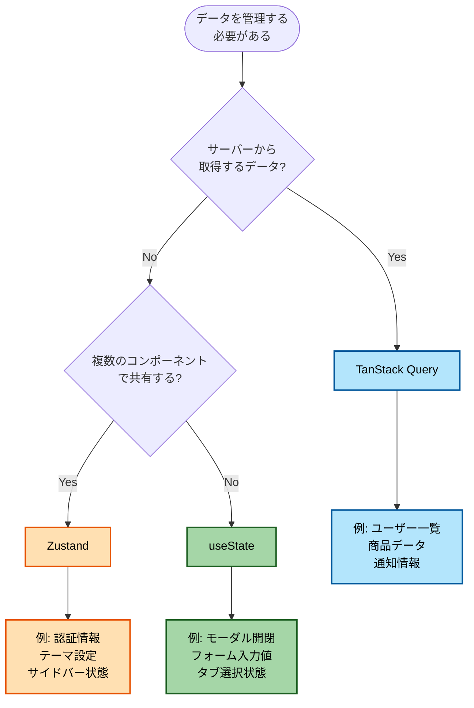
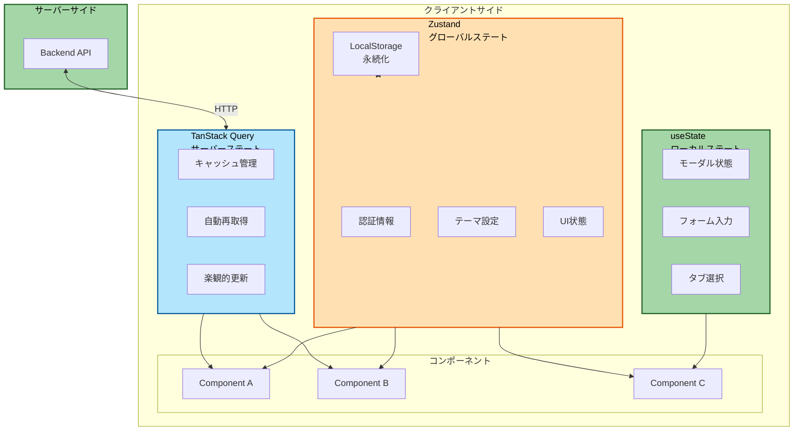
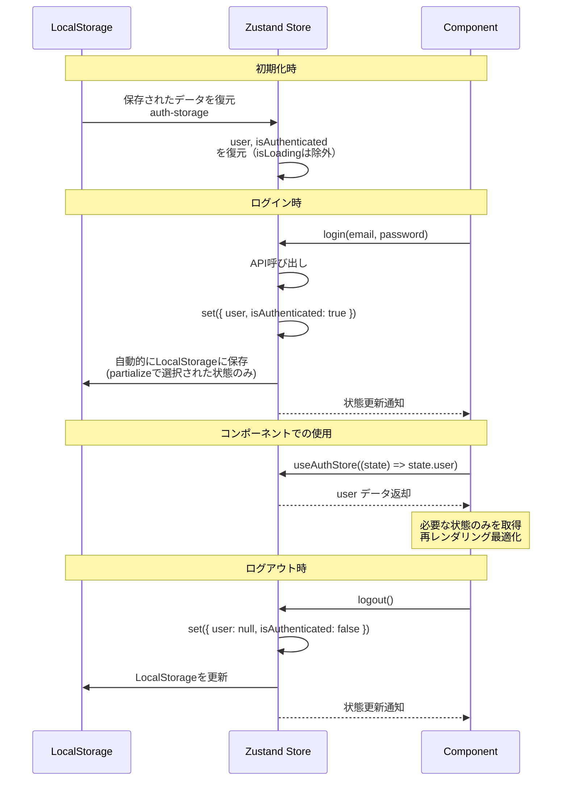
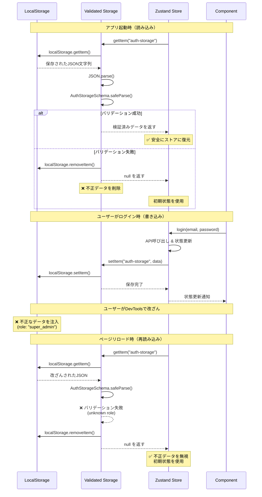

# 状態管理戦略

このドキュメントでは、プロジェクトにおける状態管理の考え方と実装方法を説明します。ローカルステート、グローバルステート、サーバーステートの3つのカテゴリに分けて管理し、それぞれに適したツールを使用する戦略を採用しています。

## 目次

1. [状態の分類](#状態の分類)
2. [使い分けフローチャート](#使い分けフローチャート)
3. [ローカルステート (useState)](#1-ローカルステート-usestate)
4. [グローバルステート (Zustand)](#2-グローバルステート-zustand)
5. [サーバーステート (TanStack Query)](#3-サーバーステート-tanstack-query)
6. [永続化とZodバリデーション](#永続化とzodバリデーション)
7. [ベストプラクティス](#ベストプラクティス)

---

## 状態の分類

| 状態の種類             | ツール         | 用途                                     |
| ---------------------- | -------------- | ---------------------------------------- |
| **ローカルステート**   | useState       | コンポーネント内部の一時的な状態         |
| **グローバルステート** | Zustand        | アプリ全体で共有するクライアント側の状態 |
| **サーバーステート**   | TanStack Query | APIから取得するデータ                    |

## 使い分けフローチャート



### 状態管理の全体像



---

## 1. ローカルステート (useState)

### 使用する場合

- ✅ 他のコンポーネントと共有しない
- ✅ コンポーネントがアンマウントされたら不要
- ✅ UIの一時的な状態

### 実装例

```typescript
// モーダルの開閉
const [isOpen, setIsOpen] = useState(false);

// フォーム入力中の値
const [query, setQuery] = useState("");

// タブの選択状態
const [activeTab, setActiveTab] = useState<"profile" | "settings">("profile");
```

---

## 2. グローバルステート (Zustand)

### 使用する場合

- ✅ 複数のコンポーネント間で共有
- ✅ アプリ全体で保持する必要がある
- ✅ サーバーから取得したデータではない

### 典型的なユースケース

- 認証ユーザー情報
- テーマ設定（ライト/ダークモード）
- サイドバーの開閉状態

### 実装例（認証ストア）

```typescript
// src/features/auth/stores/auth-store.ts
import { create } from "zustand";
import { persist, createJSONStorage } from "zustand/middleware";

type User = {
  id: string;
  email: string;
  name: string;
  role: string;
};

type AuthStore = {
  user: User | null;
  isAuthenticated: boolean;
  isLoading: boolean;
  login: (email: string, password: string) => Promise<void>;
  logout: () => void;
  setUser: (user: User) => void;
};

export const useAuthStore = create<AuthStore>()(
  persist(
    (set) => ({
      user: null,
      isAuthenticated: false,
      isLoading: false,

      login: async (email: string, password: string) => {
        set({ isLoading: true });

        await api
          .post("/auth/login", { email, password })
          .then((response) => {
            const user = response.data;

            set({
              user,
              isAuthenticated: true,
              isLoading: false,
            });
          })
          .catch((error) => {
            set({ isLoading: false });
            throw error;
          });
      },

      logout: () => {
        set({
          user: null,
          isAuthenticated: false,
          isLoading: false,
        });
      },

      setUser: (user) => {
        set({
          user,
          isAuthenticated: true,
        });
      },
    }),
    {
      name: "auth-storage", // LocalStorageのキー名
      storage: createJSONStorage(() => localStorage),

      // 永続化する状態を選択（isLoadingは除外）
      partialize: (state) => ({
        user: state.user,
        isAuthenticated: state.isAuthenticated,
      }),
    }
  )
);

// セレクター（パフォーマンス最適化用）
export const selectUser = (state: AuthStore) => state.user;
export const selectIsAuthenticated = (state: AuthStore) => state.isAuthenticated;
```

### Zustandの永続化とデータフロー



### 使用方法

```typescript
import { useAuthStore } from '@/features/auth/stores/auth-store'

export const Header = () => {
  // 必要な状態だけを取得（再レンダリング最適化）
  const user = useAuthStore((state) => state.user)
  const logout = useAuthStore((state) => state.logout)

  return (
    <div>
      <span>ようこそ、{user?.name}さん</span>
      <button onClick={logout}>ログアウト</button>
    </div>
  )
}
```

---

## 3. サーバーステート (TanStack Query)

### 使用する場合

- ✅ サーバーからAPIで取得するデータ
- ✅ キャッシュが必要なデータ
- ✅ 定期的に更新されるデータ

### なぜTanStack Queryを使うのか

従来のアプローチでは、自分でキャッシュ、再取得、エラーハンドリングを実装する必要がありました。
TanStack Queryはこれらを自動的に管理します。

### TanStack Queryのキャッシュライフサイクル


### 実装例

#### データ取得（Query）

**API層（`api/get-users.ts`）:**

```typescript
// src/features/sample-users/api/get-users.ts
import { queryOptions, useSuspenseQuery } from "@tanstack/react-query";
import { api } from "@/lib/api-client";
import { QueryConfig } from "@/lib/tanstack-query";

export const getUsers = (): Promise<{ data: User[] }> => {
  return api.get("/sample/users");
};

export const getUsersQueryOptions = () => {
  return queryOptions({
    queryKey: ["users"],
    queryFn: getUsers,
  });
};

type UseUsersOptions = {
  queryConfig?: QueryConfig<typeof getUsersQueryOptions>;
};

export const useUsers = ({ queryConfig }: UseUsersOptions = {}) => {
  return useSuspenseQuery({
    ...getUsersQueryOptions(),
    ...queryConfig,
  });
};
```

**コンポーネント層（Suspenseパターン）:**

```typescript
import { Suspense } from 'react'
import { ErrorBoundary } from 'react-error-boundary'
import { LoadingSpinner } from '@/components/ui/loading-spinner'
import { MainErrorFallback } from '@/components/errors/main'
import { useUsers } from '@/features/sample-users/api/get-users'

// データフェッチを含むコンポーネント
const UserListContent = () => {
  const { data } = useUsers()  // isLoading, error は不要
  const users = data?.data ?? []

  return (
    <ul>
      {users.map((user) => (
        <li key={user.id}>{user.name}</li>
      ))}
    </ul>
  )
}

// メインコンポーネント
export const UserList = () => {
  return (
    <ErrorBoundary FallbackComponent={MainErrorFallback}>
      <Suspense fallback={<LoadingSpinner />}>
        <UserListContent />
      </Suspense>
    </ErrorBoundary>
  )
}
```

#### データ更新（Mutation）

```typescript
// src/features/sample-users/api/create-user.ts
import { useMutation, useQueryClient } from "@tanstack/react-query";
import { api } from "@/lib/api-client";

const createUser = (data: CreateUserInput): Promise<User> => {
  return api.post("/sample/users", data);
};

export const useCreateUser = () => {
  const queryClient = useQueryClient();

  return useMutation({
    mutationFn: createUser,
    onSuccess: () => {
      // ユーザーリストを再取得
      queryClient.invalidateQueries({ queryKey: ["users"] });
    },
  });
};
```

**使用方法:**

```typescript
import { useCreateUser } from '@/features/sample-users/api/create-user'

export const CreateUserForm = () => {
  const createUser = useCreateUser()

  const handleSubmit = async (data: CreateUserInput) => {
    await createUser.mutateAsync(data)
      .then(() => {
        alert('作成しました')
      })
      .catch(() => {
        alert('エラーが発生しました')
      })
  }

  return <form onSubmit={handleSubmit}>...</form>
}
```

---

## 永続化とZodバリデーション

### なぜZodバリデーションが必要か

LocalStorageやSessionStorageに保存されたデータは、以下のリスクにさらされています:

1. **ユーザーによる改ざん**: ブラウザのDevToolsから直接編集可能
2. **データ形式の変更**: アプリケーションのアップデートでスキーマが変更
3. **破損データ**: 拡張機能やスクリプトによる不正な操作

**Zodバリデーションを実装することで**:

- ✅ 不正なデータを自動検出・削除
- ✅ アプリケーションのクラッシュを防止
- ✅ セキュリティリスクを軽減

### 実装パターン: Validated Storage

#### ステップ1: バリデーションスキーマの定義

**ファイルパス**: `src/features/sample-auth/stores/lib/validationsauth-storage.ts`

```typescript
import { z } from "zod";

/**
 * ユーザーロールスキーマ
 */
export const UserRoleStorageSchema = z.enum(["user", "admin"]);

/**
 * ユーザー情報ストレージスキーマ
 */
export const UserStorageSchema = z.object({
  id: z.string().min(1, "ユーザーIDは必須です"),
  name: z.string().min(1, "名前は必須です"),
  email: z.string().email("有効なメールアドレスではありません"),
  role: UserRoleStorageSchema,
  createdAt: z.string().min(1, "作成日時は必須です"),
  updatedAt: z.string().optional(),
});

/**
 * 認証ストア永続化データスキーマ
 *
 * Zustand persistによってlocalStorageに保存されるデータの構造
 * 不正なデータや改ざんされたデータを検出・除外
 */
export const AuthStorageSchema = z.object({
  user: UserStorageSchema.nullable(),
  isAuthenticated: z.boolean(),
});

/**
 * 型推論
 */
export type UserStorage = z.infer<typeof UserStorageSchema>;
export type AuthStorage = z.infer<typeof AuthStorageSchema>;
```

#### ステップ2: カスタムストレージの実装

**ファイルパス**: `src/features/sample-auth/stores/auth-store.ts`

```typescript
import { create } from "zustand";
import { createJSONStorage, persist, type StorageValue } from "zustand/middleware";
import { AuthStorageSchema } from "./lib/validationsauth-storage.schema";
import type { AuthStore } from "../types";

/**
 * localStorageから読み込む際にZodスキーマでバリデーションを行うカスタムストレージ
 *
 * 不正なデータや改ざんされたデータをロードしないことで、セキュリティとデータ整合性を保証
 */
const validatedLocalStorage = {
  getItem: (name: string): StorageValue<Pick<AuthStore, "user" | "isAuthenticated">> | null => {
    const item = localStorage.getItem(name);
    if (!item) return null;

    try {
      const parsed = JSON.parse(item);
      const result = AuthStorageSchema.safeParse(parsed.state);

      if (!result.success) {
        // バリデーション失敗時は不正なデータを削除してnullを返す
        console.warn("[Sample Auth Store] ローカルストレージの認証データが不正です。データを削除します:", result.error);
        localStorage.removeItem(name);
        return null;
      }

      return parsed;
    } catch (error) {
      // JSON.parse エラー時も削除
      console.warn("[Sample Auth Store] ローカルストレージのデータが破損しています。データを削除します:", error);
      localStorage.removeItem(name);
      return null;
    }
  },
  setItem: (name: string, value: StorageValue<Pick<AuthStore, "user" | "isAuthenticated">>) => {
    localStorage.setItem(name, JSON.stringify(value));
  },
  removeItem: (name: string) => {
    localStorage.removeItem(name);
  },
};

/**
 * 認証ストア
 *
 * - LocalStorageに永続化（Zodバリデーション付き）
 * - ユーザー情報、認証状態を管理
 * - ストレージからの読み込み時に不正なデータを自動的に除外
 */
export const useAuthStore = create<AuthStore>()(
  persist(
    (set) => ({
      user: null,
      isAuthenticated: false,
      isLoading: false,

      login: async (email: string, password: string) => {
        // ... login logic
      },

      logout: () => {
        set({
          user: null,
          isAuthenticated: false,
          isLoading: false,
        });
      },

      setUser: (user: User) => {
        set({
          user,
          isAuthenticated: true,
        });
      },
    }),
    {
      name: "auth-storage", // LocalStorageのキー名
      storage: createJSONStorage(() => validatedLocalStorage), // ✅ Zodバリデーション付きLocalStorageを使用

      // 永続化する状態を選択（パフォーマンス最適化）
      partialize: (state) => ({
        user: state.user,
        isAuthenticated: state.isAuthenticated,
        // isLoadingは永続化しない
      }),
    }
  )
);
```

### バリデーション付き永続化のデータフロー



### セキュリティメリット

#### 1. ロール改ざん検出

```typescript
// ❌ ユーザーがDevToolsで改ざん
localStorage.setItem(
  "auth-storage",
  JSON.stringify({
    state: {
      user: {
        id: "1",
        role: "super_admin", // ❌ 不正なロール
      },
      isAuthenticated: true,
    },
  })
);

// ✅ 次回アプリ起動時、Zodバリデーションが検出
const UserRoleSchema = z.enum(["user", "admin"]); // ✅ "super_admin"は許可されていない
// → バリデーション失敗 → データ削除 → 初期状態で起動
```

#### 2. 必須フィールドの検証

```typescript
// ❌ ユーザーがフィールドを削除
localStorage.setItem(
  "auth-storage",
  JSON.stringify({
    state: {
      user: {
        id: "1",
        // email フィールドが削除されている
      },
      isAuthenticated: true,
    },
  })
);

// ✅ Zodバリデーションが検出
const UserSchema = z.object({
  id: z.string(),
  email: z.string().email(), // ✅ email は必須
});
// → バリデーション失敗 → データ削除 → 初期状態で起動
```

#### 3. 型の不一致検出

```typescript
// ❌ ユーザーが型を変更
localStorage.setItem(
  "auth-storage",
  JSON.stringify({
    state: {
      user: { id: "1", email: "test@example.com" },
      isAuthenticated: "true", // ❌ 文字列になっている（boolean期待）
    },
  })
);

// ✅ Zodバリデーションが検出
const AuthStorageSchema = z.object({
  isAuthenticated: z.boolean(), // ✅ boolean 期待
});
// → バリデーション失敗 → データ削除 → 初期状態で起動
```

### SessionStorage での実装例

LocalStorageと同じパターンでSessionStorageにも適用可能です:

```typescript
const validatedSessionStorage = {
  getItem: (name: string): StorageValue<YourState> | null => {
    const item = sessionStorage.getItem(name);
    if (!item) return null;

    try {
      const parsed = JSON.parse(item);
      const result = YourSchema.safeParse(parsed.state);

      if (!result.success) {
        console.warn("SessionStorage data is invalid:", result.error);
        sessionStorage.removeItem(name);
        return null;
      }

      return parsed;
    } catch (error) {
      console.warn("SessionStorage data is corrupted:", error);
      sessionStorage.removeItem(name);
      return null;
    }
  },
  setItem: (name: string, value: StorageValue<YourState>) => {
    sessionStorage.setItem(name, JSON.stringify(value));
  },
  removeItem: (name: string) => {
    sessionStorage.removeItem(name);
  },
};

export const useYourStore = create<YourStore>()(
  persist(
    (set) => ({
      // your store implementation
    }),
    {
      name: "your-storage",
      storage: createJSONStorage(() => validatedSessionStorage),
    }
  )
);
```

### マイグレーション戦略

スキーマ変更時のマイグレーション処理も実装できます:

```typescript
const validatedLocalStorageWithMigration = {
  getItem: (name: string): StorageValue<AuthStore> | null => {
    const item = localStorage.getItem(name);
    if (!item) return null;

    try {
      const parsed = JSON.parse(item);

      // バージョンチェック
      if (parsed.version === undefined || parsed.version < 2) {
        // 古いバージョンのデータを新しい形式に変換
        const migrated = migrateToV2(parsed.state);
        const result = AuthStorageSchema.safeParse(migrated);

        if (result.success) {
          return { state: result.data, version: 2 };
        }
      }

      const result = AuthStorageSchema.safeParse(parsed.state);
      if (!result.success) {
        console.warn("Invalid data, removing:", result.error);
        localStorage.removeItem(name);
        return null;
      }

      return parsed;
    } catch (error) {
      console.warn("Corrupted data, removing:", error);
      localStorage.removeItem(name);
      return null;
    }
  },
  // ... setItem, removeItem
};

function migrateToV2(oldData: unknown): unknown {
  // 旧スキーマ → 新スキーマへの変換ロジック
  return {
    ...oldData,
    // 新しいフィールドを追加
    version: 2,
  };
}
```

---

## ベストプラクティス

### ✅ Good

```typescript
// ローカルステート: コンポーネント内部のみ
const [isOpen, setIsOpen] = useState(false);

// グローバルステート: アプリ全体で共有
const user = useAuthStore((state) => state.user);

// サーバーステート: APIから取得
const { data: users } = useUsers();
```

### ❌ Bad

```typescript
// サーバーデータをZustandで管理（アンチパターン）
const useUserStore = create((set) => ({
  users: [],
  fetchUsers: async () => {
    const res = await fetch("/api/users");
    set({ users: await res.json() });
  },
}));

// ローカルステートをZustandで管理（不要）
const useModalStore = create((set) => ({
  isOpen: false,
  open: () => set({ isOpen: true }),
}));
```

### 永続化ストアのベストプラクティス

#### ✅ Good: バリデーション付きストレージ

```typescript
// ✅ Zodバリデーション付きカスタムストレージ
const validatedLocalStorage = {
  getItem: (name: string) => {
    const item = localStorage.getItem(name);
    if (!item) return null;

    try {
      const parsed = JSON.parse(item);
      const result = YourSchema.safeParse(parsed.state);

      if (!result.success) {
        console.warn("Invalid data, removing");
        localStorage.removeItem(name);
        return null;
      }

      return parsed;
    } catch (error) {
      localStorage.removeItem(name);
      return null;
    }
  },
  // ... setItem, removeItem
};

export const useYourStore = create<YourStore>()(
  persist(
    (set) => ({
      /* ... */
    }),
    {
      name: "your-storage",
      storage: createJSONStorage(() => validatedLocalStorage), // ✅ 検証済み
    }
  )
);
```

#### ❌ Bad: バリデーションなし

```typescript
// ❌ バリデーションなし（改ざんリスク）
export const useAuthStore = create<AuthStore>()(
  persist(
    (set) => ({
      /* ... */
    }),
    {
      name: "auth-storage",
      storage: createJSONStorage(() => localStorage), // ❌ 生のlocalStorage
    }
  )
);
```

#### ✅ Good: スキーマと型の一元管理

```typescript
// ✅ スキーマファイルで一元管理
// src/features/auth/stores/lib/validationsauth-storage.ts
export const AuthStorageSchema = z.object({
  user: UserSchema.nullable(),
  isAuthenticated: z.boolean(),
});

export type AuthStorage = z.infer<typeof AuthStorageSchema>;
```

#### ❌ Bad: スキーマと型が分離

```typescript
// ❌ 型とスキーマが別々（同期が取れなくなる）
// types.ts
export type AuthStorage = {
  user: User | null;
  isAuthenticated: boolean;
};

// schema.ts
export const AuthStorageSchema = z.object({
  user: z
    .object({
      /* ... */
    })
    .nullable(),
  isAuthenticated: z.boolean(),
});
```

#### ✅ Good: 必要な状態のみを永続化

```typescript
// ✅ partializeで選択的に永続化
export const useAuthStore = create<AuthStore>()(
  persist(
    (set) => ({
      user: null,
      isAuthenticated: false,
      isLoading: false, // 一時的な状態
    }),
    {
      name: "auth-storage",
      storage: createJSONStorage(() => validatedLocalStorage),
      partialize: (state) => ({
        user: state.user,
        isAuthenticated: state.isAuthenticated,
        // isLoadingは除外（不要）
      }),
    }
  )
);
```

#### ❌ Bad: すべての状態を永続化

```typescript
// ❌ 一時的な状態まで永続化（不要）
export const useAuthStore = create<AuthStore>()(
  persist(
    (set) => ({
      user: null,
      isAuthenticated: false,
      isLoading: false, // ❌ これは永続化不要
    }),
    {
      name: "auth-storage",
      storage: createJSONStorage(() => localStorage),
      // partialize なし → すべて永続化される
    }
  )
);
```

---

## 参考リンク

### 外部リソース

- [TanStack Query公式](https://tanstack.com/query/latest)
- [Zustand公式](https://zustand-demo.pmnd.rs/)
- [React Hooks公式](https://react.dev/reference/react/hooks)
- [Zod公式](https://zod.dev/)

### 関連ドキュメント

- [トークンバリデーション](../04-development/06-forms-validation/09-token-validation.md)
- [APIレスポンスバリデーション](../04-development/06-forms-validation/04-api-response-validation.md)
- [環境変数バリデーション](./05-environment-variables.md)
- [APIクライアント](./06-api-client.md)
