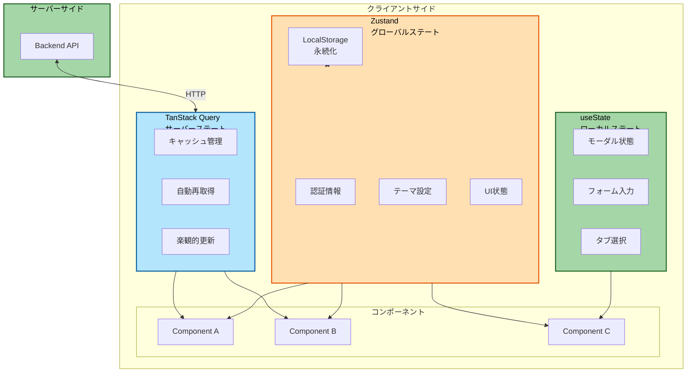
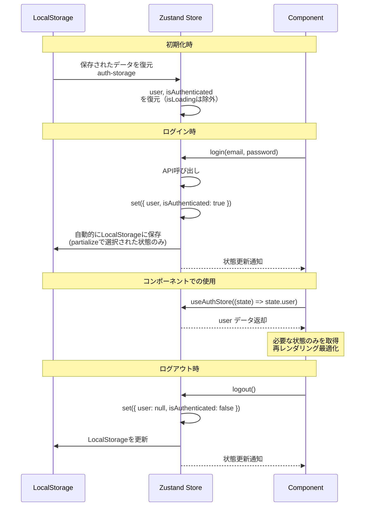
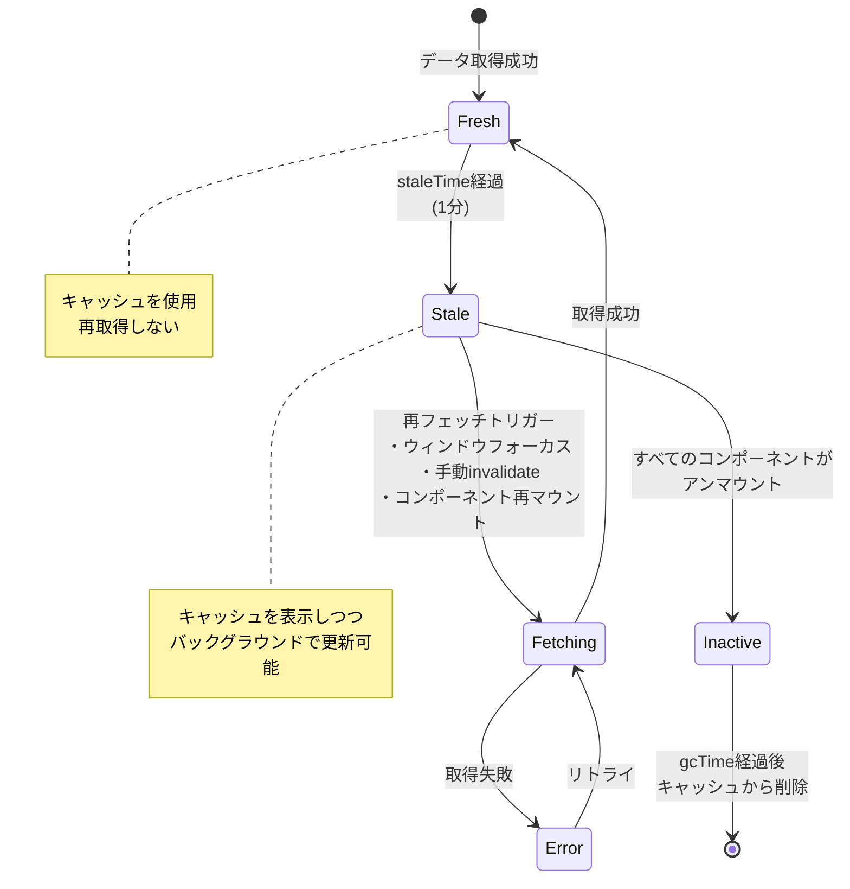

# 状態管理戦略

このドキュメントでは、プロジェクトにおける状態管理の考え方と実装方法を説明します。ローカルステート、グローバルステート、サーバーステートの3つのカテゴリに分けて管理し、それぞれに適したツールを使用する戦略を採用しています。

## 目次

1. [状態の分類](#状態の分類)
2. [使い分けフローチャート](#使い分けフローチャート)
3. [ローカルステート (useState)](#1-ローカルステート-usestate)
4. [グローバルステート (Zustand)](#2-グローバルステート-zustand)
5. [サーバーステート (TanStack Query)](#3-サーバーステート-tanstack-query)
6. [ベストプラクティス](#ベストプラクティス)

---

## 状態の分類

| 状態の種類 | ツール | 用途 |
|-----------|--------|------|
| **ローカルステート** | useState | コンポーネント内部の一時的な状態 |
| **グローバルステート** | Zustand | アプリ全体で共有するクライアント側の状態 |
| **サーバーステート** | TanStack Query | APIから取得するデータ |

## 使い分けフローチャート


### 状態管理の全体像



---

## 1. ローカルステート (useState)

### 使用する場合

- ✅ 他のコンポーネントと共有しない
- ✅ コンポーネントがアンマウントされたら不要
- ✅ UIの一時的な状態

### 実装例

```typescript
// モーダルの開閉
const [isOpen, setIsOpen] = useState(false)

// フォーム入力中の値
const [query, setQuery] = useState('')

// タブの選択状態
const [activeTab, setActiveTab] = useState<'profile' | 'settings'>('profile')
```

---

## 2. グローバルステート (Zustand)

### 使用する場合

- ✅ 複数のコンポーネント間で共有
- ✅ アプリ全体で保持する必要がある
- ✅ サーバーから取得したデータではない

### 典型的なユースケース

- 認証ユーザー情報
- テーマ設定（ライト/ダークモード）
- サイドバーの開閉状態

### 実装例（認証ストア）

```typescript
// src/features/auth/stores/auth-store.ts
import { create } from 'zustand'
import { persist, createJSONStorage } from 'zustand/middleware'

type User = {
  id: string
  email: string
  name: string
  role: string
}

type AuthStore = {
  user: User | null
  isAuthenticated: boolean
  isLoading: boolean
  login: (email: string, password: string) => Promise<void>
  logout: () => void
  setUser: (user: User) => void
}

export const useAuthStore = create<AuthStore>()(
  persist(
    (set) => ({
      user: null,
      isAuthenticated: false,
      isLoading: false,

      login: async (email: string, password: string) => {
        set({ isLoading: true })

        await api.post('/auth/login', { email, password })
          .then((response) => {
            const user = response.data

            set({
              user,
              isAuthenticated: true,
              isLoading: false,
            })
          })
          .catch((error) => {
            set({ isLoading: false })
            throw error
          })
      },

      logout: () => {
        set({
          user: null,
          isAuthenticated: false,
          isLoading: false,
        })
      },

      setUser: (user) => {
        set({
          user,
          isAuthenticated: true,
        })
      },
    }),
    {
      name: 'auth-storage', // LocalStorageのキー名
      storage: createJSONStorage(() => localStorage),

      // 永続化する状態を選択（isLoadingは除外）
      partialize: (state) => ({
        user: state.user,
        isAuthenticated: state.isAuthenticated,
      }),
    }
  )
)

// セレクター（パフォーマンス最適化用）
export const selectUser = (state: AuthStore) => state.user
export const selectIsAuthenticated = (state: AuthStore) => state.isAuthenticated
```

### Zustandの永続化とデータフロー



### 使用方法

```typescript
import { useAuthStore } from '@/features/auth/stores/auth-store'

export const Header = () => {
  // 必要な状態だけを取得（再レンダリング最適化）
  const user = useAuthStore((state) => state.user)
  const logout = useAuthStore((state) => state.logout)

  return (
    <div>
      <span>ようこそ、{user?.name}さん</span>
      <button onClick={logout}>ログアウト</button>
    </div>
  )
}
```

---

## 3. サーバーステート (TanStack Query)

### 使用する場合

- ✅ サーバーからAPIで取得するデータ
- ✅ キャッシュが必要なデータ
- ✅ 定期的に更新されるデータ

### なぜTanStack Queryを使うのか

従来のアプローチでは、自分でキャッシュ、再取得、エラーハンドリングを実装する必要がありました。
TanStack Queryはこれらを自動的に管理します。

### TanStack Queryのキャッシュライフサイクル



### 実装例

#### データ取得（Query）

**API層（`api/get-users.ts`）:**

```typescript
// src/features/sample-users/api/get-users.ts
import { queryOptions, useSuspenseQuery } from '@tanstack/react-query'
import { api } from '@/lib/api-client'
import { QueryConfig } from '@/lib/tanstack-query'

export const getUsers = (): Promise<{ data: User[] }> => {
  return api.get('/sample/users')
}

export const getUsersQueryOptions = () => {
  return queryOptions({
    queryKey: ['users'],
    queryFn: getUsers,
  })
}

type UseUsersOptions = {
  queryConfig?: QueryConfig<typeof getUsersQueryOptions>
}

export const useUsers = ({ queryConfig }: UseUsersOptions = {}) => {
  return useSuspenseQuery({
    ...getUsersQueryOptions(),
    ...queryConfig,
  })
}
```

**コンポーネント層（Suspenseパターン）:**

```typescript
import { Suspense } from 'react'
import { ErrorBoundary } from 'react-error-boundary'
import { LoadingSpinner } from '@/components/ui/loading-spinner'
import { MainErrorFallback } from '@/components/errors/main'
import { useUsers } from '@/features/sample-users/api/get-users'

// データフェッチを含むコンポーネント
const UserListContent = () => {
  const { data } = useUsers()  // isLoading, error は不要
  const users = data?.data ?? []

  return (
    <ul>
      {users.map((user) => (
        <li key={user.id}>{user.name}</li>
      ))}
    </ul>
  )
}

// メインコンポーネント
export const UserList = () => {
  return (
    <ErrorBoundary FallbackComponent={MainErrorFallback}>
      <Suspense fallback={<LoadingSpinner />}>
        <UserListContent />
      </Suspense>
    </ErrorBoundary>
  )
}
```

#### データ更新（Mutation）

```typescript
// src/features/sample-users/api/create-user.ts
import { useMutation, useQueryClient } from '@tanstack/react-query'
import { api } from '@/lib/api-client'

const createUser = (data: CreateUserInput): Promise<User> => {
  return api.post('/sample/users', data)
}

export const useCreateUser = () => {
  const queryClient = useQueryClient()

  return useMutation({
    mutationFn: createUser,
    onSuccess: () => {
      // ユーザーリストを再取得
      queryClient.invalidateQueries({ queryKey: ['users'] })
    },
  })
}
```

**使用方法:**

```typescript
import { useCreateUser } from '@/features/sample-users/api/create-user'

export const CreateUserForm = () => {
  const createUser = useCreateUser()

  const handleSubmit = async (data: CreateUserInput) => {
    await createUser.mutateAsync(data)
      .then(() => {
        alert('作成しました')
      })
      .catch(() => {
        alert('エラーが発生しました')
      })
  }

  return <form onSubmit={handleSubmit}>...</form>
}
```

---

## ベストプラクティス

### ✅ Good

```typescript
// ローカルステート: コンポーネント内部のみ
const [isOpen, setIsOpen] = useState(false)

// グローバルステート: アプリ全体で共有
const user = useAuthStore((state) => state.user)

// サーバーステート: APIから取得
const { data: users } = useUsers()
```

### ❌ Bad

```typescript
// サーバーデータをZustandで管理（アンチパターン）
const useUserStore = create((set) => ({
  users: [],
  fetchUsers: async () => {
    const res = await fetch('/api/users')
    set({ users: await res.json() })
  },
}))

// ローカルステートをZustandで管理（不要）
const useModalStore = create((set) => ({
  isOpen: false,
  open: () => set({ isOpen: true }),
}))
```

---

## 参考リンク

- [TanStack Query公式](https://tanstack.com/query/latest)
- [Zustand公式](https://zustand-demo.pmnd.rs/)
- [React Hooks公式](https://react.dev/reference/react/hooks)
