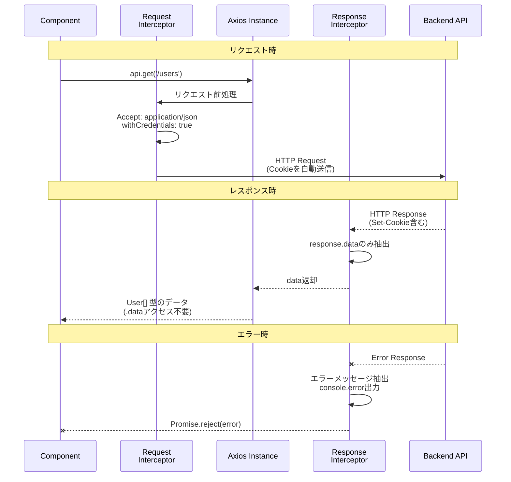

# APIクライアント (api-client.ts)

このドキュメントでは、Axiosを使用したAPIクライアントの実装について説明します。リクエスト/レスポンスインターセプター、Cookie認証、TanStack Queryとの連携など、API通信を一元管理する方法を理解できます。

## 目次

1. [実装](#実装)
2. [インターセプターの役割](#インターセプターの役割)
3. [CSRF保護](#csrf保護)
4. [基本的な使用方法](#基本的な使用方法)
5. [TanStack Queryとの連携](#tanstack-queryとの連携)
6. [Cookie認証](#cookie認証)

---

## 実装

```typescript
// src/lib/api-client.ts
import Axios, { InternalAxiosRequestConfig } from 'axios'
import { env } from '@/config/env'
import { getCsrfHeaderName, getCsrfToken } from '@/lib/csrf'

// リクエストインターセプター
const authRequestInterceptor = (
  config: InternalAxiosRequestConfig
): InternalAxiosRequestConfig => {
  if (config.headers) {
    config.headers.Accept = 'application/json'

    // CSRFトークンをヘッダーに追加
    const csrfToken = getCsrfToken()
    if (csrfToken) {
      config.headers[getCsrfHeaderName()] = csrfToken
    }
  }
  config.withCredentials = true  // Cookie認証を有効化
  return config
}

// Axiosインスタンス作成
export const api = Axios.create({
  baseURL: env.API_URL,
})

// リクエストインターセプター適用
api.interceptors.request.use(authRequestInterceptor)

// レスポンスインターセプター適用
api.interceptors.response.use(
  (response) => {
    return response.data  // response.dataのみを返す
  },
  (error) => {
    const message = error.response?.data?.message || error.message

    if (typeof window !== 'undefined') {
      console.error(`[API Error] ${message}`)
    }

    return Promise.reject(error)
  }
)
```

---

## インターセプターの役割

### リクエスト/レスポンスフロー



### リクエストインターセプター

すべてのリクエストに共通処理を追加します。

```typescript
import { getCsrfHeaderName, getCsrfToken } from '@/lib/csrf'

const authRequestInterceptor = (config: InternalAxiosRequestConfig) => {
  // 1. Acceptヘッダーを設定
  config.headers.Accept = 'application/json'

  // 2. CSRFトークンをヘッダーに追加
  const csrfToken = getCsrfToken()
  if (csrfToken) {
    config.headers[getCsrfHeaderName()] = csrfToken
  }

  // 3. Cookie認証を有効化
  config.withCredentials = true

  return config
}
```

### レスポンスインターセプター

すべてのレスポンスに共通処理を追加します。

```typescript
api.interceptors.response.use(
  // 成功時: response.dataのみを返す
  (response) => response.data,

  // エラー時: エラーログを出力
  (error) => {
    const message = error.response?.data?.message || error.message
    console.error(`[API Error] ${message}`)
    return Promise.reject(error)
  }
)
```

**メリット:**

```typescript
// ✅ インターセプター適用後
const users = await api.get<User[]>('/users')
// users は User[] 型

// ❌ インターセプターなし
const response = await api.get<User[]>('/users')
const users = response.data  // 毎回 .data が必要
```

---

## CSRF保護

Cross-Site Request Forgery (CSRF) 攻撃を防ぐため、APIクライアントは自動的にCSRFトークンをリクエストヘッダーに追加します。

### CSRF保護の仕組み

```typescript
// src/lib/csrf.ts
const CSRF_COOKIE_NAME = 'csrftoken'
const CSRF_HEADER_NAME = 'X-CSRF-Token'

export const getCsrfToken = (): string | null => {
  return getCookie(CSRF_COOKIE_NAME)
}

export const getCsrfHeaderName = (): string => {
  return CSRF_HEADER_NAME
}
```

### CSRFトークンのフロー

```mermaid
sequenceDiagram
    participant Browser as Browser<br/>(Cookie Storage)
    participant Client as API Client
    participant CSRF as CSRF Utils<br/>(lib/csrf.ts)
    participant Server as FastAPI Backend

    Note over Browser,Server: 初回アクセス
    Client->>Server: GET /api/some-endpoint
    Server-->>Browser: Set-Cookie: csrftoken=xyz789<br/>HttpOnly, Secure
    Browser->>Browser: CSRFトークンをCookieに保存

    Note over Browser,Server: POST/PATCH/DELETEリクエスト
    Client->>CSRF: getCsrfToken()
    CSRF->>Browser: Cookieから'csrftoken'取得
    Browser-->>CSRF: csrftoken=xyz789
    CSRF-->>Client: xyz789
    Client->>Client: リクエストヘッダーに追加<br/>X-CSRF-Token: xyz789
    Client->>Server: POST /api/users<br/>Cookie: csrftoken=xyz789<br/>X-CSRF-Token: xyz789
    Server->>Server: CookieとHeaderのトークン検証
    Server-->>Client: レスポンス返却

    style Browser fill:#ffe0b2,stroke:#e65100,stroke-width:2px,color:#000
    style Client fill:#b3e5fc,stroke:#01579b,stroke-width:2px,color:#000
    style CSRF fill:#fff9c4,stroke:#f57f17,stroke-width:2px,color:#000
    style Server fill:#a5d6a7,stroke:#1b5e20,stroke-width:2px,color:#000
```

### FastAPIとの連携

FastAPIバックエンドは、POST/PATCH/DELETEリクエストに対してCSRFトークンを検証します。

**バックエンド側の設定例:**

```python
# FastAPI側のCSRF保護設定
from fastapi import FastAPI, Request, HTTPException

app = FastAPI()

@app.middleware("http")
async def csrf_protect(request: Request, call_next):
    if request.method in ["POST", "PATCH", "DELETE"]:
        csrf_cookie = request.cookies.get("csrftoken")
        csrf_header = request.headers.get("X-CSRF-Token")

        if not csrf_cookie or csrf_cookie != csrf_header:
            raise HTTPException(status_code=403, detail="CSRF token validation failed")

    response = await call_next(request)
    return response
```

**重要な点:**

- **GETリクエストは検証不要**: CSRFトークンの検証はPOST/PATCH/DELETEのみ
- **自動処理**: フロントエンド側は自動的にトークンを送信するため、開発者が意識する必要なし
- **Cookie + Header**: CookieとHeaderの両方でトークンを送信し、サーバー側で一致を検証

---

## 基本的な使用方法

### GET

```typescript
import { api } from '@/lib/api-client'

type User = {
  id: string
  name: string
  email: string
}

export const getUsers = (): Promise<User[]> => {
  return api.get('/sample/users')
}

export const getUser = (userId: string): Promise<User> => {
  return api.get(`/sample/users/${userId}`)
}
```

### POST

```typescript
type CreateUserInput = {
  name: string
  email: string
}

export const createUser = (data: CreateUserInput): Promise<User> => {
  return api.post('/sample/users', data)
}
```

### PATCH

```typescript
type UpdateUserInput = {
  name?: string
  email?: string
}

export const updateUser = (
  userId: string,
  data: UpdateUserInput
): Promise<User> => {
  return api.patch(`/sample/users/${userId}`, data)
}
```

### DELETE

```typescript
export const deleteUser = (userId: string): Promise<void> => {
  return api.delete(`/sample/users/${userId}`)
}
```

### クエリパラメータ

```typescript
type GetUsersParams = {
  page?: number
  limit?: number
  search?: string
}

export const getUsers = (params: GetUsersParams): Promise<User[]> => {
  return api.get('/sample/users', { params })
}

// 使用例
const users = await getUsers({ page: 1, limit: 10, search: 'John' })
// GET /sample/users?page=1&limit=10&search=John
```

---

## TanStack Queryとの連携

実際のアプリケーションでは、TanStack Queryと組み合わせて使用します。
bulletproof-reactの構造に従い、React QueryのカスタムフックもAPI層に含めます。

**API層（`api/get-users.ts`）:**

```typescript
// src/features/sample-users/api/get-users.ts
import { queryOptions, useSuspenseQuery } from '@tanstack/react-query'
import { api } from '@/lib/api-client'
import { QueryConfig } from '@/lib/tanstack-query'

// 1. API関数
export const getUsers = (): Promise<{ data: User[] }> => {
  return api.get('/sample/users')
}

// 2. クエリオプション
export const getUsersQueryOptions = () => {
  return queryOptions({
    queryKey: ['users'],
    queryFn: getUsers,
  })
}

// 3. カスタムフック
type UseUsersOptions = {
  queryConfig?: QueryConfig<typeof getUsersQueryOptions>
}

export const useUsers = ({ queryConfig }: UseUsersOptions = {}) => {
  return useSuspenseQuery({
    ...getUsersQueryOptions(),
    ...queryConfig,
  })
}
```

**コンポーネントでの使用（Suspenseパターン）:**

```typescript
'use client'

import { Suspense } from 'react'
import { ErrorBoundary } from 'react-error-boundary'
import { LoadingSpinner } from '@/components/ui/loading-spinner'
import { MainErrorFallback } from '@/components/errors/main'
import { useUsers } from '@/features/sample-users/api/get-users'

// データフェッチを含むコンポーネント
const UserListContent = () => {
  const { data } = useUsers()  // isLoading, error は不要
  const users = data?.data ?? []

  return (
    <ul>
      {users.map((user) => (
        <li key={user.id}>{user.name}</li>
      ))}
    </ul>
  )
}

// メインコンポーネント
export const UserList = () => {
  return (
    <ErrorBoundary FallbackComponent={MainErrorFallback}>
      <Suspense fallback={<LoadingSpinner />}>
        <UserListContent />
      </Suspense>
    </ErrorBoundary>
  )
}
```

詳しくは [TanStack Query](./07-tanstack-query.md) と [API統合](../04-development/07-api-integration/index.md) を参照してください。

---

## Cookie認証

```typescript
config.withCredentials = true
```

この設定により、リクエスト時に自動的にCookieを送信し、レスポンスの`Set-Cookie`ヘッダーを自動的に保存します。

### Cookie認証のフロー

```mermaid
sequenceDiagram
    participant Browser as Browser<br/>(Cookie Storage)
    participant Client as API Client<br/>(withCredentials: true)
    participant Server as Backend API

    Note over Browser,Server: 初回ログイン
    Client->>Server: POST /auth/login<br/>{ email, password }
    Server->>Server: 認証処理
    Server-->>Client: Set-Cookie: session=abc123<br/>HttpOnly, Secure
    Client->>Browser: Cookieを自動保存

    Note over Browser,Server: 以降のリクエスト
    Client->>Browser: Cookie取得
    Browser-->>Client: session=abc123
    Client->>Server: GET /api/users<br/>Cookie: session=abc123
    Server->>Server: Cookieから認証確認
    Server-->>Client: ユーザーデータ返却

    Note over Browser,Server: ログアウト
    Client->>Server: POST /auth/logout<br/>Cookie: session=abc123
    Server-->>Client: Set-Cookie: session=; Max-Age=0<br/>Cookieを削除
    Client->>Browser: Cookie削除

    style Browser fill:#ffe0b2,stroke:#e65100,stroke-width:2px,color:#000
    style Client fill:#b3e5fc,stroke:#01579b,stroke-width:2px,color:#000
    style Server fill:#a5d6a7,stroke:#1b5e20,stroke-width:2px,color:#000
```

---

## 参考リンク

- [Axios公式ドキュメント](https://axios-http.com/)
- [TanStack Query](./07-tanstack-query.md)
- [API統合](../04-development/05-api-integration.md)
