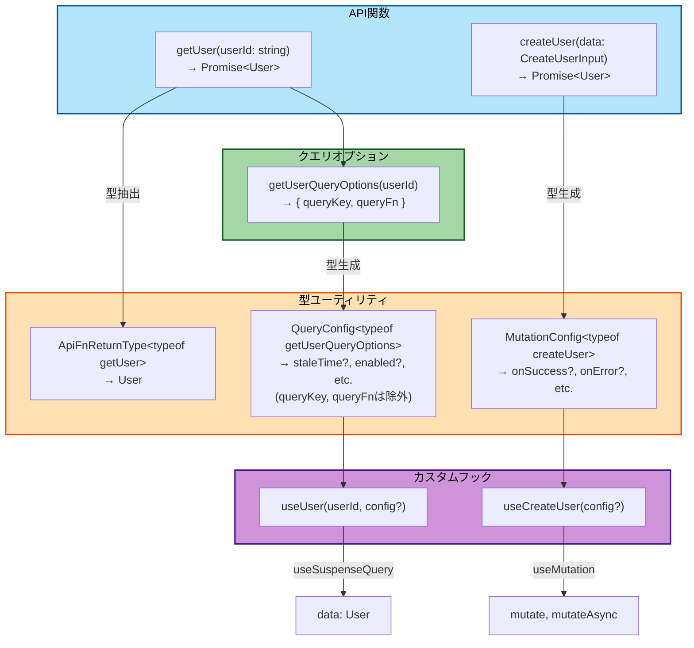
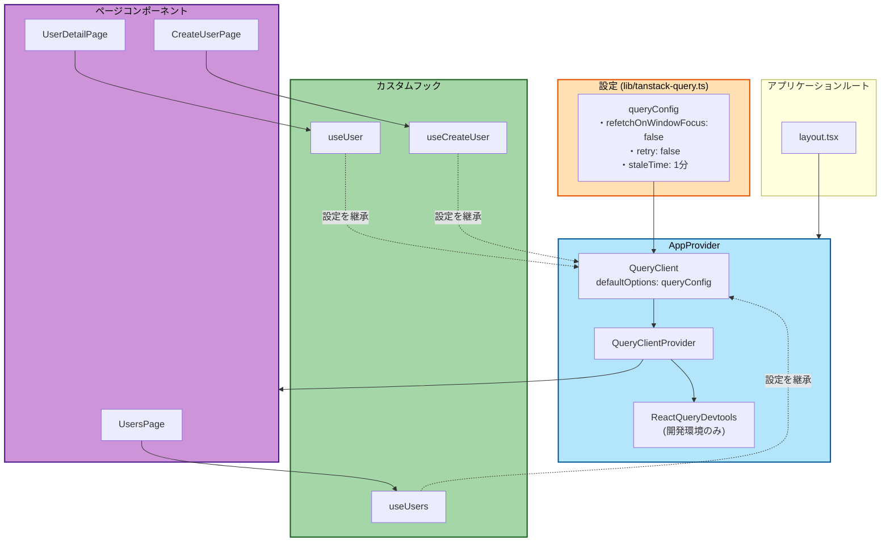

# TanStack Query設定 (tanstack-query.ts)

このドキュメントでは、TanStack Queryのデフォルト設定と型ユーティリティについて説明します。クエリ設定のカスタマイズ、型安全なAPI関数の定義、プロバイダーの設定など、TanStack Queryを効果的に使用する方法を理解できます。

## 目次

1. [デフォルト設定](#デフォルト設定)
2. [型ユーティリティ](#型ユーティリティ)
3. [プロバイダー設定](#プロバイダー設定)
4. [設定のカスタマイズ](#設定のカスタマイズ)

---

## デフォルト設定

```typescript
// src/lib/tanstack-query.ts
import { DefaultOptions } from '@tanstack/react-query'

export const queryConfig = {
  queries: {
    refetchOnWindowFocus: false,  // フォーカス時の再取得を無効化
    retry: false,                 // エラー時のリトライを無効化
    staleTime: 1000 * 60 * 5,     // 5分間はデータが新鮮
  },
} satisfies DefaultOptions
```

### 設定項目の説明

| 設定 | デフォルト値 | 説明 |
|------|-------------|------|
| **refetchOnWindowFocus** | `false` | ブラウザのタブがフォーカスされた時に再取得しない |
| **retry** | `false` | エラー時にリトライしない（即座にエラー表示） |
| **staleTime** | `1000 * 60 * 5` | 5分間はキャッシュを使用（パフォーマンス向上） |

---

## 型ユーティリティ

### 型ユーティリティの関係図



### 1. ApiFnReturnType

API関数の戻り値の型を自動抽出します。

```typescript
export type ApiFnReturnType<FnType extends (...args: any) => Promise<any>> =
  Awaited<ReturnType<FnType>>
```

**使用例:**

```typescript
const getUser = async (userId: string): Promise<User> => {
  return api.get(`/sample/users/${userId}`)
}

// 戻り値の型を抽出
type UserData = ApiFnReturnType<typeof getUser>  // User
```

### 2. QueryConfig

クエリフックのオプション型を生成します。

```typescript
export type QueryConfig<T extends (...args: any[]) => any> =
  Omit<ReturnType<T>, 'queryKey' | 'queryFn'>
```

**使用例:**

```typescript
export const getUserQueryOptions = (userId: string) => ({
  queryKey: ['users', userId],
  queryFn: () => getUser(userId),
})

export const useUser = (
  userId: string,
  config?: QueryConfig<typeof getUserQueryOptions>
) => {
  return useQuery({
    ...getUserQueryOptions(userId),
    ...config,
  })
}

// 使用
const { data } = useUser('123', {
  staleTime: 5000,    // ✅ OK
  enabled: !!userId,  // ✅ OK
  // queryKey: ['foo']  // ❌ エラー: queryKey は上書き不可
})
```

### 3. MutationConfig

Mutation関数の型安全なオプションを生成します。

```typescript
export type MutationConfig<MutationFnType extends (...args: any) => Promise<any>> =
  UseMutationOptions<
    ApiFnReturnType<MutationFnType>,  // 戻り値の型
    Error,                             // エラーの型
    Parameters<MutationFnType>[0]      // 引数の型
  >
```

**使用例:**

```typescript
const createUser = async (data: CreateUserInput): Promise<User> => {
  return api.post('/sample/users', data)
}

export const useCreateUser = (config?: MutationConfig<typeof createUser>) => {
  const queryClient = useQueryClient()

  return useMutation({
    mutationFn: createUser,
    onSuccess: () => {
      queryClient.invalidateQueries({ queryKey: ['users'] })
    },
    ...config,
  })
}

// 使用
const createUserMutation = useCreateUser({
  onSuccess: (data) => {
    console.log('User created:', data)  // data は User 型
  },
  onError: (error) => {
    console.error('Failed:', error)     // error は Error 型
  },
})

createUserMutation.mutate({
  name: 'John',
  email: 'john@example.com',
})
```

---

## プロバイダー設定

### アプリケーション構成



```typescript
// src/app/provider.tsx
'use client'

import { QueryClient, QueryClientProvider } from '@tanstack/react-query'
import { ReactQueryDevtools } from '@tanstack/react-query-devtools'
import { queryConfig } from '@/lib/tanstack-query'

const queryClient = new QueryClient({
  defaultOptions: queryConfig,
})

export const AppProvider = ({ children }: { children: React.ReactNode }) => {
  return (
    <QueryClientProvider client={queryClient}>
      {children}
      <ReactQueryDevtools initialIsOpen={false} />
    </QueryClientProvider>
  )
}
```

### ReactQueryDevtools

開発環境でTanStack Queryの状態を可視化するツールです。

- クエリの状態、キャッシュ、リフェッチのタイミングなどを確認可能
- 本番環境では自動的に無効化

---

## 設定のカスタマイズ

### 個別のクエリで設定を上書き

```typescript
const { data } = useUsers({
  staleTime: 10 * 60 * 1000,  // 10分（デフォルトの1分を上書き）
  retry: 3,                   // 3回リトライ（デフォルトの0を上書き）
})
```

### データの種類に応じた設定

```typescript
// 頻繁に更新されるデータ
const { data } = useQuery({
  queryKey: ['notifications'],
  queryFn: fetchNotifications,
  staleTime: 0,                   // すぐに古いと判断
  refetchInterval: 30 * 1000,     // 30秒ごとに再取得
})

// あまり変わらないデータ
const { data } = useQuery({
  queryKey: ['settings'],
  queryFn: fetchSettings,
  staleTime: 30 * 60 * 1000,      // 30分間はキャッシュを使用
})
```

---

## Suspenseとの統合

### API層にカスタムフックを含める

TanStack Query v5では、Reactの`Suspense`と統合するために`useSuspenseQuery`フックを使用します。
**重要**: bulletproof-reactの構造に従い、React QueryのカスタムフックもAPI層に含めます。

**API層（`api/get-users.ts`）:**

```typescript
// src/features/sample-users/api/get-users.ts
import { queryOptions, useSuspenseQuery } from '@tanstack/react-query'
import { api } from '@/lib/api-client'
import { QueryConfig } from '@/lib/tanstack-query'
import type { User } from '../types'

// 1. API関数
export const getUsers = (): Promise<{ data: User[] }> => {
  return api.get('/sample/users')
}

// 2. クエリオプション
export const getUsersQueryOptions = () => {
  return queryOptions({
    queryKey: ['users'],
    queryFn: getUsers,
  })
}

// 3. カスタムフック
type UseUsersOptions = {
  queryConfig?: QueryConfig<typeof getUsersQueryOptions>
}

export const useUsers = ({ queryConfig }: UseUsersOptions = {}) => {
  return useSuspenseQuery({
    ...getUsersQueryOptions(),
    ...queryConfig,
  })
}
```

**Hooks層（`routes/sample-users/users.hook.ts`）- 必要に応じて:**

ページ固有のビジネスロジックを追加する場合のみ作成します。

```typescript
// src/features/sample-users/routes/sample-users/users.hook.ts
import { useRouter } from 'next/navigation'
import { useUsers as useUsersQuery } from '@/features/sample-users/api/get-users'

export const useUsers = () => {
  const router = useRouter()
  const { data } = useUsersQuery()

  const users = data?.data ?? []

  const handleEdit = (userId: string) => {
    router.push(`/sample-users/${userId}/edit`)
  }

  return {
    users,
    handleEdit,
  }
}
```

### コンポーネントでの使用

**パターン1: API層のuseUsersを直接使用（シンプルなページ）**

```typescript
'use client'

import { Suspense } from 'react'
import { ErrorBoundary } from 'react-error-boundary'
import { LoadingSpinner } from '@/components/ui/loading-spinner'
import { MainErrorFallback } from '@/components/errors/main'
import { useUsers } from '@/features/sample-users/api/get-users'

// データフェッチを含むコンポーネント
const UsersPageContent = () => {
  const { data } = useUsers()  // isLoading, error は不要
  const users = data?.data ?? []

  return (
    <div>
      <h1>ユーザー一覧</h1>
      <ul>
        {users.map((user) => (
          <li key={user.id}>{user.name}</li>
        ))}
      </ul>
    </div>
  )
}

// メインコンポーネント
const UsersPage = () => {
  return (
    <ErrorBoundary FallbackComponent={MainErrorFallback}>
      <Suspense fallback={<LoadingSpinner fullScreen />}>
        <UsersPageContent />
      </Suspense>
    </ErrorBoundary>
  )
}

export default UsersPage
```

**パターン2: routes層のuseUsersを使用（ビジネスロジックがある場合）**

```typescript
'use client'

import { Suspense } from 'react'
import { ErrorBoundary } from 'react-error-boundary'
import { LoadingSpinner } from '@/components/ui/loading-spinner'
import { MainErrorFallback } from '@/components/errors/main'
import { useUsers } from './users.hook'

// データフェッチを含むコンポーネント
const UsersPageContent = () => {
  const { users, handleEdit } = useUsers()  // isLoading, error は不要

  return (
    <div>
      <h1>ユーザー一覧</h1>
      <ul>
        {users.map((user) => (
          <li key={user.id}>
            {user.name}
            <button onClick={() => handleEdit(user.id)}>編集</button>
          </li>
        ))}
      </ul>
    </div>
  )
}

// メインコンポーネント
const UsersPage = () => {
  return (
    <ErrorBoundary FallbackComponent={MainErrorFallback}>
      <Suspense fallback={<LoadingSpinner fullScreen />}>
        <UsersPageContent />
      </Suspense>
    </ErrorBoundary>
  )
}

export default UsersPage
```

### Suspenseを使用する利点

- **宣言的なローディング管理**: `isLoading`を手動でチェックする必要がない
- **エラーハンドリングの統一**: `ErrorBoundary`で一元管理
- **コードの簡潔化**: ローディングとエラー状態の分岐処理が不要
- **Reactの標準パターン**: Reactの推奨パターンに従う

---

## 参考リンク

- [TanStack Query公式](https://tanstack.com/query/latest)
- [TanStack Query - Suspense](https://tanstack.com/query/latest/docs/framework/react/guides/suspense)
- [API統合](../04-development/05-api-integration.md)
- [APIクライアント](./06-api-client.md)
