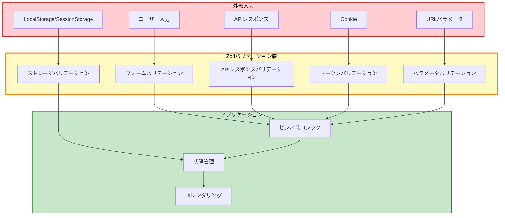

# Zodによるセキュリティ強化ガイド

このガイドでは、Zodランタイムバリデーションを活用したセキュリティ強化の実装パターンを説明します。

---

## 目次

1. [概要](#概要)
2. [なぜZodバリデーションが必要か](#なぜzodバリデーションが必要か)
3. [バリデーション箇所の特定](#バリデーション箇所の特定)
4. [実装パターン](#実装パターン)
5. [セキュリティベストプラクティス](#セキュリティベストプラクティス)
6. [トラブルシューティング](#トラブルシューティング)

---

## 概要

### セキュリティレイヤー



### このガイドで学べること

- ✅ 外部入力の完全バリデーション
- ✅ 改ざん検出と自動防御
- ✅ ランタイム型安全性の確保
- ✅ セキュリティリスクの軽減

---

## なぜZodバリデーションが必要か

### TypeScript型チェックの限界

TypeScriptの型チェックは**コンパイル時のみ**有効です。実行時には型情報が失われます。

```typescript
// ❌ TypeScriptの型は実行時には存在しない
interface User {
  id: string;
  role: "user" | "admin";
}

const user: User = JSON.parse(localStorage.getItem("user")!);
// ↑ ランタイムエラーの可能性:
// - JSONが不正
// - roleが"super_admin"（不正な値）
// - idが数値（型不一致）

if (user.role === "admin") {
  // 危険: 改ざんされたroleで管理者機能にアクセスされる
  showAdminPanel();
}
```

```typescript
// ✅ Zodは実行時にバリデーション
const UserSchema = z.object({
  id: z.string(),
  role: z.enum(["user", "admin"]), // ✅ "super_admin"は拒否される
});

const rawData = localStorage.getItem("user");
if (!rawData) {
  // ユーザーなし
  return null;
}

const result = UserSchema.safeParse(JSON.parse(rawData));
if (!result.success) {
  // ✅ 不正なデータを検出
  console.warn("改ざん検出:", result.error);
  localStorage.removeItem("user");
  return null;
}

const user = result.data; // ✅ 検証済みデータ
if (user.role === "admin") {
  // 安全: roleは確実に "user" または "admin"
  showAdminPanel();
}
```

### セキュリティリスクの種類

| リスク | 説明 | Zodによる対策 |
|--------|------|---------------|
| **改ざん** | LocalStorageやCookieのデータを直接編集 | スキーマ検証により不正データを検出・削除 |
| **インジェクション** | 悪意のあるコードやスクリプトの注入 | 厳格な型・形式検証により不正入力を拒否 |
| **型不一致** | 期待する型と異なるデータによるクラッシュ | ランタイム型検証により事前に検出 |
| **不正API応答** | サーバーバグによる不正なレスポンス | APIレスポンススキーマで検証 |

---

## バリデーション箇所の特定

### 検証が必要な全ての入力ポイント

#### 1. ユーザー入力（フォーム）

```typescript
// ✅ フォームバリデーション
import { z } from "zod";
import { zodResolver } from "@hookform/resolvers/zod";
import { useForm } from "react-hook-form";

const loginSchema = z.object({
  email: z.string().email("有効なメールアドレスを入力してください"),
  password: z.string().min(8, "パスワードは8文字以上です"),
});

type LoginInput = z.infer<typeof loginSchema>;

const { register, handleSubmit } = useForm<LoginInput>({
  resolver: zodResolver(loginSchema),
});
```

**関連ドキュメント**: [フォームバリデーション](../06-forms-validation/)

#### 2. APIレスポンス

```typescript
// ✅ APIレスポンスバリデーション
export const UserResponseSchema = z.object({
  data: z.array(
    z.object({
      id: z.string(),
      email: z.string().email(),
      role: z.enum(["user", "admin"]),
    })
  ),
});

export const getUsers = async (): Promise<UsersResponse> => {
  const response = await api.get("/users");
  return UserResponseSchema.parse(response); // ✅ バリデーション
};
```

**関連ドキュメント**: [APIレスポンスバリデーション](../06-forms-validation/04-api-response-validation.md)

#### 3. LocalStorage/SessionStorage

```typescript
// ✅ ストレージバリデーション
const AuthStorageSchema = z.object({
  user: z.object({
    id: z.string(),
    role: z.enum(["user", "admin"]),
  }).nullable(),
  isAuthenticated: z.boolean(),
});

const validatedLocalStorage = {
  getItem: (name: string) => {
    const item = localStorage.getItem(name);
    if (!item) return null;

    try {
      const parsed = JSON.parse(item);
      const result = AuthStorageSchema.safeParse(parsed.state);

      if (!result.success) {
        console.warn("改ざん検出:", result.error);
        localStorage.removeItem(name); // ✅ 不正データを削除
        return null;
      }

      return parsed;
    } catch {
      localStorage.removeItem(name);
      return null;
    }
  },
  // ... setItem, removeItem
};
```

**関連ドキュメント**: [状態管理とZodバリデーション](../../03-core-concepts/02-state-management.md#永続化とzodバリデーション)

#### 4. JWT/CSRFトークン

```typescript
// ✅ JWTトークンバリデーション
const JWTTokenSchema = z
  .string()
  .min(1)
  .regex(/^[\w-]+\.[\w-]+\.[\w-]+$/, "不正なJWT形式")
  .refine((token) => {
    const parts = token.split(".");
    return parts.length === 3 && parts.every((p) => p.length > 0);
  });

export const getValidatedToken = (key: string): string | null => {
  const token = localStorage.getItem(key);
  if (!token) return null;

  const result = JWTTokenSchema.safeParse(token);
  if (!result.success) {
    console.warn("不正なトークン:", result.error);
    localStorage.removeItem(key); // ✅ 不正トークンを削除
    return null;
  }

  return result.data;
};
```

```typescript
// ✅ CSRFトークンバリデーション
const CsrfTokenSchema = z
  .string()
  .trim()
  .min(8, "CSRFトークンは8文字以上")
  .regex(/^[\w-]+$/, "CSRFトークンは英数字のみ");

export const getCsrfToken = (): string | null => {
  const rawToken = getCookie("csrftoken");
  if (!rawToken) return null;

  const result = CsrfTokenSchema.safeParse(rawToken);
  if (!result.success) {
    console.warn("不正なCSRFトークン:", result.error);
    return null;
  }

  return result.data;
};
```

**関連ドキュメント**: [トークンバリデーション](../06-forms-validation/09-token-validation.md)

#### 5. URLパラメータ

```typescript
// ✅ URLパラメータバリデーション
const UserIdParamSchema = z.object({
  userId: z.string().uuid("不正なユーザーID形式"),
});

export const UserDetailPage = () => {
  const params = useParams();

  // ✅ パラメータをバリデーション
  const result = UserIdParamSchema.safeParse(params);

  if (!result.success) {
    // 不正なパラメータ
    return <ErrorPage />;
  }

  const { userId } = result.data;
  // 安全にuserIdを使用
};
```

#### 6. 環境変数

```typescript
// ✅ 環境変数バリデーション
const envSchema = z.object({
  API_URL: z.string().url("API_URLは有効なURLである必要があります"),
  AUTH_MODE: z.enum(["development", "production"]),
  NEXT_PUBLIC_APP_NAME: z.string().min(1),
});

export const env = envSchema.parse({
  API_URL: process.env.NEXT_PUBLIC_API_URL,
  AUTH_MODE: process.env.NEXT_PUBLIC_AUTH_MODE,
  NEXT_PUBLIC_APP_NAME: process.env.NEXT_PUBLIC_APP_NAME,
});
```

**関連ドキュメント**: [環境変数バリデーション](../../03-core-concepts/05-environment-variables.md)

---

## 実装パターン

### パターン1: 安全な読み込み (safeParse)

**使用場面**: 不正データがあっても処理を続行したい場合

```typescript
const result = UserSchema.safeParse(data);

if (!result.success) {
  // エラーログ出力
  console.warn("バリデーション失敗:", result.error);

  // 不正データを削除
  localStorage.removeItem("user");

  // デフォルト値またはnullを返す
  return null;
}

// 検証済みデータを使用
const user = result.data;
```

**メリット**:
- ✅ エラーをキャッチして適切に処理
- ✅ アプリケーションのクラッシュを防止
- ✅ ユーザー体験を損なわない

### パターン2: 厳格な検証 (parse)

**使用場面**: バリデーション失敗時に例外をスローしたい場合

```typescript
try {
  const user = UserSchema.parse(data);
  // 検証済みデータを使用
  setUser(user);
  router.push("/dashboard");
} catch (error) {
  if (error instanceof z.ZodError) {
    // バリデーションエラー
    console.error("バリデーション失敗:", error.errors);
    setError("root", {
      message: "サーバーから不正なデータが返されました",
    });
  }
}
```

**メリット**:
- ✅ エラーを明示的に処理
- ✅ try-catchでエラーハンドリング
- ✅ ユーザーに適切なエラー通知

### パターン3: 自動クリーンアップ

**使用場面**: 不正データを自動的に削除したい場合

```typescript
const validatedLocalStorage = {
  getItem: (name: string) => {
    const item = localStorage.getItem(name);
    if (!item) return null;

    try {
      const parsed = JSON.parse(item);
      const result = YourSchema.safeParse(parsed.state);

      if (!result.success) {
        // ✅ 自動的に不正データを削除
        console.warn(`[${name}] 不正データを削除:`, result.error);
        localStorage.removeItem(name);
        return null;
      }

      return parsed;
    } catch (error) {
      // ✅ 破損データも自動削除
      console.warn(`[${name}] 破損データを削除:`, error);
      localStorage.removeItem(name);
      return null;
    }
  },
  // ...
};
```

**メリット**:
- ✅ 不正データを自動削除
- ✅ 次回アクセス時はクリーンな状態
- ✅ 手動クリーンアップ不要

### パターン4: transform による正規化

**使用場面**: データを正規化・変換したい場合

```typescript
const UserInputSchema = z.object({
  email: z
    .string()
    .email()
    .transform((val) => val.toLowerCase()), // ✅ 小文字に正規化

  name: z
    .string()
    .trim() // ✅ 前後の空白を削除
    .min(1, "名前は必須です"),

  age: z
    .string()
    .transform((val) => parseInt(val, 10)) // ✅ 文字列 → 数値
    .pipe(z.number().min(0).max(150)),

  createdAt: z
    .string()
    .transform((val) => new Date(val)) // ✅ 文字列 → Date
    .pipe(z.date()),
});
```

**メリット**:
- ✅ データの一貫性を保証
- ✅ 型変換を自動化
- ✅ バリデーションと変換を一箇所で管理

---

## セキュリティベストプラクティス

### ✅ DO: 全ての外部入力をバリデーション

```typescript
// ✅ APIレスポンス
const response = await api.get("/users");
const users = UsersResponseSchema.parse(response);

// ✅ LocalStorage
const result = AuthStorageSchema.safeParse(stored);

// ✅ URLパラメータ
const params = ParamSchema.parse(useParams());

// ✅ Cookie
const token = TokenSchema.parse(getCookie("token"));
```

### ❌ DON'T: TypeScript型アサーションのみ

```typescript
// ❌ 実行時には検証されない
const user = JSON.parse(localStorage.getItem("user")!) as User;

// ❌ any型で型安全性を失う
const response: any = await api.get("/users");
const users: User[] = response.data;
```

### ✅ DO: スキーマを一箇所で定義

```typescript
// ✅ スキーマファイルで一元管理
// src/features/auth/schemas/user.schema.ts
export const UserSchema = z.object({
  id: z.string(),
  email: z.string().email(),
  role: z.enum(["user", "admin"]),
});

export type User = z.infer<typeof UserSchema>;
```

### ❌ DON'T: スキーマと型を分離

```typescript
// ❌ 型とスキーマが同期しなくなる
// types.ts
export type User = {
  id: string;
  email: string;
  role: string; // ❌ enumではない
};

// schema.ts
export const UserSchema = z.object({
  id: z.string(),
  email: z.string().email(),
  role: z.enum(["user", "admin"]), // ✅ enumだが型と不一致
});
```

### ✅ DO: 詳細なエラーメッセージ

```typescript
// ✅ ユーザーフレンドリーなメッセージ
const UserSchema = z.object({
  email: z
    .string()
    .min(1, "メールアドレスを入力してください")
    .email("有効なメールアドレスを入力してください"),

  password: z
    .string()
    .min(8, "パスワードは8文字以上で入力してください")
    .regex(
      /^(?=.*[a-z])(?=.*[A-Z])(?=.*\d)/,
      "パスワードは大文字、小文字、数字を含む必要があります"
    ),
});
```

### ❌ DON'T: デフォルトメッセージのみ

```typescript
// ❌ デバッグが困難
const UserSchema = z.object({
  email: z.string().email(),
  password: z.string().min(8),
});
```

### ✅ DO: 不正データの自動削除

```typescript
// ✅ 改ざんデータを自動削除
if (!result.success) {
  console.warn("改ざん検出:", result.error);
  localStorage.removeItem(key); // ✅ 削除
  return null;
}
```

### ❌ DON'T: 不正データをそのまま使用

```typescript
// ❌ 改ざんデータがアプリに残る
if (!result.success) {
  console.warn("バリデーション失敗");
  return null; // localStorageには不正データが残る
}
```

### ✅ DO: 最小権限の原則

```typescript
// ✅ 必要最小限のロールのみ許可
const UserRoleSchema = z.enum(["user", "admin"]);

// ✅ 厳格な形式制限
const JWTTokenSchema = z
  .string()
  .regex(/^[\w-]+\.[\w-]+\.[\w-]+$/);
```

### ❌ DON'T: 緩い検証

```typescript
// ❌ 任意の文字列を許可
const UserRoleSchema = z.string();

// ❌ 任意のトークン形式を許可
const TokenSchema = z.string().min(1);
```

---

## トラブルシューティング

### エラー: "Expected string, received undefined"

**原因**: 必須フィールドが存在しない

**解決策**:

```typescript
// ❌ 問題のあるスキーマ
const UserSchema = z.object({
  name: z.string(), // nameが存在しないとエラー
});

// ✅ 解決策1: optional()
const UserSchema = z.object({
  name: z.string().optional(),
});

// ✅ 解決策2: nullable()
const UserSchema = z.object({
  name: z.string().nullable(),
});

// ✅ 解決策3: default()
const UserSchema = z.object({
  name: z.string().default("未設定"),
});
```

### エラー: "Invalid enum value"

**原因**: enum定義に含まれない値

**解決策**:

```typescript
// ❌ 問題のあるスキーマ
const RoleSchema = z.enum(["user", "admin"]);
// APIから "moderator" が返された → エラー

// ✅ 解決策1: enumに追加
const RoleSchema = z.enum(["user", "admin", "moderator"]);

// ✅ 解決策2: 任意の文字列を許可（セキュリティリスクあり）
const RoleSchema = z.string();

// ✅ 解決策3: デフォルト値にフォールバック
const RoleSchema = z
  .enum(["user", "admin", "moderator"])
  .catch("user"); // バリデーション失敗時は "user"
```

### エラー: "Required field missing"

**原因**: APIレスポンスに期待するフィールドが存在しない

**解決策**:

```typescript
// ❌ 問題のあるコード
const UserSchema = z.object({
  id: z.string(),
  email: z.string().email(),
  profile: z.object({
    avatar: z.string().url(), // profileが存在しないとエラー
  }),
});

// ✅ 解決策: optional()またはnullable()
const UserSchema = z.object({
  id: z.string(),
  email: z.string().email(),
  profile: z
    .object({
      avatar: z.string().url(),
    })
    .optional(), // profileは省略可能
});
```

### パフォーマンス問題: "Validation is too slow"

**原因**: 大量データまたは複雑なスキーマ

**解決策**:

```typescript
// ❌ 毎回バリデーション（遅い）
const users = data.map((user) => UserSchema.parse(user));

// ✅ 配列全体を一度にバリデーション（速い）
const UsersSchema = z.array(UserSchema);
const users = UsersSchema.parse(data);

// ✅ safeParse() でキャッシュ活用
const result = UsersSchema.safeParse(data);
if (result.success) {
  const users = result.data;
}
```

---

## 関連ドキュメント

### バリデーション実装
- [トークンバリデーション](../06-forms-validation/09-token-validation.md)
- [APIレスポンスバリデーション](../06-forms-validation/04-api-response-validation.md)
- [フォームバリデーション](../06-forms-validation/)

### アーキテクチャ
- [状態管理とZodバリデーション](../../03-core-concepts/02-state-management.md#永続化とzodバリデーション)
- [APIクライアント](../../03-core-concepts/06-api-client.md)
- [環境変数バリデーション](../../03-core-concepts/05-environment-variables.md)

### 開発ガイド
- [認証機能実装](../05-custom-hooks/guides/04-use-cases/01-authentication.md#jwtトークン管理)
- [エラーハンドリング](./09-error-handling-rules.md)
- [サーバーエラー処理](../06-forms-validation/07-server-errors.md)

---

## まとめ

### セキュリティチェックリスト

- [ ] すべてのAPIレスポンスにZodバリデーション実装
- [ ] LocalStorage/SessionStorageの読み込み時にバリデーション実装
- [ ] JWTトークンとCSRFトークンのバリデーション実装
- [ ] URLパラメータのバリデーション実装
- [ ] フォーム入力のバリデーション実装
- [ ] 環境変数のバリデーション実装
- [ ] 不正データの自動削除処理実装
- [ ] 詳細なエラーメッセージ設定
- [ ] スキーマと型を一箇所で管理

### セキュリティ効果

| 実装項目 | セキュリティ効果 |
|---------|-----------------|
| **APIレスポンスバリデーション** | 不正なサーバーレスポンスによるクラッシュ防止 |
| **ストレージバリデーション** | LocalStorage改ざん検出と自動削除 |
| **トークンバリデーション** | 不正トークンによる認証バイパス防止 |
| **パラメータバリデーション** | URLインジェクション攻撃の防止 |
| **フォームバリデーション** | 不正入力によるXSS/SQLインジェクション防止 |

**結論**: Zodランタイムバリデーションにより、TypeScriptの型安全性を実行時にも拡張し、包括的なセキュリティ防御を実現できます。
