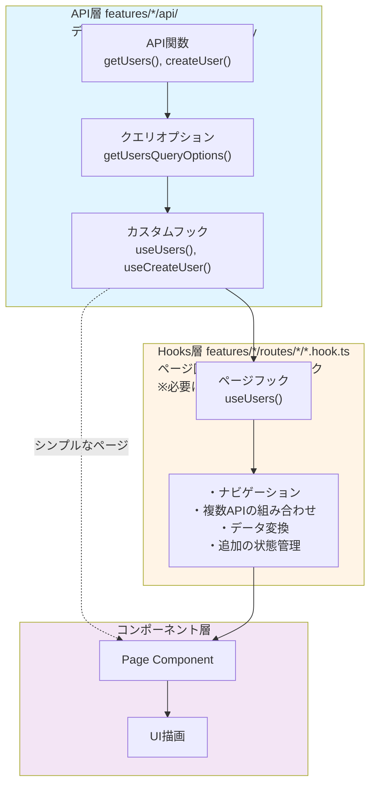
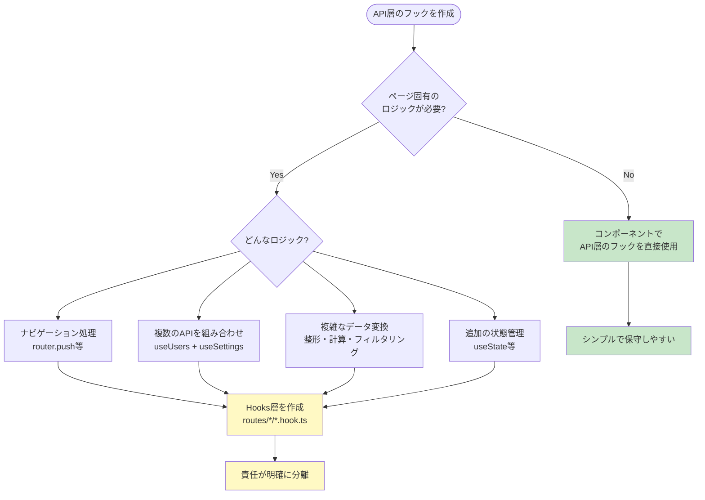
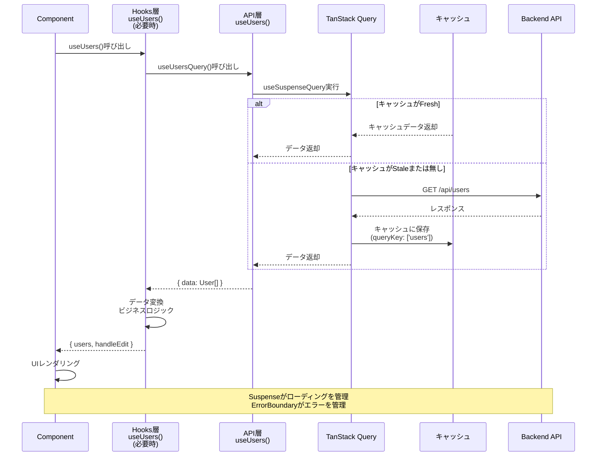
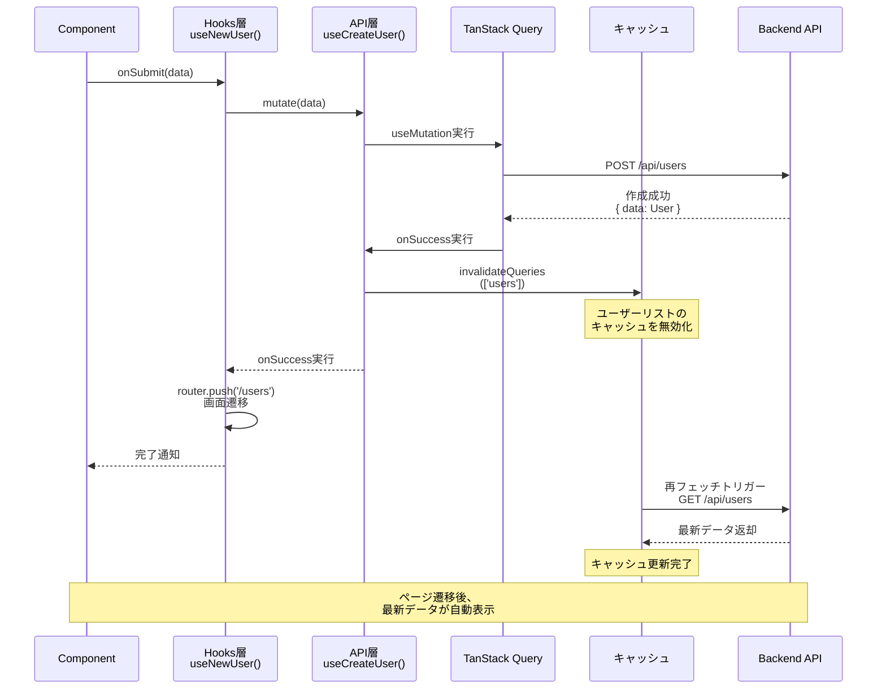
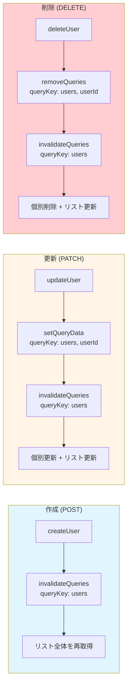

# データ取得フック

このドキュメントでは、TanStack Query（React Query）を使用したデータ取得フックの実装パターンについて説明します。

## 目次

- [概要](#概要)
- [基本パターン](#基本パターン)
- [データ取得フック（Query）](#データ取得フックquery)
- [データ更新フック（Mutation）](#データ更新フックmutation)
- [削除確認フック](#削除確認フック)
- [データ変換](#データ変換)
- [エラーハンドリング](#エラーハンドリング)
- [ベストプラクティス](#ベストプラクティス)

## 概要

データ取得フックは、TanStack Query（React Query）を使用してサーバーからのデータ取得、更新、削除を担当します。

### 主な責務

- サーバーデータの取得とキャッシュ管理
- データの作成、更新、削除（CRUD操作）
- ローディング状態とエラー状態の管理
- データの変換とフォーマット
- キャッシュの無効化と再取得

### 使用するライブラリ

- **TanStack Query**: サーバー状態管理
- **React**: Hooks API

## 基本パターン

### データフック層の構成



### いつHooks層が必要か？



### Suspenseパターン（推奨）

このプロジェクトでは、bulletproof-reactの構造に従い、`useSuspenseQuery`を使用したSuspenseパターンを推奨します。
React QueryのカスタムフックもAPI層に含めます。

**API層（`api/get-data.ts`）:**
```tsx
import { queryOptions, useSuspenseQuery } from "@tanstack/react-query";
import { api } from "@/lib/api-client";
import { QueryConfig } from "@/lib/tanstack-query";

export const getData = () => {
  return api.get("/feature/data");
};

export const getDataQueryOptions = () => {
  return queryOptions({
    queryKey: ["feature"],
    queryFn: getData,
  });
};

type UseDataOptions = {
  queryConfig?: QueryConfig<typeof getDataQueryOptions>;
};

export const useData = ({ queryConfig }: UseDataOptions = {}) => {
  return useSuspenseQuery({
    ...getDataQueryOptions(),
    ...queryConfig,
  });
};
```

**Hooks層（`routes/feature/feature.hook.ts`）- 必要に応じて:**

ページ固有のビジネスロジックがある場合のみ作成します。

```tsx
import { useData as useDataQuery } from "../../api/get-data";

export const useFeatureData = () => {
  const { data } = useDataQuery();

  // ================================================================================
  // Data Transformation
  // ================================================================================
  const transformedData = data?.data?.map((item) => ({
    // データ変換
  })) ?? [];

  return {
    data: transformedData,
    // isLoading, error は不要（SuspenseとErrorBoundaryが管理）
  };
};
```

### 従来のuseQueryパターン

以下のセクションの例は、従来の`useQuery`を使用したパターンです。
新規実装では上記のSuspenseパターンを使用してください。詳細は「[Suspenseとの統合](#suspenseとの統合)」セクションを参照してください。

## データ取得フック（Query）

### Queryのデータフロー



### 基本的なデータ取得

`src/features/sample-user/routes/users/users.hook.ts`

```tsx
import { useQuery } from "@tanstack/react-query";
import { getUsers } from "../../api/users.api";

/**
 * ユーザー一覧ページのカスタムフック
 *
 * ユーザー一覧の取得とデータ変換を担当します。
 */
export const useUsers = () => {
  // ================================================================================
  // Queries
  // ================================================================================
  const usersQuery = useQuery({
    queryKey: ["users"],
    queryFn: getUsers,
  });

  // ================================================================================
  // Data Transformation
  // ================================================================================
  const users =
    usersQuery.data?.map((user) => ({
      ...user,
      fullName: `${user.firstName} ${user.lastName}`,
    })) ?? [];

  return {
    users,
    isLoading: usersQuery.isLoading,
    error: usersQuery.error,
  };
};
```

### 使用例（コンポーネント側）

```tsx
"use client";

import { useUsers } from "./users.hook";
import { UserList } from "./components/user-list";
import { LoadingSpinner } from "@/components/ui/loading-spinner";
import { ErrorMessage } from "@/components/ui/error-message";

export default function UsersPage() {
  const { users, isLoading, error } = useUsers();

  if (isLoading) {
    return (
      <div className="flex min-h-screen items-center justify-center">
        <LoadingSpinner size="lg" />
      </div>
    );
  }

  if (error) {
    return (
      <div className="flex min-h-screen items-center justify-center">
        <ErrorMessage message="ユーザー情報の取得に失敗しました" />
      </div>
    );
  }

  return <UserList users={users} />;
}
```

### パラメータ付きデータ取得

```tsx
export const useUser = (userId: string) => {
  // ================================================================================
  // Queries
  // ================================================================================
  const userQuery = useQuery({
    queryKey: ["users", userId], // userIdをキーに含める
    queryFn: () => getUser(userId),
    enabled: !!userId, // userIdが存在する時のみ実行
  });

  return {
    user: userQuery.data,
    isLoading: userQuery.isLoading,
    error: userQuery.error,
  };
};
```

## データ更新フック（Mutation）

### Mutationのデータフロー



### Mutationのキャッシュ戦略



### 新規作成

`src/features/sample-user/routes/new-user/new-user.hook.ts`

```tsx
import { useForm } from "react-hook-form";
import { zodResolver } from "@hookform/resolvers/zod";
import { useMutation, useQueryClient } from "@tanstack/react-query";
import { useRouter } from "next/navigation";
import {
  userFormSchema,
  type UserFormValues,
} from "../../schemas/user-form.schema";
import { createUser } from "../../api/users.api";

/**
 * 新規ユーザー作成ページのカスタムフック
 */
export const useNewUser = () => {
  const router = useRouter();
  const queryClient = useQueryClient();

  // ================================================================================
  // Form
  // ================================================================================
  const {
    control,
    handleSubmit,
    formState: { errors },
    setError,
  } = useForm<UserFormValues>({
    resolver: zodResolver(userFormSchema),
    defaultValues: {
      firstName: "",
      lastName: "",
      email: "",
      age: "",
      country: "",
    },
  });

  // ================================================================================
  // Mutations
  // ================================================================================
  const createUserMutation = useMutation({
    mutationFn: createUser,
    onSuccess: () => {
      // ユーザー一覧のキャッシュを無効化
      queryClient.invalidateQueries({ queryKey: ["users"] });
      // ユーザー一覧ページに遷移
      router.push("/users");
    },
  });

  // ================================================================================
  // Handlers
  // ================================================================================
  const onSubmit = handleSubmit((values) => {
    createUserMutation.mutate(values, {
      onError: () => {
        setError("root", {
          message: "ユーザーの作成に失敗しました。もう一度お試しください。",
        });
      },
    });
  });

  return {
    control,
    onSubmit,
    errors,
    isSubmitting: createUserMutation.isPending,
  };
};
```

### 更新

`src/features/sample-user/routes/edit-user/edit-user.hook.ts`

```tsx
import { useForm } from "react-hook-form";
import { zodResolver } from "@hookform/resolvers/zod";
import { useMutation, useQuery, useQueryClient } from "@tanstack/react-query";
import { useRouter } from "next/navigation";
import {
  userFormSchema,
  type UserFormValues,
} from "../../schemas/user-form.schema";
import { getUser, updateUser } from "../../api/users.api";

/**
 * ユーザー編集ページのカスタムフック
 */
export const useEditUser = (userId: string) => {
  const router = useRouter();
  const queryClient = useQueryClient();

  // ================================================================================
  // Queries
  // ================================================================================
  const userQuery = useQuery({
    queryKey: ["users", userId],
    queryFn: () => getUser(userId),
    enabled: !!userId,
  });

  // ================================================================================
  // Form
  // ================================================================================
  const {
    control,
    handleSubmit,
    formState: { errors },
    setError,
    reset,
  } = useForm<UserFormValues>({
    resolver: zodResolver(userFormSchema),
    defaultValues: {
      firstName: "",
      lastName: "",
      email: "",
      age: "",
      country: "",
    },
  });

  // ユーザーデータが読み込まれたらフォームにセット
  useEffect(() => {
    if (userQuery.data) {
      reset({
        firstName: userQuery.data.firstName,
        lastName: userQuery.data.lastName,
        email: userQuery.data.email,
        age: userQuery.data.age?.toString() ?? "",
        country: userQuery.data.country,
      });
    }
  }, [userQuery.data, reset]);

  // ================================================================================
  // Mutations
  // ================================================================================
  const updateUserMutation = useMutation({
    mutationFn: (data: UserFormValues) => updateUser(userId, data),
    onSuccess: () => {
      // 特定のユーザーと一覧のキャッシュを無効化
      queryClient.invalidateQueries({ queryKey: ["users", userId] });
      queryClient.invalidateQueries({ queryKey: ["users"] });
      // ユーザー一覧ページに遷移
      router.push("/users");
    },
  });

  // ================================================================================
  // Handlers
  // ================================================================================
  const onSubmit = handleSubmit((values) => {
    updateUserMutation.mutate(values, {
      onError: () => {
        setError("root", {
          message: "ユーザーの更新に失敗しました。もう一度お試しください。",
        });
      },
    });
  });

  return {
    control,
    onSubmit,
    errors,
    isSubmitting: updateUserMutation.isPending,
    isLoadingUser: userQuery.isLoading,
    user: userQuery.data,
  };
};
```

### 削除

`src/features/sample-user/routes/delete-user/delete-user.hook.ts`

```tsx
import { useMutation, useQueryClient } from "@tanstack/react-query";
import { deleteUser } from "../../api/users.api";

/**
 * ユーザー削除のカスタムフック
 */
export const useDeleteUser = () => {
  const queryClient = useQueryClient();

  // ================================================================================
  // Mutations
  // ================================================================================
  const deleteUserMutation = useMutation({
    mutationFn: deleteUser,
    onSuccess: () => {
      // ユーザー一覧のキャッシュを無効化
      queryClient.invalidateQueries({ queryKey: ["users"] });
    },
  });

  return {
    deleteUser: deleteUserMutation.mutate,
    isDeleting: deleteUserMutation.isPending,
    error: deleteUserMutation.error,
  };
};
```

## 削除確認フック

削除操作では、確認ダイアログの状態管理も含めることがあります。

```tsx
import { useState } from "react";
import { useMutation, useQueryClient } from "@tanstack/react-query";
import { deleteUser } from "../../api/users.api";

/**
 * ユーザー削除のカスタムフック（確認ダイアログ付き）
 */
export const useDeleteUser = () => {
  const queryClient = useQueryClient();
  const [deleteUserId, setDeleteUserId] = useState<string | null>(null);

  // ================================================================================
  // Mutations
  // ================================================================================
  const deleteUserMutation = useMutation({
    mutationFn: deleteUser,
    onSuccess: () => {
      queryClient.invalidateQueries({ queryKey: ["users"] });
      setDeleteUserId(null); // ダイアログを閉じる
    },
  });

  // ================================================================================
  // Handlers
  // ================================================================================
  const openDeleteDialog = (userId: string) => {
    setDeleteUserId(userId);
  };

  const closeDeleteDialog = () => {
    setDeleteUserId(null);
  };

  const confirmDelete = () => {
    if (deleteUserId) {
      deleteUserMutation.mutate(deleteUserId);
    }
  };

  return {
    deleteUserId,
    openDeleteDialog,
    closeDeleteDialog,
    confirmDelete,
    isDeleting: deleteUserMutation.isPending,
    error: deleteUserMutation.error,
  };
};
```

## データ変換

### フック内でデータ変換を実行

データ変換はフック内で実行し、コンポーネントには変換済みのデータを渡します。

```tsx
export const useUsers = () => {
  const usersQuery = useQuery({
    queryKey: ["users"],
    queryFn: getUsers,
  });

  // ================================================================================
  // Data Transformation
  // ================================================================================
  const users =
    usersQuery.data?.map((user) => ({
      ...user,
      // フルネームを生成
      fullName: `${user.firstName} ${user.lastName}`,
      // 年齢表示を生成
      displayAge: user.age ? `${user.age}歳` : "未設定",
      // 国名を日本語に変換
      countryName: getCountryName(user.country),
    })) ?? [];

  return {
    users,
    isLoading: usersQuery.isLoading,
    error: usersQuery.error,
  };
};
```

### nullish coalescing でデフォルト値を提供

```tsx
// ✅ 良い例: 空配列をデフォルト値として提供
const users = usersQuery.data?.map(...) ?? [];

// ❌ 悪い例: undefinedの可能性がある
const users = usersQuery.data?.map(...);
```

## エラーハンドリング

### Query のエラー

```tsx
export const useUsers = () => {
  const usersQuery = useQuery({
    queryKey: ["users"],
    queryFn: getUsers,
  });

  return {
    users: usersQuery.data ?? [],
    isLoading: usersQuery.isLoading,
    error: usersQuery.error, // エラーオブジェクトを返す
  };
};

// コンポーネント側
const { users, isLoading, error } = useUsers();

if (error) {
  return <ErrorMessage message="データの取得に失敗しました" />;
}
```

### Mutation のエラー

```tsx
export const useNewUser = () => {
  const createUserMutation = useMutation({
    mutationFn: createUser,
    onSuccess: () => {
      // 成功時の処理
    },
  });

  const onSubmit = handleSubmit((values) => {
    createUserMutation.mutate(values, {
      onError: (error) => {
        // エラー時の処理
        setError("root", {
          message: "ユーザーの作成に失敗しました。",
        });
      },
    });
  });

  return {
    onSubmit,
    isSubmitting: createUserMutation.isPending,
    // Mutationのエラーは通常フォームエラーとして扱う
  };
};
```

## Suspenseとの統合

このプロジェクトでは、bulletproof-reactの構造に従い、TanStack Query v5の`useSuspenseQuery`を使用します。
**重要**: React QueryのカスタムフックもAPI層に含めます。

### API層（データ取得ロジック + カスタムフック）

```tsx
// src/features/sample-users/api/get-users.ts
import { queryOptions, useSuspenseQuery } from '@tanstack/react-query'
import { api } from '@/lib/api-client'
import { QueryConfig } from '@/lib/tanstack-query'
import type { User } from '../types'

// 1. API関数
export const getUsers = (): Promise<{ data: User[] }> => {
  return api.get('/sample/users')
}

// 2. クエリオプション
export const getUsersQueryOptions = () => {
  return queryOptions({
    queryKey: ['users'],
    queryFn: getUsers,
  })
}

// 3. カスタムフック
type UseUsersOptions = {
  queryConfig?: QueryConfig<typeof getUsersQueryOptions>
}

export const useUsers = ({ queryConfig }: UseUsersOptions = {}) => {
  return useSuspenseQuery({
    ...getUsersQueryOptions(),
    ...queryConfig,
  })
}
```

### Hooks層（ページ固有のビジネスロジック）- 必要に応じて

ナビゲーションなどのページ固有のロジックを追加する場合のみ作成します。

```tsx
// src/features/sample-users/routes/sample-users/users.hook.ts
import { useRouter } from 'next/navigation'
import { useUsers as useUsersQuery } from '@/features/sample-users/api/get-users'

export const useUsers = () => {
  const router = useRouter()
  const { data } = useUsersQuery()

  const users = data?.data ?? []

  const handleEdit = (userId: string) => {
    router.push(`/sample-users/${userId}/edit`)
  }

  return {
    users,
    handleEdit,
  }
}
```

### コンポーネント層（表示ロジック）

```tsx
// src/features/sample-users/routes/sample-users/users.tsx
'use client'

import { Suspense } from 'react'
import { ErrorBoundary } from 'react-error-boundary'
import { LoadingSpinner } from '@/components/ui/loading-spinner'
import { MainErrorFallback } from '@/components/errors/main'
import { useUsers } from './users.hook'

// データフェッチを含むコンポーネント
const UsersPageContent = () => {
  const { users, handleEdit } = useUsers()  // isLoading, error は不要

  return (
    <div>
      <h1>ユーザー一覧</h1>
      <ul>
        {users.map((user) => (
          <li key={user.id}>
            {user.name}
            <button onClick={() => handleEdit(user.id)}>編集</button>
          </li>
        ))}
      </ul>
    </div>
  )
}

// メインコンポーネント
const UsersPage = () => {
  return (
    <ErrorBoundary FallbackComponent={MainErrorFallback}>
      <Suspense fallback={<LoadingSpinner fullScreen />}>
        <UsersPageContent />
      </Suspense>
    </ErrorBoundary>
  )
}

export default UsersPage
```

### Suspenseを使う利点

- **宣言的なローディング管理**: `isLoading`の手動チェックが不要
- **エラーハンドリングの統一**: `ErrorBoundary`で一元管理
- **コードの簡潔化**: 条件分岐が減り、読みやすくなる
- **Reactの標準パターン**: Reactの推奨パターンに従う

---

## ベストプラクティス

### 1. クエリキーは配列で管理

```tsx
// ✅ 良い例: 配列で階層的に管理
queryKey: ["users"]           // 全ユーザー
queryKey: ["users", userId]   // 特定ユーザー
queryKey: ["users", "active"] // アクティブユーザー

// ❌ 悪い例: 文字列のみ
queryKey: "users"
```

### 2. enabled オプションで条件付き実行

```tsx
// パラメータが存在する時のみクエリを実行
const userQuery = useQuery({
  queryKey: ["users", userId],
  queryFn: () => getUser(userId),
  enabled: !!userId, // userIdが存在する時のみ実行
});
```

### 3. キャッシュの無効化は適切に

```tsx
// 特定のクエリのみ無効化
queryClient.invalidateQueries({ queryKey: ["users", userId] });

// 関連するすべてのクエリを無効化
queryClient.invalidateQueries({ queryKey: ["users"] });
```

### 4. ローディング状態を明確に返す

```tsx
return {
  users,
  isLoading: usersQuery.isLoading,      // 初回読み込み
  isFetching: usersQuery.isFetching,    // バックグラウンド更新を含む
  isRefetching: usersQuery.isRefetching, // 明示的な再取得
};
```

### 5. mutation の状態を返す

```tsx
return {
  createUser: createUserMutation.mutate,
  isCreating: createUserMutation.isPending,  // 実行中
  isSuccess: createUserMutation.isSuccess,   // 成功
  isError: createUserMutation.isError,       // エラー
};
```

### 6. JSDocコメントを追加

```tsx
/**
 * ユーザー一覧ページのカスタムフック
 *
 * ユーザー一覧の取得とデータ変換を担当します。
 * フルネームや国名などの表示用データを生成します。
 */
export const useUsers = () => {
  // ...
};
```

### 7. データ変換の一貫性

```tsx
// ✅ 良い例: 常に配列を返す
const users = usersQuery.data?.map(...) ?? [];

// ❌ 悪い例: undefined の可能性
const users = usersQuery.data?.map(...);
```

### 8. エラーメッセージは日本語でユーザーフレンドリーに

```tsx
// ✅ 良い例
setError("root", {
  message: "ユーザーの作成に失敗しました。もう一度お試しください。",
});

// ❌ 悪い例
setError("root", {
  message: error.message, // 英語のエラーメッセージ
});
```

## 参考リソース

- [TanStack Query - useQuery](https://tanstack.com/query/latest/docs/framework/react/reference/useQuery)
- [TanStack Query - useMutation](https://tanstack.com/query/latest/docs/framework/react/reference/useMutation)
- [TanStack Query - Query Invalidation](https://tanstack.com/query/latest/docs/framework/react/guides/query-invalidation)
- [TanStack Query - Dependent Queries](https://tanstack.com/query/latest/docs/framework/react/guides/dependent-queries)
- [API統合](../05-api-integration/index.md)
