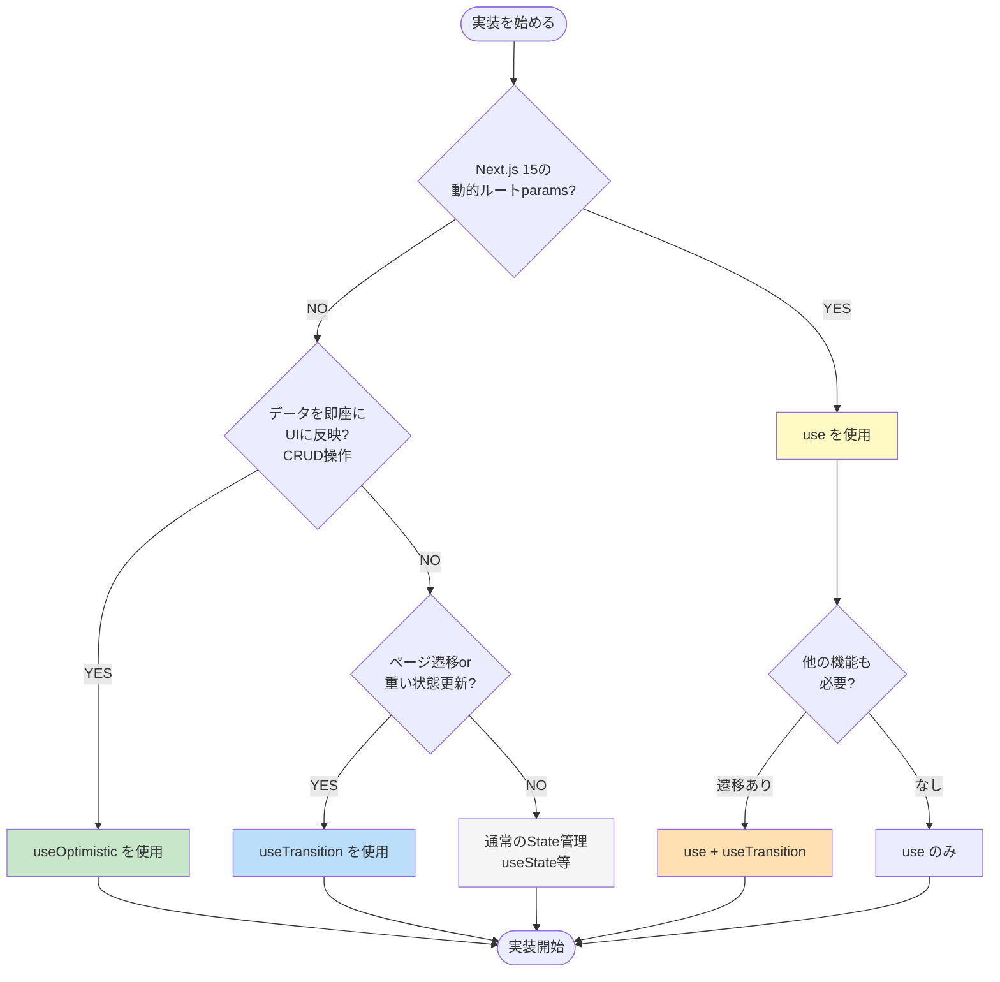

# React 19機能の使い分けガイド

このガイドでは、React 19の3つの新機能（`useOptimistic`、`use()`、`useTransition`）を**いつ、どのように使い分けるべきか**を、プロジェクトの実装例を元に説明します。

> ⚠️ **重要**: このプロジェクトでは**useTransitionとuse()フックの使用を推奨しません**。詳細は [../../learning/06-react19.md#実務での推奨事項](../../learning/06-react19.md#実務での推奨事項) を参照してください。

> **💡 このドキュメントの目的**
> 各フックの詳細な使い方ではなく、**「どれを選ぶべきか」の判断基準**を提供します。
> 詳細な実装方法は [React 19の新機能](../05-react19-features/) を参照してください。

---

## 📊 3つの機能の比較

| 機能                | 目的                   | いつ使う              | 何を更新                   | エラー時               |
| ------------------- | ---------------------- | --------------------- | -------------------------- | ---------------------- |
| **`useOptimistic`** | データの即座のUI反映   | データ変更操作 (CRUD) | **データの状態**           | 自動ロールバック       |
| **`use()`**         | Promiseの解決          | 動的paramsの取得      | Promise → 値               | サスペンドまたはエラー |
| **`useTransition`** | ノンブロッキングな更新 | ページ遷移・重い更新  | **UI状態・ナビゲーション** | 手動処理               |

---

## 🎯 判断フローチャート

実装を始める前に、以下の質問に答えて適切なフックを選択してください：



**テキスト版フローチャート:**

```text
質問1: Next.js 15の動的ルート params を扱う？
  YES → use() を使用
  NO  → 次へ

質問2: データを即座にUIに反映したい？（CRUD操作）
  YES → useOptimistic を使用
  NO  → 次へ

質問3: ページ遷移や重い状態更新がある？
  YES → useTransition を使用
  NO  → 通常のState管理（useState等）
```

---

## 1️⃣ `useOptimistic` - 楽観的UI更新

### いつ使う？

✅ **データの作成・更新・削除がある場合**

- チャットメッセージの送信
- ファイルのアップロード
- リストからのアイテム削除
- いいね・お気に入りのトグル

### プロジェクトの実装例

#### 例1: チャットメッセージ (`sample-chat.hook.ts`)

```typescript
// src/features/sample-chat/routes/sample-chat/sample-chat.hook.ts:30
const [messages, setMessages] = useState<Message[]>([]);
const [optimisticMessages, addOptimisticMessage] = useOptimistic(messages, (state, newMessage) => [...state, newMessage]);

const handleSendMessage = async () => {
  const userMessage: Message = {
    id: `user-${Date.now()}`,
    role: 'user',
    content: inputMessage.trim(),
    timestamp: new Date(),
  };

  // 🚀 即座にUIに反映（楽観的更新）
  addOptimisticMessage(userMessage);
  setInputMessage('');

  try {
    const response = await sendMessageMutation.mutateAsync({
      message: userMessage.content,
      conversationId,
    });

    // ✅ 成功時: 実際のデータで確定
    setMessages((prev) => [...prev, userMessage, response.message]);
  } catch (error) {
    // ❌ エラー時: 自動的にロールバック
    console.error('Failed to send message:', error);
    const errorMessage: Message = {
      id: `error-${Date.now()}`,
      role: 'assistant',
      content: 'エラーが発生しました。もう一度お試しください。',
      timestamp: new Date(),
    };
    setMessages((prev) => [...prev, errorMessage]);
  }
};
```

**ファイルパス**: `src/features/sample-chat/routes/sample-chat/sample-chat.hook.ts:30`

#### 例2: ユーザー削除 (`users.hook.ts`)

```typescript
// src/features/sample-users/routes/sample-users/users.hook.ts:27
const users = data?.data ?? [];
const [optimisticUsers, removeOptimisticUser] = useOptimistic(users, (state, deletedUserId: string) =>
  state.filter((user) => user.id !== deletedUserId)
);

const handleDelete = async (userId: string) => {
  const user = users.find((u) => u.id === userId);
  if (!user) return;

  const confirmed = window.confirm(`${user.name} を削除してもよろしいですか？`);
  if (!confirmed) return;

  // 🚀 即座にUIから削除
  removeOptimisticUser(userId);

  try {
    await deleteUserMutation.mutateAsync(userId);
    // ✅ 削除成功
  } catch (error) {
    // ❌ エラー時: 自動的にロールバック
    console.error('ユーザーの削除に失敗しました:', error);
    alert('ユーザーの削除に失敗しました。もう一度お試しください。');
  }
};
```

**ファイルパス**: `src/features/sample-users/routes/sample-users/users.hook.ts:27`

#### 例3: ファイルアップロード (`sample-file.hook.ts`)

```typescript
// src/features/sample-file/routes/sample-file/sample-file.hook.ts:37
const [uploadedFiles, setUploadedFiles] = useState<UploadedFile[]>([]);
const [optimisticFiles, addOptimisticFiles] = useOptimistic(uploadedFiles, (state, newFiles: UploadedFile[]) => [...state, ...newFiles]);

const handleFileDrop = async (files: File[]) => {
  const newFiles: UploadedFile[] = files.map((file) => ({
    file,
    progress: 0,
    status: 'pending',
  }));

  // 🚀 即座にUIに反映
  addOptimisticFiles(newFiles);
  setUploadedFiles((prev) => [...prev, ...newFiles]);

  // バックグラウンドでアップロード処理...
};
```

**ファイルパス**: `src/features/sample-file/routes/sample-file/sample-file.hook.ts:37`

### 特徴

- ✅ サーバーレスポンス前にUIを更新
- ✅ エラー時は自動的にロールバック
- ✅ ユーザー体験が高速に感じる
- ⚠️ ベース状態（`useState`）の更新タイミングに注意

---

## 2️⃣ `use()` - Promiseの解決

### いつ使う？

✅ **Next.js 15の動的ルートパラメータを扱う場合**

- `app/users/[id]/edit/page.tsx` などの動的ルート
- Promise型の `params` を同期的に扱う必要がある場合

### プロジェクトの実装例

#### 例1: ユーザー編集 (`edit-user.hook.ts`)

```typescript
// src/features/sample-users/routes/sample-edit-user/edit-user.hook.ts:24
export const useEditUser = (userId: string) => {
  const router = useRouter();


  // 解決後は通常の値として使用可能
  const { data } = useUser({ userId });
  const updateUserMutation = useUpdateUser();

  // ... フォーム処理
};
```

**ファイルパス**: `src/features/sample-users/routes/sample-edit-user/edit-user.hook.ts:24`

#### 例2: ユーザー削除確認 (`delete-user.hook.ts`)

```typescript
// src/features/sample-users/routes/sample-delete-user/delete-user.hook.ts:21
export const useDeleteUser = (userId: string) => {
  const router = useRouter();

  const { data } = useUser({ userId });
  const deleteUserMutation = useDeleteUserMutation();

  // ... 削除処理
};
```

**ファイルパス**: `src/features/sample-users/routes/sample-delete-user/delete-user.hook.ts:21`

### 特徴

- ✅ Next.js 15の動的paramsでは必須
- ✅ Promise、Context、その他リソースを解決
- ✅ 条件分岐内でも使用可能（従来のHooksルールの一部を緩和）
- ⚠️ SuspenseとErrorBoundaryで囲む必要がある

---

## 3️⃣ `useTransition` - ノンブロッキングなUI更新

### いつ使う？

✅ **ページ遷移がある場合**

- フォーム送信後のリダイレクト
- ログイン後のホーム画面遷移
- データ更新後の一覧ページへの戻り

✅ **重い状態更新がある場合**

- 大量のデータフィルタリング
- 検索結果の更新

### プロジェクトの実装例

#### 例1: ログイン後の遷移 (`login.hook.ts`)

```typescript
// src/features/sample-auth/routes/sample-login/login.hook.ts:28,68
const router = useRouter();
const loginMutation = useLoginMutation();
const [isPending, startTransition] = useTransition();

const onSubmit = async (values: LoginFormValues) => {
  try {
    const data = await loginMutation.mutateAsync(values);
    localStorage.setItem('token', data.token);
    setUser(data.user);

    // 🚀 ノンブロッキングなナビゲーション
    {
    router.push('/users'); // 遷移中もUIが応答
    }
  } catch (error) {
    setError('root', {
      message: 'ログインに失敗しました。',
    });
  }
};

// Mutationのpending と Transitionのpending を統合
return {
  control,
  onSubmit,
  errors,
  isSubmitting: loginMutation.isPending || isPending,
};
```

**ファイルパス**: `src/features/sample-auth/routes/sample-login/login.hook.ts:28,68`

#### 例2: ユーザー作成後の遷移 (`new-user.hook.ts`)

```typescript
// src/features/sample-users/routes/sample-new-user/new-user.hook.ts:23,60
const router = useRouter();
const createUserMutation = useCreateUser();
const [isPending, startTransition] = useTransition();

const onSubmit = async (data: UserFormValues) => {
  try {
    await createUserMutation.mutateAsync(data);

    // 🚀 ノンブロッキングなナビゲーション
    {
    router.push('/sample-users');
    }
  } catch (error) {
    setError('root', {
      message: 'ユーザーの作成に失敗しました',
    });
  }
};

const handleCancel = () => {
  // キャンセル時もuseTransitionを使用
  startTransition(() => {
    router.push('/sample-users');
  });
};
```

**ファイルパス**: `src/features/sample-users/routes/sample-new-user/new-user.hook.ts:23,60`

#### 例3: ユーザー編集後の遷移 (`edit-user.hook.ts`)

```typescript
// src/features/sample-users/routes/sample-edit-user/edit-user.hook.ts:29,80
const router = useRouter();
// userId を引数から受け取る
const updateUserMutation = useUpdateUser();
const [isPending, startTransition] = useTransition();

const onSubmit = async (formData: UserFormValues) => {
  try {
    await updateUserMutation.mutateAsync({
      userId,
      data: formData,
    });

    // 🚀 ノンブロッキングなナビゲーション
    {
    router.push('/sample-users');
    }
  } catch (error) {
    setError('root', {
      message: 'ユーザーの更新に失敗しました',
    });
  }
};
```

**ファイルパス**: `src/features/sample-users/routes/sample-edit-user/edit-user.hook.ts:29,80`

### 特徴

- ✅ UIがブロックされない
- ✅ ページ遷移中もスムーズ
- ✅ `isPending` で遷移状態を追跡可能
- ⚠️ `mutation.isPending || isPending` で統合する必要がある

---

## 🔄 組み合わせパターン

実際のプロジェクトでは、複数のフックを組み合わせて使用することがあります。

### パターン1: `useOptimistic` 単独

**使用例**: `sample-chat.hook.ts`, `sample-file.hook.ts`, `users.hook.ts`

```typescript
// データ変更のみで、ページ遷移がない場合
const [optimisticData, updateOptimisticData] = useOptimistic(...);
```

**適用シーン**:

- チャット（メッセージ送信）
- ファイルアップロード
- ユーザー削除（一覧ページ内）

---

### パターン2: `use()` + `useTransition`

**使用例**: `edit-user.hook.ts`, `delete-user.hook.ts`

```typescript
// 動的params + ページ遷移がある場合
export const useEditUser = (userId: string) => {
  // userId を引数から受け取る

  const onSubmit = async (data) => {
    await mutation.mutateAsync(data);

    {
    router.push('/users'); // ノンブロッキングナビゲーション
    }
  };
};
```

**適用シーン**:

- ユーザー編集ページ
- ユーザー削除確認ページ
- 詳細ページでのアクション

---

### パターン3: `useTransition` 単独

**使用例**: `login.hook.ts`, `new-user.hook.ts`

```typescript
// ページ遷移のみの場合（動的paramsなし）
const [isPending, startTransition] = useTransition();

const onSubmit = async (data) => {
  await mutation.mutateAsync(data);

  startTransition(() => {
    router.push('/users');
  });
};
```

**適用シーン**:

- ログインページ
- 新規作成ページ
- フォーム送信後の遷移

---

## 📋 プロジェクトでの使い分け一覧

| ファイル              | `use()` | `useOptimistic` | `useTransition` | 理由                             |
| --------------------- | ------- | --------------- | --------------- | -------------------------------- |
| `sample-chat.hook.ts` | ❌      | ✅              | ❌              | チャットメッセージの即座の表示   |
| `sample-file.hook.ts` | ❌      | ✅              | ❌              | ファイルアップロードの即座の表示 |
| `users.hook.ts`       | ❌      | ✅              | ❌              | ユーザー削除の即座の反映         |
| `edit-user.hook.ts`   | ✅      | ❌              | ✅              | 動的params + 更新後の遷移        |
| `delete-user.hook.ts` | ✅      | ❌              | ✅              | 動的params + 削除後の遷移        |
| `login.hook.ts`       | ❌      | ❌              | ✅              | ログイン後のスムーズな遷移       |
| `new-user.hook.ts`    | ❌      | ❌              | ✅              | 作成後のスムーズな遷移           |
| `sample-form.hook.ts` | ❌      | ❌              | ❌              | デモフォーム（遷移なし）         |

---

## ⚠️ よくある間違い

### 間違い1: `useOptimistic` でページ遷移

```typescript
// ❌ 間違い
const [_, navigate] = useOptimistic(null, () => router.push('/users'));
```

```typescript
// ✅ 正しい
const [isPending, startTransition] = useTransition();
startTransition(() => router.push('/users'));
```

---

### 間違い2: `useTransition` でデータ更新

```typescript
// ❌ 間違い
startTransition(() => {
  setMessages([...messages, newMessage]);
});
```

```typescript
// ✅ 正しい
addOptimisticMessage(newMessage);
```

---

### 間違い3: `isPending` の統合忘れ

```typescript
// ❌ 間違い: Transitionのpendingを無視
return {
  isSubmitting: mutation.isPending, // ナビゲーション中が反映されない
};
```

```typescript
// ✅ 正しい: 両方のpendingを統合
const [isPending, startTransition] = useTransition();
return {
  isSubmitting: mutation.isPending || isPending,
};
```

---

## 💡 実践的なアドバイス

### 1. 同時に複数使用できる

```typescript
// edit-user.hook.ts のように、use() と useTransition を併用可能
// userId を引数から受け取る
const [isPending, startTransition] = useTransition(); // 遷移
```

### 2. isPending の統合

```typescript
// Mutation と Transition の両方のpendingを統合
isSubmitting: createUserMutation.isPending || isPending;
```

### 3. エラーハンドリングの違い

```typescript
// useOptimistic: エラー時は自動ロールバック（追加処理不要）
// useTransition: エラー時も手動で処理が必要

try {
  await mutation.mutateAsync();
  startTransition(() => router.push('/success'));
} catch (error) {
  setError('...'); // 手動でエラー処理
}
```

---

## 📚 関連ドキュメント

- **[React 19の新機能（詳細版）](../05-react19-features/)** - 各フックの詳細な使い方
- **[実装パターン](../03-patterns/)** - コーディング規約とスタイル
- **[ベストプラクティス](../06-best-practices/)** - エラーハンドリング、パフォーマンス
- **[ユースケース別ガイド](../04-use-cases/)** - 具体的な実装例

---

## まとめ

このプロジェクトでは、**各機能を明確に使い分けることで、コードの一貫性と保守性を確保**しています。

- **データ操作** → `useOptimistic`
- **動的params** → `use()`
- **ページ遷移** → `useTransition`

という原則に従うことで、どの実装が正しいのか判断に迷うことなく、統一されたコードベースを維持できます。
