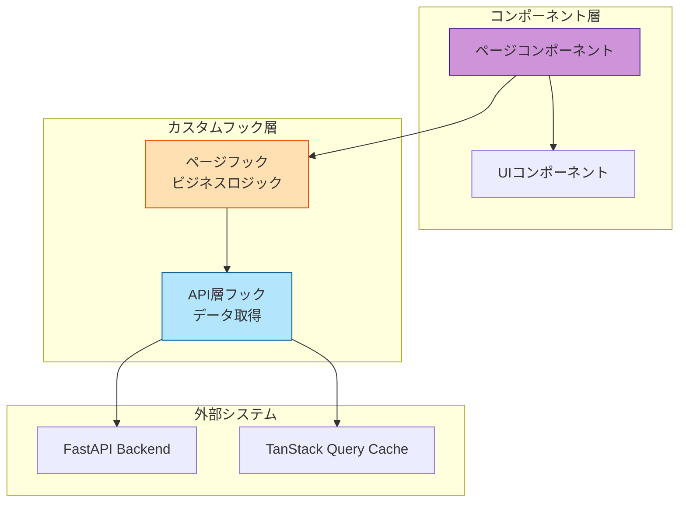
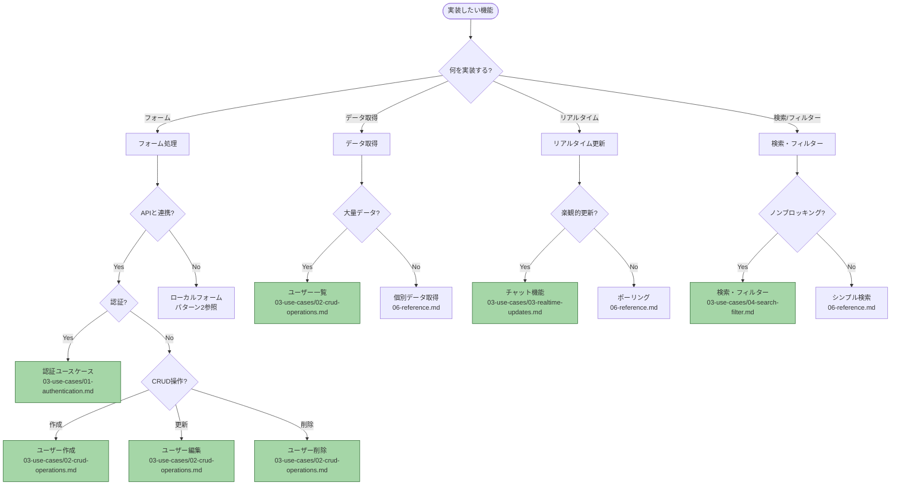
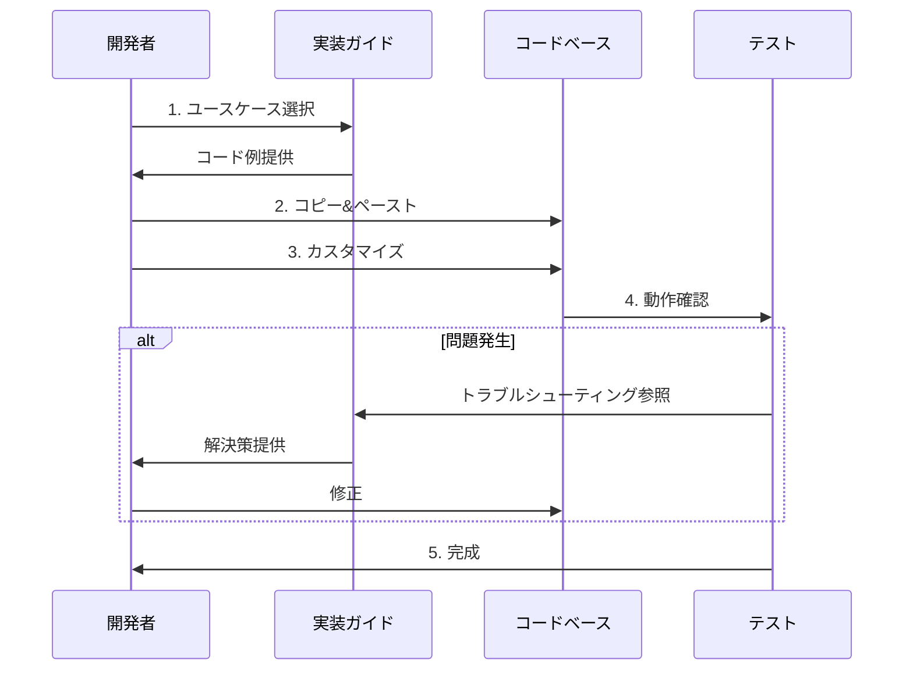

# カスタムフック実装ガイド - 全体像

このガイドでは、プロジェクトで使用するカスタムフックの全体像と、ユースケースに応じた適切なフックの選択方法を説明します。

> **💡 React 19の新機能の使い分けについて**
> `useOptimistic`、`use()`、`useTransition` の使い分けは [React 19機能の使い分けガイド](../01-decision-guide/) を参照してください。

## 目次

- [カスタムフックとは](#カスタムフックとは)
- [フック選択フローチャート](#フック選択フローチャート)
- [フックの種類一覧](#フックの種類一覧)
- [ユースケースマトリックス](#ユースケースマトリックス)
- [クイックスタート](#クイックスタート)

---

## カスタムフックとは

カスタムフックは、React Hooksを組み合わせて再利用可能なロジックを作成する仕組みです。

### プロジェクトでのカスタムフックの役割

### 主な責務

1. **ページフック** (`features/*/routes/*/*.hook.ts`)
   - ページ固有のビジネスロジック
   - ナビゲーション処理
   - 複数APIの組み合わせ
   - フォーム管理

2. **API層フック** (`features/*/api/*.ts`)
   - データ取得・更新
   - キャッシュ管理
   - TanStack Query統合

---

## フック選択フローチャート

---

## フックの種類一覧

| フック種別                 | 主な用途                                     | 使用技術                              | 実装場所             |
| -------------------------- | -------------------------------------------- | ------------------------------------- | -------------------- |
| **フォームフック**         | フォーム状態管理、バリデーション、送信処理   | React Hook Form, Zod                  | `routes/*/*.hook.ts` |
| **データ取得フック**       | サーバーデータ取得、キャッシュ管理           | TanStack Query, useSuspenseQuery      | `api/*.ts`           |
| **ミューテーションフック** | データ作成・更新・削除、キャッシュ無効化     | TanStack Query, useMutation           | `api/*.ts`           |
| **楽観的更新フック**       | 即座のUI反映、エラー時ロールバック           | useOptimistic, TanStack Query         | `routes/*/*.hook.ts` |
| **トランジションフック**   | ノンブロッキング更新、スムーズな遷移         | useTransition, Next.js Router         | `routes/*/*.hook.ts` |
| **Promise解決フック**      | Next.js 15 params、動的ルート対応            | use (React 19)                        | `routes/*/*.hook.ts` |

---

## ユースケースマトリックス

どのユースケースでどのフックを使うかの早見表です。

| ユースケース             | フォーム | データ取得 | 楽観的更新 | トランジション | use | 詳細ページ                                                      |
| ------------------------ | -------- | ---------- | ---------- | -------------- | --- | --------------------------------------------------------------- |
| **認証 - ログイン**      | ✅       | -          | -          | ✅             | -   | [01-authentication.md](../04-use-cases/01-authentication.md)     |
| **認証 - ログアウト**    | -        | -          | -          | ✅             | -   | [01-authentication.md](../04-use-cases/01-authentication.md)     |
| **ユーザー作成**         | ✅       | -          | -          | ✅             | -   | [02-crud-operations.md](../04-use-cases/02-crud-operations.md)   |
| **ユーザー編集**         | ✅       | ✅         | -          | ✅             | ✅  | [02-crud-operations.md](../04-use-cases/02-crud-operations.md)   |
| **ユーザー削除**         | -        | ✅         | ✅         | -              | ✅  | [02-crud-operations.md](../04-use-cases/02-crud-operations.md)   |
| **ユーザー一覧**         | -        | ✅         | -          | -              | -   | [02-crud-operations.md](../04-use-cases/02-crud-operations.md)   |
| **チャット送信**         | ✅       | -          | ✅         | -              | -   | [03-realtime-updates.md](../04-use-cases/03-realtime-updates.md) |
| **メッセージ受信**       | -        | ✅         | ✅         | -              | -   | [03-realtime-updates.md](../04-use-cases/03-realtime-updates.md) |
| **検索ボックス**         | -        | -          | -          | ✅             | -   | [04-search-filter.md](../04-use-cases/04-search-filter.md)       |
| **フィルター**           | -        | -          | -          | ✅             | -   | [04-search-filter.md](../04-use-cases/04-search-filter.md)       |
| **ファイルアップロード** | ✅       | -          | ✅         | -              | -   | [05-file-operations.md](../04-use-cases/05-file-operations.md)   |
| **複数ファイル**         | ✅       | -          | ✅         | -              | -   | [05-file-operations.md](../04-use-cases/05-file-operations.md)   |

### 凡例

- ✅: 使用する
- -: 使用しない

---

## クイックスタート

### 1. ユースケースから選ぶ

実装したい機能に最も近いユースケースを選択してください。

- **[認証機能](../04-use-cases/01-authentication.md)** - ログイン/ログアウト
- **[CRUD操作](../04-use-cases/02-crud-operations.md)** - ユーザー作成・編集・削除・一覧
- **[リアルタイム更新](../04-use-cases/03-realtime-updates.md)** - チャット、通知
- **[検索・フィルター](../04-use-cases/04-search-filter.md)** - 検索ボックス、フィルタリング
- **[ファイル操作](../04-use-cases/05-file-operations.md)** - アップロード、プレビュー

### 2. コードをコピーして使う

各ユースケースページには、すぐに使えるコード例が用意されています。

1. ユースケースページを開く
2. コード例をコピー
3. プロジェクトに貼り付け
4. 必要に応じてカスタマイズ

### 3. パターンを学ぶ

統一された実装パターンを理解するには、以下を参照してください。

- **[実装パターン](../03-patterns/)** - プロジェクト全体の統一ルール
- **[React 19機能](../05-react19-features/)** - useOptimistic、useTransition、use
- **[ベストプラクティス](../06-best-practices/)** - 推奨される実装方法

### 4. トラブル時はリファレンス

問題が発生したら、以下を参照してください。

- **[リファレンス](../07-reference/)** - チートシート、FAQ、トラブルシューティング

---

## 実装の流れ

### 典型的な実装手順

### 各ステップの詳細

#### 1. ユースケース選択（5分）

- [フック選択フローチャート](#フック選択フローチャート)で該当ページを見つける
- ユースケースページを開く

#### 2. コピー&ペースト（10分）

- 完全なコード例をコピー
- プロジェクトの適切な場所に配置
  - API層: `src/features/*/api/`
  - ページフック: `src/features/*/routes/*/*.hook.ts`

#### 3. カスタマイズ（20分）

- API エンドポイントを変更
- 型定義を調整
- バリデーションルールを追加

#### 4. 動作確認（10分）

- ローカルで実行
- 基本動作を確認
- エラーハンドリングをテスト

#### 5. レビュー（任意）

- [ベストプラクティス](../06-best-practices/)をチェック
- コードレビューを依頼

---

## 次のステップ

### 初めての方

1. **[実装パターン](../03-patterns/)** で統一ルールを理解
2. **[ユースケース一覧](../04-use-cases/)** から該当するページを選択
3. コード例をコピーして実装

### 既に実装している方

1. **[React 19機能](../05-react19-features/)** で最新機能を学習
2. **[ベストプラクティス](../06-best-practices/)** でコードを改善
3. **[リファレンス](../07-reference/)** で問題を解決

---

## 関連ドキュメント

### 基礎知識

- [React Hook Formガイド](../../04-forms-validation/index.md)
- [TanStack Queryガイド](../../03-core-concepts/07-tanstack-query.md)
- [Next.js App Routerガイド](../../01-coding-standards/04-nextjs-best-practices.md)

### API設計

- [API統合ガイド](../../05-api-integration/index.md)
- [エラーハンドリング](../../06-error-handling/index.md)

### テスト

- [フックのテスト方法](../../08-testing/index.md)

---

## サポート

### よくある質問

#### Q: どのフックを使えばいいかわからない

A: [フック選択フローチャート](#フック選択フローチャート)を使用してください

#### Q: コード例が動かない

A: [リファレンス](../07-reference/)のトラブルシューティングを確認してください

#### Q: カスタマイズ方法がわからない

A: [ベストプラクティス](../06-best-practices/)を参照してください

### さらなる支援

- GitHub Issuesで質問
- チーム内でレビュー依頼
- ドキュメントの改善提案
