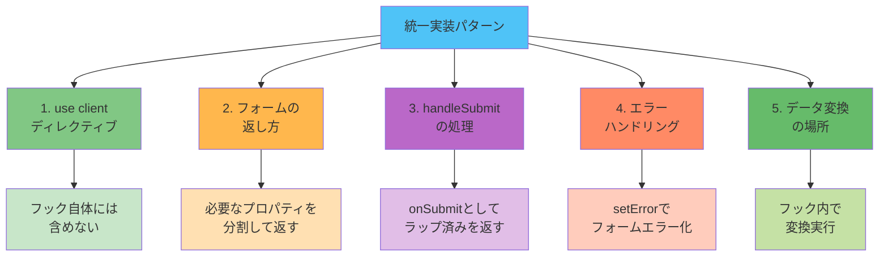

# カスタムフック実装パターン

このドキュメントでは、プロジェクト全体で統一されたカスタムフックの実装パターンについて説明します。

## 目次

- [基本構造](#基本構造)
- [5つの統一実装パターン](#5つの統一実装パターン)
- [命名規則](#命名規則)
- [ディレクトリ構成](#ディレクトリ構成)
- [コードスニペット集](#コードスニペット集)

---

## 基本構造

すべてのカスタムフックは、以下の基本構造に従います。

### テンプレート

```typescript
/**
 * {機能名}のカスタムフック
 *
 * {このフックの責務を簡潔に説明}
 */
export const useFeatureName = () => {
  // ================================================================================
  // State / Form Setup
  // ================================================================================
  // State管理、フォーム初期化など

  // ================================================================================
  // Queries / Mutations
  // ================================================================================
  // データ取得、更新のためのクエリやミューテーション

  // ================================================================================
  // Data Transformation
  // ================================================================================
  // データの変換処理

  // ================================================================================
  // Handlers
  // ================================================================================
  // イベントハンドラー、コールバック関数

  // ================================================================================
  // Return
  // ================================================================================
  return {
    // 必要なプロパティのみを分割して返す
  };
};
```

### セクション説明

| セクション              | 目的             | 含まれるもの                     |
| ----------------------- | ---------------- | -------------------------------- |
| **State / Form Setup**  | 状態の初期化     | useState, useForm, useOptimistic |
| **Queries / Mutations** | データ操作       | useQuery, useMutation            |
| **Data Transformation** | データ変換       | map, filter, reduce              |
| **Handlers**            | イベント処理     | onSubmit, onClick, onChange      |
| **Return**              | インターフェース | 外部に公開する値・関数           |

---

## 5つの統一実装パターン

プロジェクト全体で統一するために、以下の5つのパターンを標準化しました。



### 1. "use client" ディレクティブの扱い

#### 決定事項

**カスタムフック自体には `"use client"` ディレクティブを含めない。**

#### 理由

- フックは純粋なロジックの単位であり、クライアント/サーバーの境界はコンポーネント側で決定すべき
- フックの再利用性を高める
- このプロジェクトはClient Componentのみを使用するが、フックは純粋なロジックとして実装

#### 実装例

```typescript
// ❌ 悪い例: フックにuse clientを含める
"use client";

export const useLogin = () => {
  const form = useForm<LoginFormValues>({...});
  // ...
};
```

```typescript
// ✅ 良い例: フックには含めない
export const useLogin = () => {
  const form = useForm<LoginFormValues>({...});
  // ...
};
```

コンポーネント側で `"use client"` を宣言:

```typescript
// コンポーネント側
"use client";

import { useLogin } from "./login.hook";

export default function LoginPage() {
  const { control, onSubmit } = useLogin();
  return <form onSubmit={onSubmit}>...</form>;
}
```

---

### 2. フォームの返し方

#### 決定事項

**Pattern B: フォームオブジェクト全体ではなく、必要なプロパティを分割して返す。**

#### 比較

```typescript
// Pattern A: フォームオブジェクト全体を返す
export const useLogin = () => {
  const form = useForm<LoginFormValues>({...});
  return { form };
};

// 使用側
const { form } = useLogin();
<LoginForm control={form.control} errors={form.formState.errors} />

// Pattern B: 必要なプロパティを分割して返す ✅
export const useLogin = () => {
  const {
    control,
    handleSubmit,
    formState: { errors },
    setError,
  } = useForm<LoginFormValues>({...});

  return { control, errors, setError };
};

// 使用側
const { control, errors } = useLogin();
<LoginForm control={control} errors={errors} />
```

#### 理由

- コンポーネント側で必要なものだけを使用できる（明示的な依存関係）
- プロパティのドリリングが減少
- TypeScriptの型補完が効きやすい
- 使用する側のコードが簡潔になる

#### 実装例

```typescript
export const useLogin = () => {
  // ================================================================================
  // Form
  // ================================================================================
  const {
    control,
    handleSubmit,
    formState: { errors },
    setError,
  } = useForm<LoginFormValues>({
    resolver: zodResolver(loginFormSchema),
    defaultValues: {
      email: '',
      password: '',
    },
  });

  // ================================================================================
  // Handlers
  // ================================================================================
  const onSubmit = handleSubmit((values) => {
    // 送信処理
  });

  return {
    control,
    onSubmit,
    errors,
    isSubmitting: loginMutation.isPending,
  };
};
```

---

### 3. handleSubmit の処理方法

#### 決定事項

**Pattern C: `handleSubmit` でラップした関数を `onSubmit` として返す。**

#### 比較

```typescript
// Pattern A: handleSubmit を直接返す
export const useLogin = () => {
  const { control, handleSubmit } = useForm<LoginFormValues>({...});

  const submit = (values: LoginFormValues) => {
    // 処理
  };

  return { control, handleSubmit: handleSubmit(submit) };
};

// Pattern B: handleSubmit とsubmit関数を別々に返す
export const useLogin = () => {
  const { control, handleSubmit } = useForm<LoginFormValues>({...});

  const submit = (values: LoginFormValues) => {
    // 処理
  };

  return { control, handleSubmit, submit };
};

// 使用側
const { control, handleSubmit, submit } = useLogin();
<form onSubmit={handleSubmit(submit)}>

// Pattern C: ラップ済みの関数を onSubmit として返す ✅
export const useLogin = () => {
  const { control, handleSubmit } = useForm<LoginFormValues>({...});

  const onSubmit = handleSubmit((values) => {
    // 処理
  });

  return { control, onSubmit };
};

// 使用側
const { control, onSubmit } = useLogin();
<form onSubmit={onSubmit}>
```

#### 理由

- コンポーネント側でhandleSubmitを呼び出す必要がない
- フォームの送信処理がフック内で完結
- 使用する側のコードが簡潔
- `onSubmit` という直感的な命名

#### 実装例

```typescript
export const useSampleForm = () => {
  // ================================================================================
  // Form
  // ================================================================================
  const {
    control,
    handleSubmit,
    formState: { errors },
    reset,
  } = useForm<SampleFormValues>({
    resolver: zodResolver(sampleFormSchema),
    defaultValues: {
      username: '',
      email: '',
    },
  });

  // ================================================================================
  // Handlers
  // ================================================================================
  const onSubmit = handleSubmit(async (data) => {
    console.log('Form Data:', data);
    alert(`フォームが送信されました！\n\n${JSON.stringify(data, null, 2)}`);
    reset();
  });

  return {
    control,
    onSubmit,
    errors,
    reset,
  };
};
```

---

### 4. エラーハンドリングの方法

#### 決定事項

**使用するケースに応じて適切な方法を選択:**

1. **フォーム関連エラー** → `setError` を使用してフォームエラーとして管理
2. **データ取得/更新エラー** → mutation/query の状態を使用

#### 理由

- フォームバリデーションエラーと同じ仕組みで表示できる
- エラー表示の一貫性が保たれる
- React Hook Formのエラー管理機能を最大限活用

#### 実装例

##### フォーム関連エラー

```typescript
export const useLogin = () => {
  const {
    control,
    handleSubmit,
    formState: { errors },
    setError,
  } = useForm<LoginFormValues>({...});

  const loginMutation = useMutation({
    mutationFn: loginUser,
  });

  const onSubmit = handleSubmit((values) => {
    loginMutation
      .mutateAsync(values)
      .then((data) => {
        // 成功処理
      })
      .catch(() => {
        // Formエラーとして設定
        setError("root", {
          message: "ログインに失敗しました。メールアドレスとパスワードを確認してください。",
        });
      });
  });

  return {
    control,
    onSubmit,
    errors, // errors.root にエラーメッセージが含まれる
    isSubmitting: loginMutation.isPending,
  };
};
```

##### データ取得/更新エラー

```typescript
export const useDeleteUser = () => {
  const deleteUserMutation = useMutation({
    mutationFn: deleteUser,
    onSuccess: () => {
      queryClient.invalidateQueries({ queryKey: ['users'] });
    },
  });

  return {
    deleteUser: deleteUserMutation.mutate,
    isDeleting: deleteUserMutation.isPending,
    error: deleteUserMutation.error, // mutation の error を直接返す
  };
};
```

---

### 5. データ変換の場所

#### 決定事項

**Pattern A: データ変換はフック内で実行する。**

#### 比較

```typescript
// Pattern A: フック内で変換 ✅
export const useUsers = () => {
  const { data, isLoading } = useQuery({
    queryKey: ['users'],
    queryFn: fetchUsers,
  });

  // Hooks内で変換
  const users =
    data?.map((user) => ({
      ...user,
      fullName: `${user.firstName} ${user.lastName}`,
    })) ?? [];

  return { users, isLoading };
};

// 使用側
const { users } = useUsers();
// usersは既に変換済み

// Pattern B: コンポーネント内で変換
export const useUsers = () => {
  const { data, isLoading } = useQuery({
    queryKey: ['users'],
    queryFn: fetchUsers,
  });

  return { users: data, isLoading };
};

// 使用側
const { users: rawUsers } = useUsers();
const users =
  rawUsers?.map((user) => ({
    ...user,
    fullName: `${user.firstName} ${user.lastName}`,
  })) ?? [];
```

#### 理由

- ビジネスロジックをコンポーネントから分離
- データ変換ロジックの再利用性
- コンポーネントのテストが容易
- 変換ロジックの一元管理

#### 実装例

```typescript
export const useUsers = () => {
  // ================================================================================
  // Queries
  // ================================================================================
  const usersQuery = useQuery({
    queryKey: ['users'],
    queryFn: getUsers,
  });

  // ================================================================================
  // Data Transformation
  // ================================================================================
  const users =
    usersQuery.data?.map((user) => ({
      ...user,
      fullName: `${user.firstName} ${user.lastName}`,
      displayAge: user.age ? `${user.age}歳` : '未設定',
    })) ?? [];

  return {
    users,
    isLoading: usersQuery.isLoading,
    error: usersQuery.error,
  };
};
```

---

## 命名規則

### フック名

- **必ず `use` プレフィックスを使用**
- **機能を表す名詞または動詞を使用**
- **キャメルケース**

```typescript
// ✅ 良い例
useLogin;
useUsers;
useNewUser;
useEditUser;
useDeleteUser;
useSampleForm;

// ❌ 悪い例
loginHook;
handleLogin;
fetchUsers;
```

### 戻り値のプロパティ名

#### データ

```typescript
// 単数形
user;
product;

// 複数形
users;
products;
```

#### ローディング状態

```typescript
isLoading; // 初回読み込み
isSubmitting; // フォーム送信中
isDeleting; // 削除処理中
isFetching; // バックグラウンド更新を含む
```

#### エラー

```typescript
error; // 単一エラー
errors; // フォームエラー（複数）
```

#### 関数

```typescript
// イベントハンドラー
onSubmit;
onReset;
onClick;

// 操作関数
createUser;
updateUser;
deleteUser;
refetch;
```

---

## ディレクトリ構成

カスタムフックは機能ごとに適切な場所に配置します。

### API層フック

```text
src/
  features/
    sample-users/
      api/
        get-users.ts           # ユーザー一覧取得フック
        get-user.ts            # 個別ユーザー取得フック
        create-user.ts         # ユーザー作成フック
        update-user.ts         # ユーザー更新フック
        delete-user.ts         # ユーザー削除フック
```

### ページ固有フック

```text
src/
  features/
    sample-auth/
      routes/
        sample-login/
          login.hook.ts        # ログインページフック
          login.tsx            # ページコンポーネント
    sample-users/
      routes/
        sample-users/
          users.hook.ts        # ユーザー一覧ページフック
          users.tsx
        sample-new-user/
          new-user.hook.ts     # 新規ユーザーページフック
          new-user.tsx
        sample-edit-user/
          edit-user.hook.ts    # ユーザー編集ページフック
          edit-user.tsx
```

### ファイル命名規則

```typescript
// API層
{action}-{resource}.ts
例: get-users.ts, create-user.ts

// ページフック
{feature-name}.hook.ts
例: login.hook.ts, users.hook.ts, new-user.hook.ts
```

---

## コードスニペット集

すぐに使えるコードテンプレート集です。

### 1. シンプルなフォームフック

```typescript
import { useForm } from 'react-hook-form';
import { zodResolver } from '@hookform/resolvers/zod';
import { schema, type SchemaValues } from './schema';

/**
 * {機能名}フォームのカスタムフック
 */
export const useFeatureForm = () => {
  // ================================================================================
  // Form
  // ================================================================================
  const {
    control,
    handleSubmit,
    formState: { errors },
    reset,
  } = useForm<SchemaValues>({
    resolver: zodResolver(schema),
    defaultValues: {
      // デフォルト値
    },
  });

  // ================================================================================
  // Handlers
  // ================================================================================
  const onSubmit = handleSubmit(async (data) => {
    // 処理
    console.log(data);
    reset();
  });

  return {
    control,
    onSubmit,
    errors,
    reset,
  };
};
```

### 2. API連携フォームフック

```typescript
import { useForm } from 'react-hook-form';
import { zodResolver } from '@hookform/resolvers/zod';
import { useRouter } from 'next/navigation';
import { useCreateItem } from '../../api/create-item';
import { schema, type SchemaValues } from './schema';

/**
 * {機能名}作成ページのカスタムフック
 */
export const useNewItem = () => {
  const router = useRouter();
  const createItemMutation = useCreateItem();

  // ================================================================================
  // Form
  // ================================================================================
  const {
    control,
    handleSubmit,
    formState: { errors },
    setError,
  } = useForm<SchemaValues>({
    resolver: zodResolver(schema),
    defaultValues: {
      // デフォルト値
    },
  });

  // ================================================================================
  // Handlers
  // ================================================================================
  const onSubmit = handleSubmit(async (values) => {
    await createItemMutation
      .mutateAsync(values)
      .then(() => router.push('/items'))
      .catch((error) => {
        setError('root', {
          message: '作成に失敗しました。もう一度お試しください。',
        });
      });
  });

  const handleCancel = () => {
    router.push('/items');
  };

  return {
    control,
    onSubmit,
    handleCancel,
    errors,
    isSubmitting: createItemMutation.isPending,
  };
};
```

### 3. データ取得フック（API層）

```typescript
import { queryOptions, useSuspenseQuery } from '@tanstack/react-query';
import { api } from '@/lib/api-client';
import { QueryConfig } from '@/lib/tanstack-query';
import type { Item } from '../types';

/**
 * アイテム一覧を取得するAPI関数
 */
export const getItems = (): Promise<{ data: Item[] }> => {
  return api.get('/items');
};

/**
 * アイテム一覧のクエリオプション
 */
export const getItemsQueryOptions = () => {
  return queryOptions({
    queryKey: ['items'],
    queryFn: getItems,
  });
};

/**
 * アイテム一覧を取得するカスタムフック
 */
type UseItemsOptions = {
  queryConfig?: QueryConfig<typeof getItemsQueryOptions>;
};

export const useItems = ({ queryConfig }: UseItemsOptions = {}) => {
  return useSuspenseQuery({
    ...getItemsQueryOptions(),
    ...queryConfig,
  });
};
```

### 4. ミューテーションフック（API層）

```typescript
import { useMutation, useQueryClient } from '@tanstack/react-query';
import { api } from '@/lib/api-client';
import { MutationConfig } from '@/lib/tanstack-query';
import type { Item } from '../types';

/**
 * アイテム作成のAPI関数
 */
export const createItem = (data: CreateItemInput): Promise<{ data: Item }> => {
  return api.post('/items', data);
};

/**
 * アイテム作成のカスタムフック
 */
type UseCreateItemOptions = {
  mutationConfig?: MutationConfig<typeof createItem>;
};

export const useCreateItem = ({ mutationConfig }: UseCreateItemOptions = {}) => {
  const queryClient = useQueryClient();

  return useMutation({
    mutationFn: createItem,
    onSuccess: () => {
      queryClient.invalidateQueries({ queryKey: ['items'] });
    },
    ...mutationConfig,
  });
};
```

### 5. 楽観的更新フック

```typescript
import { useOptimistic, useState } from 'react';
import { useMutation } from '@tanstack/react-query';

/**
 * {機能名}の楽観的更新フック
 */
export const useOptimisticItems = () => {
  const [items, setItems] = useState<Item[]>([]);
  const createItemMutation = useCreateItem();

  // ================================================================================
  // Optimistic Updates
  // ================================================================================
  const [optimisticItems, addOptimisticItem] = useOptimistic(items, (state, newItem: Item) => [...state, newItem]);

  // ================================================================================
  // Handlers
  // ================================================================================
  const handleCreate = async (data: CreateItemInput) => {
    const tempItem = { id: `temp-${Date.now()}`, ...data };

    // 楽観的更新
    addOptimisticItem(tempItem);

    try {
      const response = await createItemMutation.mutateAsync(data);
      // 成功時: ベース状態を更新
      setItems((prev) => [...prev, response.data]);
    } catch (error) {
      // エラー時: 自動ロールバック
      console.error('Failed to create item:', error);
    }
  };

  return {
    items: optimisticItems,
    handleCreate,
    isCreating: createItemMutation.isPending,
  };
};
```

### 6. Next.js 15 編集フック（useSuspenseQuery活用）

```typescript
import { useRouter } from 'next/navigation';
import { useForm } from 'react-hook-form';
import { zodResolver } from '@hookform/resolvers/zod';
import { useItem } from '../../api/get-item';
import { useUpdateItem } from '../../api/update-item';
import { itemFormSchema, type ItemFormValues } from './schema';

/**
 * {機能名}編集ページのカスタムフック
 *
 * useSuspenseQueryでデータを取得し、defaultValuesに直接設定
 * Client Component内でuseParams()を使用してitemIdを取得し、このフックに渡す
 */
export const useEditItem = (itemId: string) => {
  const router = useRouter();
  const { data } = useItem({ itemId }); // useSuspenseQuery - データは常に存在
  const updateItemMutation = useUpdateItem();

  // ================================================================================
  // Form
  // ================================================================================
  const {
    control,
    handleSubmit,
    formState: { errors },
    setError,
  } = useForm<ItemFormValues>({
    resolver: zodResolver(itemFormSchema),
    defaultValues: data.data, // useEffectなしで直接設定！
  });

  // ================================================================================
  // Handlers
  // ================================================================================
  const onSubmit = handleSubmit(async (formData) => {
    await updateItemMutation
      .mutateAsync({ itemId, data: formData })
      .then(() => router.push('/items'))
      .catch((error) => {
        setError('root', {
          message: '更新に失敗しました',
        });
      });
  });

  const handleCancel = () => {
    router.push('/items');
  };

  return {
    control,
    onSubmit,
    handleCancel,
    errors,
    isSubmitting: updateItemMutation.isPending,
  };
};
```

---

## まとめ

### 5つの統一パターン

1. ✅ **"use client" ディレクティブ**: フック自体には含めない
2. ✅ **フォームの返し方**: 必要なプロパティを分割して返す
3. ✅ **handleSubmit の処理**: ラップ済みの関数を `onSubmit` として返す
4. ✅ **エラーハンドリング**: フォーム関連は `setError`、データ取得は mutation/query の状態
5. ✅ **データ変換**: フック内で実行

### 実装チェックリスト

フックを実装する際は、以下をチェックしてください:

- [ ] JSDocコメントを追加
- [ ] セクションコメントで区切り
- [ ] TypeScript型を明示
- [ ] 必要なプロパティのみを返す
- [ ] `onSubmit`で送信処理をラップ
- [ ] エラーハンドリングを実装
- [ ] ローディング状態を返す
- [ ] 適切な命名規則に従う

---

## 次のステップ

- **[ユースケース一覧](../04-use-cases/)** - 実際の実装例を見る
- **[React 19機能](../05-react19-features/)** - 最新機能を学ぶ
- **[ベストプラクティス](../06-best-practices/)** - より良い実装を目指す

---

## 関連ドキュメント

- [フックの実装パターン（元ドキュメント）](../01-hook-patterns.md)
- [フォーム用フック](../02-form-hooks.md)
- [データ取得フック](../03-data-hooks.md)
