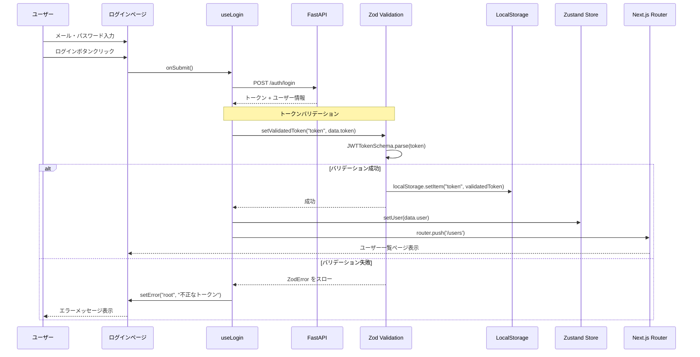

# 認証機能の実装

このガイドでは、ログイン・ログアウト機能の完全な実装方法を説明します。

## 目次

- [概要](#概要)
- [ログイン機能](#ログイン機能)
- [JWTトークン管理](#jwtトークン管理)
- [ログアウト機能](#ログアウト機能)
- [認証状態管理](#認証状態管理)
- [完全な実装例](#完全な実装例)

---

## 概要

### 実装する機能


### 使用する技術

- **React Hook Form**: フォーム管理
- **Zod**: バリデーション
- **TanStack Query**: API通信
- **Zustand**: 認証状態管理
- **useTransition**: ノンブロッキングなナビゲーション

---

## ログイン機能

### 1. バリデーションスキーマ

**ファイル**: `src/features/sample-auth/schemas/login-form.schema.ts`

```typescript
import { z } from 'zod';

/**
 * ログインフォームのバリデーションスキーマ
 */
export const loginFormSchema = z.object({
  email: z.string().min(1, 'メールアドレスを入力してください').email('有効なメールアドレスを入力してください'),
  password: z.string().min(1, 'パスワードを入力してください').min(8, 'パスワードは8文字以上で入力してください'),
});

/**
 * ログインフォームの型定義
 */
export type LoginFormValues = z.infer<typeof loginFormSchema>;
```

### 2. API関数

**ファイル**: `src/features/sample-auth/api/auth.api.ts`

```typescript
import { api } from '@/lib/api-client';
import type { LoginFormValues } from '../schemas/login-form.schema';

/**
 * ユーザー型定義
 */
export type User = {
  id: string;
  name: string;
  email: string;
  role: string;
};

/**
 * ログインレスポンス型定義
 */
export type LoginResponse = {
  token: string;
  user: User;
};

/**
 * ログインAPI関数
 *
 * @param data - ログインフォームの値
 * @returns トークンとユーザー情報
 */
export const loginUser = async (data: LoginFormValues): Promise<LoginResponse> => {
  return api.post('/auth/login', data);
};
```

### 3. ミューテーションフック（API層）

**ファイル**: `src/features/sample-auth/api/login.ts`

```typescript
import { useMutation } from '@tanstack/react-query';
import { MutationConfig } from '@/lib/tanstack-query';
import { loginUser } from './auth.api';

/**
 * ログインミューテーションのオプション型
 */
type UseLoginOptions = {
  mutationConfig?: MutationConfig<typeof loginUser>;
};

/**
 * ログインミューテーションフック
 *
 * FastAPIの/auth/loginエンドポイントにPOSTリクエストを送信します。
 */
export const useLoginMutation = ({ mutationConfig }: UseLoginOptions = {}) => {
  return useMutation({
    mutationFn: loginUser,
    ...mutationConfig,
  });
};
```

### 4. 認証ストア（Zustand）

**ファイル**: `src/features/sample-auth/stores/auth.store.ts`

```typescript
import { create } from 'zustand';
import { persist } from 'zustand/middleware';
import type { User } from '../api/auth.api';

/**
 * 認証ストアの状態型定義
 */
type AuthState = {
  user: User | null;
  isAuthenticated: boolean;
};

/**
 * 認証ストアのアクション型定義
 */
type AuthActions = {
  setUser: (user: User) => void;
  clearUser: () => void;
};

/**
 * 認証状態管理ストア
 *
 * ユーザー情報をlocalStorageに永続化します。
 */
export const useAuthStore = create<AuthState & AuthActions>()(
  persist(
    (set) => ({
      // State
      user: null,
      isAuthenticated: false,

      // Actions
      setUser: (user) =>
        set({
          user,
          isAuthenticated: true,
        }),

      clearUser: () =>
        set({
          user: null,
          isAuthenticated: false,
        }),
    }),
    {
      name: 'auth-storage', // localStorageのキー名
    }
  )
);
```

### 5. ログインフック（ページ層）

**ファイル**: `src/features/sample-auth/routes/sample-login/login.hook.ts`

````typescript
'use client';

import { zodResolver } from '@hookform/resolvers/zod';
import { useRouter } from 'next/navigation';
import { useForm } from 'react-hook-form';

import { useLoginMutation } from '../../api/login';
import { useAuthStore } from '../../stores/auth.store';
import { loginFormSchema, type LoginFormValues } from '../../schemas/login-form.schema';

/**
 * ログインページのカスタムフック
 *
 * ログインフォームの状態管理と認証処理を担当します。
 * ログイン成功時にはトークンを保存し、ユーザー一覧ページに遷移します。
 *
 * @example
 * ```tsx
 * const { control, onSubmit, errors, isSubmitting } = useLogin();
 *
 * return (
 *   <form onSubmit={onSubmit}>
 *     <ControlledInputField name="email" control={control} />
 *     <ControlledInputField name="password" control={control} />
 *     <Button type="submit" disabled={isSubmitting}>ログイン</Button>
 *   </form>
 * );
 * ```
 */
export const useLogin = () => {
  const router = useRouter();
  const setUser = useAuthStore((state) => state.setUser);
  const loginMutation = useLoginMutation();

  // ================================================================================
  // Form
  // ================================================================================
  const {
    control,
    handleSubmit,
    formState: { errors },
    setError,
  } = useForm<LoginFormValues>({
    resolver: zodResolver(loginFormSchema),
    defaultValues: {
      email: '',
      password: '',
    },
  });

  // ================================================================================
  // Handlers
  // ================================================================================
  /**
   * ログインフォーム送信ハンドラー
   *
   * 1. FastAPIにログインリクエスト送信
   * 2. トークンをlocalStorageに保存
   * 3. ユーザー情報をZustandストアに保存
   * 4. ユーザー一覧ページに遷移
   */
  const onSubmit = handleSubmit(async (values) => {
    await loginMutation
      .mutateAsync(values)
      .then((data) => {
        // トークンをlocalStorageに保存
        localStorage.setItem('token', data.token);

        // ユーザー情報をストアに保存
        setUser(data.user);

        // ユーザー一覧ページに遷移
        router.push('/sample-users');
      })
      .catch((error) => {
        // ログイン失敗時のエラーメッセージ
        setError('root', {
          message: 'ログインに失敗しました。メールアドレスとパスワードを確認してください。',
        });
      });
  });

  return {
    control,
    onSubmit,
    errors,
    isSubmitting: loginMutation.isPending,
  };
};
````

### 6. ログインページコンポーネント

**ファイル**: `src/features/sample-auth/routes/sample-login/login.tsx`

```typescript
"use client";

import { Button } from "@/components/sample-ui/button";
import { ControlledInputField } from "@/components/forms/controlled-input-field";
import { PageHeader } from "@/components/layout/page-header";
import { PageLayout } from "@/components/layout/page-layout";

import { useLogin } from "./login.hook";

/**
 * ログインページコンポーネント
 */
const LoginPage = () => {
  const { control, onSubmit, errors, isSubmitting } = useLogin();

  return (
    <PageLayout maxWidth="sm">
      <PageHeader
        title="ログイン"
        description="メールアドレスとパスワードを入力してください"
      />

      <form onSubmit={onSubmit} className="space-y-4">
        {/* メールアドレス */}
        <ControlledInputField
          name="email"
          control={control}
          label="メールアドレス"
          type="email"
          placeholder="user@example.com"
        />

        {/* パスワード */}
        <ControlledInputField
          name="password"
          control={control}
          label="パスワード"
          type="password"
          placeholder="8文字以上"
        />

        {/* エラーメッセージ */}
        {errors.root && (
          <div className="rounded-md bg-red-50 p-4">
            <p className="text-sm text-red-800">{errors.root.message}</p>
          </div>
        )}

        {/* ログインボタン */}
        <Button
          type="submit"
          className="w-full"
          disabled={isSubmitting}
        >
          {isSubmitting ? "ログイン中..." : "ログイン"}
        </Button>
      </form>
    </PageLayout>
  );
};

export default LoginPage;
```

---

## JWTトークン管理

### なぜトークンバリデーションが必要か

LocalStorageに保存されたJWTトークンは、以下のリスクにさらされています:

1. **サーバーからの不正なトークン**: APIバグやネットワークエラーで不正な形式のトークンが返される
2. **ユーザーによる改ざん**: ブラウザのDevToolsから直接編集可能
3. **マルウェアによる注入**: 悪意のあるスクリプトがlocalStorageを操作

**Zodバリデーションを実装することで**:
- ✅ 不正な形式のトークンを検出・拒否
- ✅ アプリケーションのクラッシュを防止
- ✅ セキュリティリスクを軽減

### 1. JWT トークンスキーマの定義

**ファイル**: `src/features/sample-auth/stores/schemas/token-storage.schema.ts`

```typescript
import { z } from "zod";

/**
 * JWT トークンスキーマ
 *
 * 検証内容:
 * 1. 空文字列でないこと
 * 2. 3つのパート（header.payload.signature）から構成されること
 * 3. 各パートが空でないこと
 */
export const JWTTokenSchema = z
  .string()
  .min(1, "トークンは必須です")
  .regex(
    /^[\w-]+\.[\w-]+\.[\w-]+$/,
    "不正なJWTトークン形式です。正しい形式: header.payload.signature"
  )
  .refine(
    (token) => {
      const parts = token.split(".");
      return parts.length === 3 && parts.every((part) => part.length > 0);
    },
    {
      message: "JWTトークンは3つの非空パート（header.payload.signature）で構成される必要があります",
    }
  );

export type JWTToken = z.infer<typeof JWTTokenSchema>;
```

### 2. トークン管理ヘルパー関数

**ファイル**: `src/features/sample-auth/stores/schemas/token-storage.schema.ts`（続き）

```typescript
/**
 * トークンを安全に取得
 *
 * localStorageから取得したトークンをZodスキーマで検証
 * 不正なトークンの場合は自動的に削除してnullを返す
 *
 * @param key - localStorageのキー名
 * @returns 検証済みトークン、または null
 *
 * @example
 * ```typescript
 * const token = getValidatedToken("token");
 * if (token) {
 *   // トークンは検証済み、安全に使用可能
 *   api.defaults.headers.common["Authorization"] = `Bearer ${token}`;
 * } else {
 *   // トークンなし、または不正
 *   router.push("/login");
 * }
 * ```
 */
export const getValidatedToken = (key: string): string | null => {
  if (typeof window === "undefined") return null;

  const storedToken = localStorage.getItem(key);
  if (!storedToken) return null;

  // ✅ Zodスキーマでバリデーション
  const result = JWTTokenSchema.safeParse(storedToken);

  if (!result.success) {
    console.warn(`[TokenStorage] 不正なトークンを検出しました: ${result.error.message}`);
    localStorage.removeItem(key);
    return null;
  }

  return result.data;
};

/**
 * トークンを安全に保存
 *
 * Zodスキーマで検証してからlocalStorageに保存
 * 不正なトークンの場合はエラーをスロー
 *
 * @param key - localStorageのキー名
 * @param token - JWTトークン
 * @throws {z.ZodError} トークンが不正な場合
 *
 * @example
 * ```typescript
 * try {
 *   setValidatedToken("token", data.token);
 *   console.log("トークンを安全に保存しました");
 * } catch (error) {
 *   console.error("トークンバリデーションエラー:", error);
 *   setError("root", {
 *     message: "サーバーから不正なトークンが返されました。",
 *   });
 * }
 * ```
 */
export const setValidatedToken = (key: string, token: string): void => {
  if (typeof window === "undefined") return;

  // ✅ Zodスキーマで検証（parse()を使用してエラーをスロー）
  const validatedToken = JWTTokenSchema.parse(token);
  localStorage.setItem(key, validatedToken);
};

/**
 * トークンを削除
 *
 * @param key - localStorageのキー名
 *
 * @example
 * ```typescript
 * removeToken("token");
 * console.log("トークンを削除しました");
 * ```
 */
export const removeToken = (key: string): void => {
  if (typeof window === "undefined") return;
  localStorage.removeItem(key);
};
```

### 3. ログインフックの更新（トークンバリデーション追加）

**ファイル**: `src/features/sample-auth/routes/sample-login/login.hook.ts`（更新版）

```typescript
'use client';

import { zodResolver } from '@hookform/resolvers/zod';
import { useRouter } from 'next/navigation';
import { useForm } from 'react-hook-form';

import { useLoginMutation } from '../../api/login';
import { useAuthStore } from '../../stores/auth.store';
import { loginFormSchema, type LoginFormValues } from '../../schemas/login-form.schema';
import { setValidatedToken } from '../../stores/schemas/token-storage.schema'; // ✅ 追加

export const useLogin = () => {
  const router = useRouter();
  const setUser = useAuthStore((state) => state.setUser);
  const loginMutation = useLoginMutation();

  const {
    control,
    handleSubmit,
    formState: { errors },
    setError,
  } = useForm<LoginFormValues>({
    resolver: zodResolver(loginFormSchema),
    defaultValues: {
      email: '',
      password: '',
    },
  });

  /**
   * ログインフォーム送信ハンドラー（トークンバリデーション追加版）
   *
   * 1. FastAPIにログインリクエスト送信
   * 2. ✅ トークンをZodで検証してからlocalStorageに保存
   * 3. ユーザー情報をZustandストアに保存
   * 4. ユーザー一覧ページに遷移
   */
  const onSubmit = handleSubmit(async (values) => {
    await loginMutation
      .mutateAsync(values)
      .then((data) => {
        try {
          // ✅ トークンをバリデーション後にlocalStorageに保存
          setValidatedToken("token", data.token);

          // ユーザー情報をストアに保存
          setUser(data.user);

          // ユーザー一覧ページに遷移
          router.push('/sample-users');
        } catch (error) {
          // トークン形式が不正な場合
          console.error("トークンバリデーションエラー:", error);
          setError('root', {
            message: 'サーバーから不正なトークンが返されました。管理者に連絡してください。',
          });
        }
      })
      .catch((error) => {
        // ログイン失敗時のエラーメッセージ
        setError('root', {
          message: 'ログインに失敗しました。メールアドレスとパスワードを確認してください。',
        });
      });
  });

  return {
    control,
    onSubmit,
    errors,
    isSubmitting: loginMutation.isPending,
  };
};
```

### 4. API クライアントでのトークン使用

**ファイル**: `src/lib/api-client.ts`（一部抜粋）

```typescript
import { getValidatedToken } from '@/features/sample-auth/stores/schemas/token-storage.schema';

const authRequestInterceptor = async (config: InternalAxiosRequestConfig) => {
  if (config.headers !== undefined) {
    // ✅ 検証済みトークンを取得
    const token = getValidatedToken("token");

    if (token !== null) {
      // ✅ トークンは検証済み、安全に使用可能
      config.headers.Authorization = `Bearer ${token}`;
    }
  }

  return config;
};

api.interceptors.request.use(authRequestInterceptor);
```

### トークンバリデーションのデータフロー



### セキュリティメリット

#### 1. サーバーからの不正トークン検出

```typescript
// ❌ サーバーが不正な形式のトークンを返した
{
  token: "invalid-token-format" // 3パート構成ではない
}

// ✅ Zodバリデーションが検出
setValidatedToken("token", "invalid-token-format")
// → ZodError: "不正なJWTトークン形式です"
// → エラーメッセージをユーザーに表示
```

#### 2. 改ざんトークンの検出

```typescript
// ❌ ユーザーがDevToolsで改ざん
localStorage.setItem("token", "tampered.token") // 不正な形式

// ✅ 次回使用時にZodバリデーションが検出
const token = getValidatedToken("token");
// → バリデーション失敗
// → localStorageから自動削除
// → null を返す
// → ログインページにリダイレクト
```

#### 3. 空トークンの検出

```typescript
// ❌ 空のトークン
localStorage.setItem("token", "")

// ✅ Zodバリデーションが検出
const token = getValidatedToken("token");
// → バリデーション失敗（最小長チェック）
// → localStorageから自動削除
// → null を返す
```

### ベストプラクティス

#### ✅ Good: 常にヘルパー関数を使用

```typescript
// ✅ トークン保存
try {
  setValidatedToken("token", data.token);
  console.log("トークン保存成功");
} catch (error) {
  console.error("バリデーションエラー:", error);
  // ユーザーに通知
}

// ✅ トークン取得
const token = getValidatedToken("token");
if (token) {
  // 検証済みトークンを使用
  api.defaults.headers.common["Authorization"] = `Bearer ${token}`;
}

// ✅ トークン削除
removeToken("token");
```

#### ❌ Bad: 生のlocalStorageを直接使用

```typescript
// ❌ バリデーションなし（セキュリティリスク）
localStorage.setItem("token", data.token); // 不正なトークンでも保存される

// ❌ バリデーションなし（不正なトークンが使用される可能性）
const token = localStorage.getItem("token"); // 改ざんトークンでも取得される

// ❌ 削除のみ（統一性がない）
localStorage.removeItem("token");
```

---

## ログアウト機能

### 1. ログアウトAPI関数

**ファイル**: `src/features/sample-auth/api/auth.api.ts`（追加）

```typescript
/**
 * ログアウトAPI関数
 *
 * サーバー側でセッションを無効化します。
 */
export const logoutUser = async (): Promise<void> => {
  return api.post('/auth/logout');
};
```

### 2. ログアウトフック

**ファイル**: `src/features/sample-auth/hooks/use-logout.ts`

````typescript
'use client';

import { useRouter } from 'next/navigation';
import { useMutation } from '@tanstack/react-query';

import { logoutUser } from '../api/auth.api';
import { useAuthStore } from '../stores/auth.store';
import { removeToken } from '../stores/schemas/token-storage.schema'; // ✅ 追加

/**
 * ログアウト機能のカスタムフック
 *
 * ログアウト処理を実行し、ログインページに遷移します。
 *
 * @example
 * ```tsx
 * const { handleLogout, isLoggingOut } = useLogout();
 *
 * return (
 *   <Button onClick={handleLogout} disabled={isLoggingOut}>
 *     ログアウト
 *   </Button>
 * );
 * ```
 */
export const useLogout = () => {
  const router = useRouter();
  const clearUser = useAuthStore((state) => state.clearUser);

  // ================================================================================
  // Mutations
  // ================================================================================
  const logoutMutation = useMutation({
    mutationFn: logoutUser,
  });

  // ================================================================================
  // Handlers
  // ================================================================================
  /**
   * ログアウトハンドラー（トークン削除ヘルパー使用版）
   *
   * 1. FastAPIにログアウトリクエスト送信
   * 2. ✅ removeToken()でlocalStorageからトークンを削除
   * 3. Zustandストアをクリア
   * 4. ログインページに遷移
   */
  const handleLogout = async () => {
    await logoutMutation
      .mutateAsync()
      .catch((error) => {
        // ログアウト失敗時もクライアント側はクリア
        console.error('Logout failed:', error);
      })
      .finally(() => {
        // ✅ トークンを安全に削除（ヘルパー関数を使用）
        removeToken('token');

        // Storesをクリア
        clearUser();

        // ログインページに遷移
        router.push('/sample-login');
      });
  };

  return {
    handleLogout,
    isLoggingOut: logoutMutation.isPending,
  };
};
````

### 3. ログアウトボタンコンポーネント

**ファイル**: `src/features/sample-auth/components/logout-button.tsx`

```typescript
"use client";

import { Button } from "@/components/sample-ui/button";
import { useLogout } from "../hooks/use-logout";

/**
 * ログアウトボタンコンポーネント
 */
export const LogoutButton = () => {
  const { handleLogout, isLoggingOut } = useLogout();

  return (
    <Button
      variant="outline"
      onClick={handleLogout}
      disabled={isLoggingOut}
    >
      {isLoggingOut ? "ログアウト中..." : "ログアウト"}
    </Button>
  );
};
```

---

## 認証状態管理

### 認証チェック

認証が必要なページでは、以下のようにチェックします。

**ファイル**: `src/features/sample-users/routes/sample-users/users.tsx`

```typescript
"use client";

import { useEffect } from "react";
import { useRouter } from "next/navigation";
import { useAuthStore } from "@/features/sample-auth/stores/auth.store";

const UsersPage = () => {
  const router = useRouter();
  const isAuthenticated = useAuthStore((state) => state.isAuthenticated);

  // 認証チェック
  useEffect(() => {
    if (!isAuthenticated) {
      router.push("/sample-login");
    }
  }, [isAuthenticated, router]);

  if (!isAuthenticated) {
    return null; // または <LoadingSpinner />
  }

  return (
    <div>
      {/* ページコンテンツ */}
    </div>
  );
};

export default UsersPage;
```

### 認証状態の表示

ヘッダーなどでユーザー情報を表示できます。

```typescript
"use client";

import { useAuthStore } from "@/features/sample-auth/stores/auth.store";
import { LogoutButton } from "@/features/sample-auth/components/logout-button";

export const Header = () => {
  const user = useAuthStore((state) => state.user);
  const isAuthenticated = useAuthStore((state) => state.isAuthenticated);

  return (
    <header className="flex items-center justify-between p-4">
      <div>
        {isAuthenticated && user && (
          <p>ようこそ、{user.name}さん</p>
        )}
      </div>
      <div>
        {isAuthenticated && <LogoutButton />}
      </div>
    </header>
  );
};
```

---

## 完全な実装例

### ディレクトリ構成

```text
src/
  features/
    sample-auth/
      api/
        auth.api.ts          # API関数
        login.ts             # ログインミューテーション
      components/
        logout-button.tsx    # ログアウトボタン
      hooks/
        use-logout.ts        # ログアウトフック
      routes/
        sample-login/
          login.hook.ts      # ログインフック
          login.tsx          # ログインページ
      schemas/
        login-form.schema.ts # バリデーションスキーマ
      stores/
        auth.store.ts        # 認証ストア
```

### FastAPIエンドポイント例

```python
# backend/app/api/v1/endpoints/auth.py
from fastapi import APIRouter, HTTPException
from pydantic import BaseModel, EmailStr

router = APIRouter()

class LoginRequest(BaseModel):
    email: EmailStr
    password: str

class LoginResponse(BaseModel):
    token: str
    user: dict

@router.post("/login", response_model=LoginResponse)
async def login(data: LoginRequest):
    # ユーザー認証処理
    user = authenticate_user(data.email, data.password)

    if not user:
        raise HTTPException(
            status_code=401,
            detail="メールアドレスまたはパスワードが正しくありません"
        )

    # トークン生成
    token = create_access_token(user.id)

    return LoginResponse(
        token=token,
        user={
            "id": user.id,
            "name": user.name,
            "email": user.email,
            "role": user.role,
        }
    )

@router.post("/logout")
async def logout():
    # ログアウト処理（セッション無効化など）
    return {"message": "ログアウトしました"}
```

---

## エラーハンドリング

### よくあるエラーと対処法

#### 1. ログイン失敗

```typescript
// エラーをフォームに表示
setError('root', {
  message: 'ログインに失敗しました。メールアドレスとパスワードを確認してください。',
});
```

#### 2. トークン期限切れ

```typescript
// API clientでインターセプター設定
api.interceptors.response.use(
  (response) => response,
  (error) => {
    if (error.response?.status === 401) {
      // トークン期限切れ
      localStorage.removeItem('token');
      useAuthStore.getState().clearUser();
      window.location.href = '/sample-login';
    }
    return Promise.reject(error);
  }
);
```

#### 3. ネットワークエラー

```typescript
try {
  await loginMutation.mutateAsync(values);
} catch (error) {
  if (error instanceof Error) {
    if (error.message.includes('network')) {
      setError('root', {
        message: 'ネットワークエラーが発生しました。接続を確認してください。',
      });
    } else {
      setError('root', {
        message: 'ログインに失敗しました。もう一度お試しください。',
      });
    }
  }
}
```

---

## テスト例

### ログインフックのテスト

```typescript
import { renderHook, waitFor } from '@testing-library/react';
import { useLogin } from './login.hook';

describe('useLogin', () => {
  it('ログイン成功時にユーザー一覧ページに遷移する', async () => {
    const { result } = renderHook(() => useLogin());

    // ログイン実行
    await result.current.onSubmit({
      email: 'test@example.com',
      password: 'password123',
    });

    await waitFor(() => {
      expect(mockRouter.push).toHaveBeenCalledWith('/sample-users');
    });
  });

  it('ログイン失敗時にエラーメッセージを表示する', async () => {
    const { result } = renderHook(() => useLogin());

    // 失敗するログイン
    await result.current.onSubmit({
      email: 'wrong@example.com',
      password: 'wrongpassword',
    });

    await waitFor(() => {
      expect(result.current.errors.root).toBeDefined();
    });
  });
});
```

---

## まとめ

### 実装の流れ

1. ✅ バリデーションスキーマ作成
2. ✅ API関数定義
3. ✅ ミューテーションフック作成（API層）
4. ✅ 認証ストア作成（Zustand）
5. ✅ ログインフック作成（ページ層）
6. ✅ ログインページコンポーネント作成
7. ✅ ログアウト機能実装

### ポイント

- **useTransition** でノンブロッキングなナビゲーション
- **Zustand** で認証状態を永続化
- **setError("root")** でフォームエラーとして表示
- **localStorage** でトークン管理

---

## 関連ドキュメント

### カスタムフック関連
- [実装パターン](../03-patterns/)
- [React 19機能 - useTransition](../04-react19-features.md#usetransition)
- [ベストプラクティス](../06-best-practices/)

### Zodバリデーション関連
- [トークンバリデーション](../../06-forms-validation/09-token-validation.md)
- [APIレスポンスバリデーション](../../06-forms-validation/04-api-response-validation.md)
- [状態管理とZodバリデーション](../../../03-core-concepts/02-state-management.md#永続化とzodバリデーション)

### セキュリティ関連
- [APIクライアント](../../../03-core-concepts/06-api-client.md)
- [環境変数バリデーション](../../../03-core-concepts/05-environment-variables.md)
