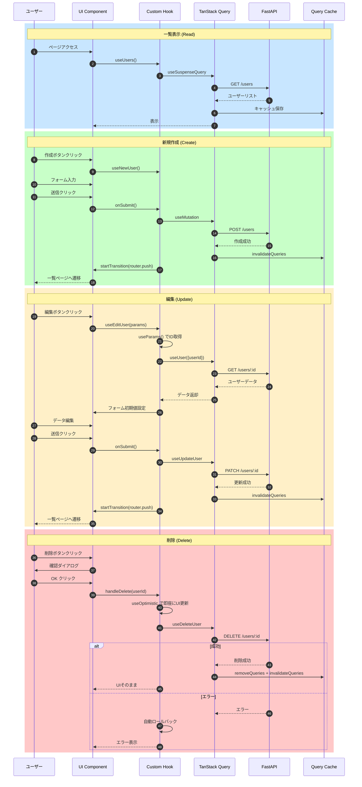

# CRUD操作の実装

このガイドでは、ユーザー管理の完全なCRUD（作成・読取・更新・削除）操作の実装方法を説明します。

## 目次

- [概要](#概要)
- [一覧表示（Read）](#一覧表示read)
- [新規作成（Create）](#新規作成create)
- [編集（Update）](#編集update)
- [削除（Delete）](#削除delete)
- [完全なフロー](#完全なフロー)

---

## 概要

### 実装する機能

| 操作 | エンドポイント | 使用技術 |
|-----|-------------|---------|
| **一覧** | GET /users | useSuspenseQuery |
| **作成** | POST /users | useMutation ~~+ useTransition~~ |
| **編集** | PATCH /users/:id | useMutation ~~+ useTransition + use~~ + await |
| **削除** | DELETE /users/:id | useMutation + useOptimistic ~~+ use~~ |

> ⚠️ **注意**: useTransitionとuse()フックは非推奨です。推奨パターンは [learning/06-react19.md](../../learning/06-react19.md#実務での推奨事項) を参照してください。

---

## 一覧表示（Read）

### API層フック

**ファイル**: `src/features/sample-users/api/get-users.ts`

```typescript
import { queryOptions, useSuspenseQuery } from "@tanstack/react-query";
import { api } from "@/lib/api-client";
import { QueryConfig } from "@/lib/tanstack-query";
import type { User } from "../types";

export const getUsers = (): Promise<{ data: User[] }> => {
  return api.get("/sample/users");
};

export const getUsersQueryOptions = () => {
  return queryOptions({
    queryKey: ["users"],
    queryFn: getUsers,
  });
};

type UseUsersOptions = {
  queryConfig?: QueryConfig<typeof getUsersQueryOptions>;
};

export const useUsers = ({ queryConfig }: UseUsersOptions = {}) => {
  return useSuspenseQuery({
    ...getUsersQueryOptions(),
    ...queryConfig,
  });
};
```

### ページコンポーネント

**ファイル**: `src/features/sample-users/routes/sample-users/users.tsx`

```typescript
"use client";

import { Suspense } from "react";
import { ErrorBoundary } from "react-error-boundary";
import { useUsers } from "../../api/get-users";
import { LoadingSpinner } from "@/components/ui/loading-spinner";

const UsersPageContent = () => {
  const { data } = useUsers();
  const users = data?.data ?? [];

  return (
    <div className="space-y-4">
      <h1 className="text-2xl font-bold">ユーザー一覧</h1>
      <ul className="space-y-2">
        {users.map((user) => (
          <li key={user.id} className="rounded border p-4">
            <p className="font-semibold">{user.name}</p>
            <p className="text-sm text-gray-600">{user.email}</p>
          </li>
        ))}
      </ul>
    </div>
  );
};

const UsersPage = () => {
  return (
    <ErrorBoundary FallbackComponent={ErrorFallback}>
      <Suspense fallback={<LoadingSpinner fullScreen />}>
        <UsersPageContent />
      </Suspense>
    </ErrorBoundary>
  );
};

export default UsersPage;
```

---

## 新規作成（Create）

### バリデーションスキーマ

**ファイル**: `src/features/sample-users/types/forms.ts`

```typescript
import { z } from "zod";

export const userFormSchema = z.object({
  name: z.string().min(1, "名前を入力してください"),
  email: z.string().email("有効なメールアドレスを入力してください"),
  role: z.enum(["user", "admin"], {
    required_error: "ロールを選択してください",
  }),
});

export type UserFormValues = z.infer<typeof userFormSchema>;
```

### ミューテーションフック（API層）

**ファイル**: `src/features/sample-users/api/create-user.ts`

```typescript
import { useMutation, useQueryClient } from "@tanstack/react-query";
import { api } from "@/lib/api-client";
import type { User, UserFormValues } from "../types";

export const createUser = (data: UserFormValues): Promise<{ data: User }> => {
  return api.post("/sample/users", data);
};

export const useCreateUser = () => {
  const queryClient = useQueryClient();

  return useMutation({
    mutationFn: createUser,
    onSuccess: () => {
      queryClient.invalidateQueries({ queryKey: ["users"] });
    },
  });
};
```

### ページフック

**ファイル**: `src/features/sample-users/routes/sample-new-user/new-user.hook.ts`

> ⚠️ **非推奨パターン削除**: useTransitionは不要です。

```typescript
"use client";

import { zodResolver } from "@hookform/resolvers/zod";
import { useRouter } from "next/navigation";
import { useForm } from "react-hook-form";
import { useCreateUser } from "../../api/create-user";
import { userFormSchema, type UserFormValues } from "../../types/forms.schema";

export const useNewUser = () => {
  const router = useRouter();
  const createUserMutation = useCreateUser();

  const {
    control,
    handleSubmit,
    formState: { errors },
    setError,
  } = useForm<UserFormValues>({
    resolver: zodResolver(userFormSchema),
    defaultValues: {
      name: "",
      email: "",
      role: "user",
    },
  });

  const onSubmit = handleSubmit(async (data) => {
    await createUserMutation
      .mutateAsync(data)
      .then(() => router.push("/sample-users")) // ← シンプル！
      .catch((error) => {
        setError("root", {
          message: "ユーザーの作成に失敗しました",
        });
      });
  });

  const handleCancel = () => {
    router.push("/sample-users"); // ← シンプル！
  };

  return {
    control,
    onSubmit,
    handleCancel,
    errors,
    isSubmitting: createUserMutation.isPending, // ← シンプル！
  };
};
```

---

## 編集（Update）

### 個別データ取得（API層）

**ファイル**: `src/features/sample-users/api/get-user.ts`

```typescript
import { queryOptions, useSuspenseQuery } from "@tanstack/react-query";
import { api } from "@/lib/api-client";
import type { User } from "../types";

export const getUser = (userId: string): Promise<{ data: User }> => {
  return api.get(`/sample/users/${userId}`);
};

export const getUserQueryOptions = (userId: string) => {
  return queryOptions({
    queryKey: ["users", userId],
    queryFn: () => getUser(userId),
  });
};

type UseUserOptions = {
  userId: string;
};

export const useUser = ({ userId }: UseUserOptions) => {
  return useSuspenseQuery({
    ...getUserQueryOptions(userId),
  });
};
```

### 更新ミューテーション（API層）

**ファイル**: `src/features/sample-users/api/update-user.ts`

```typescript
import { useMutation, useQueryClient } from "@tanstack/react-query";
import { api } from "@/lib/api-client";
import type { User, UserFormValues } from "../types";

type UpdateUserDTO = {
  userId: string;
  data: UserFormValues;
};

export const updateUser = ({ userId, data }: UpdateUserDTO): Promise<{ data: User }> => {
  return api.patch(`/sample/users/${userId}`, data);
};

export const useUpdateUser = () => {
  const queryClient = useQueryClient();

  return useMutation({
    mutationFn: updateUser,
    onSuccess: (_, variables) => {
      queryClient.invalidateQueries({ queryKey: ["users", variables.userId] });
      queryClient.invalidateQueries({ queryKey: ["users"] });
    },
  });
};
```

### 編集ページフック

**ファイル**: `src/features/sample-users/routes/sample-edit-user/edit-user.hook.ts`

> ⚠️ **非推奨パターン削除**: use()、useEffect、useTransitionは不要です。

```typescript
"use client";

import { zodResolver } from "@hookform/resolvers/zod";
import { useRouter } from "next/navigation";
import { useForm } from "react-hook-form";
import { useUser } from "../../api/get-user";
import { useUpdateUser } from "../../api/update-user";
import { userFormSchema, type UserFormValues } from "../../types/forms.schema";

/**
 * ユーザー編集ページのカスタムフック
 *
 * paramsはPage Componentでawaitして、userIdを受け取る
 */
export const useEditUser = (userId: string) => {
  const router = useRouter();

  // useSuspenseQueryなので、必ずdataが存在
  const { data } = useUser({ userId });
  const updateUserMutation = useUpdateUser();

  const {
    control,
    handleSubmit,
    formState: { errors },
    setError,
  } = useForm<UserFormValues>({
    resolver: zodResolver(userFormSchema),
    // useEffect不要！最初からdataがある
    defaultValues: {
      name: data.data.name,
      email: data.data.email,
      role: data.data.role as "user" | "admin",
    },
  });

  const onSubmit = handleSubmit(async (formData) => {
    await updateUserMutation
      .mutateAsync({
        userId,
        data: formData,
      })
      .then(() => router.push("/sample-users")) // ← シンプル！
      .catch((error) => {
        setError("root", {
          message: "ユーザーの更新に失敗しました",
        });
      });
  });

  const handleCancel = () => {
    router.push("/sample-users"); // ← シンプル！
  };

  return {
    control,
    onSubmit,
    handleCancel,
    errors,
    isSubmitting: updateUserMutation.isPending, // ← シンプル！
  };
};
```

**Page Component** (`edit-user.tsx`):

```typescript
// page.tsx (メタデータのみ)
import type { Metadata } from 'next';
import EditUserPage from '@/features/sample-users/routes/sample-edit-user';

export const metadata: Metadata = {
  title: 'ユーザー編集',
};

export default function Page() {
  return <EditUserPage />;
}

// edit-user.tsx (Client Component)
'use client';

const EditUserPageContent = () => {
  const params = useParams();
  const userId = params.id as string;

  return (
    <ErrorBoundary FallbackComponent={MainErrorFallback}>
      <Suspense fallback={<LoadingSpinner fullScreen />}>
        <EditUserForm userId={userId} />
      </Suspense>
    </ErrorBoundary>
  );
};

---

## 削除（Delete）

### 削除ミューテーション（API層）

**ファイル**: `src/features/sample-users/api/delete-user.ts`

```typescript
import { useMutation, useQueryClient } from "@tanstack/react-query";
import { api } from "@/lib/api-client";

export const deleteUser = (userId: string): Promise<void> => {
  return api.delete(`/sample/users/${userId}`);
};

export const useDeleteUser = () => {
  const queryClient = useQueryClient();

  return useMutation({
    mutationFn: deleteUser,
    onSuccess: (_, userId) => {
      queryClient.removeQueries({ queryKey: ["users", userId] });
      queryClient.invalidateQueries({ queryKey: ["users"] });
    },
  });
};
```

### 削除確認ページフック（楽観的更新あり）

**ファイル**: `src/features/sample-users/routes/sample-users/users.hook.ts`

```typescript
"use client";

import { useOptimistic } from "react";
import { useRouter } from "next/navigation";
import { useUsers as useUsersQuery } from "../../api/get-users";
import { useDeleteUser as useDeleteUserMutation } from "../../api/delete-user";

export const useUsers = () => {
  const router = useRouter();
  const { data } = useUsersQuery();
  const deleteUserMutation = useDeleteUserMutation();

  const users = data?.data ?? [];

  // 楽観的UI更新（削除）
  const [optimisticUsers, removeOptimisticUser] = useOptimistic(
    users,
    (state, deletedUserId: string) =>
      state.filter((user) => user.id !== deletedUserId)
  );

  const handleDelete = async (userId: string) => {
    const user = users.find((u) => u.id === userId);
    if (!user) return;

    const confirmed = window.confirm(
      `${user.name} を削除してもよろしいですか？`
    );
    if (!confirmed) return;

    // 即座にUIから削除
    removeOptimisticUser(userId);

    await deleteUserMutation
      .mutateAsync(userId)
      .catch((error) => {
        console.error("削除に失敗しました:", error);
        alert("ユーザーの削除に失敗しました。");
      });
  };

  const handleEdit = (userId: string) => {
    router.push(`/sample-users/${userId}/edit`);
  };

  const handleCreate = () => {
    router.push("/sample-users/new");
  };

  return {
    users: optimisticUsers,
    handleDelete,
    handleEdit,
    handleCreate,
    isDeleting: deleteUserMutation.isPending,
  };
};
```

---

## 完全なフロー



### テキスト版フロー

#### 1. 一覧表示

```text
ユーザー → 一覧ページ
         ↓
    useUsers (API層)
         ↓
    useSuspenseQuery
         ↓
    FastAPI GET /users
         ↓
    データ取得完了
         ↓
    ユーザーリスト表示
```

#### 2. 新規作成フロー

```text
ユーザー → 新規作成ボタン
         ↓
    /users/new ページ
         ↓
    useNewUser フック
         ↓
    フォーム入力
         ↓
    送信ボタンクリック
         ↓
    useCreateUser (API層)
         ↓
    FastAPI POST /users
         ↓
    成功 → キャッシュ無効化
         ↓
    useTransition でナビゲーション
         ↓
    一覧ページに戻る
```

#### 3. 編集フロー

```text
ユーザー → 編集ボタンクリック
         ↓
    /users/:id/edit ページ
         ↓
    useEditUser フック
         ↓
    useParams() でID取得
         ↓
    useUser でデータ取得
         ↓
    フォームに初期値セット
         ↓
    編集して送信
         ↓
    useUpdateUser (API層)
         ↓
    FastAPI PATCH /users/:id
         ↓
    成功 → キャッシュ無効化
         ↓
    useTransition でナビゲーション
         ↓
    一覧ページに戻る
```

#### 4. 削除フロー

```text
ユーザー → 削除ボタンクリック
         ↓
    確認ダイアログ表示
         ↓
    OK クリック
         ↓
    useOptimistic で即座に削除表示
         ↓
    useDeleteUser (API層)
         ↓
    FastAPI DELETE /users/:id
         ↓
    成功 → キャッシュ無効化
         ↓
    (エラー時は自動ロールバック)
```

---

## FastAPIエンドポイント例

```python
from fastapi import APIRouter, HTTPException
from pydantic import BaseModel, EmailStr
from typing import List

router = APIRouter()

class User(BaseModel):
    id: str
    name: str
    email: EmailStr
    role: str

class CreateUserRequest(BaseModel):
    name: str
    email: EmailStr
    role: str

# 一覧取得
@router.get("/users", response_model=List[User])
async def get_users():
    return db.get_all_users()

# 個別取得
@router.get("/users/{user_id}", response_model=User)
async def get_user(user_id: str):
    user = db.get_user(user_id)
    if not user:
        raise HTTPException(status_code=404, detail="User not found")
    return user

# 作成
@router.post("/users", response_model=User)
async def create_user(data: CreateUserRequest):
    return db.create_user(data)

# 更新
@router.patch("/users/{user_id}", response_model=User)
async def update_user(user_id: str, data: CreateUserRequest):
    user = db.update_user(user_id, data)
    if not user:
        raise HTTPException(status_code=404, detail="User not found")
    return user

# 削除
@router.delete("/users/{user_id}")
async def delete_user(user_id: str):
    success = db.delete_user(user_id)
    if not success:
        raise HTTPException(status_code=404, detail="User not found")
    return {"message": "User deleted successfully"}
```

---

## まとめ

### 使用技術まとめ

| 操作 | フック | ポイント |
|-----|-------|---------|
| **一覧** | useSuspenseQuery | Suspense + ErrorBoundary |
| **作成** | useMutation ~~+ useTransition~~ | ~~ノンブロッキング遷移~~ 直接ナビゲーション |
| **編集** | useMutation + useParams() | Client Component で params取得 + 直接ナビゲーション |
| **削除** | useOptimistic + useMutation | 楽観的更新 |

---

## 関連ドキュメント

- [React 19機能 - useOptimistic](../04-react19-features.md#useoptimistic)
- [React 19機能 - useTransition](../04-react19-features.md#usetransition)
- [React 19機能 - use](../04-react19-features.md#use)
