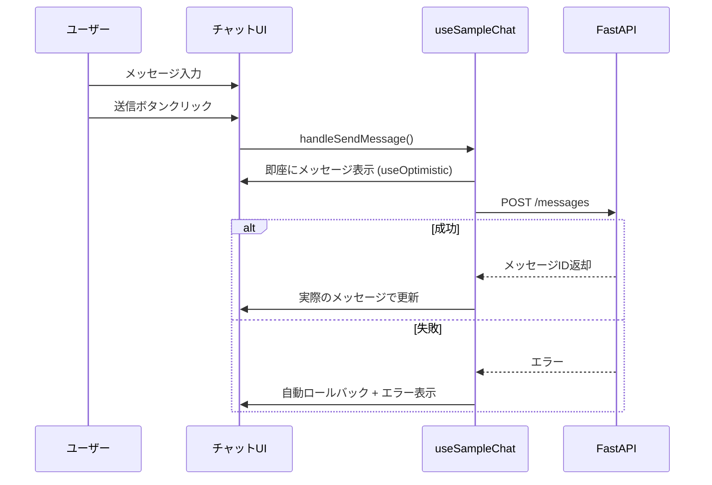

# リアルタイム更新の実装

このガイドでは、チャット機能など、リアルタイム更新が必要な機能の実装方法を説明します。

## 目次

- [概要](#概要)
- [チャット機能の実装](#チャット機能の実装)
- [楽観的UI更新](#楽観的ui更新)
- [エラーハンドリング](#エラーハンドリング)

---

## 概要

### useOptimisticの活用

リアルタイム更新では、`useOptimistic`を使って即座のフィードバックを提供します。



---

## チャット機能の実装

### 型定義

**ファイル**: `src/features/sample-chat/types/index.ts`

```typescript
export type Message = {
  id: string;
  role: "user" | "assistant";
  content: string;
  timestamp: Date;
};

export type SendMessageRequest = {
  message: string;
  conversationId?: string;
};
```

### API層

**ファイル**: `src/features/sample-chat/api/send-message.ts`

```typescript
import { useMutation } from "@tanstack/react-query";
import { api } from "@/lib/api-client";
import type { Message, SendMessageRequest } from "../types";

export const sendMessage = async (
  data: SendMessageRequest
): Promise<{ data: Message }> => {
  return api.post("/chat/messages", data);
};

export const useSendMessage = () => {
  return useMutation({
    mutationFn: sendMessage,
  });
};
```

### チャットフック

**ファイル**: `src/features/sample-chat/routes/sample-chat/sample-chat.hook.ts`

```typescript
"use client";

import { useOptimistic, useState } from "react";
import { useSendMessage } from "../../api/send-message";
import type { Message } from "../../types";

/**
 * チャット機能のカスタムフック
 *
 * useOptimisticで楽観的UI更新を実装
 */
export const useSampleChat = () => {
  const [messages, setMessages] = useState<Message[]>([]);
  const [inputMessage, setInputMessage] = useState("");
  const sendMessageMutation = useSendMessage();

  // ================================================================================
  // Optimistic Updates
  // ================================================================================
  const [optimisticMessages, addOptimisticMessage] = useOptimistic(
    messages,
    (state, newMessage: Message) => [...state, newMessage]
  );

  // ================================================================================
  // Handlers
  // ================================================================================
  const handleSendMessage = async () => {
    if (!inputMessage.trim()) return;

    const userMessage: Message = {
      id: `user-${Date.now()}`,
      role: "user",
      content: inputMessage.trim(),
      timestamp: new Date(),
    };

    // 入力をクリア
    setInputMessage("");

    // 楽観的更新: 即座にUIに反映
    addOptimisticMessage(userMessage);

    try {
      // FastAPIにメッセージ送信
      const response = await sendMessageMutation.mutateAsync({
        message: userMessage.content,
      });

      // 成功: ユーザーメッセージとアシスタントの応答を追加
      setMessages((prev) => [...prev, userMessage, response.data]);
    } catch (error) {
      console.error("Failed to send message:", error);

      // エラー時: エラーメッセージを表示
      setMessages((prev) => [
        ...prev,
        {
          id: `error-${Date.now()}`,
          role: "assistant",
          content: "エラーが発生しました。もう一度お試しください。",
          timestamp: new Date(),
        },
      ]);
    }
  };

  const handleKeyPress = (e: React.KeyboardEvent) => {
    if (e.key === "Enter" && !e.shiftKey) {
      e.preventDefault();
      handleSendMessage();
    }
  };

  return {
    messages: optimisticMessages,
    inputMessage,
    setInputMessage,
    handleSendMessage,
    handleKeyPress,
    isSending: sendMessageMutation.isPending,
  };
};
```

### チャットコンポーネント

**ファイル**: `src/features/sample-chat/routes/sample-chat/sample-chat.tsx`

```typescript
"use client";

import { Button } from "@/components/ui/button";
import { useSampleChat } from "./sample-chat.hook";

const SampleChatPage = () => {
  const {
    messages,
    inputMessage,
    setInputMessage,
    handleSendMessage,
    handleKeyPress,
    isSending,
  } = useSampleChat();

  return (
    <div className="flex h-screen flex-col">
      {/* メッセージリスト */}
      <div className="flex-1 space-y-4 overflow-y-auto p-4">
        {messages.map((message) => (
          <div
            key={message.id}
            className={`flex ${
              message.role === "user" ? "justify-end" : "justify-start"
            }`}
          >
            <div
              className={`max-w-[70%] rounded-lg p-3 ${
                message.role === "user"
                  ? "bg-blue-500 text-white"
                  : "bg-gray-200 text-gray-900"
              }`}
            >
              <p className="whitespace-pre-wrap">{message.content}</p>
              <p className="mt-1 text-xs opacity-70">
                {message.timestamp.toLocaleTimeString()}
              </p>
            </div>
          </div>
        ))}
      </div>

      {/* 入力エリア */}
      <div className="border-t p-4">
        <div className="flex gap-2">
          <textarea
            value={inputMessage}
            onChange={(e) => setInputMessage(e.target.value)}
            onKeyPress={handleKeyPress}
            placeholder="メッセージを入力..."
            className="flex-1 resize-none rounded border p-2"
            rows={3}
          />
          <Button
            onClick={handleSendMessage}
            disabled={isSending || !inputMessage.trim()}
          >
            {isSending ? "送信中..." : "送信"}
          </Button>
        </div>
      </div>
    </div>
  );
};

export default SampleChatPage;
```

---

## 楽観的UI更新

### ポイント

1. **即座のフィードバック**: メッセージ送信後すぐにUIに表示
2. **自動ロールバック**: エラー時は自動的に元に戻る
3. **ローディング状態**: 送信中は送信ボタンを無効化

### データフロー

```text
ユーザーがメッセージ入力
         ↓
    送信ボタンクリック
         ↓
    addOptimisticMessage() → 即座にUI更新
         ↓
    FastAPI POST /messages
         ↓
    ┌─────────┬─────────┐
    │ 成功    │ 失敗    │
    └─────────┴─────────┘
         ↓         ↓
    実際の      エラー
    メッセージ  メッセージ
    で更新      追加
```

---

## エラーハンドリング

### エラー時の処理

```typescript
catch (error) {
  console.error("Failed to send message:", error);

  // エラーメッセージを表示
  setMessages((prev) => [
    ...prev,
    {
      id: `error-${Date.now()}`,
      role: "assistant",
      content: "エラーが発生しました。もう一度お試しください。",
      timestamp: new Date(),
    },
  ]);
}
```

### リトライ機能

```typescript
const [retryCount, setRetryCount] = useState(0);
const MAX_RETRIES = 3;

const handleSendMessage = async () => {
  // ... 楽観的更新

  try {
    const response = await sendMessageMutation.mutateAsync({
      message: userMessage.content,
    });

    setMessages((prev) => [...prev, userMessage, response.data]);
    setRetryCount(0); // リセット
  } catch (error) {
    if (retryCount < MAX_RETRIES) {
      setRetryCount((prev) => prev + 1);
      // 再試行
      setTimeout(() => handleSendMessage(), 1000);
    } else {
      // 最大リトライ回数到達
      setMessages((prev) => [
        ...prev,
        {
          id: `error-${Date.now()}`,
          role: "assistant",
          content: "接続に失敗しました。ページをリロードしてください。",
          timestamp: new Date(),
        },
      ]);
    }
  }
};
```

---

## FastAPIエンドポイント例

```python
from fastapi import APIRouter, HTTPException
from pydantic import BaseModel
from datetime import datetime

router = APIRouter()

class SendMessageRequest(BaseModel):
    message: str
    conversation_id: str | None = None

class Message(BaseModel):
    id: str
    role: str
    content: str
    timestamp: datetime

@router.post("/messages", response_model=Message)
async def send_message(data: SendMessageRequest):
    # メッセージ処理（LLM呼び出しなど）
    response_content = await process_message(data.message)

    return Message(
        id=generate_id(),
        role="assistant",
        content=response_content,
        timestamp=datetime.now(),
    )
```

---

## まとめ

### ポイント

- **useOptimistic**: 即座のフィードバック
- **自動ロールバック**: エラー時に安全
- **エラーメッセージ**: ユーザーフレンドリーな通知

---

## 関連ドキュメント

- [React 19機能 - useOptimistic](../04-react19-features.md#useoptimistic)
- [ベストプラクティス](../06-best-practices/)
