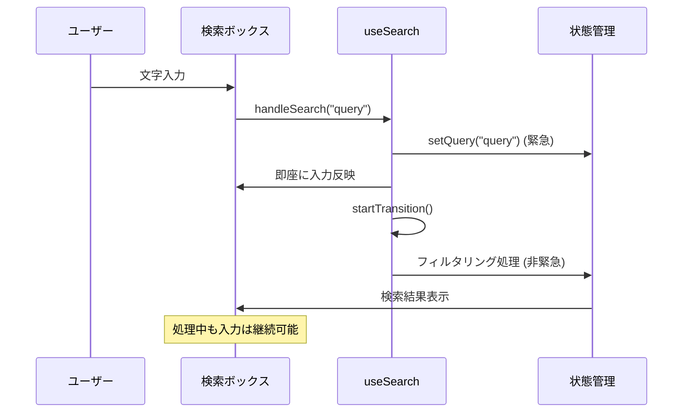

# 検索・フィルター機能の実装

このガイドでは、`useTransition`を活用したノンブロッキングな検索・フィルター機能の実装方法を説明します。

## 目次

- [概要](#概要)
- [検索ボックスの実装](#検索ボックスの実装)
- [フィルター機能](#フィルター機能)
- [デバウンス処理](#デバウンス処理)

---

## 概要

### useTransitionの活用

検索・フィルター処理では、`useTransition`を使ってノンブロッキングな更新を実現します。



---

## 検索ボックスの実装

### 検索フック

**ファイル**: `src/hooks/use-search.ts`

```typescript
"use client";

import { useState, useTransition } from "react";

/**
 * 検索機能のカスタムフック
 *
 * useTransitionでノンブロッキングなフィルタリングを実現
 *
 * @example
 * ```tsx
 * const { query, filteredItems, handleSearch, isPending } = useSearch(
 *   users,
 *   (user, query) => user.name.toLowerCase().includes(query.toLowerCase())
 * );
 * ```
 */
export const useSearch = <T,>(
  items: T[],
  searchFn: (item: T, query: string) => boolean
) => {
  const [query, setQuery] = useState("");
  const [filteredItems, setFilteredItems] = useState(items);
  const [isPending, startTransition] = useTransition();

  /**
   * 検索処理ハンドラー
   *
   * 1. 入力値を即座に反映（緊急）
   * 2. フィルタリングをノンブロッキングで実行（非緊急）
   */
  const handleSearch = (newQuery: string) => {
    // 入力は即座に反映
    setQuery(newQuery);

    // フィルタリングはノンブロッキング
    startTransition(() => {
      if (!newQuery.trim()) {
        setFilteredItems(items);
      } else {
        const filtered = items.filter((item) => searchFn(item, newQuery));
        setFilteredItems(filtered);
      }
    });
  };

  return {
    query,
    filteredItems,
    handleSearch,
    isPending,
  };
};
```

### ユーザー検索の実装例

**ファイル**: `src/features/sample-users/routes/sample-users/users.hook.ts`

```typescript
"use client";

import { useRouter } from "next/navigation";
import { useSearch } from "@/hooks/use-search";
import { useUsers as useUsersQuery } from "../../api/get-users";
import type { User } from "../../types";

export const useUsers = () => {
  const router = useRouter();
  const { data } = useUsersQuery();
  const users = data?.data ?? [];

  // 検索機能
  const { query, filteredItems, handleSearch, isPending } = useSearch<User>(
    users,
    (user, query) => {
      const searchLower = query.toLowerCase();
      return (
        user.name.toLowerCase().includes(searchLower) ||
        user.email.toLowerCase().includes(searchLower) ||
        user.role.toLowerCase().includes(searchLower)
      );
    }
  );

  const handleEdit = (userId: string) => {
    router.push(`/sample-users/${userId}/edit`);
  };

  return {
    users: filteredItems,
    query,
    handleSearch,
    handleEdit,
    isSearching: isPending,
  };
};
```

### 検索UIコンポーネント

```typescript
"use client";

import { Input } from "@/components/ui/input";
import { useUsers } from "./users.hook";

const UsersPage = () => {
  const { users, query, handleSearch, isSearching } = useUsers();

  return (
    <div className="space-y-4">
      {/* 検索ボックス */}
      <div className="relative">
        <Input
          type="text"
          value={query}
          onChange={(e) => handleSearch(e.target.value)}
          placeholder="名前、メール、ロールで検索..."
          className="w-full"
        />
        {isSearching && (
          <div className="absolute right-3 top-3">
            <LoadingSpinner size="sm" />
          </div>
        )}
      </div>

      {/* 検索結果 */}
      <div className="text-sm text-gray-600">
        {query && `${users.length}件の結果`}
      </div>

      {/* ユーザーリスト */}
      <UserList users={users} />
    </div>
  );
};
```

---

## フィルター機能

### 複数条件フィルター

**ファイル**: `src/hooks/use-filter.ts`

```typescript
"use client";

import { useState, useTransition } from "react";

export type FilterCondition<T> = {
  key: string;
  value: string | string[];
  filterFn: (item: T, value: string | string[]) => boolean;
};

/**
 * 複数条件フィルター機能のカスタムフック
 */
export const useFilter = <T,>(items: T[]) => {
  const [filters, setFilters] = useState<FilterCondition<T>[]>([]);
  const [filteredItems, setFilteredItems] = useState(items);
  const [isPending, startTransition] = useTransition();

  const applyFilter = (condition: FilterCondition<T>) => {
    const newFilters = [
      ...filters.filter((f) => f.key !== condition.key),
      condition,
    ];

    setFilters(newFilters);

    startTransition(() => {
      let result = items;

      newFilters.forEach((filter) => {
        result = result.filter((item) => filter.filterFn(item, filter.value));
      });

      setFilteredItems(result);
    });
  };

  const clearFilter = (key: string) => {
    const newFilters = filters.filter((f) => f.key !== key);
    setFilters(newFilters);

    startTransition(() => {
      let result = items;

      newFilters.forEach((filter) => {
        result = result.filter((item) => filter.filterFn(item, filter.value));
      });

      setFilteredItems(result);
    });
  };

  const clearAllFilters = () => {
    setFilters([]);
    startTransition(() => {
      setFilteredItems(items);
    });
  };

  return {
    filteredItems,
    filters,
    applyFilter,
    clearFilter,
    clearAllFilters,
    isPending,
  };
};
```

### フィルター使用例

```typescript
"use client";

import { useFilter } from "@/hooks/use-filter";
import type { User } from "../../types";

export const useUsersWithFilter = () => {
  const { data } = useUsersQuery();
  const users = data?.data ?? [];

  const { filteredItems, applyFilter, clearFilter, isPending } =
    useFilter<User>(users);

  const filterByRole = (role: string) => {
    applyFilter({
      key: "role",
      value: role,
      filterFn: (user, value) => user.role === value,
    });
  };

  const filterByStatus = (status: string) => {
    applyFilter({
      key: "status",
      value: status,
      filterFn: (user, value) => user.status === value,
    });
  };

  return {
    users: filteredItems,
    filterByRole,
    filterByStatus,
    clearFilter,
    isFiltering: isPending,
  };
};
```

---

## デバウンス処理

### デバウンスフック

**ファイル**: `src/hooks/use-debounce.ts`

```typescript
"use client";

import { useEffect, useState } from "react";

/**
 * デバウンス処理のカスタムフック
 *
 * 指定時間後に値を更新
 *
 * @param value - デバウンスする値
 * @param delay - 遅延時間（ミリ秒）
 */
export const useDebounce = <T,>(value: T, delay: number = 500): T => {
  const [debouncedValue, setDebouncedValue] = useState<T>(value);

  useEffect(() => {
    const handler = setTimeout(() => {
      setDebouncedValue(value);
    }, delay);

    return () => {
      clearTimeout(handler);
    };
  }, [value, delay]);

  return debouncedValue;
};
```

### デバウンス検索の実装

```typescript
"use client";

import { useState, useTransition, useEffect } from "react";
import { useDebounce } from "@/hooks/use-debounce";

export const useDebouncedSearch = <T,>(
  items: T[],
  searchFn: (item: T, query: string) => boolean
) => {
  const [query, setQuery] = useState("");
  const [filteredItems, setFilteredItems] = useState(items);
  const [isPending, startTransition] = useTransition();

  // デバウンス処理
  const debouncedQuery = useDebounce(query, 300);

  useEffect(() => {
    startTransition(() => {
      if (!debouncedQuery.trim()) {
        setFilteredItems(items);
      } else {
        const filtered = items.filter((item) =>
          searchFn(item, debouncedQuery)
        );
        setFilteredItems(filtered);
      }
    });
  }, [debouncedQuery, items, searchFn]);

  return {
    query,
    setQuery,
    filteredItems,
    isPending,
  };
};
```

---

## まとめ

### ポイント

| 機能 | 技術 | メリット |
|-----|------|---------|
| **検索** | useTransition | 入力がブロックされない |
| **フィルター** | useTransition + 複数条件 | スムーズな絞り込み |
| **デバウンス** | useDebounce + useEffect | API呼び出しの削減 |

### 使い分け

- **即座の検索**: `useSearch` + `useTransition`
- **API検索**: `useDebouncedSearch` + TanStack Query
- **複数条件**: `useFilter` + `useTransition`

---

## 関連ドキュメント

- [React 19機能 - useTransition](../04-react19-features.md#usetransition)
- [ベストプラクティス](../06-best-practices/)
