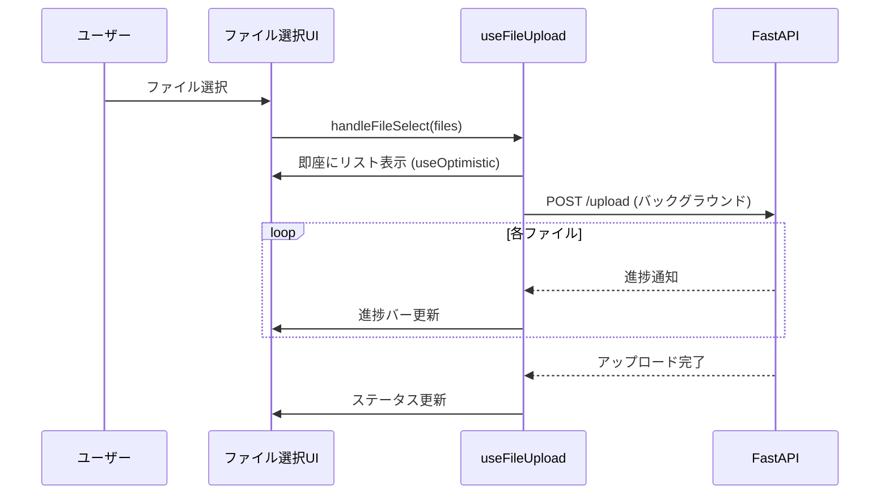

# ファイル操作の実装

このガイドでは、ファイルアップロード機能の実装方法を説明します。

## 目次

- [概要](#概要)
- [シングルファイルアップロード](#シングルファイルアップロード)
- [複数ファイルアップロード](#複数ファイルアップロード)
- [進捗表示](#進捗表示)

---

## 概要

### useOptimisticの活用

ファイル選択後、即座にリストに表示し、バックグラウンドでアップロードします。



---

## シングルファイルアップロード

### 型定義

```typescript
export type UploadedFile = {
  file: File;
  progress: number;
  status: "pending" | "uploading" | "success" | "error";
  url?: string;
  error?: string;
};
```

### アップロードAPI

**ファイル**: `src/features/sample-file/api/upload-file.ts`

```typescript
import { api } from "@/lib/api-client";

export type UploadResponse = {
  url: string;
  filename: string;
};

export const uploadFile = async (
  file: File,
  onProgress?: (progress: number) => void
): Promise<UploadResponse> => {
  const formData = new FormData();
  formData.append("file", file);

  return api.post("/upload", formData, {
    headers: {
      "Content-Type": "multipart/form-data",
    },
    onUploadProgress: (progressEvent) => {
      if (progressEvent.total) {
        const progress = Math.round(
          (progressEvent.loaded * 100) / progressEvent.total
        );
        onProgress?.(progress);
      }
    },
  });
};
```

### ファイルアップロードフック

**ファイル**: `src/features/sample-file/routes/sample-file/sample-file.hook.ts`

```typescript
"use client";

import { useOptimistic, useState } from "react";
import { uploadFile } from "../../api/upload-file";
import type { UploadedFile } from "../../types";

export const useSampleFile = () => {
  const [uploadedFiles, setUploadedFiles] = useState<UploadedFile[]>([]);

  // 楽観的UI更新
  const [optimisticFiles, addOptimisticFiles] = useOptimistic(
    uploadedFiles,
    (state, newFiles: UploadedFile[]) => [...state, ...newFiles]
  );

  const handleFileSelect = async (files: File[]) => {
    const newFiles: UploadedFile[] = files.map((file) => ({
      file,
      progress: 0,
      status: "pending" as const,
    }));

    // 即座にリストに表示
    addOptimisticFiles(newFiles);

    // ベース状態も更新
    setUploadedFiles((prev) => [...prev, ...newFiles]);

    // バックグラウンドでアップロード
    for (let i = 0; i < files.length; i++) {
      const fileIndex = uploadedFiles.length + i;

      try {
        // ステータスを「アップロード中」に変更
        setUploadedFiles((prev) =>
          prev.map((f, idx) =>
            idx === fileIndex
              ? { ...f, status: "uploading" as const }
              : f
          )
        );

        // アップロード実行
        const response = await uploadFile(files[i], (progress) => {
          setUploadedFiles((prev) =>
            prev.map((f, idx) =>
              idx === fileIndex ? { ...f, progress } : f
            )
          );
        });

        // 成功: ステータスとURLを更新
        setUploadedFiles((prev) =>
          prev.map((f, idx) =>
            idx === fileIndex
              ? {
                  ...f,
                  status: "success" as const,
                  url: response.url,
                  progress: 100,
                }
              : f
          )
        );
      } catch (error) {
        // エラー: ステータスを更新
        setUploadedFiles((prev) =>
          prev.map((f, idx) =>
            idx === fileIndex
              ? {
                  ...f,
                  status: "error" as const,
                  error: "アップロードに失敗しました",
                }
              : f
          )
        );
      }
    }
  };

  const handleRemove = (index: number) => {
    setUploadedFiles((prev) => prev.filter((_, idx) => idx !== index));
  };

  return {
    uploadedFiles: optimisticFiles,
    handleFileSelect,
    handleRemove,
  };
};
```

---

## 複数ファイルアップロード

### ドラッグ&ドロップ対応

```typescript
"use client";

import { useState } from "react";
import { useSampleFile } from "./sample-file.hook";

const SampleFilePage = () => {
  const { uploadedFiles, handleFileSelect, handleRemove } = useSampleFile();
  const [isDragging, setIsDragging] = useState(false);

  const handleDragOver = (e: React.DragEvent) => {
    e.preventDefault();
    setIsDragging(true);
  };

  const handleDragLeave = () => {
    setIsDragging(false);
  };

  const handleDrop = (e: React.DragEvent) => {
    e.preventDefault();
    setIsDragging(false);

    const files = Array.from(e.dataTransfer.files);
    handleFileSelect(files);
  };

  const handleInputChange = (e: React.ChangeEvent<HTMLInputElement>) => {
    if (e.target.files) {
      const files = Array.from(e.target.files);
      handleFileSelect(files);
    }
  };

  return (
    <div className="space-y-4 p-4">
      {/* ドロップゾーン */}
      <div
        onDragOver={handleDragOver}
        onDragLeave={handleDragLeave}
        onDrop={handleDrop}
        className={`rounded-lg border-2 border-dashed p-8 text-center ${
          isDragging ? "border-blue-500 bg-blue-50" : "border-gray-300"
        }`}
      >
        <input
          type="file"
          multiple
          onChange={handleInputChange}
          className="hidden"
          id="file-input"
        />
        <label htmlFor="file-input" className="cursor-pointer">
          <p className="text-lg">
            ファイルをドラッグ&ドロップまたはクリックして選択
          </p>
        </label>
      </div>

      {/* ファイルリスト */}
      <div className="space-y-2">
        {uploadedFiles.map((file, index) => (
          <FileItem
            key={index}
            file={file}
            onRemove={() => handleRemove(index)}
          />
        ))}
      </div>
    </div>
  );
};
```

---

## 進捗表示

### ファイルアイテムコンポーネント

```typescript
type FileItemProps = {
  file: UploadedFile;
  onRemove: () => void;
};

const FileItem = ({ file, onRemove }: FileItemProps) => {
  const getStatusColor = () => {
    switch (file.status) {
      case "success":
        return "text-green-600";
      case "error":
        return "text-red-600";
      case "uploading":
        return "text-blue-600";
      default:
        return "text-gray-600";
    }
  };

  const getStatusText = () => {
    switch (file.status) {
      case "success":
        return "完了";
      case "error":
        return file.error || "エラー";
      case "uploading":
        return `${file.progress}%`;
      default:
        return "待機中";
    }
  };

  return (
    <div className="flex items-center gap-4 rounded border p-4">
      {/* ファイル情報 */}
      <div className="flex-1">
        <p className="font-semibold">{file.file.name}</p>
        <p className="text-sm text-gray-600">
          {(file.file.size / 1024 / 1024).toFixed(2)} MB
        </p>
      </div>

      {/* 進捗バー */}
      {file.status === "uploading" && (
        <div className="w-48">
          <div className="h-2 overflow-hidden rounded-full bg-gray-200">
            <div
              className="h-full bg-blue-500 transition-all"
              style={{ width: `${file.progress}%` }}
            />
          </div>
        </div>
      )}

      {/* ステータス */}
      <div className={`min-w-20 text-sm ${getStatusColor()}`}>
        {getStatusText()}
      </div>

      {/* 削除ボタン */}
      <Button
        variant="ghost"
        size="sm"
        onClick={onRemove}
        disabled={file.status === "uploading"}
      >
        削除
      </Button>
    </div>
  );
};
```

---

## FastAPIエンドポイント例

```python
from fastapi import APIRouter, File, UploadFile, HTTPException
from pathlib import Path
import shutil

router = APIRouter()

UPLOAD_DIR = Path("uploads")
UPLOAD_DIR.mkdir(exist_ok=True)

@router.post("/upload")
async def upload_file(file: UploadFile = File(...)):
    try:
        # ファイル保存
        file_path = UPLOAD_DIR / file.filename
        with file_path.open("wb") as buffer:
            shutil.copyfileobj(file.file, buffer)

        return {
            "url": f"/uploads/{file.filename}",
            "filename": file.filename,
        }
    except Exception as e:
        raise HTTPException(status_code=500, detail=str(e))
```

---

## まとめ

### ポイント

- **useOptimistic**: 即座にリスト表示
- **進捗表示**: リアルタイムな進捗バー
- **エラーハンドリング**: 失敗時の再試行

---

## 関連ドキュメント

- [React 19機能 - useOptimistic](../04-react19-features.md#useoptimistic)
- [ベストプラクティス](../06-best-practices/)
