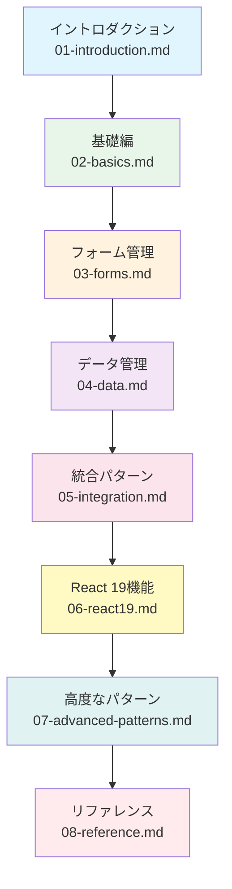
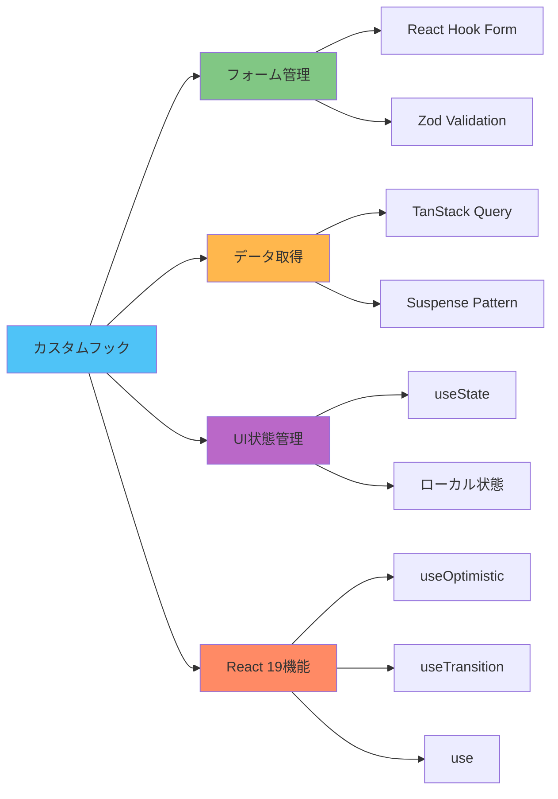

# イントロダクション

カスタムフックの学習へようこそ！このガイドでは、React/Next.jsプロジェクトでカスタムフックを効果的に使用する方法を、基礎から応用まで段階的に学びます。

---

## カスタムフックとは

カスタムフックは、Reactコンポーネントからロジックを抽出し、再利用可能な形にまとめるための仕組みです。

### なぜカスタムフックが必要？

```tsx
// ❌ 悪い例: コンポーネントにロジックが混在
export default function UserPage() {
  const [users, setUsers] = useState([]);
  const [loading, setLoading] = useState(false);

  useEffect(() => {
    setLoading(true);
    fetch('/api/users')
      .then(res => res.json())
      .then(data => setUsers(data))
      .finally(() => setLoading(false));
  }, []);

  return <UserList users={users} loading={loading} />;
}

// ✅ 良い例: ロジックをフックに分離
export default function UserPage() {
  const { users, isLoading } = useUsers();
  return <UserList users={users} loading={isLoading} />;
}
```

**メリット:**
- コンポーネントが読みやすくなる
- ロジックを再利用できる
- テストしやすくなる
- 関心の分離ができる

---

## このドキュメントの使い方

### 学習の進め方

このドキュメントは、以下の順序で学習することを想定しています：



1. **[基礎編](./02-basics.md)** - カスタムフックの基本パターン
2. **[フォーム管理](./03-forms.md)** - React Hook Formとの統合
3. **[データ管理](./04-data.md)** - TanStack Queryとの統合
4. **[統合パターン](./05-integration.md)** - フォームとデータの組み合わせ
5. **[React 19機能](./06-react19.md)** - 最新機能の活用
6. **[高度なパターン](./07-advanced-patterns.md)** - パフォーマンス最適化
7. **[リファレンス](./08-reference.md)** - クイックリファレンス

### すぐに実装したい方

実装したい機能が決まっている場合は、[ユースケースガイド](../guides/01-overview.md)から始めることをお勧めします。

---

## 前提知識

このドキュメントを最大限活用するために、以下の知識があることを前提としています：

### 必須

- ✅ **React の基本** - コンポーネント、Props、State
- ✅ **React Hooks** - useState、useEffect、useContext
- ✅ **TypeScript** - 型定義、インターフェース
- ✅ **Next.js の基本** - App Router、Server/Client Components

### あると望ましい

- React Hook Form の基本
- TanStack Query（React Query）の基本
- Zodによるバリデーション

初めての方は、まず公式ドキュメントで基礎を学ぶことをお勧めします：
- [React 公式チュートリアル](https://react.dev/learn)
- [Next.js 公式ドキュメント](https://nextjs.org/docs)

---

## プロジェクトでのカスタムフック

このプロジェクトでは、カスタムフックを以下の3つの主要な用途で使用します：



### 1. フォーム管理フック

React Hook Formを使用したフォームの状態管理とバリデーション。

```tsx
export const useLogin = () => {
  const { control, handleSubmit, formState: { errors } } = useForm({
    resolver: zodResolver(loginSchema),
  });

  const onSubmit = handleSubmit(async (data) => {
    // ログイン処理
  });

  return { control, onSubmit, errors };
};
```

**学習**: [フォーム管理](./03-forms.md)

### 2. データ取得フック

TanStack Query（React Query）を使用したサーバーデータの取得とキャッシュ管理。

```tsx
export const useUsers = () => {
  const { data, isLoading } = useQuery({
    queryKey: ["users"],
    queryFn: fetchUsers,
  });

  return {
    users: data ?? [],
    isLoading,
  };
};
```

**学習**: [データ管理](./04-data.md)

### 3. UI状態管理フック

コンポーネント内のローカルなUI状態を管理。

```tsx
export const useModal = () => {
  const [isOpen, setIsOpen] = useState(false);

  const open = () => setIsOpen(true);
  const close = () => setIsOpen(false);

  return { isOpen, open, close };
};
```

**学習**: [基礎編](./02-basics.md)

### 4. React 19の新機能フック

React 19で導入された新しいフックを活用してUXを向上。

```tsx
export const useOptimisticUsers = () => {
  const [users, setUsers] = useState([]);
  const [optimisticUsers, addOptimisticUser] = useOptimistic(
    users,
    (state, newUser) => [...state, newUser]
  );

  return { optimisticUsers, addOptimisticUser };
};
```

**学習**: [React 19機能](./06-react19.md)

---

## カスタムフックの基本ルール

Reactのカスタムフックには、従うべきルールがあります：

### 1. 命名規則

**必ず `use` プレフィックスを使用**

```tsx
// ✅ 良い例
export const useLogin = () => { /* ... */ };
export const useUsers = () => { /* ... */ };

// ❌ 悪い例
export const login = () => { /* ... */ };
export const getUsers = () => { /* ... */ };
```

### 2. フックのルール

カスタムフック内では、他のReact Hooksを呼び出すことができます：

```tsx
export const useUserData = (userId: string) => {
  // ✅ useState、useEffect、他のフックを使用できる
  const [data, setData] = useState(null);

  useEffect(() => {
    fetchUserData(userId).then(setData);
  }, [userId]);

  return data;
};
```

### 3. トップレベルでのみ呼び出し

```tsx
// ✅ 良い例: トップレベル
export const Component = () => {
  const data = useUserData('123');
  return <div>{data}</div>;
};

// ❌ 悪い例: 条件内
export const Component = () => {
  if (condition) {
    const data = useUserData('123'); // エラー！
  }
};
```

**例外**: React 19の `use` フックは条件付き呼び出しが可能です。詳細は[React 19機能](./06-react19.md)を参照。

---

## ディレクトリ構成

カスタムフックは機能ごとに配置します：

```
src/
  features/
    sample-auth/
      routes/
        sample-login/
          login.hook.ts          # ページ固有のフック
          login.tsx              # ページコンポーネント
    sample-user/
      api/
        get-users.ts             # API層のフック（Suspenseパターン）
      routes/
        users/
          users.hook.ts          # ページ固有のフック（必要時のみ）
          users.tsx
```

### API層とHooks層の使い分け

- **API層** (`features/*/api/`): データ取得ロジック + React Queryのカスタムフック
- **Hooks層** (`features/*/routes/*/*.hook.ts`): ページ固有のビジネスロジック（必要時のみ）

詳細は[データ管理](./04-data.md)を参照。

---

## 次のステップ

準備ができたら、[基礎編](./02-basics.md)に進んで、カスタムフックの基本パターンを学びましょう。

すぐに実装を始めたい場合は、[ユースケースガイド](../guides/01-overview.md)をチェックしてください。

---

## 参考リソース

### React 公式
- [カスタムフックの作成](https://react.dev/learn/reusing-logic-with-custom-hooks)
- [フックのルール](https://react.dev/reference/rules/rules-of-hooks)

### このプロジェクト
- [React/Next.js規約](../../01-coding-standards/07-react-nextjs-rules.md)
- [TypeScript規約](../../01-coding-standards/02-typescript.md)
- [ディレクトリ構成](../../02-project-structure/01-directory-structure.md)
