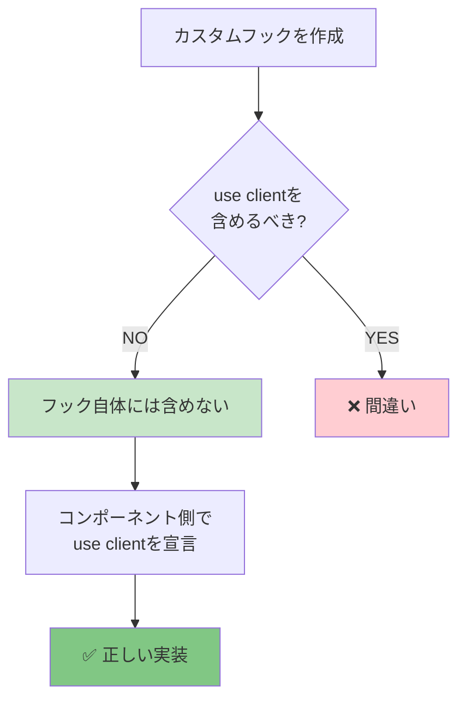

# 基礎編：カスタムフックの基本

カスタムフックの基本的なパターンと、シンプルな実装例を学びます。

---

## 基本構造

すべてのカスタムフックは、以下の基本構造に従います：

```tsx
export const useFeatureName = () => {
  // ================================================================================
  // State / Form Setup
  // ================================================================================
  // State管理、フォーム初期化など

  // ================================================================================
  // Queries / Mutations
  // ================================================================================
  // データ取得、更新のためのクエリやミューテーション

  // ================================================================================
  // Data Transformation
  // ================================================================================
  // データの変換処理

  // ================================================================================
  // Handlers
  // ================================================================================
  // イベントハンドラー、コールバック関数

  // ================================================================================
  // Return
  // ================================================================================
  return {
    // 必要なプロパティのみを分割して返す
  };
};
```

---

## 命名規則

### フック名

- **必ず `use` プレフィックスを使用**
- **機能を表す名詞または動詞を使用**
- **キャメルケース**

```tsx
// ✅ 良い例
useLogin;
useUsers;
useNewUser;
useEditUser;
useDeleteUser;
useSampleForm;
useModal;
useToggle;

// ❌ 悪い例
loginHook; // useがない
handleLogin; // handleはイベントハンドラー用
fetchUsers; // fetchは関数用
```

### 戻り値のプロパティ名

#### データ

```tsx
// 単数形
user;
product;
post;

// 複数形
users;
products;
posts;
```

#### ローディング状態

```tsx
isLoading; // 初回ローディング
isSubmitting; // 送信中
isDeleting; // 削除中
isFetching; // 再取得中（バックグラウンド）
```

#### エラー

```tsx
error; // エラーオブジェクト
errors; // Formエラー（複数）
```

#### 関数

```tsx
// イベントハンドラー
onSubmit;
onReset;
onCancel;

// 操作関数
open / close;
toggle;
createUser;
updateUser;
deleteUser;
refetch;
```

---

## シンプルな実装例

### 例1: モーダルの開閉

最もシンプルなカスタムフック：

```tsx
import { useState } from 'react';

/**
 * モーダルの開閉状態を管理するフック
 */
export const useModal = () => {
  const [isOpen, setIsOpen] = useState(false);

  const open = () => setIsOpen(true);
  const close = () => setIsOpen(false);
  const toggle = () => setIsOpen((prev) => !prev);

  return {
    isOpen,
    open,
    close,
    toggle,
  };
};
```

**使用例:**

```tsx
'use client';

export const MyPage = () => {
  const { isOpen, open, close } = useModal();

  return (
    <>
      <button onClick={open}>開く</button>

      {isOpen && (
        <Modal onClose={close}>
          <p>モーダルコンテンツ</p>
        </Modal>
      )}
    </>
  );
};
```

---

### 例2: トグルスイッチ

Boolean値を切り替えるシンプルなフック：

```tsx
import { useState } from 'react';

/**
 * Boolean値をトグルするフック
 */
export const useToggle = (initialValue: boolean = false) => {
  const [value, setValue] = useState(initialValue);

  const toggle = () => setValue((prev) => !prev);
  const setTrue = () => setValue(true);
  const setFalse = () => setValue(false);

  return {
    value,
    toggle,
    setTrue,
    setFalse,
    setValue,
  };
};
```

**使用例:**

```tsx
'use client';

export const SettingsPage = () => {
  const darkMode = useToggle(false);
  const notifications = useToggle(true);

  return (
    <div>
      <Switch checked={darkMode.value} onChange={darkMode.toggle}>
        ダークモード
      </Switch>

      <Switch checked={notifications.value} onChange={notifications.toggle}>
        通知を受け取る
      </Switch>
    </div>
  );
};
```

---

### 例3: カウンター

値の増減を管理するフック：

```tsx
import { useState } from 'react';

type UseCounterOptions = {
  min?: number;
  max?: number;
  step?: number;
};

/**
 * カウンターの状態を管理するフック
 */
export const useCounter = (initialValue: number = 0, options: UseCounterOptions = {}) => {
  const { min, max, step = 1 } = options;
  const [count, setCount] = useState(initialValue);

  const increment = () => {
    setCount((prev) => {
      const newValue = prev + step;
      return max !== undefined ? Math.min(newValue, max) : newValue;
    });
  };

  const decrement = () => {
    setCount((prev) => {
      const newValue = prev - step;
      return min !== undefined ? Math.max(newValue, min) : newValue;
    });
  };

  const reset = () => setCount(initialValue);

  return {
    count,
    increment,
    decrement,
    reset,
    setCount,
  };
};
```

**使用例:**

```tsx
'use client';

export const ProductPage = () => {
  const { count, increment, decrement, reset } = useCounter(1, {
    min: 1,
    max: 10,
  });

  return (
    <div>
      <button onClick={decrement}>-</button>
      <span>{count}</span>
      <button onClick={increment}>+</button>
      <button onClick={reset}>リセット</button>
    </div>
  );
};
```

---

### 例4: 配列の状態管理

配列の追加・削除を管理するフック：

```tsx
import { useState } from 'react';

/**
 * 配列の状態を管理するフック
 */
export const useArray = <T,>(initialValue: T[] = []) => {
  const [array, setArray] = useState<T[]>(initialValue);

  const push = (item: T) => {
    setArray((prev) => [...prev, item]);
  };

  const remove = (index: number) => {
    setArray((prev) => prev.filter((_, i) => i !== index));
  };

  const clear = () => {
    setArray([]);
  };

  const update = (index: number, item: T) => {
    setArray((prev) => prev.map((val, i) => (i === index ? item : val)));
  };

  return {
    array,
    push,
    remove,
    clear,
    update,
    setArray,
  };
};
```

**使用例:**

```tsx
'use client';

export const TodoList = () => {
  const { array: todos, push, remove } = useArray<string>([]);
  const [input, setInput] = useState('');

  const handleAdd = () => {
    if (input.trim()) {
      push(input);
      setInput('');
    }
  };

  return (
    <div>
      <input value={input} onChange={(e) => setInput(e.target.value)} />
      <button onClick={handleAdd}>追加</button>

      <ul>
        {todos.map((todo, index) => (
          <li key={index}>
            {todo}
            <button onClick={() => remove(index)}>削除</button>
          </li>
        ))}
      </ul>
    </div>
  );
};
```

---

## 統一された実装パターン

プロジェクト全体で以下のパターンに従います：

### 1. "use client" ディレクティブの扱い

**原則**: カスタムフック自体には `"use client"` を**含めない**



```tsx
// ❌ 悪い例
'use client';

export const useModal = () => {
  // ...
};
```

```tsx
// ✅ 良い例
export const useModal = () => {
  // ...
};
```

フックを使用するコンポーネント側で `"use client"` を宣言します：

```tsx
// コンポーネント側
'use client';

import { useModal } from './modal.hook';

export default function Page() {
  const { isOpen, open } = useModal();
  // ...
}
```

### 2. 必要なプロパティを分割して返す

```tsx
// ✅ 良い例: 必要なプロパティを分割
export const useModal = () => {
  const [isOpen, setIsOpen] = useState(false);
  const open = () => setIsOpen(true);
  const close = () => setIsOpen(false);

  return { isOpen, open, close }; // 個別に返す
};

// ❌ 悪い例: すべてを1つのオブジェクトに
export const useModal = () => {
  const [isOpen, setIsOpen] = useState(false);
  const open = () => setIsOpen(true);
  const close = () => setIsOpen(false);

  return { modal: { isOpen, open, close } }; // ネストしない
};
```

### 3. TypeScript型を明示する

```tsx
// ✅ 良い例: 型を明示
export const useCounter = (initialValue: number = 0) => {
  const [count, setCount] = useState<number>(initialValue);

  return {
    count,
    increment: () => setCount((prev) => prev + 1),
    decrement: () => setCount((prev) => prev - 1),
  };
};

// より良い例: 戻り値の型も定義
type UseCounterReturn = {
  count: number;
  increment: () => void;
  decrement: () => void;
};

export const useCounter = (initialValue: number = 0): UseCounterReturn => {
  // ...
};
```

---

## ディレクトリ構成

カスタムフックは機能ごとに配置します：

```
src/
  features/
    sample-auth/
      routes/
        sample-login/
          login.hook.ts          # ページ固有のフック
          login.tsx
    sample-user/
      routes/
        users/
          users.hook.ts          # ユーザー一覧フック
          users.tsx
```

### ファイル命名

```
{feature-name}.hook.ts

例:
login.hook.ts
users.hook.ts
modal.hook.ts
```

---

## ベストプラクティス

### 1. JSDocコメントを追加

```tsx
/**
 * モーダルの開閉状態を管理するフック
 *
 * @returns isOpen - モーダルの開閉状態
 * @returns open - モーダルを開く関数
 * @returns close - モーダルを閉じる関数
 */
export const useModal = () => {
  // ...
};
```

### 2. 初期値をオプションにする

```tsx
// ✅ 良い例: デフォルト値を提供
export const useCounter = (initialValue: number = 0) => {
  // ...
};

// 使用側
const counter1 = useCounter(); // 0から開始
const counter2 = useCounter(10); // 10から開始
```

### 3. クリーンアップを忘れずに

```tsx
export const useWindowSize = () => {
  const [size, setSize] = useState({ width: 0, height: 0 });

  useEffect(() => {
    const handleResize = () => {
      setSize({
        width: window.innerWidth,
        height: window.innerHeight,
      });
    };

    handleResize();
    window.addEventListener('resize', handleResize);

    // クリーンアップ
    return () => window.removeEventListener('resize', handleResize);
  }, []);

  return size;
};
```

---

## 次のステップ

基本的なカスタムフックの作り方を学びました。次は、より実践的な内容に進みましょう：

- **[フォーム管理](./03-forms.md)** - React Hook Formとの統合
- **[データ管理](./04-data.md)** - TanStack Queryとの統合

---

## 参考リソース

- [React公式 - カスタムフックの作成](https://react.dev/learn/reusing-logic-with-custom-hooks)
- [React公式 - フックのルール](https://react.dev/reference/rules/rules-of-hooks)
