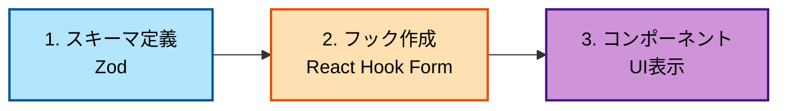
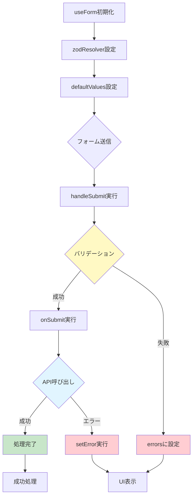

# フォーム管理の基礎

このセクションでは、React Hook FormとZodを使用したフォーム管理の基本を学びます。

## 目次

- [フォーム管理の基礎](#フォーム管理の基礎)
  - [目次](#目次)
  - [このセクションで学ぶこと](#このセクションで学ぶこと)
  - [フォーム管理の全体像](#フォーム管理の全体像)
  - [ステップ1: スキーマの定義](#ステップ1-スキーマの定義)
    - [Zodスキーマとは](#zodスキーマとは)
    - [基本的なスキーマの作成](#基本的なスキーマの作成)
    - [複雑なスキーマの例](#複雑なスキーマの例)
    - [バリデーションルールのパターン](#バリデーションルールのパターン)
  - [ステップ2: フォームフックの作成](#ステップ2-フォームフックの作成)
    - [フォームフックの基本構造](#フォームフックの基本構造)
    - [シンプルなフォームフック](#シンプルなフォームフック)
    - [重要なポイント](#重要なポイント)
  - [ステップ3: コンポーネントでの使用](#ステップ3-コンポーネントでの使用)
    - [フォームコンポーネント](#フォームコンポーネント)
    - [ControlledInputFieldの仕組み](#controlledinputfieldの仕組み)
  - [実装例](#実装例)
    - [例1: 新規ユーザー作成フォーム](#例1-新規ユーザー作成フォーム)
  - [エラーハンドリング](#エラーハンドリング)
    - [フィールドレベルのエラー](#フィールドレベルのエラー)
    - [フォームレベルのエラー](#フォームレベルのエラー)
    - [特定フィールドのエラー](#特定フィールドのエラー)
  - [フォームのリセット](#フォームのリセット)
    - [基本的なリセット](#基本的なリセット)
    - [特定の値にリセット](#特定の値にリセット)
    - [送信成功後の自動リセット](#送信成功後の自動リセット)
  - [チェックポイント](#チェックポイント)
    - [実践課題](#実践課題)
  - [次のステップ](#次のステップ)
    - [関連ドキュメント](#関連ドキュメント)

---

## このセクションで学ぶこと

このセクションを完了すると、以下のことができるようになります:

- Zodを使用したバリデーションスキーマの定義
- React Hook Formを使用したフォームの初期化
- フォーム送信処理の実装
- バリデーションエラーの表示
- フォームのリセット処理

---

## フォーム管理の全体像

フォーム管理は以下の3つのステップで構成されます:



---

## ステップ1: スキーマの定義

### Zodスキーマとは

Zodスキーマは、フォームの構造とバリデーションルールを定義します。

### 基本的なスキーマの作成

**ファイル**: `src/features/sample-auth/lib/validationslogin-form.ts`

```typescript
import { z } from 'zod';

/**
 * ログインフォームのバリデーションスキーマ
 *
 * @description
 * メールアドレスとパスワードのバリデーションを定義します。
 */
export const loginFormSchema = z.object({
  // メールアドレス
  email: z.string().min(1, 'メールアドレスを入力してください').email('有効なメールアドレスを入力してください'),

  // パスワード
  password: z.string().min(1, 'パスワードを入力してください').min(8, 'パスワードは8文字以上で入力してください'),
});

/**
 * ログインフォームの値の型
 *
 * @description
 * Zodスキーマから型を自動生成します。
 */
export type LoginFormValues = z.infer<typeof loginFormSchema>;
```

### 複雑なスキーマの例

**ファイル**: `src/features/sample-user/types/forms.ts`

```typescript
import { z } from 'zod';

/**
 * ユーザーフォームのバリデーションスキーマ
 */
export const userFormSchema = z.object({
  // 必須項目
  firstName: z.string().min(1, '名前を入力してください'),
  lastName: z.string().min(1, '姓を入力してください'),
  email: z.string().min(1, 'メールアドレスを入力してください').email('有効なメールアドレスを入力してください'),

  // オプション項目
  age: z.string().optional(),
  country: z.string().optional(),
});

export type UserFormValues = z.infer<typeof userFormSchema>;
```

### バリデーションルールのパターン

| バリデーション             | 例                               | 用途           |
| -------------------------- | -------------------------------- | -------------- |
| `.min(n, message)`         | `.min(1, "入力してください")`    | 最小文字数     |
| `.max(n, message)`         | `.max(100, "100文字以内")`       | 最大文字数     |
| `.email(message)`          | `.email("メールアドレス形式")`   | メール形式     |
| `.optional()`              | `.string().optional()`           | オプション項目 |
| `.regex(pattern, message)` | `.regex(/^[0-9]+$/, "数字のみ")` | 正規表現       |

---

## ステップ2: フォームフックの作成

### フォームフックの基本構造



フォームフックは、以下の責務を持ちます:

1. フォームの初期化
2. バリデーションの適用
3. 送信処理
4. エラーハンドリング

### シンプルなフォームフック

**ファイル**: `src/features/sample-auth/routes/sample-login/login.hook.ts`

```typescript
import { useForm } from 'react-hook-form';
import { zodResolver } from '@hookform/resolvers/zod';
import { loginFormSchema, type LoginFormValues } from '../../lib/validationslogin-form.schema';

/**
 * ログインページのカスタムフック
 *
 * @description
 * ログインフォームの状態管理とロジックを担当します。
 */
export const useLogin = () => {
  // ================================================================================
  // Form
  // ================================================================================
  const {
    control,
    handleSubmit,
    formState: { errors },
    setError,
  } = useForm<LoginFormValues>({
    // Zodスキーマをバリデーターとして設定
    resolver: zodResolver(loginFormSchema),

    // デフォルト値を設定（重要！）
    defaultValues: {
      email: '',
      password: '',
    },
  });

  // ================================================================================
  // Handlers
  // ================================================================================
  /**
   * フォーム送信ハンドラー
   *
   * @param data - バリデーション済みのフォームデータ
   */
  const onSubmit = handleSubmit(async (data) => {
    console.log('Form submitted:', data);

    // ここでAPIリクエストなどの処理を実行
    // （次のセクションで詳しく学びます）

    alert(`ログイン情報:\nEmail: ${data.email}\nPassword: ${data.password}`);
  });

  // ================================================================================
  // Return
  // ================================================================================
  return {
    control, // フォームコントロール（フィールドに渡す）
    onSubmit, // 送信ハンドラー
    errors, // エラーオブジェクト
  };
};
```

### 重要なポイント

1. **defaultValues の必須設定**

   ```typescript
   // ✅ 良い例: すべてのフィールドにデフォルト値を設定
   defaultValues: {
     email: "",
     password: "",
   }

   // ❌ 悪い例: デフォルト値なし
   // useFormの動作が不安定になる可能性があります
   ```

2. **型安全性の確保**

   ```typescript
   // Schemasから型を自動生成
   export type LoginFormValues = z.infer<typeof loginFormSchema>;

   // Hooksで型を指定
   useForm<LoginFormValues>({...})
   ```

3. **handleSubmitの使用**

   ```typescript
   // handleSubmitがバリデーションを自動実行
   const onSubmit = handleSubmit(async (data) => {
     // ここに来る時点でバリデーション済み
   });
   ```

---

## ステップ3: コンポーネントでの使用

### フォームコンポーネント

**ファイル**: `src/features/sample-auth/routes/sample-login/login.tsx`

```typescript
"use client";

import { Button } from "@/components/sample-ui/button";
import { ControlledInputField } from "@/components/form/controlled-input-field";
import { useLogin } from "./login.hook";

/**
 * ログインページコンポーネント
 */
export default function LoginPage() {
  const { control, onSubmit, errors } = useLogin();

  return (
    <div className="flex min-h-screen items-center justify-center">
      <div className="w-full max-w-md space-y-6 rounded-lg border p-8">
        <h1 className="text-2xl font-bold">ログイン</h1>

        <form onSubmit={onSubmit} className="space-y-4">
          {/* メールアドレス入力 */}
          <ControlledInputField
            name="email"
            control={control}
            label="メールアドレス"
            placeholder="example@email.com"
            type="email"
          />

          {/* パスワード入力 */}
          <ControlledInputField
            name="password"
            control={control}
            label="パスワード"
            placeholder="パスワードを入力"
            type="password"
          />

          {/* フォーム全体のエラー表示 */}
          {errors.root && (
            <div className="rounded-md bg-red-50 p-4 text-sm text-red-600">
              {errors.root.message}
            </div>
          )}

          {/* 送信ボタン */}
          <Button type="submit" className="w-full">
            ログイン
          </Button>
        </form>
      </div>
    </div>
  );
}
```

### ControlledInputFieldの仕組み

`ControlledInputField`は、React Hook FormのControllerをラップしたコンポーネントです。

```typescript
<ControlledInputField
  name="email"        // フィールド名（スキーマのキーと一致）
  control={control}   // useFormから取得したcontrol
  label="メールアドレス"
  type="email"
/>
```

- `name`: スキーマで定義したキー名
- `control`: フォームとフィールドを紐付ける
- バリデーションエラーは自動的に表示される

---

## 実装例

### 例1: 新規ユーザー作成フォーム

**スキーマ**: `src/features/sample-user/types/forms.ts`

```typescript
import { z } from 'zod';

export const userFormSchema = z.object({
  firstName: z.string().min(1, '名前を入力してください'),
  lastName: z.string().min(1, '姓を入力してください'),
  email: z.string().min(1, 'メールアドレスを入力してください').email('有効なメールアドレスを入力してください'),
  age: z.string().optional(),
  country: z.string().optional(),
});

export type UserFormValues = z.infer<typeof userFormSchema>;
```

**フック**: `src/features/sample-user/routes/new-user/new-user.hook.ts`

```typescript
import { useForm } from 'react-hook-form';
import { zodResolver } from '@hookform/resolvers/zod';
import { userFormSchema, type UserFormValues } from '../../types/forms.schema';

/**
 * 新規ユーザー作成ページのカスタムフック
 */
export const useNewUser = () => {
  // ================================================================================
  // Form
  // ================================================================================
  const {
    control,
    handleSubmit,
    formState: { errors },
    reset,
  } = useForm<UserFormValues>({
    resolver: zodResolver(userFormSchema),
    defaultValues: {
      firstName: '',
      lastName: '',
      email: '',
      age: '',
      country: '',
    },
  });

  // ================================================================================
  // Handlers
  // ================================================================================
  const onSubmit = handleSubmit(async (data) => {
    console.log('Form Data:', data);
    alert(`ユーザー作成\n${JSON.stringify(data, null, 2)}`);

    // 送信後にフォームをリセット
    reset();
  });

  return {
    control,
    onSubmit,
    errors,
    reset,
  };
};
```

---

## エラーハンドリング

### フィールドレベルのエラー

Zodスキーマで定義したバリデーションエラーは、自動的に各フィールドに表示されます。

```typescript
// Schemas
email: z
  .string()
  .min(1, "メールアドレスを入力してください")  // ← このメッセージが表示される
  .email("有効なメールアドレスを入力してください"),
```

`ControlledInputField`が自動的にエラーを表示します。

### フォームレベルのエラー

API呼び出しの失敗など、フォーム全体に関するエラーは`root`にセットします。

```typescript
const onSubmit = handleSubmit(async (data) => {
  try {
    // API呼び出し
    await loginUser(data);
  } catch (error) {
    // Formレベルのエラーを設定
    setError("root", {
      message: "ログインに失敗しました。メールアドレスとパスワードを確認してください。",
    });
  }
});

// コンポーネント側で表示
{errors.root && (
  <div className="rounded-md bg-red-50 p-4 text-sm text-red-600">
    {errors.root.message}
  </div>
)}
```

### 特定フィールドのエラー

サーバー側のバリデーションエラーなど、特定のフィールドにエラーを設定することもできます。

```typescript
// メールアドレスが既に使用されている場合
setError('email', {
  message: 'このメールアドレスは既に使用されています。',
});
```

---

## フォームのリセット

### 基本的なリセット

```typescript
const { reset } = useForm({...});

// デフォルト値にリセット
reset();
```

### 特定の値にリセット

```typescript
// 特定の値にリセット
reset({
  email: '',
  password: '',
});
```

### 送信成功後の自動リセット

```typescript
const onSubmit = handleSubmit(async (data) => {
  try {
    await createUser(data);

    // 成功後にフォームをリセット
    reset();
  } catch (error) {
    // エラー処理
  }
});
```

---

## チェックポイント

このセクションを完了したら、以下を確認してください:

- [ ] Zodスキーマを定義できる
- [ ] React Hook Formでフォームを初期化できる
- [ ] バリデーションエラーが正しく表示される
- [ ] フォーム送信処理が実装できる
- [ ] フォームのリセットができる

### 実践課題

以下のフォームを実装してみましょう:

**お問い合わせフォーム**

- 名前（必須、最小2文字）
- メールアドレス（必須、メール形式）
- 件名（必須）
- 本文（必須、最小10文字）

<details>
<summary>解答例を見る</summary>

```typescript
// Schemas
export const contactFormSchema = z.object({
  name: z.string().min(2, '名前は2文字以上で入力してください'),
  email: z.string().email('有効なメールアドレスを入力してください'),
  subject: z.string().min(1, '件名を入力してください'),
  message: z.string().min(10, '本文は10文字以上で入力してください'),
});

export type ContactFormValues = z.infer<typeof contactFormSchema>;

// Hooks
export const useContact = () => {
  const {
    control,
    handleSubmit,
    formState: { errors },
    reset,
  } = useForm<ContactFormValues>({
    resolver: zodResolver(contactFormSchema),
    defaultValues: {
      name: '',
      email: '',
      subject: '',
      message: '',
    },
  });

  const onSubmit = handleSubmit(async (data) => {
    console.log('Contact form:', data);
    alert('お問い合わせを送信しました');
    reset();
  });

  return { control, onSubmit, errors, reset };
};
```

</details>

---

## 次のステップ

フォームの基本を理解したら、次はデータ取得について学びましょう:

- [データ取得の基礎](./04-data.md) - TanStack Queryを使用したデータ取得

### 関連ドキュメント

- [フォーム用フック（詳細版）](../02-form-hooks.md)
- [フォームとバリデーション](../../04-forms-validation/index.md)
- [React Hook Form公式ドキュメント](https://react-hook-form.com/)
- [Zod公式ドキュメント](https://zod.dev/)
