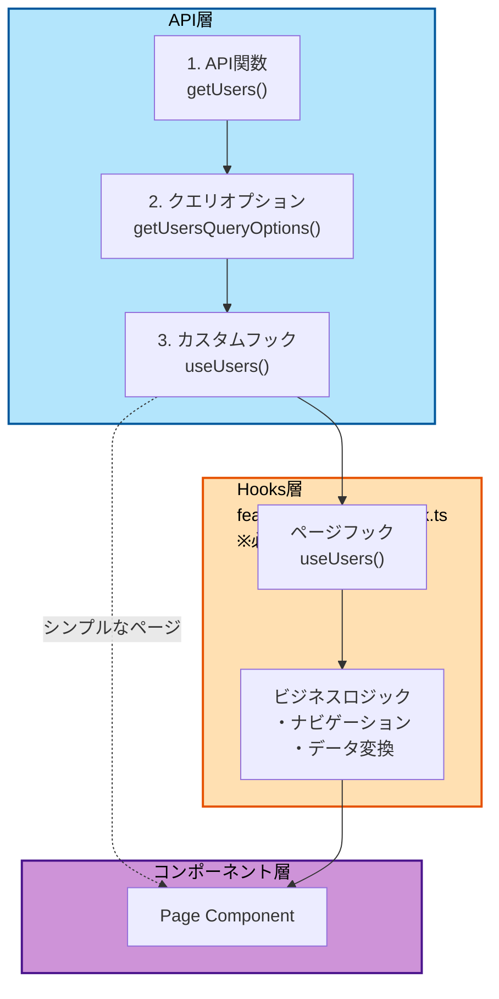
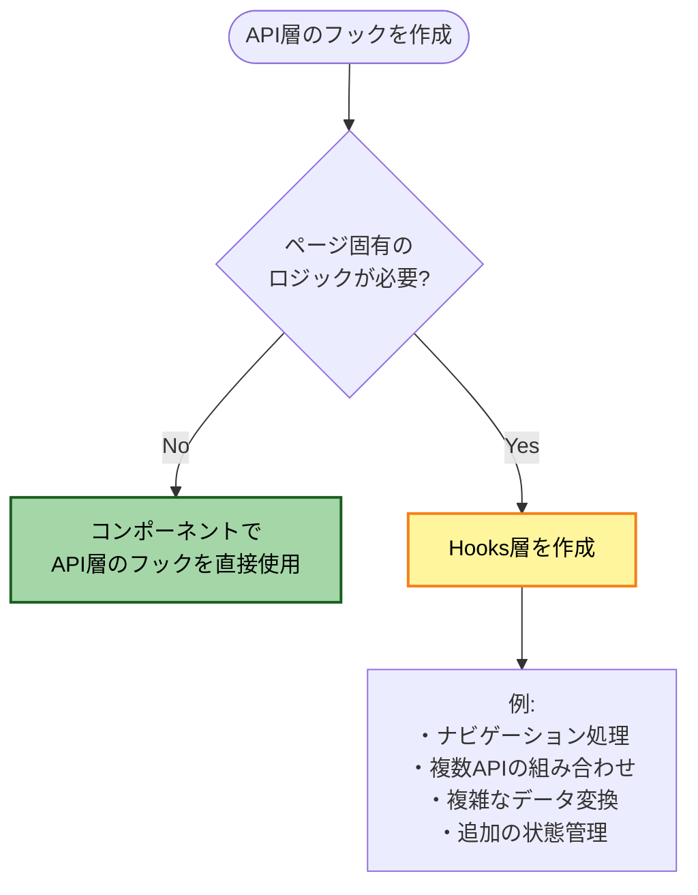
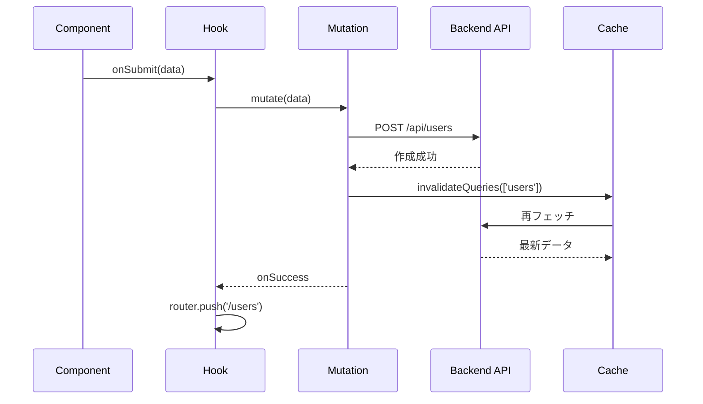

# データ取得の基礎

このセクションでは、TanStack Query（React Query）を使用したデータ取得の基本を学びます。

## 目次

- [このセクションで学ぶこと](#このセクションで学ぶこと)
- [データ取得の全体像](#データ取得の全体像)
- [Query: データの読み取り](#queryデータの読み取り)
- [Mutation: データの更新](#mutationデータの更新)
- [キャッシュ管理](#キャッシュ管理)
- [実装例](#実装例)
- [チェックポイント](#チェックポイント)
- [次のステップ](#次のステップ)

---

## このセクションで学ぶこと

このセクションを完了すると、以下のことができるようになります:

- useSuspenseQueryを使用したデータ取得
- useMutationを使用したデータの作成・更新・削除
- キャッシュの無効化と再取得
- API層とHooks層の役割分担
- エラーハンドリングとローディング管理

---

## データ取得の全体像

### アーキテクチャ

このプロジェクトでは、**bulletproof-react**の構造に従い、API層とHooks層を分離します。



### Hooks層はいつ必要か？



---

## Query: データの読み取り

### API層の実装

#### ステップ1: API関数の作成

**ファイル**: `src/features/sample-users/api/get-users.ts`

```typescript
import { queryOptions, useSuspenseQuery } from '@tanstack/react-query';
import { api } from '@/lib/api-client';
import { QueryConfig } from '@/lib/tanstack-query';
import type { User } from '../types';

/**
 * ユーザー一覧を取得するAPI関数
 *
 * @returns ユーザー一覧のPromise
 */
export const getUsers = (): Promise<{ data: User[] }> => {
  return api.get('/sample/users');
};
```

#### ステップ2: クエリオプションの定義

```typescript
/**
 * ユーザー一覧取得のクエリオプション
 *
 * @description
 * TanStack Queryのクエリ設定を定義します。
 * queryKey: キャッシュのキー
 * queryFn: データ取得関数
 */
export const getUsersQueryOptions = () => {
  return queryOptions({
    queryKey: ['users'], // キャッシュのキー
    queryFn: getUsers, // データ取得関数
  });
};
```

#### ステップ3: カスタムフックの作成

```typescript
/**
 * オプション型定義
 */
type UseUsersOptions = {
  queryConfig?: QueryConfig<typeof getUsersQueryOptions>;
};

/**
 * ユーザー一覧を取得するカスタムフック（API層）
 *
 * @description
 * useSuspenseQueryを使用してデータを取得します。
 * ローディングはSuspense、エラーはErrorBoundaryが管理します。
 *
 * @param options - クエリ設定のオプション
 * @returns クエリ結果
 */
export const useUsers = ({ queryConfig }: UseUsersOptions = {}) => {
  return useSuspenseQuery({
    ...getUsersQueryOptions(),
    ...queryConfig,
  });
};
```

### Hooks層の実装（必要に応じて）

**ファイル**: `src/features/sample-users/routes/sample-users/users.hook.ts`

```typescript
import { useRouter } from 'next/navigation';
import { useUsers as useUsersQuery } from '@/features/sample-users/api/get-users';

/**
 * ユーザー一覧ページのカスタムフック（Hooks層）
 *
 * @description
 * ページ固有のビジネスロジック（ナビゲーション、データ変換）を担当します。
 */
export const useUsers = () => {
  const router = useRouter();
  const { data } = useUsersQuery();

  // ================================================================================
  // Data Transformation
  // ================================================================================
  const users = data?.data ?? [];

  // ================================================================================
  // Handlers
  // ================================================================================
  /**
   * 編集ページへ遷移
   */
  const handleEdit = (userId: string) => {
    router.push(`/sample-users/${userId}/edit`);
  };

  /**
   * 新規作成ページへ遷移
   */
  const handleCreate = () => {
    router.push('/sample-users/new');
  };

  return {
    users,
    handleEdit,
    handleCreate,
    // isLoading, error は不要（SuspenseとErrorBoundaryが管理）
  };
};
```

### コンポーネントでの使用

**ファイル**: `src/features/sample-users/routes/sample-users/users.tsx`

```typescript
"use client";

import { Suspense } from "react";
import { ErrorBoundary } from "react-error-boundary";
import { LoadingSpinner } from "@/components/ui/loading-spinner";
import { MainErrorFallback } from "@/components/errors/main";
import { useUsers } from "./users.hook";

/**
 * ユーザー一覧ページのコンテンツ
 */
const UsersPageContent = () => {
  const { users, handleEdit, handleCreate } = useUsers();
  // isLoading, error は不要！

  return (
    <div>
      <div className="mb-4 flex justify-between">
        <h1 className="text-2xl font-bold">ユーザー一覧</h1>
        <button onClick={handleCreate}>新規作成</button>
      </div>

      <ul>
        {users.map((user) => (
          <li key={user.id}>
            {user.name}
            <button onClick={() => handleEdit(user.id)}>編集</button>
          </li>
        ))}
      </ul>
    </div>
  );
};

/**
 * ユーザー一覧ページ
 */
const UsersPage = () => {
  return (
    <ErrorBoundary FallbackComponent={MainErrorFallback}>
      <Suspense fallback={<LoadingSpinner fullScreen />}>
        <UsersPageContent />
      </Suspense>
    </ErrorBoundary>
  );
};

export default UsersPage;
```

### useSuspenseQueryの利点

| 従来のuseQuery                      | useSuspenseQuery        |
| ----------------------------------- | ----------------------- |
| `if (isLoading) return <Loading />` | Suspenseが自動管理      |
| `if (error) return <Error />`       | ErrorBoundaryが自動管理 |
| 条件分岐が必要                      | コードが簡潔            |

---

## Mutation: データの更新

Mutationは、データの作成・更新・削除に使用します。

### データフロー



### API層の実装

**ファイル**: `src/features/sample-users/api/create-user.ts`

```typescript
import { useMutation, useQueryClient } from '@tanstack/react-query';
import { api } from '@/lib/api-client';
import { MutationConfig } from '@/lib/tanstack-query';
import type { User } from '../types';

/**
 * ユーザー作成のリクエスト型
 */
export type CreateUserInput = {
  name: string;
  email: string;
  role: string;
};

/**
 * ユーザーを作成するAPI関数
 *
 * @param data - ユーザー作成データ
 * @returns 作成されたユーザー
 */
export const createUser = (data: CreateUserInput): Promise<{ data: User }> => {
  return api.post('/sample/users', data);
};

/**
 * オプション型定義
 */
type UseCreateUserOptions = {
  mutationConfig?: MutationConfig<typeof createUser>;
};

/**
 * ユーザー作成のカスタムフック（API層）
 *
 * @description
 * useMutationを使用してユーザーを作成します。
 * 成功時に自動的にキャッシュを無効化します。
 */
export const useCreateUser = ({ mutationConfig }: UseCreateUserOptions = {}) => {
  const queryClient = useQueryClient();

  return useMutation({
    // 実行する関数
    mutationFn: createUser,

    // 成功時の処理
    onSuccess: () => {
      // ユーザー一覧のキャッシュを無効化
      // → 自動的に再取得される
      queryClient.invalidateQueries({ queryKey: ['users'] });
    },

    // カスタム設定をマージ
    ...mutationConfig,
  });
};
```

### Hooks層の実装

**ファイル**: `src/features/sample-users/routes/sample-new-user/new-user.hook.ts`

```typescript
import { useRouter } from 'next/navigation';
import { useForm } from 'react-hook-form';
import { zodResolver } from '@hookform/resolvers/zod';
import { useCreateUser } from '@/features/sample-users/api/create-user';
import { userFormSchema, type UserFormValues } from '../../types/forms.schema';

/**
 * 新規ユーザー作成ページのカスタムフック
 *
 * @description
 * フォーム管理、API呼び出し、ページ遷移を担当します。
 */
export const useNewUser = () => {
  const router = useRouter();
  const createUserMutation = useCreateUser();

  // ================================================================================
  // Form
  // ================================================================================
  const {
    control,
    handleSubmit,
    formState: { errors },
    setError,
  } = useForm<UserFormValues>({
    resolver: zodResolver(userFormSchema),
    defaultValues: {
      name: '',
      email: '',
      role: 'user',
    },
  });

  // ================================================================================
  // Handlers
  // ================================================================================
  /**
   * フォーム送信ハンドラー
   */
  const onSubmit = handleSubmit(async (data) => {
    await createUserMutation
      .mutateAsync(data)
      .then(() => router.push('/sample-users'))
      .catch((error) => {
        // エラー時: フォームにエラーを設定
        setError('root', {
          message: 'ユーザーの作成に失敗しました',
        });
      });
  });

  /**
   * キャンセルボタンのハンドラー
   */
  const handleCancel = () => {
    router.push('/sample-users');
  };

  return {
    control,
    onSubmit,
    handleCancel,
    errors,
    isSubmitting: createUserMutation.isPending,
  };
};
```

### 更新・削除の実装

**更新の例**: `src/features/sample-users/api/update-user.ts`

```typescript
export const updateUser = ({ userId, data }: { userId: string; data: UpdateUserInput }): Promise<{ data: User }> => {
  return api.patch(`/sample/users/${userId}`, data);
};

export const useUpdateUser = ({ mutationConfig }: UseUpdateUserOptions = {}) => {
  const queryClient = useQueryClient();

  return useMutation({
    mutationFn: updateUser,
    onSuccess: (data) => {
      // 特定のユーザーのキャッシュを更新
      queryClient.setQueryData(['users', data.data.id], data);
      // 一覧のキャッシュを無効化
      queryClient.invalidateQueries({ queryKey: ['users'] });
    },
    ...mutationConfig,
  });
};
```

**削除の例**: `src/features/sample-users/api/delete-user.ts`

```typescript
export const deleteUser = (userId: string): Promise<void> => {
  return api.delete(`/sample/users/${userId}`);
};

export const useDeleteUser = ({ mutationConfig }: UseDeleteUserOptions = {}) => {
  const queryClient = useQueryClient();

  return useMutation({
    mutationFn: deleteUser,
    onSuccess: (_, userId) => {
      // 特定のユーザーのキャッシュを削除
      queryClient.removeQueries({ queryKey: ['users', userId] });
      // 一覧のキャッシュを無効化
      queryClient.invalidateQueries({ queryKey: ['users'] });
    },
    ...mutationConfig,
  });
};
```

---

## キャッシュ管理

### キャッシュの仕組み

TanStack Queryは、`queryKey`を使用してデータをキャッシュします。

```typescript
// 一覧取得
queryKey: ['users']; // すべてのユーザー

// 個別取得
queryKey: ['users', userId]; // 特定のユーザー

// 条件付き取得
queryKey: ['users', 'active']; // アクティブユーザー
```

### キャッシュ操作のパターン

#### パターン1: invalidateQueries（無効化）

キャッシュを無効化し、再取得をトリガーします。

```typescript
// 特定のクエリを無効化
queryClient.invalidateQueries({ queryKey: ['users', userId] });

// 前方一致で無効化（["users", *]）
queryClient.invalidateQueries({ queryKey: ['users'] });
```

#### パターン2: setQueryData（直接更新）

キャッシュを直接更新します（再取得なし）。

```typescript
// 特定のユーザーを更新
queryClient.setQueryData(['users', userId], updatedUser);
```

#### パターン3: removeQueries（削除）

キャッシュから削除します。

```typescript
// 特定のユーザーを削除
queryClient.removeQueries({ queryKey: ['users', userId] });
```

### CRUD操作とキャッシュ戦略

| 操作       | キャッシュ戦略                                                |
| ---------- | ------------------------------------------------------------- |
| **Create** | `invalidateQueries(['users'])` → 一覧を再取得                 |
| **Update** | `setQueryData` + `invalidateQueries` → 個別更新 + 一覧再取得  |
| **Delete** | `removeQueries` + `invalidateQueries` → 個別削除 + 一覧再取得 |

---

## 実装例

### 例1: ユーザー一覧の取得

```typescript
// API層
export const useUsers = () => {
  return useSuspenseQuery({
    ...getUsersQueryOptions(),
  });
};

// コンポーネント層
<Suspense fallback={<Loading />}>
  <UsersList />
</Suspense>
```

### 例2: ユーザーの作成

```typescript
// API層
export const useCreateUser = () => {
  const queryClient = useQueryClient();

  return useMutation({
    mutationFn: createUser,
    onSuccess: () => {
      queryClient.invalidateQueries({ queryKey: ['users'] });
    },
  });
};

// Hooks層
const onSubmit = handleSubmit(async (data) => {
  await createUserMutation.mutateAsync(data);
  router.push('/users');
});
```

### 例3: ユーザーの削除

```typescript
// API層
export const useDeleteUser = () => {
  const queryClient = useQueryClient();

  return useMutation({
    mutationFn: deleteUser,
    onSuccess: (_, userId) => {
      queryClient.removeQueries({ queryKey: ['users', userId] });
      queryClient.invalidateQueries({ queryKey: ['users'] });
    },
  });
};

// Hooks層
const handleDelete = async (userId: string) => {
  await deleteUserMutation.mutateAsync(userId);
};
```

---

## チェックポイント

このセクションを完了したら、以下を確認してください:

- [ ] useSuspenseQueryでデータを取得できる
- [ ] useMutationでデータを作成・更新・削除できる
- [ ] API層とHooks層の役割分担を理解している
- [ ] キャッシュの無効化ができる
- [ ] SuspenseとErrorBoundaryの使い方を理解している

### 実践課題

以下の機能を実装してみましょう:

#### タスク管理機能

- タスク一覧の取得（useSuspenseQuery）
- タスクの作成（useMutation）
- タスクの更新（useMutation）
- タスクの削除（useMutation）

<details>
<summary>ヒント</summary>

```typescript
// API層
export const useTasks = () => {
  return useSuspenseQuery({
    queryKey: ['tasks'],
    queryFn: getTasks,
  });
};

export const useCreateTask = () => {
  const queryClient = useQueryClient();
  return useMutation({
    mutationFn: createTask,
    onSuccess: () => {
      queryClient.invalidateQueries({ queryKey: ['tasks'] });
    },
  });
};

// 他のMutationも同様に実装
```

</details>

---

## 次のステップ

データ取得の基本を理解したら、次はフォームとデータの統合について学びましょう:

- [フォームとデータの統合](./05-integration.md) - フォーム送信からキャッシュ更新までの流れ

### 関連ドキュメント

- [データ取得フック（詳細版）](../03-data-hooks.md)
- [TanStack Query設定](../../03-core-concepts/07-tanstack-query.md)
- [API統合](../../05-api-integration/index.md)
- [TanStack Query公式ドキュメント](https://tanstack.com/query/latest)
