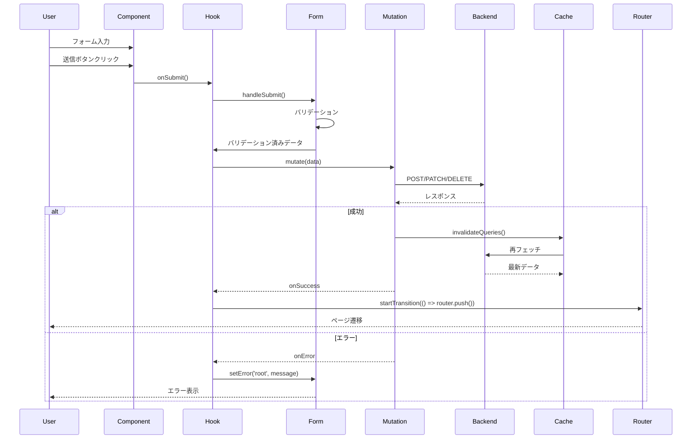
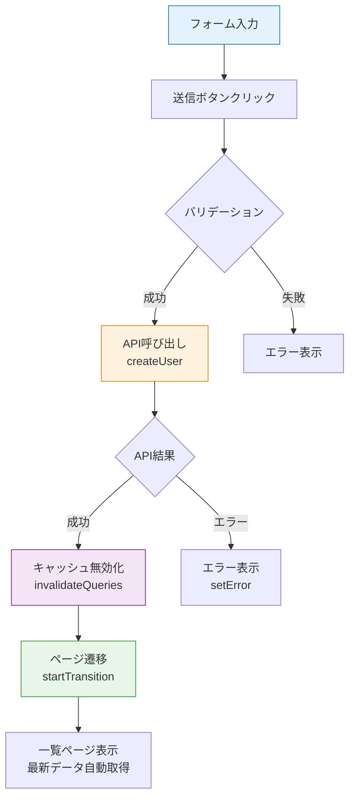
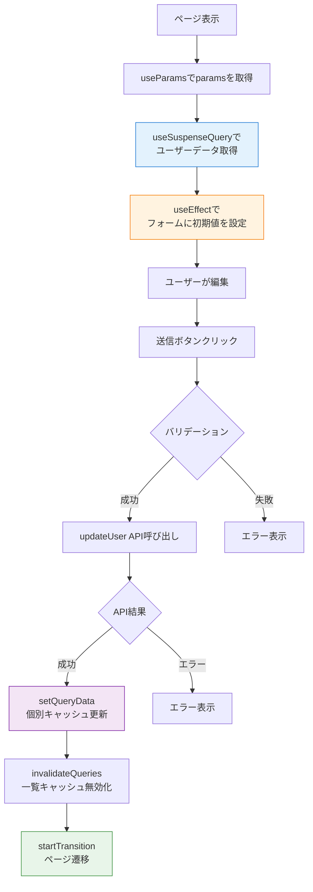

# フォームとデータの統合

このセクションでは、フォーム管理とデータ取得を統合した実践的なパターンを学びます。

> ℹ️ **注意**: 最新の推奨パターンについては [06-react19.md](./06-react19.md#実務での推奨事項) を参照してください。

## 目次

- [このセクションで学ぶこと](#このセクションで学ぶこと)
- [統合の全体像](#統合の全体像)
- [新規作成フローの実装](#新規作成フローの実装)
- [編集フローの実装](#編集フローの実装)
- [削除フローの実装](#削除フローの実装)
- [ベストプラクティス](#ベストプラクティス)
- [チェックポイント](#チェックポイント)
- [次のステップ](#次のステップ)

---

## このセクションで学ぶこと

このセクションを完了すると、以下のことができるようになります:

- フォーム送信とAPI呼び出しの統合
- 成功時のページ遷移処理
- キャッシュの無効化と再取得
- useTransitionを使用したノンブロッキングなナビゲーション
- エラーハンドリングとユーザーフィードバック

---

## 統合の全体像

### データフロー



### 3つの主要フロー

| フロー       | 処理               | キャッシュ戦略                    |
| ------------ | ------------------ | --------------------------------- |
| **新規作成** | POST → 遷移        | invalidateQueries(['users'])      |
| **編集**     | GET → PATCH → 遷移 | setQueryData + invalidateQueries  |
| **削除**     | DELETE → 遷移      | removeQueries + invalidateQueries |

---

## 新規作成フローの実装

### ステップ1: API層の実装

**ファイル**: `src/features/sample-users/api/create-user.ts`

```typescript
import { useMutation, useQueryClient } from '@tanstack/react-query';
import { api } from '@/lib/api-client';
import type { User } from '../types';

export type CreateUserInput = {
  name: string;
  email: string;
  role: string;
};

/**
 * ユーザー作成API関数
 */
export const createUser = (data: CreateUserInput): Promise<{ data: User }> => {
  return api.post('/sample/users', data);
};

/**
 * ユーザー作成フック（API層）
 *
 * @description
 * 成功時に自動的にキャッシュを無効化します。
 */
export const useCreateUser = () => {
  const queryClient = useQueryClient();

  return useMutation({
    mutationFn: createUser,
    onSuccess: () => {
      // ユーザー一覧のキャッシュを無効化
      queryClient.invalidateQueries({ queryKey: ['users'] });
    },
  });
};
```

### ステップ2: Hooks層の実装

**ファイル**: `src/features/sample-users/routes/sample-new-user/new-user.hook.ts`

```typescript
import { useRouter } from 'next/navigation';
import { useTransition } from 'react';
import { useForm } from 'react-hook-form';
import { zodResolver } from '@hookform/resolvers/zod';
import { useCreateUser } from '@/features/sample-users/api/create-user';
import { userFormSchema, type UserFormValues } from '../../types/forms.schema';

/**
 * 新規ユーザー作成ページのカスタムフック
 *
 * @description
 * フォーム管理、API呼び出し、ページ遷移を統合します。
 */
export const useNewUser = () => {
  const router = useRouter();
  const createUserMutation = useCreateUser();
  // ================================================================================
  // Form
  // ================================================================================
  const {
    control,
    handleSubmit,
    formState: { errors },
    setError,
  } = useForm<UserFormValues>({
    resolver: zodResolver(userFormSchema),
    defaultValues: {
      name: '',
      email: '',
      role: 'user',
    },
  });

  // ================================================================================
  // Handlers
  // ================================================================================
  /**
   * フォーム送信ハンドラー
   *
   * @description
   * 1. バリデーション（自動実行）
   * 2. API呼び出し
   * 3. 成功時: ページ遷移
   * 4. エラー時: エラー表示
   */
  const onSubmit = handleSubmit(async (data) => {
    await createUserMutation
      .mutateAsync(data)
      .then(() => {
        // ステップ1: ユーザー作成

        // ステップ2: キャッシュ無効化（自動実行）

        // ステップ3: ノンブロッキングなページ遷移
        {
        router.push('/sample-users');
        }
      })
      .catch((error) => {
        // エラー時: フォームにエラーを設定
        setError('root', {
          message: 'ユーザーの作成に失敗しました。もう一度お試しください。',
        }
      });
  });

  /**
   * キャンセルボタンのハンドラー
   */
  const handleCancel = () => {
    
    router.push('/sample-users');
  }
  };

  return {
    control,
    onSubmit,
    handleCancel,
    errors,
    // MutationとTransitionのpendingを統合
    isSubmitting: createUserMutation.isPending || isPending,
  };
};
```

### ステップ3: コンポーネントの実装

**ファイル**: `src/features/sample-users/routes/sample-new-user/new-user.tsx`

```typescript
"use client";

import { PageLayout } from "@/components/layout/page-layout";
import { PageHeader } from "@/components/layout/page-header";
import { UserForm } from "@/features/sample-users/components/user-form";
import { useNewUser } from "./new-user.hook";

/**
 * 新規ユーザー作成ページ
 */
const NewUserPage = () => {
  const { control, onSubmit, handleCancel, errors, isSubmitting } = useNewUser();

  return (
    <PageLayout maxWidth="2xl">
      <PageHeader title="新規ユーザー作成" />

      <UserForm
        control={control}
        onSubmit={onSubmit}
        onCancel={handleCancel}
        errors={errors}
        isSubmitting={isSubmitting}
        isEditMode={false}
      />
    </PageLayout>
  );
};

export default NewUserPage;
```

### フローの詳細



---

## 編集フローの実装

編集フローは、既存データの取得→フォームへの設定→更新→遷移の流れになります。

### ステップ1: API層の実装

**ファイル**: `src/features/sample-users/api/get-user.ts`

```typescript
import { queryOptions, useSuspenseQuery } from '@tanstack/react-query';
import { api } from '@/lib/api-client';
import type { User } from '../types';

/**
 * 特定ユーザーを取得
 */
export const getUser = (userId: string): Promise<{ data: User }> => {
  return api.get(`/sample/users/${userId}`);
};

/**
 * クエリオプション
 */
export const getUserQueryOptions = (userId: string) => {
  return queryOptions({
    queryKey: ['users', userId],
    queryFn: () => getUser(userId),
  });
};

/**
 * ユーザー取得フック
 */
export const useUser = ({ userId }: { userId: string }) => {
  return useSuspenseQuery({
    ...getUserQueryOptions(userId),
  });
};
```

**ファイル**: `src/features/sample-users/api/update-user.ts`

```typescript
import { useMutation, useQueryClient } from '@tanstack/react-query';
import { api } from '@/lib/api-client';
import type { User } from '../types';

export type UpdateUserInput = {
  name: string;
  email: string;
  role: string;
};

/**
 * ユーザー更新API関数
 */
export const updateUser = ({ userId, data }: { userId: string; data: UpdateUserInput }): Promise<{ data: User }> => {
  return api.patch(`/sample/users/${userId}`, data);
};

/**
 * ユーザー更新フック
 */
export const useUpdateUser = () => {
  const queryClient = useQueryClient();

  return useMutation({
    mutationFn: updateUser,
    onSuccess: (responseData, variables) => {
      // 個別ユーザーのキャッシュを更新
      queryClient.setQueryData(['users', variables.userId], responseData);
      // 一覧のキャッシュを無効化
      queryClient.invalidateQueries({ queryKey: ['users'] });
    },
  });
};
```

### ステップ2: Hooks層の実装

**ファイル**: `src/features/sample-users/routes/sample-edit-user/edit-user.hook.ts`

```typescript
import { useEffect } from 'react';
import { useRouter } from 'next/navigation';
import { useForm } from 'react-hook-form';
import { zodResolver } from '@hookform/resolvers/zod';
import { useUser } from '@/features/sample-users/api/get-user';
import { useUpdateUser } from '@/features/sample-users/api/update-user';
import { userFormSchema, type UserFormValues } from '../../types/forms.schema';

/**
 * ユーザー編集ページのカスタムフック
 *
 * @description
 * Client Component でuseParams()から受け取ったuserIdを使用し、
 * データ取得→フォーム初期化→更新→遷移を統合します。
 */
export const useEditUser = (userId: string) => {
  const router = useRouter();
  const { data } = useUser({ userId });
  const updateUserMutation = useUpdateUser();
  // ================================================================================
  // Form
  // ================================================================================
  const {
    control,
    handleSubmit,
    reset,
    formState: { errors },
    setError,
  } = useForm<UserFormValues>({
    resolver: zodResolver(userFormSchema),
    defaultValues: {
      name: '',
      email: '',
      role: 'user',
    },
  });

  // 取得したユーザーデータをフォームに設定
  useEffect(() => {
    if (data?.data) {
      reset({
        name: data.data.name,
        email: data.data.email,
        role: data.data.role as 'user' | 'admin',
      });
    }
  }, [data, reset]);

  // ================================================================================
  // Handlers
  // ================================================================================
  /**
   * フォーム送信ハンドラー
   */
  const onSubmit = handleSubmit(async (formData) => {
    await updateUserMutation
      .mutateAsync({
        userId,
        data: formData,
      })
      .then(() => {
        // 成功時: ノンブロッキングなページ遷移
        {
        router.push('/sample-users');
        }
      })
      .catch((error) => {
        setError('root', {
          message: 'ユーザーの更新に失敗しました',
        }
      });
  });

  /**
   * キャンセルボタンのハンドラー
   */
  const handleCancel = () => {
    router.push('/sample-users');
  }

  return {
    control,
    onSubmit,
    handleCancel,
    errors,
    isSubmitting: updateUserMutation.isPending,
  };
};
```

### 編集フローの詳細



---

## 削除フローの実装

### API層の実装

**ファイル**: `src/features/sample-users/api/delete-user.ts`

```typescript
import { useMutation, useQueryClient } from '@tanstack/react-query';
import { api } from '@/lib/api-client';

/**
 * ユーザー削除API関数
 */
export const deleteUser = (userId: string): Promise<void> => {
  return api.delete(`/sample/users/${userId}`);
};

/**
 * ユーザー削除フック
 */
export const useDeleteUser = () => {
  const queryClient = useQueryClient();

  return useMutation({
    mutationFn: deleteUser,
    onSuccess: (_, userId) => {
      // 個別ユーザーのキャッシュを削除
      queryClient.removeQueries({ queryKey: ['users', userId] });
      // 一覧のキャッシュを無効化
      queryClient.invalidateQueries({ queryKey: ['users'] });
    },
  });
};
```

### Hooks層の実装（一覧ページ内）

**ファイル**: `src/features/sample-users/routes/sample-users/users.hook.ts`

```typescript
import { useRouter } from 'next/navigation';
import { useUsers as useUsersQuery } from '@/features/sample-users/api/get-users';
import { useDeleteUser as useDeleteUserMutation } from '@/features/sample-users/api/delete-user';

/**
 * ユーザー一覧ページのカスタムフック
 */
export const useUsers = () => {
  const router = useRouter();
  const { data } = useUsersQuery();
  const deleteUserMutation = useDeleteUserMutation();

  const users = data?.data ?? [];

  // ================================================================================
  // Handlers
  // ================================================================================
  /**
   * 編集ページへ遷移
   */
  const handleEdit = (userId: string) => {
    router.push(`/sample-users/${userId}/edit`);
  };

  /**
   * 新規作成ページへ遷移
   */
  const handleCreate = () => {
    router.push('/sample-users/new');
  };

  /**
   * ユーザー削除
   */
  const handleDelete = async (userId: string) => {
    const user = users.find((u) => u.id === userId);
    if (!user) return;

    // 確認ダイアログ
    const confirmed = window.confirm(`${user.name} を削除してもよろしいですか？`);
    if (!confirmed) return;

    await deleteUserMutation
      .mutateAsync(userId)
      .then(() => {
        // 削除実行
        // キャッシュは自動的に更新される
      })
      .catch((error) => {
        alert('ユーザーの削除に失敗しました');
      });
  };

  return {
    users,
    handleEdit,
    handleCreate,
    handleDelete,
    isDeleting: deleteUserMutation.isPending,
  };
};
```

---

## ベストプラクティス

### 1. pending状態の統合

```typescript
// ✅ 良い例: MutationとTransitionのpendingを統合
const isSubmitting = createUserMutation.isPending || isPending;

return {
  onSubmit,
  isSubmitting, // 1つの状態として返す
};

// ❌ 悪い例: 別々に返す
return {
  onSubmit,
  isMutating: createUserMutation.isPending,
  isNavigating: isPending,
};
```

### 2. エラーハンドリング

```typescript
// ✅ 良い例: .then/.catchで適切にエラーハンドリング
const onSubmit = handleSubmit(async (data) => {
  await mutation
    .mutateAsync(data)
    .then(() => {
      startTransition(() => {
        router.push('/users');
      });
    })
    .catch((error) => {
      setError('root', {
        message: '操作に失敗しました。もう一度お試しください。',
      });
    });
});

// ❌ 悪い例: エラーハンドリングなし
const onSubmit = handleSubmit(async (data) => {
  await mutation.mutateAsync(data);
  router.push('/users'); // エラー時も遷移してしまう
});
```

### 3. キャッシュ戦略の使い分け

```typescript
// 作成: 一覧のみ無効化
onSuccess: () => {
  queryClient.invalidateQueries({ queryKey: ['users'] });
};

// 更新: 個別更新 + 一覧無効化
onSuccess: (data, variables) => {
  queryClient.setQueryData(['users', variables.userId], data);
  queryClient.invalidateQueries({ queryKey: ['users'] });
};

// 削除: 個別削除 + 一覧無効化
onSuccess: (_, userId) => {
  queryClient.removeQueries({ queryKey: ['users', userId] });
  queryClient.invalidateQueries({ queryKey: ['users'] });
};
```

### 4. useTransitionの一貫した使用

```typescript
// ✅ 良い例: すべてのナビゲーションで使用
const handleCancel = () => {
  startTransition(() => {
    router.push('/users');
  });
};

const onSubmit = async (data) => {
  await mutation.mutateAsync(data);
  startTransition(() => {
    router.push('/users');
  });
};

// ❌ 悪い例: 一部だけ使用
const handleCancel = () => {
  router.push('/users'); // ブロッキング
};
```

### 5. ローディング状態の表示

```typescript
// ✅ 良い例: 適切なフィードバック
<Button type="submit" disabled={isSubmitting}>
  {isSubmitting ? "作成中..." : "作成"}
</Button>

// ❌ 悪い例: フィードバックなし
<Button type="submit" disabled={isSubmitting}>
  作成
</Button>
```

---

## チェックポイント

このセクションを完了したら、以下を確認してください:

- [ ] フォーム送信とAPI呼び出しを統合できる
- [ ] 成功時のページ遷移が実装できる
- [ ] キャッシュの無効化が正しく動作する
- [ ] エラーハンドリングが適切に実装されている
- [ ] useTransitionでノンブロッキングなナビゲーションができる

### 実践課題

以下の完全なCRUD機能を実装してみましょう:

#### 記事管理機能

- 記事一覧の表示
- 記事の新規作成（フォーム→API→遷移）
- 記事の編集（データ取得→フォーム→更新→遷移）
- 記事の削除（確認→削除→キャッシュ更新）

<details>
<summary>実装のチェックリスト</summary>

##### API層

- [ ] `api/get-articles.ts` - 一覧取得
- [ ] `api/get-article.ts` - 個別取得
- [ ] `api/create-article.ts` - 作成
- [ ] `api/update-article.ts` - 更新
- [ ] `api/delete-article.ts` - 削除

##### Hooks層

- [ ] `routes/articles/articles.hook.ts` - 一覧ページのロジック
- [ ] `routes/new-article/new-article.hook.ts` - 新規作成のロジック
- [ ] `routes/edit-article/edit-article.hook.ts` - 編集のロジック

##### キャッシュ戦略

- [ ] 作成: `invalidateQueries(['articles'])`
- [ ] 更新: `setQueryData` + `invalidateQueries`
- [ ] 削除: `removeQueries` + `invalidateQueries`

</details>

---

## 次のステップ

フォームとデータの統合を理解したら、次はReact 19の新機能について学びましょう:

- [React 19の新機能](./06-react19.md) - useOptimistic、useTransition、useフックの詳細

### 関連ドキュメント

- [フォーム用フック](../02-form-hooks.md)
- [データ取得フック](../03-data-hooks.md)
- [useTransition](../05-use-transition.md)
- [API統合](../../05-api-integration/index.md)
