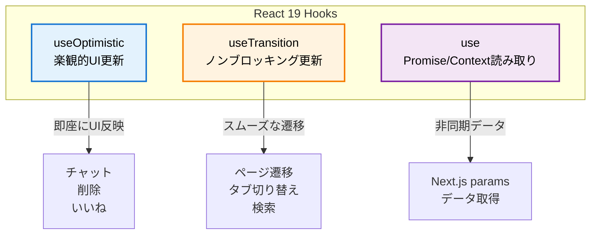
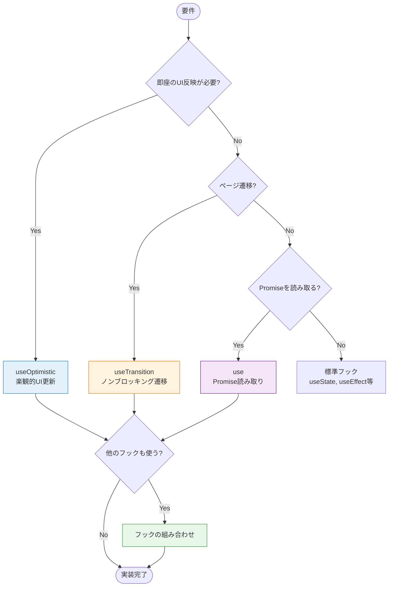

# React 19の新機能

このセクションでは、React 19で導入された3つの重要なフック（useOptimistic、useTransition、use）について学びます。

## 目次

- [このセクションで学ぶこと](#このセクションで学ぶこと)
- [React 19の新機能概要](#react-19の新機能概要)
- [useOptimistic - 楽観的UI更新](#useoptimistic-楽観的ui更新)
- [useTransition - ノンブロッキング更新](#usetransition-ノンブロッキング更新)
- [use - Promise/Contextの読み取り](#use-promisecontextの読み取り)
- [フックの組み合わせパターン](#フックの組み合わせパターン)
- [チェックポイント](#チェックポイント)
- [次のステップ](#次のステップ)

---

## このセクションで学ぶこと

このセクションを完了すると、以下のことができるようになります:

- useOptimisticで楽観的UI更新を実装できる
- useTransitionでノンブロッキングな状態更新ができる
- useフックでPromise/Contextを読み取れる
- 各フックを適切に使い分けられる
- フックを組み合わせて最適なUXを実現できる

---

## React 19の新機能概要

### 3つの主要フック



### フックの使い分け

| フック            | 用途                      | タイミング | ロールバック  | 推奨度    |
| ----------------- | ------------------------- | ---------- | ------------- | --------- |
| **useOptimistic** | 楽観的UI更新              | 即座       | 自動          | ⭐⭐⭐    |
| **useTransition** | 非緊急な状態更新          | 遅延可能   | なし          | ❌ 非推奨 |
| **use**           | Promise/Contextの読み取り | 同期的     | ErrorBoundary | ❌ 非推奨 |

### 🎯 実務での推奨事項

このプロジェクトでは、以下の方針でReact 19機能を使用しています：

#### ✅ 使用を推奨

- **useOptimistic**: ファイルアップロードなど、進捗表示が必要な処理
  - 例: `src/features/sample-file/routes/sample-file/sample-file.hook.ts`
  - 理由: ユーザーに即座のフィードバックを提供できる

#### ❌ 使用を非推奨

- **useTransition**: Next.js App Routerでは効果なし
  - 理由: `router.push()`は既に最適化されており、視覚的な違いがない
  - 代替: 直接`router.push()`を呼ぶ

- **use()フック**: awaitで十分
  - 理由: Next.js 15の`params`は`await`で簡単に解決できる
  - 代替: Server ComponentまたはClient Component内で`await params`
  - 注意: Suspense境界とError Boundaryが必須になり、複雑さが増す

#### 🔄 移行パターン

```typescript
// ❌ 非推奨: use()とuseTransition
export const useEditUser = (params: Promise<{ id: string }>) => {
  const { id: userId } = use(params);
  const [isPending, startTransition] = useTransition();

  const onSubmit = async (data) => {
    await mutation.mutateAsync(data);
    startTransition(() => router.push('/users'));
  };
};

// ✅ 推奨: useParams()と直接ナビゲーション（このプロジェクトの方針）
'use client';

import { useParams } from 'next/navigation';

// Client Component
const EditUserPageContent = () => {
  const params = useParams();
  const userId = params.id as string;

  const { control, onSubmit, ... } = useEditUser(userId);

  return <UserForm ... />;
};

// Hook
export const useEditUser = (userId: string) => {
  const { data } = useUser({ userId });

  const onSubmit = async (data) => {
    await mutation.mutateAsync(data);
    router.push('/users'); // ← 直接呼ぶだけ
  };

  return { control, onSubmit, ... };
};
```

---

## useOptimistic - 楽観的UI更新

### 概要

楽観的UI更新は、サーバーのレスポンスを待たずに、操作が成功すると仮定してUIを先に更新する手法です。

**メリット:**

- 即座のフィードバック
- レスポンスの良いUI
- ネイティブアプリのような体験

**デメリット:**

- エラー時のロールバックが必要
- 実装が複雑になる可能性

### 基本的な使い方

```typescript
import { useOptimistic } from 'react';

const [optimisticState, addOptimistic] = useOptimistic(
  state, // ベースとなる状態
  (currentState, optimisticValue) => {
    // 楽観的更新のロジック
    return newState;
  }
);
```

### 実装例1: チャット機能

**ファイル**: `src/features/sample-chat/routes/sample-chat/sample-chat.hook.ts`

```typescript
import { useOptimistic, useState } from 'react';
import { useSendMessage } from '../../api/send-message';

type Message = {
  id: string;
  role: 'user' | 'assistant';
  content: string;
  timestamp: Date;
};

/**
 * チャットページのカスタムフック
 */
export const useSampleChat = () => {
  const [messages, setMessages] = useState<Message[]>([]);
  const [inputMessage, setInputMessage] = useState('');
  const sendMessageMutation = useSendMessage();

  // ================================================================================
  // Optimistic Update
  // ================================================================================
  /**
   * 楽観的UI更新
   *
   * @description
   * メッセージ送信時に即座にUIに反映し、
   * エラー時は自動的にロールバックします。
   */
  const [optimisticMessages, addOptimisticMessage] = useOptimistic(messages, (state, newMessage: Message) => [...state, newMessage]);

  // ================================================================================
  // Handlers
  // ================================================================================
  /**
   * メッセージ送信ハンドラー
   */
  const handleSendMessage = async () => {
    if (!inputMessage.trim()) return;

    const userMessage: Message = {
      id: `user-${Date.now()}`,
      role: 'user',
      content: inputMessage.trim(),
      timestamp: new Date(),
    };

    // 入力欄をクリア
    setInputMessage('');

    // 🚀 即座にUIに反映（楽観的更新）
    addOptimisticMessage(userMessage);

    try {
      // FastAPIにメッセージ送信
      const response = await sendMessageMutation.mutateAsync({
        message: userMessage.content,
      });

      // ✅ 成功時: ベース状態を更新
      setMessages((prev) => [
        ...prev,
        userMessage,
        response.message, // アシスタントの返信
      ]);
    } catch (error) {
      // ❌ エラー時: 自動的にロールバック + エラーメッセージ
      console.error('メッセージ送信エラー:', error);
      setMessages((prev) => [
        ...prev,
        {
          id: `error-${Date.now()}`,
          role: 'assistant',
          content: 'エラーが発生しました。もう一度お試しください。',
          timestamp: new Date(),
        },
      ]);
    }
  };

  return {
    messages: optimisticMessages, // 楽観的更新された状態を返す
    inputMessage,
    setInputMessage,
    handleSendMessage,
    isSending: sendMessageMutation.isPending,
  };
};
```

### 実装例2: リスト項目の削除

```typescript
import { useOptimistic } from 'react';
import { useUsers as useUsersQuery } from '../../api/get-users';
import { useDeleteUser } from '../../api/delete-user';

/**
 * ユーザー一覧ページのカスタムフック
 */
export const useUsers = () => {
  const { data } = useUsersQuery();
  const deleteUserMutation = useDeleteUser();

  const users = data?.data ?? [];

  // ================================================================================
  // Optimistic Update
  // ================================================================================
  /**
   * 楽観的UI更新（削除）
   */
  const [optimisticUsers, removeOptimisticUser] = useOptimistic(users, (state, deletedUserId: string) =>
    state.filter((user) => user.id !== deletedUserId)
  );

  // ================================================================================
  // Handlers
  // ================================================================================
  /**
   * ユーザー削除ハンドラー
   */
  const handleDelete = async (userId: string) => {
    const user = users.find((u) => u.id === userId);
    if (!user) return;

    const confirmed = window.confirm(`${user.name} を削除してもよろしいですか？`);
    if (!confirmed) return;

    // 🚀 即座にUIから削除
    removeOptimisticUser(userId);

    try {
      // FastAPIに削除リクエスト
      await deleteUserMutation.mutateAsync(userId);
      // ✅ 削除成功（キャッシュは自動更新）
    } catch (error) {
      // ❌ エラー時: 自動的にロールバック
      console.error('削除エラー:', error);
      alert('ユーザーの削除に失敗しました。');
    }
  };

  return {
    users: optimisticUsers,
    handleDelete,
    isDeleting: deleteUserMutation.isPending,
  };
};
```

### ベストプラクティス

```typescript
// ✅ 良い例: 成功時のみベース状態を更新
const handleAction = async () => {
  addOptimistic(newItem);

  try {
    await mutation.mutateAsync(data);
    setItems((prev) => [...prev, newItem]); // ここで更新
  } catch (error) {
    // エラー時は更新しない（自動ロールバック）
  }
};

// ❌ 悪い例: 楽観的更新と同時にベース状態を更新
const handleAction = async () => {
  addOptimistic(newItem);
  setItems((prev) => [...prev, newItem]); // ロールバックが効かない

  await mutation.mutateAsync(data);
};
```

---

## useTransition - ノンブロッキング更新

> ⚠️ **注意**: このプロジェクトでは**useTransitionの使用を推奨しません**。Next.js App Routerの`router.push()`は既に最適化されており、useTransitionを使っても視覚的な違いがありません。

### 概要

`useTransition`は、状態更新を**緊急でない（non-urgent）**ものとしてマークし、より優先度の高い更新がUIをブロックしないようにします。

**理論上のユースケース:**

- ページ遷移（❌ Next.jsでは効果なし）
- タブ切り替え
- 検索・フィルタリング
- 大量データの処理

**このプロジェクトでの方針:**

- ❌ ページ遷移では使用しない → 直接`router.push()`を呼ぶ
- ✅ 検索・フィルタリングでは使用可能（ただし慎重に判断）

### 基本的な使い方

```typescript
import { useTransition } from 'react';

const [isPending, startTransition] = useTransition();

// 非緊急な状態更新をラップ
startTransition(() => {
  // State更新
});
```

### 実装例1: フォーム送信後のページ遷移（非推奨）

#### ❌ 非推奨: useTransitionを使用

**理由**: Next.js App Routerでは効果なし

```typescript
// ❌ 非推奨パターン
import { useRouter } from "next/navigation";
import { useTransition } from "react";
import { useForm } from "react-hook-form";

export const useNewUser = () => {
  const router = useRouter();
  const createUserMutation = useCreateUser();
  const [isPending, startTransition] = useTransition(); // ← 不要！

  const { control, handleSubmit, setError } = useForm({...});

  const onSubmit = handleSubmit(async (data) => {
    await createUserMutation.mutateAsync(data)
      .then(() => {
        startTransition(() => { // ← 冗長なラップ
          router.push("/sample-users");
        });
      })
      .catch(() => setError("root", { message: "作成に失敗しました" }));
  });

  return {
    control,
    onSubmit,
    isSubmitting: createUserMutation.isPending || isPending, // ← 複雑
  };
};
```

#### ✅ 推奨: 直接ナビゲーション

**理由**: シンプル、視覚的な違いなし

```typescript
// ✅ 推奨パターン
import { useRouter } from "next/navigation";
import { useForm } from "react-hook-form";

export const useNewUser = () => {
  const router = useRouter();
  const createUserMutation = useCreateUser();

  const { control, handleSubmit, setError } = useForm({...});

  const onSubmit = handleSubmit(async (data) => {
    await createUserMutation.mutateAsync(data)
      .then(() => router.push("/sample-users")) // ← シンプル！
      .catch(() => setError("root", { message: "作成に失敗しました" }));
  });

  return {
    control,
    onSubmit,
    isSubmitting: createUserMutation.isPending, // ← シンプル！
  };
};
```

### 実装例2: 検索・フィルタリング

```typescript
import { useState, useTransition } from "react";

/**
 * 検索機能のカスタムフック
 */
export const useSearch = <T,>(
  items: T[],
  searchFn: (item: T, query: string) => boolean
) => {
  const [query, setQuery] = useState("");
  const [filteredItems, setFilteredItems] = useState(items);
  const [isPending, startTransition] = useTransition();

  /**
   * 検索ハンドラー
   */
  const handleSearch = (newQuery: string) => {
    // 入力は即座に反映（緊急）
    setQuery(newQuery);

    // フィルタリングはノンブロッキング（非緊急）
    startTransition(() => {
      const filtered = items.filter((item) => searchFn(item, newQuery));
      setFilteredItems(filtered);
    });
  };

  return {
    query,
    filteredItems,
    handleSearch,
    isPending, // 検索中かどうか
  };
};

// 使用例
const UsersPage = () => {
  const { data } = useUsers();
  const users = data?.data ?? [];

  const { query, filteredItems, handleSearch, isPending } = useSearch(
    users,
    (user, query) =>
      user.name.toLowerCase().includes(query.toLowerCase())
  );

  return (
    <>
      <input
        value={query}
        onChange={(e) => handleSearch(e.target.value)}
        placeholder="ユーザーを検索..."
      />
      {isPending && <p>検索中...</p>}
      <UsersList users={filteredItems} />
    </>
  );
};
```

### ベストプラクティス

```typescript
// ✅ 良い例: 直接ナビゲーション（推奨）
const handleCancel = () => {
  router.push('/users');
};

const onSubmit = async (data) => {
  await mutation.mutateAsync(data);
  router.push('/users');
};

// ❌ 悪い例: useTransitionを使用（非推奨）
const handleCancel = () => {
  startTransition(() => {
    // 冗長！
    router.push('/users');
  });
};
```

---

## use - Promise/Contextの読み取り

> ⚠️ **注意**: このプロジェクトでは**use()フックの使用を推奨しません**。Next.js 15の`params`は`await`で簡単に解決でき、use()を使うとSuspense境界とError Boundaryが必須になり、複雑さが増します。

### 概要

React 19の`use`フックは、Promise、Context、その他の値を読み取るための統一的なAPIです。

**主な機能:**

1. Promiseの読み取り
2. Contextの読み取り
3. 条件付き呼び出し可能

**このプロジェクトでの方針:**

- ❌ Next.js 15の`params`では使用しない → `await params`で十分
- ✅ 必要に応じてContextの読み取りには使用可能

### Next.js 15での活用（非推奨）

Next.js 15では、動的ルートの`params`がPromise型になりましたが、**awaitで解決するのが推奨**です。

```typescript
// Next.js 14以前
type PageProps = {
  params: { id: string };
};

// Next.js 15以降
type PageProps = {
  params: Promise<{ id: string }>; // ← awaitで解決すべき
};
```

### 実装例: 動的ルートでのパラメータ取得

#### ❌ 非推奨: use()フックを使用

**理由**: Suspense境界とError Boundaryが必須、コードが複雑

```typescript
// ❌ 非推奨パターン
import { use, useEffect } from 'react';
import { useRouter } from 'next/navigation';
import { useForm } from 'react-hook-form';
import { useUser } from '../../api/get-user';

export const useEditUser = (params: Promise<{ id: string }>) => {
  const router = useRouter();

  // ❌ use()フック: 複雑さが増す
  const { id: userId } = use(params);

  const { data } = useUser({ userId });

  // ❌ useEffect: データ取得後のフォームリセットが必要
  useEffect(() => {
    if (data?.data) {
      reset(data.data);
    }
  }, [data]);

  // ...
};
```

#### ✅ 推奨: awaitを使用

**理由**: シンプル、useEffect不要、Suspense境界は既にある

```typescript
// ✅ 推奨パターン
import { useRouter } from 'next/navigation';
import { useForm } from 'react-hook-form';
import { useUser } from '../../api/get-user';

// Page Component (Server Component風)
const EditUserPage = async ({ params }: { params: Promise<{ id: string }> }) => {
  const { id: userId } = await params; // ← シンプル！

  return (
    <ErrorBoundary FallbackComponent={MainErrorFallback}>
      <Suspense fallback={<LoadingSpinner fullScreen />}>
        <EditUserPageContent userId={userId} />
      </Suspense>
    </ErrorBoundary>
  );
};

// Hook: 普通のstring型
export const useEditUser = (userId: string) => {
  const router = useRouter();

  // useSuspenseQueryなので、データは必ず存在
  const { data } = useUser({ userId });

  // useEffect不要！最初からdataがある
  const { control, handleSubmit, formState: { errors }, setError } = useForm({
    defaultValues: data.data, // ← 直接設定！
  });

  const onSubmit = handleSubmit(async (formData) => {
    await updateUserMutation.mutateAsync({ userId, data: formData })
      .then(() => router.push('/sample-users')) // ← 直接呼ぶだけ
      .catch(() => setError('root', { message: '更新に失敗しました' }));
  });

  const handleCancel = () => router.push('/sample-users');

  return {
    control,
    onSubmit,
    handleCancel,
    errors,
    isSubmitting: updateUserMutation.isPending,
  };
};
```

**削減効果:**

- コード量: 107行 → 77行（**-28%**）
- Import数: 3個 → 0個（use, useEffect, useTransition削除）
- 複雑度: 大幅に削減

### ベストプラクティス

```typescript
// ✅ 良い例: awaitで解決
const Page = async ({ params }: { params: Promise<{ id: string }> }) => {
  const { id } = await params;
  return <PageContent id={id} />;
};

export const useEditUser = (id: string) => {
  // シンプル！
};

// ❌ 悪い例: use()フック
const PageContent = ({ params }: { params: Promise<{ id: string }> }) => {
  const { id } = use(params); // 複雑さが増す
  // ...
};
```

---

## フックの組み合わせパターン

### パターン1: useOptimistic + useTransition

最高のユーザー体験を実現するための組み合わせ。

```typescript
import { useOptimistic, useTransition } from 'react';
import { useRouter } from 'next/navigation';

export const useCreateItem = () => {
  const router = useRouter();
  const { data } = useItems();
  const createItemMutation = useCreateItem();

  const items = data?.data ?? [];
  const [isPending, startTransition] = useTransition();

  // 楽観的UI更新
  const [optimisticItems, addOptimisticItem] = useOptimistic(items, (state, newItem: Item) => [...state, newItem]);

  const handleCreate = async (data: CreateItemInput) => {
    const tempItem = { id: `temp-${Date.now()}`, ...data };

    // 🚀 即座にUIに反映（useOptimistic）
    addOptimisticItem(tempItem);

    try {
      await createItemMutation.mutateAsync(data);

      // 🚀 ノンブロッキングなナビゲーション（useTransition）
      startTransition(() => {
        router.push('/items');
      });
    } catch (error) {
      // エラー時: useOptimisticが自動ロールバック
      console.error(error);
    }
  };

  return {
    items: optimisticItems,
    handleCreate,
    isProcessing: createItemMutation.isPending || isPending,
  };
};
```

### パターン2: use + useSuspenseQuery

Next.js 15のparamsとデータ取得の組み合わせ。

```typescript
import { use } from 'react';
import { useUser } from '../../api/get-user';

export const useUserProfile = (params: Promise<{ id: string }>) => {
  // Promiseを解決
  const { id: userId } = use(params);

  // データ取得（Suspense管理）
  const { data } = useUser({ userId });

  return {
    user: data?.data,
    userId,
  };
};
```

### パターン3: すべてのフックの組み合わせ

```typescript
import { use, useOptimistic, useTransition } from 'react';
import { useRouter } from 'next/navigation';

export const useEditUserComplete = (params: Promise<{ id: string }>) => {
  const router = useRouter();

  // 1. useでparamsを解決
  const { id: userId } = use(params);

  // 2. データ取得
  const { data } = useUser({ userId });
  const updateUserMutation = useUpdateUser();

  const user = data?.data;
  const [isPending, startTransition] = useTransition();

  // 3. 楽観的更新（オプション）
  const [optimisticUser, updateOptimisticUser] = useOptimistic(user, (state, newData) => ({ ...state, ...newData }));

  const handleUpdate = async (formData) => {
    // 楽観的更新
    updateOptimisticUser(formData);

    try {
      await updateUserMutation.mutateAsync({ userId, data: formData });

      // ノンブロッキングなページ遷移
      startTransition(() => {
        router.push('/users');
      });
    } catch (error) {
      console.error(error);
    }
  };

  return {
    user: optimisticUser,
    handleUpdate,
    isUpdating: updateUserMutation.isPending || isPending,
  };
};
```

---

## チェックポイント

このセクションを完了したら、以下を確認してください:

- [ ] useOptimisticで楽観的UI更新ができる
- [ ] useTransitionでノンブロッキングな状態更新ができる
- [ ] useフックでPromiseを読み取れる
- [ ] 各フックの使い分けができる
- [ ] フックを組み合わせて最適なUXを実現できる

### フック選択フローチャート



---

## 次のステップ

React 19の新機能を理解したら、次は高度なパターンについて学びましょう:

- [高度なパターン](./07-advanced-patterns.md) - 複数フックの組み合わせ、パフォーマンス最適化、テスト

### 関連ドキュメント

- [useOptimistic（詳細版）](../04-use-optimistic.md)
- [useTransition（詳細版）](../05-use-transition.md)
- [use（詳細版）](../06-use-hook.md)
- [React 19公式ドキュメント](https://react.dev/)
