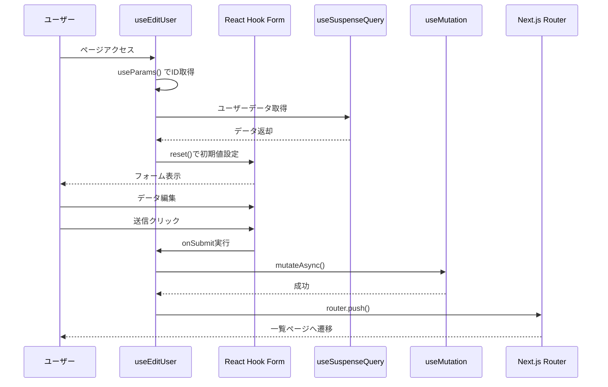
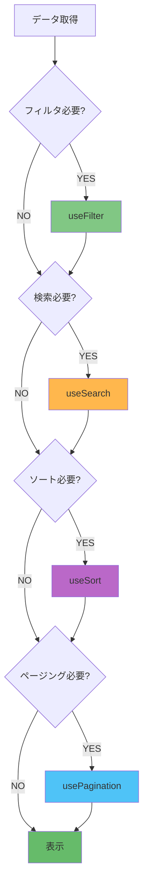

# 高度なパターンとベストプラクティス

このセクションでは、カスタムフックの高度なパターン、パフォーマンス最適化、テスト手法について学びます。

> ℹ️ **注意**: 最新の推奨パターンについては [06-react19.md](./06-react19.md#実務での推奨事項) を参照してください。

## 目次

- [このセクションで学ぶこと](#このセクションで学ぶこと)
- [複数フックの組み合わせ](#複数フックの組み合わせ)
- [パフォーマンス最適化](#パフォーマンス最適化)
- [エラーハンドリングとSuspense](#エラーハンドリングとsuspense)
- [カスタムフックのカスタムフック](#カスタムフックのカスタムフック)
- [テスタビリティ](#テスタビリティ)
- [実践的なパターン集](#実践的なパターン集)
- [チェックポイント](#チェックポイント)
- [次のステップ](#次のステップ)

---

## このセクションで学ぶこと

このセクションを完了すると、以下のことができるようになります:

- 複数のフックを効果的に組み合わせられる
- useMemoとuseCallbackで適切に最適化できる
- ErrorBoundaryとSuspenseを統合できる
- 再利用可能なカスタムフックを作成できる
- カスタムフックのテストができる

---

## 複数フックの組み合わせ

### パターン1: フォーム + データ取得 + ナビゲーション

完全なCRUD操作の統合例。



```typescript
import { useEffect } from 'react';
import { useRouter } from 'next/navigation';
import { useForm } from 'react-hook-form';
import { zodResolver } from '@hookform/resolvers/zod';
import { useUser } from '../../api/get-user';
import { useUpdateUser } from '../../api/update-user';
import { userFormSchema, type UserFormValues } from '../../types/forms.schema';

/**
 * ユーザー編集の完全な統合フック
 *
 * @description
 * - Client Component でuseParams()から受け取ったuserIdを使用
 * - useSuspenseQueryでデータ取得
 * - useFormでフォーム管理
 * - useMutationでデータ更新
 * - router.push()で直接ナビゲーション
 */
export const useEditUser = (userId: string) => {
  const router = useRouter();

  // ================================================================================
  // Data Fetching
  // ================================================================================

  // ユーザーデータ取得
  const { data } = useUser({ userId });

  // 更新Mutation
  const updateUserMutation = useUpdateUser();


  // ================================================================================
  // Form Management
  // ================================================================================
  const {
    control,
    handleSubmit,
    reset,
    formState: { errors, isDirty },
    setError,
  } = useForm<UserFormValues>({
    resolver: zodResolver(userFormSchema),
    defaultValues: {
      name: '',
      email: '',
      role: 'user',
    },
  });

  // データ取得後、フォームに初期値を設定
  useEffect(() => {
    if (data?.data) {
      reset({
        name: data.data.name,
        email: data.data.email,
        role: data.data.role as 'user' | 'admin',
      });
    }
  }, [data, reset]);

  // ================================================================================
  // Handlers
  // ================================================================================
  /**
   * フォーム送信ハンドラー
   */
  const onSubmit = handleSubmit(async (formData) => {
    await updateUserMutation
      .mutateAsync({
        userId,
        data: formData,
      })
      .then(() => {
        {
        router.push('/sample-users');
        }
      })
      .catch((error) => {
        setError('root', {
          message: 'ユーザーの更新に失敗しました',
        }
      });
  });

  /**
   * キャンセルボタンのハンドラー
   */
  const handleCancel = () => {
    if (isDirty) {
      const confirmed = window.confirm('編集内容が保存されていません。破棄してもよろしいですか？');
      if (!confirmed) return;
    }

    {
    router.push('/sample-users');
    }
  };

  /**
   * フォームのリセット
   */
  const handleReset = () => {
    if (data?.data) {
      reset({
        name: data.data.name,
        email: data.data.email,
        role: data.data.role as 'user' | 'admin',
      });
    }
  };

  return {
    control,
    onSubmit,
    handleCancel,
    handleReset,
    errors,
    isDirty,
    isSubmitting: updateUserMutation.isPending,
  };
};
```

### パターン2: 楽観的更新 + データ取得

```typescript
import { useOptimistic } from 'react';
import { useRouter } from 'next/navigation';
import { useItems } from '../../api/get-items';
import { useCreateItem } from '../../api/create-item';

type Item = {
  id: string;
  title: string;
  completed: boolean;
};

/**
 * アイテム管理の高度なフック
 *
 * @description
 * - useSuspenseQueryでデータ取得
 * - useOptimisticで楽観的UI更新
 * - router.push()で直接ナビゲーション
 */
export const useItemsAdvanced = () => {
  const router = useRouter();
  const { data } = useItems();
  const createItemMutation = useCreateItem();

  const items = data?.data ?? [];

  // ================================================================================
  // Optimistic Update
  // ================================================================================
  const [optimisticItems, addOptimisticItem] = useOptimistic(items, (state, newItem: Item) => [...state, newItem]);

  // ================================================================================
  // Handlers
  // ================================================================================
  /**
   * アイテム作成ハンドラー
   */
  const handleCreate = async (title: string) => {
    const tempItem: Item = {
      id: `temp-${Date.now()}`,
      title,
      completed: false,
    };

    // 楽観的UI更新
    addOptimisticItem(tempItem);

    try {
      await createItemMutation.mutateAsync({ title });

      // ページ遷移
      {
      router.push('/items');
      }
    } catch (error) {
      console.error('アイテム作成エラー:', error);
    }
  };

  return {
    items: optimisticItems,
    handleCreate,
    isProcessing: createItemMutation.isPending,
  };
};
```

---

## パフォーマンス最適化

### useMemoの活用

**いつ使う:**

- 計算コストが高い処理
- 参照の同一性を保つ必要がある場合

```typescript
import { useMemo } from 'react';

export const useUsers = () => {
  const { data } = useUsersQuery();

  // ================================================================================
  // Memoized Values
  // ================================================================================
  /**
   * フィルタリングされたユーザーリスト
   *
   * @description
   * 計算コストが高いため、useMemoで最適化します。
   */
  const activeUsers = useMemo(() => {
    return (data?.data ?? []).filter((user) => user.status === 'active');
  }, [data]);

  /**
   * ユーザー統計
   */
  const statistics = useMemo(() => {
    const users = data?.data ?? [];
    return {
      total: users.length,
      active: users.filter((u) => u.status === 'active').length,
      inactive: users.filter((u) => u.status === 'inactive').length,
      admins: users.filter((u) => u.role === 'admin').length,
    };
  }, [data]);

  return {
    users: data?.data ?? [],
    activeUsers,
    statistics,
  };
};
```

### useCallbackの活用

**いつ使う:**

- 子コンポーネントに関数を渡す場合
- useEffectの依存配列に含める関数

```typescript
import { useCallback } from 'react';
import { useRouter } from 'next/navigation';

export const useUsers = () => {
  const router = useRouter();
  const { data } = useUsersQuery();
  const deleteUserMutation = useDeleteUser();

  // ================================================================================
  // Memoized Callbacks
  // ================================================================================
  /**
   * 編集ページへの遷移
   *
   * @description
   * 子コンポーネントに渡すため、useCallbackで最適化します。
   */
  const handleEdit = useCallback(
    (userId: string) => {
      router.push(`/sample-users/${userId}/edit`);
    },
    [router]
  );

  /**
   * ユーザー削除
   */
  const handleDelete = useCallback(
    async (userId: string) => {
      const user = data?.data?.find((u) => u.id === userId);
      if (!user) return;

      const confirmed = window.confirm(`${user.name} を削除してもよろしいですか？`);
      if (!confirmed) return;

      await deleteUserMutation
        .mutateAsync(userId)
        .catch((error) => {
          alert('削除に失敗しました');
        }
    },
    [data, deleteUserMutation]
  );

  return {
    users: data?.data ?? [],
    handleEdit,
    handleDelete,
  };
};
```

### 最適化のガイドライン

```typescript
// ✅ 良い例: 計算コストが高い処理をメモ化
const expensiveValue = useMemo(() => {
  return heavyCalculation(data);
}, [data]);

// ❌ 悪い例: シンプルな処理をメモ化（不要）
const simpleValue = useMemo(() => {
  return data?.length ?? 0;
}, [data]);

// ✅ 良い例: 子コンポーネントに渡す関数をメモ化
const handleClick = useCallback(() => {
  doSomething();
}, []);

// ❌ 悪い例: 子コンポーネントに渡さない関数をメモ化（不要）
const handleClick = useCallback(() => {
  console.log('clicked');
}, []);
```

---

## エラーハンドリングとSuspense

### ErrorBoundaryとSuspenseの統合

```typescript
// コンポーネント層
"use client";

import { Suspense } from "react";
import { ErrorBoundary } from "react-error-boundary";
import { LoadingSpinner } from "@/components/ui/loading-spinner";
import { MainErrorFallback } from "@/components/errors/main";

/**
 * データフェッチを含むコンテンツ
 */
const UsersPageContent = () => {
  const { users, handleEdit, handleDelete } = useUsers();
  // isLoading, error は不要（SuspenseとErrorBoundaryが管理）

  return (
    <div>
      <UsersList
        users={users}
        onEdit={handleEdit}
        onDelete={handleDelete}
      />
    </div>
  );
};

/**
 * ページコンポーネント
 *
 * @description
 * ErrorBoundaryとSuspenseでコンテンツをラップします。
 */
const UsersPage = () => {
  return (
    <ErrorBoundary FallbackComponent={MainErrorFallback}>
      <Suspense fallback={<LoadingSpinner fullScreen />}>
        <UsersPageContent />
      </Suspense>
    </ErrorBoundary>
  );
};

export default UsersPage;
```

### カスタムエラーハンドリング

```typescript
import { useQueryErrorResetBoundary } from "@tanstack/react-query";

/**
 * エラーリセット機能付きページ
 */
const UsersPage = () => {
  const { reset } = useQueryErrorResetBoundary();

  return (
    <ErrorBoundary
      FallbackComponent={MainErrorFallback}
      onReset={reset}
    >
      <Suspense fallback={<LoadingSpinner fullScreen />}>
        <UsersPageContent />
      </Suspense>
    </ErrorBoundary>
  );
};
```

---

## カスタムフックのカスタムフック

再利用可能なカスタムフックを作成します。

### パターン1: 汎用的な削除フック

```typescript
import { useCallback } from 'react';
import { useMutation, useQueryClient } from '@tanstack/react-query';

type UseDeleteOptions<T> = {
  queryKey: string[];
  deleteFn: (id: string) => Promise<void>;
  getName: (item: T) => string;
};

/**
 * 汎用的な削除フック
 *
 * @description
 * 確認ダイアログ、削除処理、キャッシュ更新を統合します。
 *
 * @example
 * const { handleDelete } = useDelete({
 *   queryKey: ["users"],
 *   deleteFn: deleteUser,
 *   getName: (user) => user.name,
 * });
 */
export const useDelete = <T>({ queryKey, deleteFn, getName }: UseDeleteOptions<T>) => {
  const queryClient = useQueryClient();

  const deleteMutation = useMutation({
    mutationFn: deleteFn,
    onSuccess: (_, id) => {
      queryClient.removeQueries({ queryKey: [...queryKey, id] });
      queryClient.invalidateQueries({ queryKey });
    },
  });

  const handleDelete = useCallback(
    async (id: string, item: T) => {
      const confirmed = window.confirm(`${getName(item)} を削除してもよろしいですか？`);
      if (!confirmed) return;

      await deleteMutation
        .mutateAsync(id)
        .catch((error) => {
          alert('削除に失敗しました');
        }
    },
    [deleteMutation, getName]
  );

  return {
    handleDelete,
    isDeleting: deleteMutation.isPending,
  };
};

// 使用例
export const useUsers = () => {
  const { data } = useUsersQuery();

  const { handleDelete, isDeleting } = useDelete({
    queryKey: ['users'],
    deleteFn: deleteUser,
    getName: (user) => user.name,
  });

  return {
    users: data?.data ?? [],
    handleDelete,
    isDeleting,
  };
};
```

### パターン2: 汎用的な検索フック

```typescript
import { useState, useMemo } from 'react';

type UseSearchOptions<T> = {
  items: T[];
  searchFields: (keyof T)[];
};

/**
 * 汎用的な検索フック
 *
 * @description
 * 複数フィールドの検索をサポートします。
 *
 * @example
 * const { query, filteredItems, handleSearch } = useSearch({
 *   items: users,
 *   searchFields: ["name", "email"],
 * });
 */
export const useSearch = <T extends Record<string, any>>({ items, searchFields }: UseSearchOptions<T>) => {
  const [query, setQuery] = useState('');

  const filteredItems = useMemo(() => {
    if (!query.trim()) return items;

    const lowerQuery = query.toLowerCase();
    return items.filter((item) => searchFields.some((field) => String(item[field]).toLowerCase().includes(lowerQuery)));
  }, [items, query, searchFields]);

  const handleSearch = (newQuery: string) => {
    setQuery(newQuery);

    }
  };

  return {
    query,
    filteredItems,
    handleSearch,
  };
};

// 使用例
export const useUsers = () => {
  const { data } = useUsersQuery();
  const users = data?.data ?? [];

  const { query, filteredItems, handleSearch } = useSearch({
    items: users,
    searchFields: ['name', 'email'],
  });

  return {
    query,
    users: filteredItems,
    handleSearch,
  };
};
```

---

## テスタビリティ

### カスタムフックのテスト

```typescript
import { renderHook, waitFor } from "@testing-library/react";
import { QueryClient, QueryClientProvider } from "@tanstack/react-query";
import { useUsers } from "./users.hook";

/**
 * テスト用のラッパー
 */
const createWrapper = () => {
  const queryClient = new QueryClient({
    defaultOptions: {
      queries: { retry: false },
      mutations: { retry: false },
    },
  });

  return ({ children }: { children: React.ReactNode }) => (
    <QueryClientProvider client={queryClient}>
      {children}
    </QueryClientProvider>
  );
};

describe("useUsers", () => {
  it("ユーザー一覧を取得できる", async () => {
    const { result } = renderHook(() => useUsers(), {
      wrapper: createWrapper(),
    });

    await waitFor(() => {
      expect(result.current.users).toHaveLength(3);
    });
  });

  it("ユーザーを削除できる", async () => {
    const { result } = renderHook(() => useUsers(), {
      wrapper: createWrapper(),
    });

    await waitFor(() => {
      expect(result.current.users).toHaveLength(3);
    });

    // 削除実行
    await result.current.handleDelete("user-1");

    await waitFor(() => {
      expect(result.current.users).toHaveLength(2);
    });
  });
});
```

### モックの活用

```typescript
import { vi } from 'vitest';
import * as usersApi from '../../api/get-users';

// APIモック
vi.mock('../../api/get-users', () => ({
  useUsers: vi.fn(() => ({
    data: {
      data: [
        { id: '1', name: 'User 1', email: 'user1@example.com' },
        { id: '2', name: 'User 2', email: 'user2@example.com' },
      ],
    },
  })),
}));

describe('useUsers with mock', () => {
  it('モックデータを使用する', () => {
    const { result } = renderHook(() => useUsers(), {
      wrapper: createWrapper(),
    });

    expect(result.current.users).toHaveLength(2);
  });
});
```

---

## 実践的なパターン集



### パターン1: ページネーション

```typescript
import { useState } from 'react';

export const usePagination = <T>(items: T[], itemsPerPage: number = 10) => {
  const [currentPage, setCurrentPage] = useState(1);

  const totalPages = Math.ceil(items.length / itemsPerPage);
  const startIndex = (currentPage - 1) * itemsPerPage;
  const endIndex = startIndex + itemsPerPage;
  const currentItems = items.slice(startIndex, endIndex);

  const goToPage = (page: number) => {
    setCurrentPage(Math.max(1, Math.min(page, totalPages)));
  };

  const nextPage = () => goToPage(currentPage + 1);
  const prevPage = () => goToPage(currentPage - 1);

  return {
    currentItems,
    currentPage,
    totalPages,
    goToPage,
    nextPage,
    prevPage,
    hasNextPage: currentPage < totalPages,
    hasPrevPage: currentPage > 1,
  };
};
```

### パターン2: ソート機能

```typescript
import { useState, useMemo } from 'react';

type SortDirection = 'asc' | 'desc';

export const useSort = <T>(items: T[], defaultKey: keyof T) => {
  const [sortKey, setSortKey] = useState<keyof T>(defaultKey);
  const [sortDirection, setSortDirection] = useState<SortDirection>('asc');

  const sortedItems = useMemo(() => {
    return [...items].sort((a, b) => {
      const aValue = a[sortKey];
      const bValue = b[sortKey];

      if (aValue < bValue) return sortDirection === 'asc' ? -1 : 1;
      if (aValue > bValue) return sortDirection === 'asc' ? 1 : -1;
      return 0;
    });
  }, [items, sortKey, sortDirection]);

  const handleSort = (key: keyof T) => {
    if (sortKey === key) {
      setSortDirection(sortDirection === 'asc' ? 'desc' : 'asc');
    } else {
      setSortKey(key);
      setSortDirection('asc');
    }
  };

  return {
    sortedItems,
    sortKey,
    sortDirection,
    handleSort,
  };
};
```

### パターン3: フィルター機能

```typescript
import { useState, useMemo } from 'react';

type FilterConfig<T> = {
  [key in keyof T]?: T[key][];
};

export const useFilter = <T extends Record<string, any>>(items: T[], initialFilters: FilterConfig<T> = {}) => {
  const [filters, setFilters] = useState<FilterConfig<T>>(initialFilters);

  const filteredItems = useMemo(() => {
    return items.filter((item) => {
      return Object.entries(filters).every(([key, values]) => {
        if (!values || values.length === 0) return true;
        return values.includes(item[key]);
      });
    });
  }, [items, filters]);

  const setFilter = <K extends keyof T>(key: K, values: T[K][]) => {
    setFilters((prev) => ({ ...prev, [key]: values }));
  };

  const clearFilter = <K extends keyof T>(key: K) => {
    setFilters((prev) => {
      const newFilters = { ...prev };
      delete newFilters[key];
      return newFilters;
    });
  };

  const clearAllFilters = () => {
    setFilters({});
  };

  return {
    filteredItems,
    filters,
    setFilter,
    clearFilter,
    clearAllFilters,
  };
};
```

---

## チェックポイント

このセクションを完了したら、以下を確認してください:

- [ ] 複数のフックを効果的に組み合わせられる
- [ ] useMemoとuseCallbackで適切に最適化できる
- [ ] ErrorBoundaryとSuspenseを統合できる
- [ ] 再利用可能なカスタムフックを作成できる
- [ ] カスタムフックのテストができる

### 実践課題

以下の高度な機能を実装してみましょう:

**高度なユーザー管理機能**

- ページネーション（10件ずつ表示）
- ソート機能（名前、メール、作成日）
- フィルター機能（ロール、ステータス）
- 検索機能（名前、メール）
- 一括削除機能

<details>
<summary>実装のヒント</summary>

```typescript
export const useUsersAdvanced = () => {
  const { data } = useUsersQuery();
  const users = data?.data ?? [];

  // 検索
  const {
    query,
    filteredItems: searchedUsers,
    handleSearch,
  } = useSearch({
    items: users,
    searchFields: ['name', 'email'],
  });

  // フィルター
  const { filteredItems: filteredUsers, setFilter, clearAllFilters } = useFilter(searchedUsers, { role: [], status: [] });

  // ソート
  const { sortedItems, handleSort } = useSort(filteredUsers, 'name');

  // ページネーション
  const { currentItems, currentPage, totalPages, goToPage } = usePagination(sortedItems, 10);

  return {
    users: currentItems,
    query,
    handleSearch,
    setFilter,
    clearAllFilters,
    handleSort,
    currentPage,
    totalPages,
    goToPage,
  };
};
```

</details>

---

## 次のステップ

高度なパターンを理解したら、次はクイックリファレンスで全体を復習しましょう:

- [クイックリファレンス](./08-reference.md) - チートシート、FAQ、トラブルシューティング

### 関連ドキュメント

- [フックパターン](../01-hook-patterns.md)
- [パフォーマンス最適化](../../03-core-concepts/06-performance.md)
- [テスト](../../06-testing/index.md)
- [React公式 - パフォーマンス最適化](https://react.dev/learn/render-and-commit)
