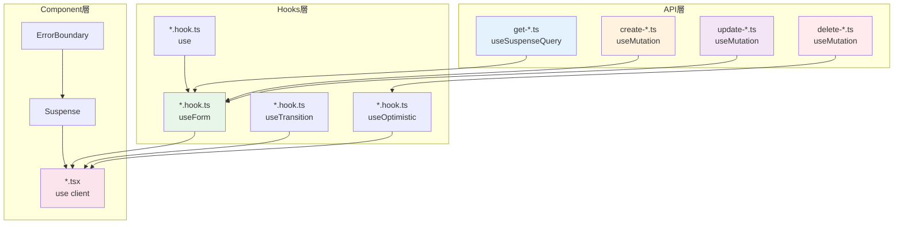

# クイックリファレンス

カスタムフックの実装時に参照できるチートシート、FAQ、トラブルシューティングガイドです。

## 実装マップ



## 目次

- [チートシート](#チートシート)
- [よくある質問（FAQ）](#よくある質問faq)
- [トラブルシューティング](#トラブルシューティング)
- [ベストプラクティス一覧](#ベストプラクティス一覧)
- [パフォーマンスチェックリスト](#パフォーマンスチェックリスト)
- [関連リンク](#関連リンク)

---

## チートシート

### フォーム管理

```typescript
// 基本構造
import { useForm } from "react-hook-form";
import { zodResolver } from "@hookform/resolvers/zod";

const {
  control,           // フィールドに渡す
  handleSubmit,      // Form送信
  formState: { errors, isDirty },
  setError,          // エラー設定
  reset,             // リセット
} = useForm<FormValues>({
  resolver: zodResolver(schema),
  defaultValues: {...},
});

// 送信処理
const onSubmit = handleSubmit(async (data) => {
  try {
    await mutation.mutateAsync(data);
  } catch (error) {
    setError("root", { message: "エラー" });
  }
});
```

### データ取得（Query）

```typescript
// API層
import { queryOptions, useSuspenseQuery } from "@tanstack/react-query";

export const getUsers = () => api.get("/users");

export const getUsersQueryOptions = () => {
  return queryOptions({
    queryKey: ["users"],
    queryFn: getUsers,
  });
};

export const useUsers = ({ queryConfig } = {}) => {
  return useSuspenseQuery({
    ...getUsersQueryOptions(),
    ...queryConfig,
  });
};

// コンポーネント層
<ErrorBoundary FallbackComponent={MainErrorFallback}>
  <Suspense fallback={<Loading />}>
    <Content />
  </Suspense>
</ErrorBoundary>
```

### データ更新（Mutation）

```typescript
// API層
import { useMutation, useQueryClient } from '@tanstack/react-query';

export const createUser = (data) => api.post('/users', data);

export const useCreateUser = () => {
  const queryClient = useQueryClient();

  return useMutation({
    mutationFn: createUser,
    onSuccess: () => {
      queryClient.invalidateQueries({ queryKey: ['users'] });
    },
  });
};

// Hooks層
const mutation = useCreateUser();

const onSubmit = async (data) => {
  await mutation.mutateAsync(data);
  router.push('/users');
};
```

### React 19フック

```typescript
// useOptimistic: 楽観的UI更新（✅ 推奨）
const [optimisticState, addOptimistic] = useOptimistic(state, (current, optimisticValue) => [...current, optimisticValue]);

addOptimistic(newItem); // 即座にUI反映

// 注意: useTransitionとuse()フックはこのプロジェクトでは非推奨です
// - useTransition: Next.js App Routerでは効果なし → 直接router.push()を使用
// - use(): Server Componentでawait、Client Componentでpropsを使用
```

### キャッシュ管理

```typescript
const queryClient = useQueryClient();

// 無効化（再取得をトリガー）
queryClient.invalidateQueries({ queryKey: ['users'] });
queryClient.invalidateQueries({ queryKey: ['users', userId] });

// 直接更新（再取得なし）
queryClient.setQueryData(['users', userId], updatedUser);

// 削除
queryClient.removeQueries({ queryKey: ['users', userId] });

// クリア
queryClient.clear();
```

---

## よくある質問（FAQ）

### Q1: API層とHooks層の違いは？

**A:** 責務が異なります。

| 層          | 責務                             | 例                                        |
| ----------- | -------------------------------- | ----------------------------------------- |
| **API層**   | データ取得ロジック + React Query | `useUsers()` - データ取得のみ             |
| **Hooks層** | ページ固有のビジネスロジック     | `useUsers()` - ナビゲーション、データ変換 |

**Hooks層が必要な場合:**

- ページ遷移処理（router.push）
- 複数のAPIを組み合わせ
- 複雑なデータ変換
- 追加の状態管理

**不要な場合:**

- シンプルなデータ表示のみ

---

### Q2: useSuspenseQueryとuseQueryの違いは？

**A:** ローディングとエラーの管理方法が異なります。

| 項目             | useQuery          | useSuspenseQuery    |
| ---------------- | ----------------- | ------------------- |
| ローディング管理 | `isLoading`で手動 | Suspenseが自動      |
| エラー管理       | `error`で手動     | ErrorBoundaryが自動 |
| コードの簡潔性   | 条件分岐が必要    | 簡潔                |
| 推奨度           | 従来の方法        | **推奨**            |

```typescript
// useQuery（従来）
const { data, isLoading, error } = useQuery({...});

if (isLoading) return <Loading />;
if (error) return <Error />;
return <Content data={data} />;

// useSuspenseQuery（推奨）
const { data } = useSuspenseQuery({...});
// isLoading, error は不要
return <Content data={data} />;
```

---

### Q3: useOptimisticとuseTransitionの使い分けは？

**A:** 用途が異なります。

| フック            | 用途                 | 例                         |
| ----------------- | -------------------- | -------------------------- |
| **useOptimistic** | 即座のUI反映         | チャット送信、いいね、削除 |
| **useTransition** | ノンブロッキング更新 | ページ遷移、タブ切り替え   |

```typescript
// useOptimistic: データの楽観的更新
const [optimisticItems, addItem] = useOptimistic(items, ...);
addItem(newItem); // 即座にリストに追加

// useTransition: ナビゲーション
startTransition(() => {
  router.push("/page"); // ブロックしない
});
```

---

### Q4: キャッシュの無効化（invalidateQueries）とは？

**A:** キャッシュを古い（stale）とマークし、再取得をトリガーします。

```typescript
// 作成時: 一覧のキャッシュを無効化
queryClient.invalidateQueries({ queryKey: ['users'] });
// → ユーザー一覧が自動的に再取得される

// 更新時: 個別 + 一覧を無効化
queryClient.invalidateQueries({ queryKey: ['users', userId] });
queryClient.invalidateQueries({ queryKey: ['users'] });

// 削除時: 個別を削除 + 一覧を無効化
queryClient.removeQueries({ queryKey: ['users', userId] });
queryClient.invalidateQueries({ queryKey: ['users'] });
```

---

### Q5: Next.js 15のparamsはなぜPromise型？

**A:** 非同期的なルーティングをサポートするためです。

````typescript
// Next.js 14以前
type PageProps = {
  params: { id: string };
};

// Next.js 15 (Client Component パターン)
// page.tsx (Server Component)
import type { Metadata } from 'next';
import UserDetailPage from '@/features/users/routes/user-detail';

export const metadata: Metadata = {
  title: 'ユーザー詳細',
};

export default function Page() {
  return <UserDetailPage />;
}

// user-detail.tsx (Client Component)
'use client';
import { useParams } from 'next/navigation';

export default function UserDetailPage() {
  const params = useParams();
  const userId = params.id as string;

  const { data } = useUser({ userId });
  return <div>{data.data.name}</div>;
}

---

### Q6: useMemoとuseCallbackはいつ使うべき？

**A:** 以下の場合のみ使用します。

**useMemo:**

- 計算コストが高い処理
- 参照の同一性を保つ必要がある場合

```typescript
// ✅ 使うべき
const expensiveValue = useMemo(() => {
  return items.filter(...).map(...).reduce(...);
}, [items]);

// ❌ 不要
const length = useMemo(() => items.length, [items]);
````

**useCallback:**

- 子コンポーネントに渡す関数
- useEffectの依存配列に含める関数

```typescript
// ✅ 使うべき
const handleClick = useCallback(() => {
  doSomething();
}, []);

<ChildComponent onClick={handleClick} />

// ❌ 不要（子コンポーネントに渡さない）
const handleClick = useCallback(() => {
  console.log("clicked");
}, []);
```

---

## トラブルシューティング

### エラー1: "Uncaught Error: use() called outside of Suspense"

**原因:** useフックを使用しているが、Suspenseで囲んでいない。

**解決策:**

```typescript
// ❌ Bad
<ComponentUsingUse />

// ✅ Good
<Suspense fallback={<Loading />}>
  <ComponentUsingUse />
</Suspense>
```

---

### エラー2: "useOptimisticがロールバックしない"

**原因:** 楽観的更新と同時にベース状態を更新している。

**解決策:**

```typescript
// ❌ Bad
addOptimistic(newItem);
setItems((prev) => [...prev, newItem]); // 即座に更新

// ✅ Good
addOptimistic(newItem);
try {
  await mutation.mutateAsync(data);
  setItems((prev) => [...prev, newItem]); // 成功時のみ更新
} catch (error) {
  // エラー時は自動ロールバック
}
```

---

### エラー3: "キャッシュが更新されない"

**原因:** invalidateQueriesのqueryKeyが間違っている。

**解決策:**

```typescript
// ❌ Bad: キーが一致していない
queryClient.invalidateQueries({ queryKey: ['user'] }); // "user"
// 実際のクエリ: ["users"]

// ✅ Good: キーを一致させる
queryClient.invalidateQueries({ queryKey: ['users'] });
```

---

### エラー4: "フォームのデフォルト値が反映されない"

**原因:** useEffectでresetを呼び出す際、依存配列が不適切。

**解決策:**

```typescript
// ❌ Bad: 依存配列なし
useEffect(() => {
  if (data) {
    reset(data);
  }
});

// ✅ Good: 依存配列を指定
useEffect(() => {
  if (data) {
    reset(data);
  }
}, [data, reset]);
```

---

### エラー5: "useTransitionのisPendingが常にfalse"

**原因:** startTransitionの外で状態更新している。

**解決策:**

```typescript
// ❌ Bad
router.push('/page');

// ✅ Good
startTransition(() => {
  router.push('/page');
});
```

---

## ベストプラクティス一覧

### フォーム

- [ ] すべてのフィールドにdefaultValuesを設定
- [ ] Zodスキーマから型を導出（`z.infer<typeof schema>`）
- [ ] エラーメッセージは日本語でユーザーフレンドリーに
- [ ] ローディング状態を明示（`isSubmitting`）
- [ ] 成功時の処理を明確にする

### データ取得

- [ ] API層でuseSuspenseQueryを使用
- [ ] Hooks層はページ固有のロジックのみ
- [ ] queryKeyは配列で階層的に管理
- [ ] enabledオプションで条件付き実行
- [ ] データ変換はフック内で実行

### データ更新

- [ ] 成功時にinvalidateQueriesでキャッシュ無効化
- [ ] エラーハンドリングを適切に実装
- [ ] pending状態を統合して返す
- [ ] ユーザーフィードバックを提供

### React 19フック

- [ ] useOptimisticは成功時のみベース状態を更新
- [ ] useTransitionはすべてのナビゲーションで使用
- [ ] useフックはSuspenseで囲む
- [ ] 型を明示する

### パフォーマンス

- [ ] 計算コストが高い処理のみuseMemo
- [ ] 子コンポーネントに渡す関数のみuseCallback
- [ ] 不要な再レンダリングを避ける
- [ ] React DevToolsで確認

---

## パフォーマンスチェックリスト

### 計測

- [ ] React DevTools Profilerで計測
- [ ] レンダリング回数を確認
- [ ] 不要な再レンダリングを特定

### 最適化

- [ ] 計算コストが高い処理をuseMemoで最適化
- [ ] 子コンポーネントに渡す関数をuseCallbackで最適化
- [ ] React.memoで子コンポーネントをメモ化
- [ ] コード分割（React.lazy）を検討

### 検証

- [ ] 最適化前後で計測
- [ ] パフォーマンスが改善されたか確認
- [ ] 過度な最適化を避ける

---

## 関連リンク

### 公式ドキュメント

- [React 19公式](https://react.dev/)
- [React Hook Form](https://react-hook-form.com/)
- [Zod](https://zod.dev/)
- [TanStack Query](https://tanstack.com/query/latest)
- [Next.js 15](https://nextjs.org/)

### プロジェクト内ドキュメント

#### 基礎

- [フォーム管理の基礎](./03-forms.md)
- [データ取得の基礎](./04-data.md)
- [フォームとデータの統合](./05-integration.md)

#### 詳細ガイド

- [フォーム用フック](../02-form-hooks.md)
- [データ取得フック](../03-data-hooks.md)
- [フックパターン](../01-hook-patterns.md)

#### React 19

- [React 19の新機能](./06-react19.md)
- [useOptimistic](../04-use-optimistic.md)
- [useTransition](../05-use-transition.md)
- [use](../06-use-hook.md)

#### 高度なトピック

- [高度なパターン](./07-advanced-patterns.md)
- [パフォーマンス最適化](../../03-core-concepts/06-performance.md)
- [テスト](../../06-testing/index.md)

### 外部リソース

- [bulletproof-react](https://github.com/alan2207/bulletproof-react) - プロジェクト構造の参考
- [React Query公式ガイド](https://tanstack.com/query/latest/docs/framework/react/guides)
- [Zodバリデーションガイド](https://zod.dev/?id=strings)

---

## クイックスタートテンプレート

### 新規ユーザー作成ページ

```typescript
// Schemas
export const userFormSchema = z.object({
  name: z.string().min(1, "名前を入力してください"),
  email: z.string().email("有効なメールアドレスを入力してください"),
  role: z.enum(["user", "admin"]),
});

export type UserFormValues = z.infer<typeof userFormSchema>;

// API層（create-user.ts）
export const createUser = (data: CreateUserInput) => api.post("/users", data);

export const useCreateUser = () => {
  const queryClient = useQueryClient();
  return useMutation({
    mutationFn: createUser,
    onSuccess: () => {
      queryClient.invalidateQueries({ queryKey: ["users"] });
    },
  });
};

// Hooks層（new-user.hook.ts）
export const useNewUser = () => {
  const router = useRouter();
  const createUserMutation = useCreateUser();

  const { control, handleSubmit, formState: { errors }, setError } = useForm<UserFormValues>({
    resolver: zodResolver(userFormSchema),
    defaultValues: {
      name: "",
      email: "",
      role: "user",
    },
  });

  const onSubmit = handleSubmit(async (data) => {
    await createUserMutation
      .mutateAsync(data)
      .then(() => router.push("/users"))
      .catch((error) => setError("root", { message: "作成に失敗しました" }));
  });

  return {
    control,
    onSubmit,
    errors,
    isSubmitting: createUserMutation.isPending,
  };
};

// コンポーネント（new-user.tsx）
const NewUserPage = () => {
  const { control, onSubmit, errors, isSubmitting } = useNewUser();

  return (
    <form onSubmit={onSubmit}>
      <ControlledInputField name="name" control={control} label="名前" />
      <ControlledInputField name="email" control={control} label="メール" type="email" />
      <ControlledSelectField name="role" control={control} label="ロール" options={...} />

      {errors.root && <ErrorMessage message={errors.root.message} />}

      <Button type="submit" disabled={isSubmitting}>
        {isSubmitting ? "作成中..." : "作成"}
      </Button>
    </form>
  );
};
```

---

## まとめ

このリファレンスを活用して、効率的にカスタムフックを実装してください。

### 学習の進め方

1. **基礎**: フォーム、データ取得、統合を順番に学ぶ
2. **実践**: 実際のプロジェクトで使ってみる
3. **応用**: React 19の新機能、高度なパターンを学ぶ
4. **最適化**: パフォーマンスチェックリストで確認

### 困ったときは

1. このリファレンスのトラブルシューティングを確認
2. 関連ドキュメントを参照
3. 公式ドキュメントを確認
4. チームメンバーに相談

---

**ハッピーコーディング！**
