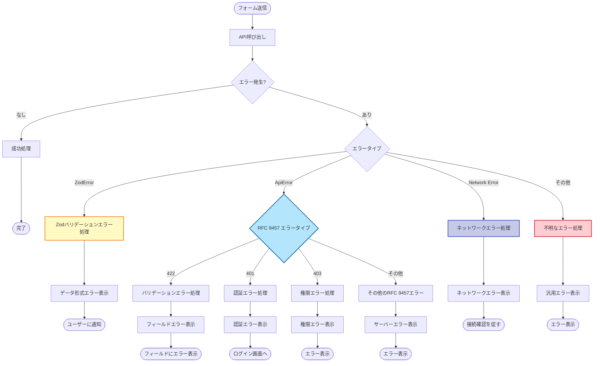

# サーバーエラーハンドリング

APIから返されるエラーをフォームに反映させる方法を説明します。

---

## 基本パターン

### フィールドエラーとグローバルエラー

```typescript
import { useState } from 'react'
import { useForm } from 'react-hook-form'
import { zodResolver } from '@hookform/resolvers/zod'
import { ApiError, ProblemTypes } from '@/lib/api-client'
import { userFormSchema, type UserFormValues } from './user-form.schema'
import { useCreateUser } from '@/features/users/api/create-user'

export const CreateUserForm = () => {
  const [serverError, setServerError] = useState<string | null>(null)
  const createUser = useCreateUser()

  const {
    register,
    handleSubmit,
    setError,
    formState: { errors, isSubmitting },
  } = useForm<UserFormValues>({
    resolver: zodResolver(userFormSchema),
  })

  const onSubmit = async (data: UserFormValues) => {
    setServerError(null)

    await createUser.mutateAsync(data)
      .catch((error) => {
        // RFC 9457準拠のエラーハンドリング
        if (error instanceof ApiError) {
          if (error.isType(ProblemTypes.VALIDATION_ERROR)) {
            const validationErrors = error.getExtension('errors')
            Object.entries(validationErrors).forEach(([field, messages]) => {
              setError(field as keyof UserFormValues, {
                message: Array.isArray(messages) ? messages[0] : String(messages),
              })
            })
          } else {
            setServerError(error.detail || 'エラーが発生しました')
          }
        } else {
          setServerError('エラーが発生しました')
        }
      })
  }

  return (
    <form onSubmit={handleSubmit(onSubmit)}>
      {serverError && (
        <div className="bg-red-100 border border-red-400 text-red-700 px-4 py-3 rounded">
          {serverError}
        </div>
      )}

      <div>
        <label>名前</label>
        <input {...register('name')} />
        {errors.name && <p className="text-red-500">{errors.name.message}</p>}
      </div>

      <div>
        <label>メールアドレス</label>
        <input {...register('email')} />
        {errors.email && <p className="text-red-500">{errors.email.message}</p>}
      </div>

      <button type="submit" disabled={isSubmitting}>
        {isSubmitting ? '送信中...' : '送信'}
      </button>
    </form>
  )
}
```

---

## エラーレスポンスの形式

このプロジェクトは、エラーレスポンスに [RFC 9457 (Problem Details for HTTP APIs)](https://www.rfc-editor.org/rfc/rfc9457.html) を採用しています。

### RFC 9457形式（422 Unprocessable Entity）

バリデーションエラーは、RFC 9457の拡張フィールドとして`errors`を含みます：

```json
{
  "type": "https://api.example.com/problems/validation-error",
  "title": "Validation Failed",
  "status": 422,
  "detail": "The request data failed validation",
  "instance": "/api/v1/users",
  "errors": {
    "email": ["メールアドレスはすでに使用されています"],
    "name": ["名前は必須です"]
  }
}
```

### ApiErrorクラスでの処理

```typescript
import { ApiError, ProblemTypes } from "@/lib/api-client";

const handleServerError = (error: unknown, setError: UseFormSetError<UserFormValues>) => {
  if (!(error instanceof ApiError)) {
    setError("root", { message: "エラーが発生しました" });
    return;
  }

  // RFC 9457: バリデーションエラー
  if (error.isType(ProblemTypes.VALIDATION_ERROR)) {
    const validationErrors = error.getExtension<Record<string, string[]>>("errors");

    if (validationErrors) {
      Object.entries(validationErrors).forEach(([field, messages]) => {
        setError(field as keyof UserFormValues, {
          type: "server",
          message: Array.isArray(messages) ? messages[0] : String(messages),
        });
      });
    }
  } else {
    // その他のエラー
    setError("root", {
      type: "server",
      message: error.detail || "エラーが発生しました",
    });
  }
};
```

---

## エラーハンドリングのパターン

### 1. フィールド単位のエラー

特定のフィールドにエラーをセットします。

```typescript
setError("email", {
  type: "server",
  message: "このメールアドレスはすでに使用されています",
});
```

### 2. ルートレベルのエラー

フォーム全体のエラーを表示します。

```typescript
setError('root', {
  type: 'server',
  message: 'サーバーエラーが発生しました',
})

// 表示
{errors.root && <p>{errors.root.message}</p>}
```

### 3. カスタムフィールドのエラー

```typescript
setError('root.serverError', {
  type: 'server',
  message: 'ネットワークエラーが発生しました',
})

// 表示
{errors.root?.serverError && <p>{errors.root.serverError.message}</p>}
```

---

## 再利用可能なエラーハンドラー

### ユーティリティ関数（RFC 9457対応）

```typescript
// src/utils/form-error-handler.ts
import type { UseFormSetError, FieldValues, Path } from "react-hook-form";
import { ApiError, ProblemTypes } from "@/lib/api-client";

/**
 * RFC 9457準拠のサーバーエラーをフォームエラーにマッピング
 */
export const handleServerError = <T extends FieldValues>(error: unknown, setError: UseFormSetError<T>): void => {
  // ApiErrorでない場合は汎用エラー
  if (!(error instanceof ApiError)) {
    setError("root.serverError" as Path<T>, {
      type: "server",
      message: "エラーが発生しました",
    });
    return;
  }

  // RFC 9457: バリデーションエラー（422）
  if (error.isType(ProblemTypes.VALIDATION_ERROR)) {
    const validationErrors = error.getExtension<Record<string, string[]>>("errors");

    if (validationErrors) {
      Object.entries(validationErrors).forEach(([field, messages]) => {
        setError(field as Path<T>, {
          type: "server",
          message: Array.isArray(messages) ? messages[0] : String(messages),
        });
      });
      return;
    }
  }

  // その他のRFC 9457エラー
  setError("root.serverError" as Path<T>, {
    type: "server",
    message: error.detail || error.title || "エラーが発生しました",
  });
};
```

### 使用例

```typescript
import { handleServerError } from "@/utils/form-error-handler";

const onSubmit = async (data: UserFormValues) => {
  await createUser.mutateAsync(data).catch((error) => {
    handleServerError(error, setError);
  });
};
```

---

## エラーメッセージのクリア

### フィールド単位でクリア

```typescript
import { useForm } from "react-hook-form";

const { clearErrors } = useForm();

// 特定のフィールドのエラーをクリア
clearErrors("email");

// 複数のフィールドのエラーをクリア
clearErrors(["email", "password"]);

// 全てのエラーをクリア
clearErrors();
```

### 入力時に自動クリア

```typescript
<input
  {...register('email')}
  onChange={(e) => {
    register('email').onChange(e)
    clearErrors('email')
  }}
/>
```

---

## グローバルエラー通知

### Toastとの連携（RFC 9457対応）

```typescript
import { toast } from "sonner";
import { ApiError, ProblemTypes } from "@/lib/api-client";

const onSubmit = async (data: UserFormValues) => {
  await createUser
    .mutateAsync(data)
    .then(() => {
      toast.success("ユーザーを作成しました");
    })
    .catch((error) => {
      if (error instanceof ApiError) {
        if (error.isType(ProblemTypes.VALIDATION_ERROR)) {
          handleServerError(error, setError);
          toast.error("入力内容を確認してください");
        } else {
          toast.error(error.detail || "エラーが発生しました");
        }
      } else {
        toast.error("エラーが発生しました");
      }
    });
};
```

---

## エラーの表示コンポーネント

### FormErrorMessage

```typescript
// src/components/ui/form-error-message.tsx
type FormErrorMessageProps = {
  message?: string
}

export const FormErrorMessage = ({ message }: FormErrorMessageProps) => {
  if (!message) return null

  return (
    <p className="text-sm text-red-600 mt-1">
      {message}
    </p>
  )
}
```

### ServerErrorAlert

```typescript
// src/components/ui/server-error-alert.tsx
type ServerErrorAlertProps = {
  error?: string | null
  onDismiss?: () => void
}

export const ServerErrorAlert = ({ error, onDismiss }: ServerErrorAlertProps) => {
  if (!error) return null

  return (
    <div className="bg-red-50 border border-red-200 text-red-800 px-4 py-3 rounded mb-4">
      <div className="flex justify-between items-start">
        <p>{error}</p>
        {onDismiss && (
          <button
            onClick={onDismiss}
            className="text-red-600 hover:text-red-800"
          >
            ✕
          </button>
        )}
      </div>
    </div>
  )
}
```

### 使用例

```typescript
<form onSubmit={handleSubmit(onSubmit)}>
  <ServerErrorAlert
    error={errors.root?.serverError?.message}
    onDismiss={() => clearErrors('root.serverError')}
  />

  <div>
    <input {...register('email')} />
    <FormErrorMessage message={errors.email?.message} />
  </div>

  <button type="submit">送信</button>
</form>
```

---

## Zodバリデーションとの統合

### APIレスポンスバリデーション失敗時のエラー処理

APIレスポンスがスキーマに一致しない場合、適切なエラーハンドリングが必要です。

#### パターン1: Zodバリデーションエラーをフォームエラーに変換

```typescript
import { ZodError } from "zod";
import { ApiError } from "@/lib/api-client";

const onSubmit = async (data: UserFormValues) => {
  try {
    await createUser.mutateAsync(data);
    toast.success("ユーザーを作成しました");
  } catch (error) {
    // Zodバリデーションエラー
    if (error instanceof ZodError) {
      // ✅ APIレスポンスが期待する形式ではない
      console.error("APIレスポンスバリデーション失敗:", error);
      setError("root", {
        type: "server",
        message: "サーバーから不正なデータが返されました。管理者に連絡してください。",
      });
      return;
    }

    // RFC 9457 エラー
    if (error instanceof ApiError) {
      handleServerError(error, setError);
      return;
    }

    // その他のエラー
    setError("root", {
      type: "server",
      message: "エラーが発生しました",
    });
  }
};
```

#### パターン2: トークンバリデーション失敗時のエラー処理

```typescript
import { ZodError } from "zod";
import { setValidatedToken } from "@/features/auth/stores/lib/validationstoken-storage.schema";

const onSubmit = async (data: LoginFormValues) => {
  try {
    const response = await loginUser.mutateAsync(data);

    // ✅ トークンをZodバリデーション
    try {
      setValidatedToken("token", response.token);
    } catch (tokenError) {
      if (tokenError instanceof ZodError) {
        // ✅ トークン形式が不正
        console.error("トークンバリデーション失敗:", tokenError);
        setError("root", {
          type: "server",
          message: "サーバーから不正なトークンが返されました。管理者に連絡してください。",
        });
        return;
      }
      throw tokenError;
    }

    // ユーザー情報を保存
    setUser(response.user);
    router.push("/dashboard");
  } catch (error) {
    if (error instanceof ApiError) {
      handleServerError(error, setError);
    } else {
      setError("root", {
        type: "server",
        message: "ログインに失敗しました",
      });
    }
  }
};
```

### 統合エラーハンドラー（Zod + RFC 9457）

包括的なエラーハンドリングユーティリティ:

```typescript
// src/utils/comprehensive-error-handler.ts
import type { UseFormSetError, FieldValues, Path } from "react-hook-form";
import { ZodError } from "zod";
import { ApiError, ProblemTypes } from "@/lib/api-client";

/**
 * Zodバリデーションエラー、RFC 9457エラー、その他のエラーを包括的に処理
 */
export const handleComprehensiveError = <T extends FieldValues>(error: unknown, setError: UseFormSetError<T>): void => {
  // ✅ Zodバリデーションエラー
  if (error instanceof ZodError) {
    console.error("[Zod Validation Error]", error.errors);

    // APIレスポンス形式不正
    setError("root.serverError" as Path<T>, {
      type: "validation",
      message: "サーバーから不正なデータが返されました。管理者に連絡してください。",
    });
    return;
  }

  // ✅ RFC 9457 エラー
  if (error instanceof ApiError) {
    // バリデーションエラー（422）
    if (error.isType(ProblemTypes.VALIDATION_ERROR)) {
      const validationErrors = error.getExtension<Record<string, string[]>>("errors");

      if (validationErrors) {
        Object.entries(validationErrors).forEach(([field, messages]) => {
          setError(field as Path<T>, {
            type: "server",
            message: Array.isArray(messages) ? messages[0] : String(messages),
          });
        });
        return;
      }
    }

    // 認証エラー（401）
    if (error.isStatus(401)) {
      setError("root.serverError" as Path<T>, {
        type: "auth",
        message: "認証に失敗しました。ログインし直してください。",
      });
      return;
    }

    // 権限エラー（403）
    if (error.isStatus(403)) {
      setError("root.serverError" as Path<T>, {
        type: "auth",
        message: "この操作を実行する権限がありません。",
      });
      return;
    }

    // その他のRFC 9457エラー
    setError("root.serverError" as Path<T>, {
      type: "server",
      message: error.detail || error.title || "エラーが発生しました",
    });
    return;
  }

  // ✅ ネットワークエラー
  if (error instanceof Error && error.message.includes("network")) {
    setError("root.serverError" as Path<T>, {
      type: "network",
      message: "ネットワークエラーが発生しました。接続を確認してください。",
    });
    return;
  }

  // ✅ その他のエラー
  setError("root.serverError" as Path<T>, {
    type: "unknown",
    message: "エラーが発生しました",
  });
};
```

### 使用例

```typescript
import { handleComprehensiveError } from "@/utils/comprehensive-error-handler";

const onSubmit = async (data: UserFormValues) => {
  await createUser.mutateAsync(data).catch((error) => {
    // ✅ すべてのエラータイプを包括的に処理
    handleComprehensiveError(error, setError);
  });
};
```

### エラータイプ別の表示

```typescript
<form onSubmit={handleSubmit(onSubmit)}>
  {/* Zodバリデーションエラー */}
  {errors.root?.serverError?.type === 'validation' && (
    <div className="bg-yellow-50 border border-yellow-200 text-yellow-800 px-4 py-3 rounded mb-4">
      <p className="font-semibold">⚠️ データ形式エラー</p>
      <p>{errors.root.serverError.message}</p>
    </div>
  )}

  {/* RFC 9457 認証エラー */}
  {errors.root?.serverError?.type === 'auth' && (
    <div className="bg-red-50 border border-red-200 text-red-800 px-4 py-3 rounded mb-4">
      <p className="font-semibold">🔒 認証エラー</p>
      <p>{errors.root.serverError.message}</p>
    </div>
  )}

  {/* ネットワークエラー */}
  {errors.root?.serverError?.type === 'network' && (
    <div className="bg-blue-50 border border-blue-200 text-blue-800 px-4 py-3 rounded mb-4">
      <p className="font-semibold">🌐 ネットワークエラー</p>
      <p>{errors.root.serverError.message}</p>
    </div>
  )}

  {/* サーバーエラー */}
  {errors.root?.serverError?.type === 'server' && (
    <div className="bg-red-50 border border-red-200 text-red-800 px-4 py-3 rounded mb-4">
      <p className="font-semibold">❌ サーバーエラー</p>
      <p>{errors.root.serverError.message}</p>
    </div>
  )}

  {/* フィールドエラー */}
  <div>
    <input {...register('email')} />
    {errors.email && (
      <p className="text-sm text-red-600 mt-1">
        {errors.email.message}
      </p>
    )}
  </div>

  <button type="submit" disabled={isSubmitting}>
    送信
  </button>
</form>
```

### エラーフローの全体像



---

## ベストプラクティス

### 1. エラーの種類を区別する

```typescript
// クライアントサイドバリデーション
{errors.email?.type === 'required' && <p>必須項目です</p>}

// サーバーエラー
{errors.email?.type === 'server' && <p>{errors.email.message}</p>}
```

### 2. エラーメッセージを明確に

```typescript
// ❌ Bad
setError("email", { message: "エラー" });

// ✅ Good
setError("email", { message: "このメールアドレスはすでに使用されています" });
```

### 3. ローディング状態を管理

```typescript
<button type="submit" disabled={isSubmitting}>
  {isSubmitting ? '送信中...' : '送信'}
</button>
```

---

## 関連リンク

### フォームバリデーション

- [基本パターン](./01-basic-patterns.md) - フォームの基本実装
- [ベストプラクティス](./08-best-practices.md) - フォーム開発のまとめ

### Zodバリデーション

- [APIレスポンスバリデーション](./04-api-response-validation.md) - APIレスポンスのZodバリデーション
- [トークンバリデーション](./09-token-validation.md) - JWT/CSRFトークンバリデーション
- [Zodによるセキュリティ強化](../01-coding-standards/10-security-with-zod.md) - セキュリティ包括ガイド

### アーキテクチャ

- [APIクライアント](../../03-core-concepts/06-api-client.md) - RFC 9457エラーハンドリング
- [API統合](../05-api-integration/) - TanStack Queryとの連携
- [状態管理](../../03-core-concepts/02-state-management.md) - Zustand + Zodバリデーション
