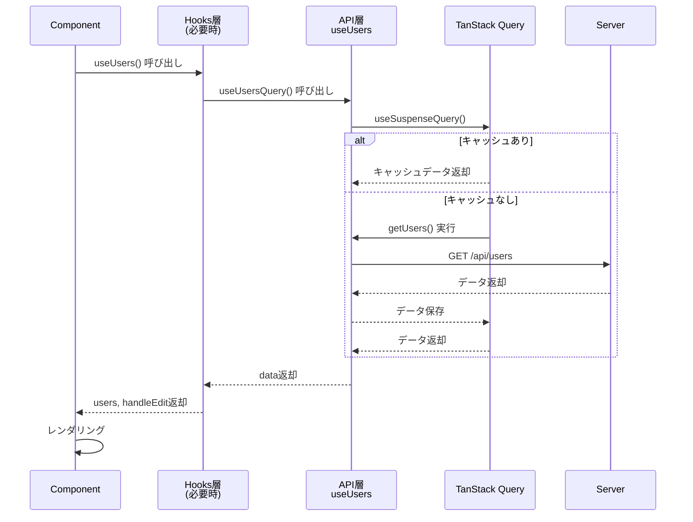
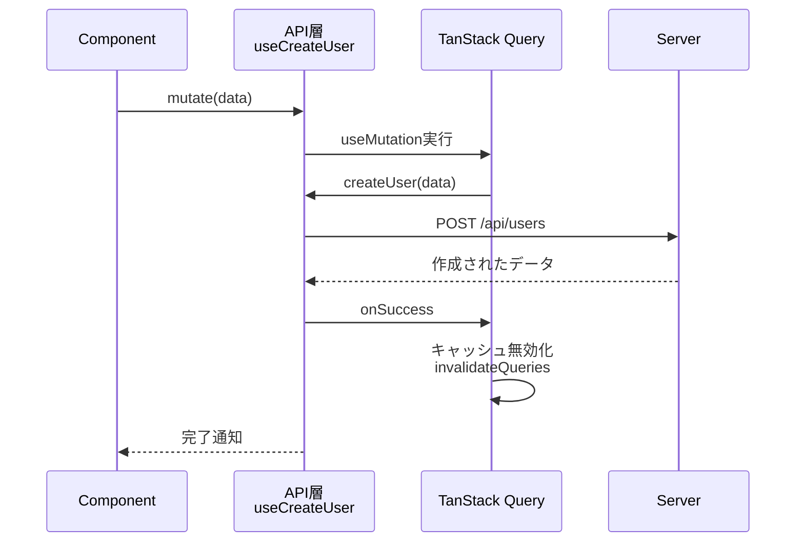

# API統合

本ドキュメントでは、REST API通信の実装パターンとTanStack Queryを使用したデータフェッチングについて説明します。API関数、クエリオプション、カスタムフックの3つのパートに分けた実装方法を解説します。

## 目次

1. [基本パターン](#基本パターン)
2. [データ取得（Query）](#データ取得query)
3. [データ更新（Mutation）](#データ更新mutation)
4. [ベストプラクティス](#ベストプラクティス)
5. [エラーハンドリング](#エラーハンドリング)

---

## 基本パターン

### アーキテクチャ概要

```mermaid
graph TB
    subgraph Component["コンポーネント層"]
        Page[Page Component]
    end

    subgraph Hooks["Hooks層 routes/*/xxx.hook.ts<br/>※必要に応じて"]
        PageHook[useUsers<br/>ページ固有のビジネスロジック<br/>ナビゲーション、複数APIの組み合わせ]
    end

    subgraph API["API層 api/get-users.ts"]
        APIFn[getUsers<br/>API関数]
        QueryOpts[getUsersQueryOptions<br/>クエリオプション]
        QueryHook[useUsers<br/>React Queryカスタムフック]
    end

    subgraph Backend[バックエンドAPI]
        Server[/api/users]
    end

    Page -->|直接呼び出し<br/>シンプルな場合| QueryHook
    Page -->|ビジネスロジック<br/>が必要な場合| PageHook
    PageHook --> QueryHook
    QueryHook --> QueryOpts
    QueryOpts --> APIFn
    APIFn --> Server

    style API fill:#b3e5fc,stroke:#01579b,stroke-width:2px,color:#000
    style Hooks fill:#ffe0b2,stroke:#e65100,stroke-width:2px,color:#000
    style Component fill:#ce93d8,stroke:#4a148c,stroke-width:2px,color:#000
    style Backend fill:#a5d6a7,stroke:#1b5e20,stroke-width:2px,color:#000
```

### データフロー（Query）



### データフロー（Mutation）



### API層（`api/`）

API関数は**データ取得・更新ロジック**と**React Queryのカスタムフック**を含みます。

```typescript
// src/features/users/api/get-users.ts
import { queryOptions, useSuspenseQuery } from '@tanstack/react-query'
import { api } from '@/lib/api-client'
import { QueryConfig } from '@/lib/tanstack-query'
import type { User } from '../types'

// 1. API関数
export const getUsers = (): Promise<{ data: User[] }> => {
  return api.get('/sample/users')
}

// 2. クエリオプション
export const getUsersQueryOptions = () => {
  return queryOptions({
    queryKey: ['users'],
    queryFn: getUsers,
  })
}

// 3. カスタムフック
type UseUsersOptions = {
  queryConfig?: QueryConfig<typeof getUsersQueryOptions>
}

export const useUsers = ({ queryConfig }: UseUsersOptions = {}) => {
  return useSuspenseQuery({
    ...getUsersQueryOptions(),
    ...queryConfig,
  })
}
```

### Hooks層（`routes/{route-name}/*.hook.ts`）※必要に応じて

ページ固有のビジネスロジック（ナビゲーション、複数APIの組み合わせなど）を担当します。

```typescript
// src/features/users/routes/users/users.hook.ts
import { useRouter } from 'next/navigation'
import { useUsers as useUsersQuery } from '@/features/users/api/get-users'

export const useUsers = () => {
  const router = useRouter()
  const { data } = useUsersQuery()

  const users = data?.data ?? []

  const handleEdit = (userId: string) => {
    router.push(`/users/${userId}/edit`)
  }

  return {
    users,
    handleEdit,
  }
}
```

---

## データ取得（Query）

### 基本的な取得

**API層:**

```typescript
// src/features/users/api/get-users.ts
import { queryOptions, useSuspenseQuery } from '@tanstack/react-query'
import { api } from '@/lib/api-client'
import { QueryConfig } from '@/lib/tanstack-query'
import type { User } from '../types'

export const getUsers = (): Promise<{ data: User[] }> => {
  return api.get('/sample/users')
}

export const getUsersQueryOptions = () => {
  return queryOptions({
    queryKey: ['users'],
    queryFn: getUsers,
  })
}

type UseUsersOptions = {
  queryConfig?: QueryConfig<typeof getUsersQueryOptions>
}

export const useUsers = ({ queryConfig }: UseUsersOptions = {}) => {
  return useSuspenseQuery({
    ...getUsersQueryOptions(),
    ...queryConfig,
  })
}
```

**Hooks層（必要に応じて）:**

```typescript
// src/features/users/routes/users/users.hook.ts
import { useRouter } from 'next/navigation'
import { useUsers as useUsersQuery } from '@/features/users/api/get-users'

export const useUsers = () => {
  const router = useRouter()
  const { data } = useUsersQuery()
  const users = data?.data ?? []

  const handleEdit = (userId: string) => {
    router.push(`/users/${userId}/edit`)
  }

  return { users, handleEdit }
}
```

### パラメータ付き取得

**API層:**

```typescript
// src/features/users/api/get-user.ts
import { queryOptions, useSuspenseQuery } from '@tanstack/react-query'
import { api } from '@/lib/api-client'
import { QueryConfig } from '@/lib/tanstack-query'
import type { User } from '../types'

export const getUser = (userId: string): Promise<{ data: User }> => {
  return api.get(`/sample/users/${userId}`)
}

export const getUserQueryOptions = (userId: string) => {
  return queryOptions({
    queryKey: ['users', userId],
    queryFn: () => getUser(userId),
  })
}

type UseUserOptions = {
  userId: string
  queryConfig?: QueryConfig<typeof getUserQueryOptions>
}

export const useUser = ({ userId, queryConfig }: UseUserOptions) => {
  return useSuspenseQuery({
    ...getUserQueryOptions(userId),
    ...queryConfig,
  })
}
```

**Hooks層（必要に応じて）:**

```typescript
// src/features/users/routes/user-detail/user-detail.hook.ts
import { useUser as useUserQuery } from '@/features/users/api/get-user'

export const useUserDetail = (userId: string) => {
  const { data } = useUserQuery({ userId })
  const user = data?.data

  return { user }
}
```

### コンポーネントでの使用

```typescript
'use client'

import { Suspense } from 'react'
import { ErrorBoundary } from 'react-error-boundary'
import { LoadingSpinner } from '@/components/ui/loading-spinner'
import { MainErrorFallback } from '@/components/errors/main'
import { useUsers } from './users.hook'

// データフェッチを含むコンポーネント
const UserListContent = () => {
  const { users } = useUsers()  // isLoading, error は不要

  return (
    <ul>
      {users.map((user) => (
        <li key={user.id}>{user.name}</li>
      ))}
    </ul>
  )
}

// メインコンポーネント
export const UserList = () => {
  return (
    <ErrorBoundary FallbackComponent={MainErrorFallback}>
      <Suspense fallback={<LoadingSpinner />}>
        <UserListContent />
      </Suspense>
    </ErrorBoundary>
  )
}
```

---

## データ更新（Mutation）

### 作成

```typescript
// src/features/users/api/create-user.ts
import { useMutation, useQueryClient } from '@tanstack/react-query'
import { api } from '@/lib/api-client'
import { MutationConfig } from '@/lib/tanstack-query'
import type { User, CreateUserInput } from '../types'

export const createUser = (data: CreateUserInput): Promise<User> => {
  return api.post('/sample/users', data)
}

export const useCreateUser = ({
  mutationConfig,
}: {
  mutationConfig?: MutationConfig<typeof createUser>
} = {}) => {
  const queryClient = useQueryClient()

  const { onSuccess, ...restConfig } = mutationConfig || {}

  return useMutation({
    mutationFn: createUser,
    onSuccess: (...args) => {
      queryClient.invalidateQueries({ queryKey: ['users'] })
      onSuccess?.(...args)
    },
    ...restConfig,
  })
}
```

### 更新

```typescript
// src/features/users/api/update-user.ts
export const updateUser = ({
  userId,
  data,
}: {
  userId: string
  data: UpdateUserInput
}): Promise<User> => {
  return api.patch(`/sample/users/${userId}`, data)
}

export const useUpdateUser = ({
  mutationConfig,
}: {
  mutationConfig?: MutationConfig<typeof updateUser>
} = {}) => {
  const queryClient = useQueryClient()

  const { onSuccess, ...restConfig } = mutationConfig || {}

  return useMutation({
    mutationFn: updateUser,
    onSuccess: (updatedUser, ...args) => {
      queryClient.setQueryData(['users', updatedUser.id], updatedUser)
      queryClient.invalidateQueries({ queryKey: ['users'] })
      onSuccess?.(updatedUser, ...args)
    },
    ...restConfig,
  })
}
```

### 削除

```typescript
// src/features/users/api/delete-user.ts
export const deleteUser = (userId: string): Promise<void> => {
  return api.delete(`/sample/users/${userId}`)
}

export const useDeleteUser = ({
  mutationConfig,
}: {
  mutationConfig?: MutationConfig<typeof deleteUser>
} = {}) => {
  const queryClient = useQueryClient()

  const { onSuccess, ...restConfig } = mutationConfig || {}

  return useMutation({
    mutationFn: deleteUser,
    onSuccess: (_, deletedUserId, ...args) => {
      queryClient.removeQueries({ queryKey: ['users', deletedUserId] })
      queryClient.invalidateQueries({ queryKey: ['users'] })
      onSuccess?.(_, deletedUserId, ...args)
    },
    ...restConfig,
  })
}
```

### コンポーネントでの使用

```typescript
'use client'

import { useCreateUser } from '@/features/users/api/create-user'

export const CreateUserForm = () => {
  const createUser = useCreateUser()

  const handleSubmit = async (data: CreateUserInput) => {
    await createUser.mutateAsync(data)
      .then(() => {
        alert('作成しました')
      })
      .catch(() => {
        alert('エラーが発生しました')
      })
  }

  return <form onSubmit={handleSubmit}>...</form>
}
```

---

## ベストプラクティス

### ✅ Good: bulletproof-reactの構造に従う

**API層（データ取得ロジック + React Queryのカスタムフック）:**

```typescript
// src/features/users/api/get-users.ts
import { queryOptions, useSuspenseQuery } from '@tanstack/react-query'
import { api } from '@/lib/api-client'
import { QueryConfig } from '@/lib/tanstack-query'
import type { User } from '../types'

export const getUsers = (): Promise<{ data: User[] }> => {
  return api.get('/sample/users')
}

export const getUsersQueryOptions = () => {
  return queryOptions({
    queryKey: ['users'],
    queryFn: getUsers,
  })
}

type UseUsersOptions = {
  queryConfig?: QueryConfig<typeof getUsersQueryOptions>
}

export const useUsers = ({ queryConfig }: UseUsersOptions = {}) => {
  return useSuspenseQuery({
    ...getUsersQueryOptions(),
    ...queryConfig,
  })
}
```

**Hooks層（ページ固有のビジネスロジック）- 必要に応じて:**

```typescript
// src/features/users/routes/users/users.hook.ts
import { useRouter } from 'next/navigation'
import { useUsers as useUsersQuery } from '@/features/users/api/get-users'

export const useUsers = () => {
  const router = useRouter()
  const { data } = useUsersQuery()

  const users = data?.data ?? []

  const handleEdit = (userId: string) => {
    router.push(`/users/${userId}/edit`)
  }

  return { users, handleEdit }
}
```

### ❌ Bad: 責任が混在

```typescript
// API関数とReact Hooksが混在（単一責任の原則に違反）
// src/features/users/api/get-users.ts
export const useUsers = () => {
  return useQuery({
    queryKey: ['users'],
    queryFn: async () => {
      const res = await fetch('/api/users')
      return res.json()
    },
  })
}
```

### Suspense パターンの利点

- **宣言的なローディング管理**: `isLoading`の手動チェックが不要
- **エラーハンドリングの統一**: `ErrorBoundary`で一元管理
- **コードの簡潔化**: 条件分岐が減り、読みやすくなる
- **Reactの標準パターン**: Reactの推奨パターンに従う

### bulletproof-react構造の利点

- **API層**: React Queryのカスタムフックも含め、再利用可能なAPI操作を提供
- **Hooks層**: ページ固有のビジネスロジック（ナビゲーション、複数APIの組み合わせ）に集中
- **明確な責任分離**: API操作とビジネスロジックが分離され、保守性が向上
- **テスト容易性**: API層は純粋な関数として単体テストが可能

---

## エラーハンドリング

### グローバルエラー処理

```typescript
// src/lib/api-client.ts
api.interceptors.response.use(
  (response) => response.data,
  (error) => {
    const message = error.response?.data?.message || error.message

    if (typeof window !== 'undefined') {
      console.error(`[API Error] ${message}`)
    }

    return Promise.reject(error)
  }
)
```

### ErrorBoundaryによるエラー処理

Suspenseを使用する場合、エラーは`ErrorBoundary`でキャッチします。

```typescript
import { ErrorBoundary } from 'react-error-boundary'
import { MainErrorFallback } from '@/components/errors/main'

const UsersPage = () => {
  return (
    <ErrorBoundary FallbackComponent={MainErrorFallback}>
      <Suspense fallback={<LoadingSpinner fullScreen />}>
        <UsersPageContent />
      </Suspense>
    </ErrorBoundary>
  )
}
```

### カスタムエラーフォールバック

```typescript
const CustomErrorFallback = ({ error, resetErrorBoundary }: FallbackProps) => {
  return (
    <div>
      <h2>エラーが発生しました</h2>
      <p>{error.message}</p>
      <button onClick={resetErrorBoundary}>再試行</button>
    </div>
  )
}
```

---

## 参考リンク

- [TanStack Query公式](https://tanstack.com/query/latest)
- [APIクライアント](../../03-core-concepts/06-api-client.md)
- [TanStack Query設定](../../03-core-concepts/07-tanstack-query.md)
