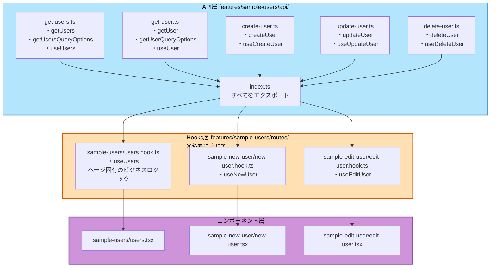
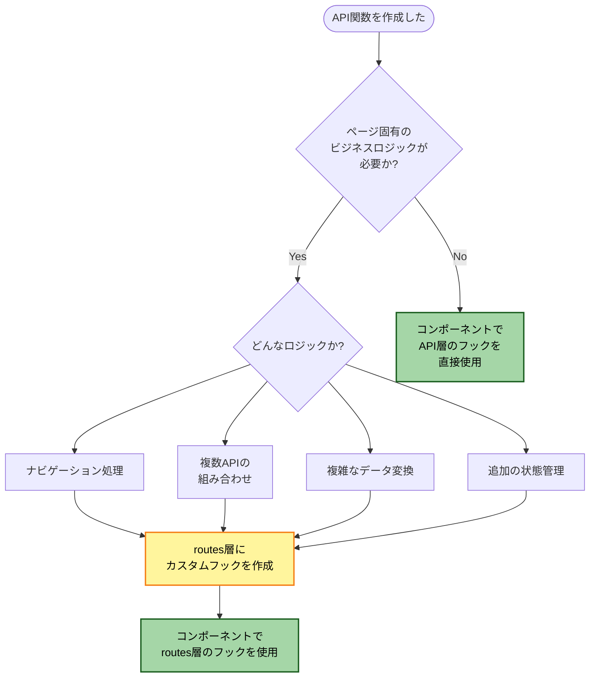
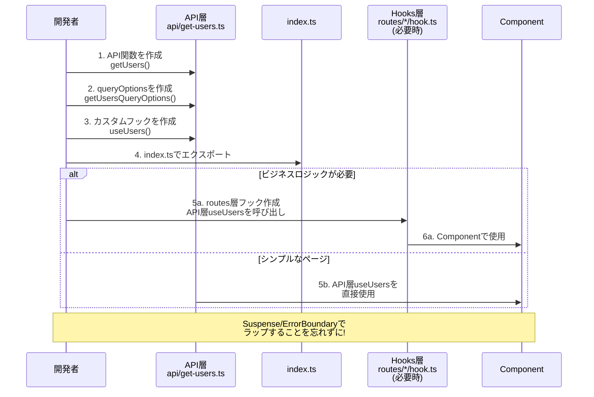
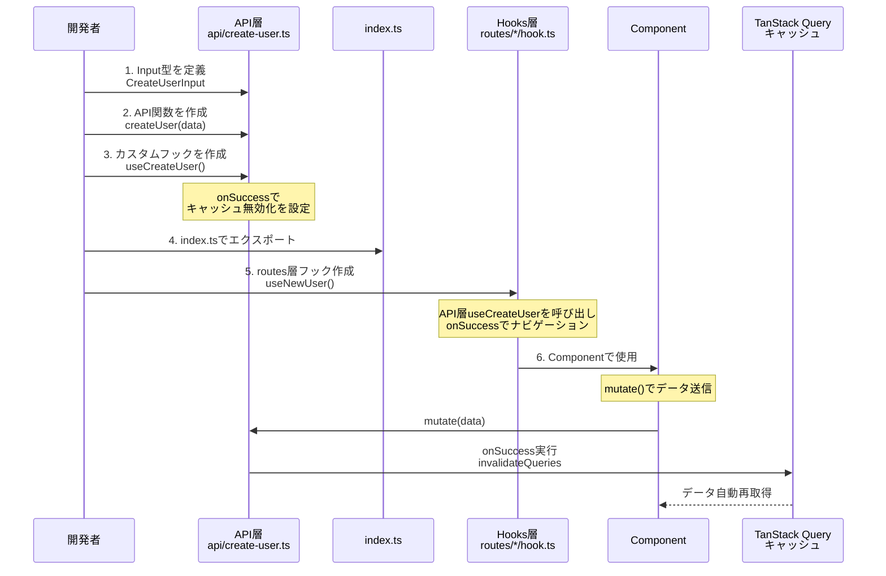
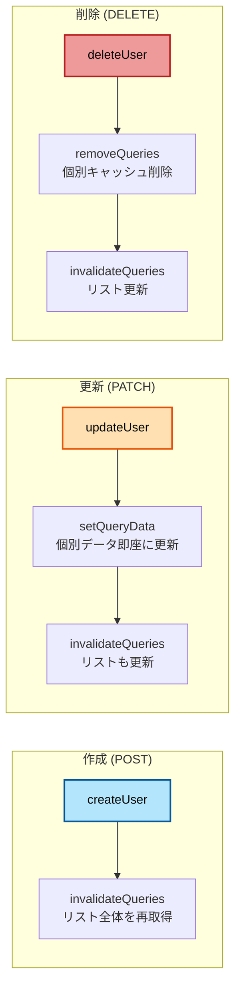

# API関数作成手順(TanStack Query)

このガイドでは、TanStack Queryを使用した新しいAPI関数の作成手順を説明します。データ取得(Query)とデータ更新(Mutation)の両方のパターンを網羅し、キャッシュ管理の最適な方法まで解説します。

## 目次

1. [作成するもの](#-作成するもの)
2. [パターン1: データ取得(Query)](#パターン1-データ取得query)
3. [パターン2: データ作成(Mutation - POST)](#パターン2-データ作成mutation---post)
4. [パターン3: データ更新(Mutation - PATCH)](#パターン3-データ更新mutation---patch)
5. [パターン4: データ削除(Mutation - DELETE)](#パターン4-データ削除mutation---delete)
6. [ステップ2: index.tsでエクスポート](#ステップ2-indextsでエクスポート)
7. [ステップ3: カスタムフックを作成](#ステップ3-カスタムフックを作成)
8. [ステップ4: コンポーネントで使用](#ステップ4-コンポーネントで使用)
9. [チェックリスト](#-チェックリスト)
10. [Tips](#-tips)

---

## 📋 作成するもの

### ファイル構成



### API層（`api/`）
- API関数（データ取得・更新ロジック）
- queryOptions（Queryの場合）
- React Queryのカスタムフック（useUsers、useCreateUser など）

### Hooks層（`routes/{route-name}/*.hook.ts`）※必要に応じて
- ページ固有のビジネスロジック（ナビゲーション、複数APIの組み合わせなど）
- API層のカスタムフックを呼び出し、追加のロジックを適用

### Hooks層が必要かどうかの判断フロー



---

## パターン1: データ取得(Query)

### 作成フロー



### ステップ1: API関数ファイルを作成

#### 一覧取得

```typescript
// src/features/sample-users/api/get-users.ts
import { queryOptions, useSuspenseQuery } from '@tanstack/react-query'
import { api } from '@/lib/api-client'
import { QueryConfig } from '@/lib/tanstack-query'
import type { User } from '../types'

// 1. API関数
export const getUsers = (): Promise<{ data: User[] }> => {
  return api.get('/sample/users')
}

// 2. クエリオプション
export const getUsersQueryOptions = () => {
  return queryOptions({
    queryKey: ['users'],
    queryFn: getUsers,
  })
}

// 3. カスタムフック（API層に含める）
type UseUsersOptions = {
  queryConfig?: QueryConfig<typeof getUsersQueryOptions>
}

export const useUsers = ({ queryConfig }: UseUsersOptions = {}) => {
  return useSuspenseQuery({
    ...getUsersQueryOptions(),
    ...queryConfig,
  })
}
```

#### 個別取得

```typescript
// src/features/sample-users/api/get-user.ts
import { queryOptions, useSuspenseQuery } from '@tanstack/react-query'
import { api } from '@/lib/api-client'
import { QueryConfig } from '@/lib/tanstack-query'
import type { User } from '../types'

// 1. API関数
export const getUser = (userId: string): Promise<{ data: User }> => {
  return api.get(`/sample/users/${userId}`)
}

// 2. クエリオプション
export const getUserQueryOptions = (userId: string) => {
  return queryOptions({
    queryKey: ['users', userId],
    queryFn: () => getUser(userId),
  })
}

// 3. カスタムフック（API層に含める）
type UseUserOptions = {
  userId: string
  queryConfig?: QueryConfig<typeof getUserQueryOptions>
}

export const useUser = ({ userId, queryConfig }: UseUserOptions) => {
  return useSuspenseQuery({
    ...getUserQueryOptions(userId),
    ...queryConfig,
  })
}
```

---

## パターン2: データ作成(Mutation - POST)

### Mutation作成フロー



### Mutationのキャッシュ更新戦略



---

```typescript
// src/features/sample-users/api/create-user.ts
import { useMutation, useQueryClient } from '@tanstack/react-query'
import { api } from '@/lib/api-client'
import { MutationConfig } from '@/lib/tanstack-query'
import type { User } from '../types'

// 入力型定義
export type CreateUserInput = {
  name: string
  email: string
}

// 1. API関数
export const createUser = (data: CreateUserInput): Promise<{ data: User }> => {
  return api.post('/sample/users', data)
}

// 2. カスタムフック
type UseCreateUserOptions = {
  mutationConfig?: MutationConfig<typeof createUser>
}

export const useCreateUser = ({ mutationConfig }: UseCreateUserOptions = {}) => {
  const queryClient = useQueryClient()

  const { onSuccess, ...restConfig } = mutationConfig || {}

  return useMutation({
    mutationFn: createUser,
    onSuccess: (data, ...args) => {
      // ユーザーリストのキャッシュを無効化
      queryClient.invalidateQueries({ queryKey: ['users'] })
      onSuccess?.(data, ...args)
    },
    ...restConfig,
  })
}
```

---

## パターン3: データ更新(Mutation - PATCH)

```typescript
// src/features/sample-users/api/update-user.ts
import { useMutation, useQueryClient } from '@tanstack/react-query'
import { api } from '@/lib/api-client'
import { MutationConfig } from '@/lib/tanstack-query'
import type { User } from '../types'

// 入力型定義
export type UpdateUserInput = {
  name?: string
  email?: string
}

// 1. API関数
export const updateUser = ({
  userId,
  data,
}: {
  userId: string
  data: UpdateUserInput
}): Promise<{ data: User }> => {
  return api.patch(`/sample/users/${userId}`, data)
}

// 2. カスタムフック
type UseUpdateUserOptions = {
  mutationConfig?: MutationConfig<typeof updateUser>
}

export const useUpdateUser = ({ mutationConfig }: UseUpdateUserOptions = {}) => {
  const queryClient = useQueryClient()

  const { onSuccess, ...restConfig } = mutationConfig || {}

  return useMutation({
    mutationFn: updateUser,
    onSuccess: (response, variables, ...args) => {
      const updatedUser = response.data

      // 個別ユーザーのキャッシュを更新
      queryClient.setQueryData(['users', updatedUser.id], updatedUser)

      // ユーザーリストのキャッシュを無効化
      queryClient.invalidateQueries({ queryKey: ['users'] })

      onSuccess?.(response, variables, ...args)
    },
    ...restConfig,
  })
}
```

---

## パターン4: データ削除(Mutation - DELETE)

```typescript
// src/features/sample-users/api/delete-user.ts
import { useMutation, useQueryClient } from '@tanstack/react-query'
import { api } from '@/lib/api-client'
import { MutationConfig } from '@/lib/tanstack-query'

// 1. API関数
export const deleteUser = (userId: string): Promise<void> => {
  return api.delete(`/sample/users/${userId}`)
}

// 2. カスタムフック
type UseDeleteUserOptions = {
  mutationConfig?: MutationConfig<typeof deleteUser>
}

export const useDeleteUser = ({ mutationConfig }: UseDeleteUserOptions = {}) => {
  const queryClient = useQueryClient()

  const { onSuccess, ...restConfig } = mutationConfig || {}

  return useMutation({
    mutationFn: deleteUser,
    onSuccess: (data, deletedUserId, ...args) => {
      // 削除されたユーザーのキャッシュを削除
      queryClient.removeQueries({ queryKey: ['users', deletedUserId] })

      // ユーザーリストのキャッシュを無効化
      queryClient.invalidateQueries({ queryKey: ['users'] })

      onSuccess?.(data, deletedUserId, ...args)
    },
    ...restConfig,
  })
}
```

---

## ステップ2: index.tsでエクスポート

```typescript
// src/features/sample-users/api/index.ts
export * from './get-users'
export * from './get-user'
export * from './create-user'
export * from './update-user'
export * from './delete-user'
```

---

## ステップ3: ページ固有のカスタムフックを作成（必要に応じて）

routes層では、API層のカスタムフックを使用し、ページ固有のビジネスロジックを追加します。

### Query(データ取得)のカスタムフック

```typescript
// src/features/sample-users/routes/sample-users/users.hook.ts
import { useRouter } from 'next/navigation'
import { useUsers as useUsersQuery } from '@/features/sample-users/api/get-users'

/**
 * ユーザー一覧ページのロジックを管理するカスタムフック
 *
 * API層のuseUsersを呼び出し、ページ固有のビジネスロジック（ナビゲーション）を追加
 */
export const useUsers = () => {
  const router = useRouter()
  const { data } = useUsersQuery()

  const users = data?.data ?? []

  // ビジネスロジック
  const handleEdit = (userId: string) => {
    router.push(`/sample-users/${userId}/edit`)
  }

  const handleDelete = (userId: string) => {
    router.push(`/sample-users/${userId}/delete`)
  }

  const handleCreateNew = () => {
    router.push('/sample-users/new')
  }

  return {
    users,
    handleEdit,
    handleDelete,
    handleCreateNew,
  }
}
```

**注意**: シンプルなページの場合、コンポーネント内で直接API層のuseUsersを使用することもできます。

## ステップ4: コンポーネントで使用

```typescript
// src/features/sample-users/routes/sample-users/users.tsx
'use client'

import { Suspense } from 'react'
import { ErrorBoundary } from 'react-error-boundary'
import { LoadingSpinner } from '@/components/ui/loading-spinner'
import { MainErrorFallback } from '@/components/errors/main'
import { useUsers } from './users.hook'

// データフェッチを含むコンポーネント
const UsersPageContent = () => {
  const { users, handleEdit, handleDelete, handleCreateNew } = useUsers()

  return (
    <div>
      <h1>ユーザー一覧</h1>
      <button onClick={handleCreateNew}>新規作成</button>
      <ul>
        {users.map((user) => (
          <li key={user.id}>
            {user.name}
            <button onClick={() => handleEdit(user.id)}>編集</button>
            <button onClick={() => handleDelete(user.id)}>削除</button>
          </li>
        ))}
      </ul>
    </div>
  )
}

// メインコンポーネント
const UsersPage = () => {
  return (
    <ErrorBoundary FallbackComponent={MainErrorFallback}>
      <Suspense fallback={<LoadingSpinner fullScreen />}>
        <UsersPageContent />
      </Suspense>
    </ErrorBoundary>
  )
}

export default UsersPage
```

### Mutation(データ作成)の使用

```typescript
// src/features/sample-users/routes/sample-new-user/new-user.tsx
'use client'

import { UserForm } from '@/features/sample-users/components/user-form'
import { useNewUser } from './new-user.hook'

export default function NewUserPage() {
  const { handleSubmit, isPending } = useNewUser()

  return <UserForm onSubmit={handleSubmit} isSubmitting={isPending} />
}
```

```typescript
// src/features/sample-users/routes/sample-new-user/new-user.hook.ts
import { useRouter } from 'next/navigation'
import { useCreateUser, type CreateUserInput } from '@/features/sample-users/api/create-user'

export const useNewUser = () => {
  const router = useRouter()
  const createUser = useCreateUser({
    mutationConfig: {
      onSuccess: () => {
        router.push('/sample-users')
      },
    },
  })

  const handleSubmit = async (data: CreateUserInput) => {
    await createUser.mutateAsync(data)
      .catch((error) => {
        // エラーハンドリング
      })
  }

  return {
    handleSubmit,
    isPending: createUser.isPending,
  }
}
```

---

## 🎯 チェックリスト

### Query(データ取得)

- [ ] API関数を作成(`getXxx`)
- [ ] queryOptionsを作成(`getXxxQueryOptions`)
- [ ] カスタムフックを作成(`useXxx`)
- [ ] `queryKey`を適切に設定
  - [ ] 一覧: `['resource']`
  - [ ] 個別: `['resource', id]`
- [ ] 型定義を追加
- [ ] `index.ts`でエクスポート

### Mutation(データ更新)

- [ ] API関数を作成(`createXxx`, `updateXxx`, `deleteXxx`)
- [ ] 入力型を定義(`CreateXxxInput`, `UpdateXxxInput`)
- [ ] カスタムフックを作成(`useCreateXxx`, `useUpdateXxx`, `useDeleteXxx`)
- [ ] `onSuccess`でキャッシュを更新
  - [ ] `invalidateQueries`: リストを再取得
  - [ ] `setQueryData`: 個別データを直接更新
  - [ ] `removeQueries`: 削除されたデータのキャッシュを削除
- [ ] `index.ts`でエクスポート

---

## 💡 Tips

### queryKeyの命名規則

| パターン | queryKey | 例 |
|---------|----------|---|
| **リスト** | `[resource]` | `['users']` |
| **個別** | `[resource, id]` | `['users', '123']` |
| **フィルター付き** | `[resource, filter]` | `['users', { status: 'active' }]` |
| **ネスト** | `[parent, parentId, child]` | `['users', '123', 'posts']` |

### キャッシュ更新戦略

| 操作 | 推奨方法 | 理由 |
|------|---------|------|
| **作成** | `invalidateQueries` | リストに新しい項目を追加 |
| **更新** | `setQueryData` + `invalidateQueries` | 即座に反映 + リストも更新 |
| **削除** | `removeQueries` + `invalidateQueries` | キャッシュ削除 + リスト更新 |

### エラーハンドリング

```typescript
export const useCreateUser = () => {
  const queryClient = useQueryClient()

  return useMutation({
    mutationFn: createUser,
    onSuccess: () => {
      queryClient.invalidateQueries({ queryKey: ['users'] })
    },
    onError: (error) => {
      // グローバルエラーハンドリング
      console.error('Failed to create user:', error)
    },
  })
}
```

---

## 参考リンク

- [API統合](../04-development/05-api-integration.md)
- [TanStack Query](../03-core-concepts/07-tanstack-query.md)
- [APIクライアント](../03-core-concepts/06-api-client.md)
